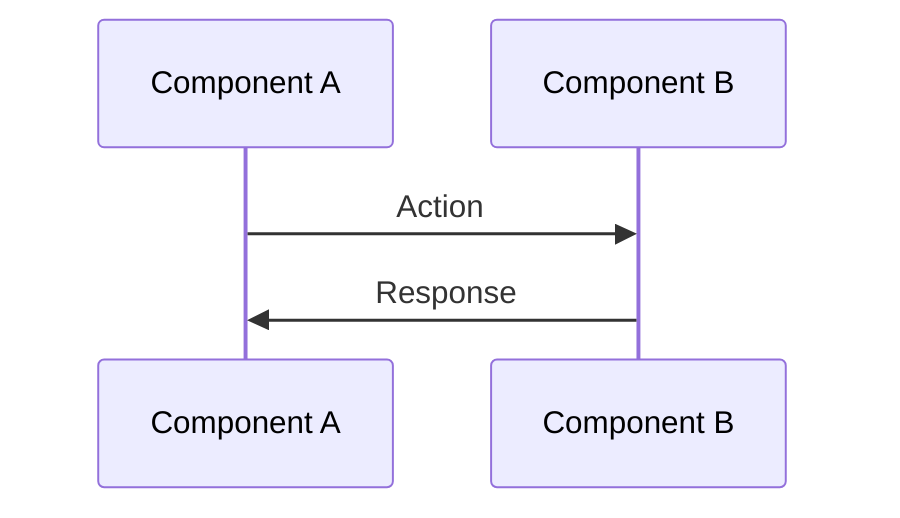

# [Number] - [Document Title]

**Purpose:** [One sentence describing what this document covers and why it matters]

---

## 🎯 **Overview**

[2-3 paragraph executive summary covering:
- What this document describes
- Why it's important
- Key takeaways
- Who should read this]

---

## 🏗️ **[Main Section Title]**

### **[Subsection Title]**

[Content with code examples]

```typescript
// Example code from actual project
export function exampleFunction() {
  // Implementation
}
```

**Why this approach?**
- [Reason 1]
- [Reason 2]
- [Reason 3]

### **[Another Subsection]**

[More content]

---

## 📊 **Architecture/Flow Diagrams**

### **[Diagram Title]**



**Key Points:**
- [Explanation of diagram element 1]
- [Explanation of diagram element 2]

---

## 💡 **Implementation Details**

### **[Technical Detail 1]**

```typescript
// Code snippet with explanation
const implementation = {
  pattern: 'example',
  usage: 'specific case'
};
```

### **[Technical Detail 2]**

[Detailed explanation]

---

## ✅ **Success Criteria**

### **Functional Requirements**
- ✅ [Requirement 1]
- ✅ [Requirement 2]
- ✅ [Requirement 3]

### **Performance Requirements**
- ✅ [Metric 1: < target]
- ✅ [Metric 2: > target]

### **Validation Steps**
```bash
# Test command 1
npm run test:feature

# Test command 2
npm run validate
```

---

## 🔍 **Troubleshooting**

### **Issue 1**
**Problem**: [Description]
**Solution**: [Step-by-step fix]

### **Issue 2**
**Problem**: [Description]
**Solution**: [Step-by-step fix]

---

## 📚 **References**

- [Link to related document 1](link)
- [Link to related document 2](link)
- [External resource](link)

---

**Next Step:** Review [next-doc.md](next-doc.md) to [continue with next topic].

---

**Generated:** [Date]
**Version:** [Version Number]
**Status:** [Draft/Review/Complete]
