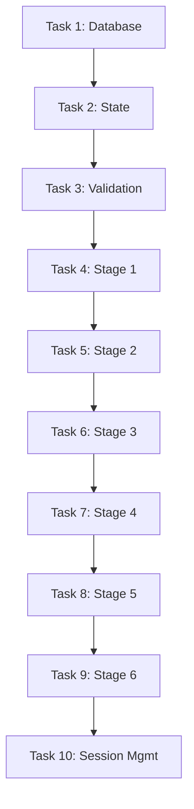

# Feature Task Breakdown Guide

How to decompose features into actionable tasks for Task Master and documentation.

---

## 🎯 **Task Breakdown Methodology**

### **The 5-Level Hierarchy**

```
Epic (Product Goal)
  └─ Feature (User-Facing Capability)
      └─ Task (Implementation Unit)
          └─ Subtask (Granular Work Item)
              └─ Validation (Test/Verification)
```

### **Example: Event Wizard Feature**

```
Epic: Event Management System
├─ Feature 1: Event Creation Wizard
│   ├─ Task 1: Database Schema (wizard_sessions table)
│   │   ├─ 1.1: Create migration file
│   │   ├─ 1.2: Add indexes
│   │   ├─ 1.3: Implement RLS policies
│   │   ├─ 1.4: Add triggers
│   │   └─ 1.5: Validate schema
│   ├─ Task 2: Zustand Store & Auto-save
│   │   ├─ 2.1: Create store structure
│   │   ├─ 2.2: Implement auto-save hook
│   │   ├─ 2.3: Add session management
│   │   ├─ 2.4: Add offline support
│   │   └─ 2.5: Create save indicators
│   └─ Task 3-9: [Additional tasks]
└─ Feature 2: Dashboard
    └─ [Tasks...]
```

---

## 📐 **Task Sizing Guidelines**

### **Ideal Task Size**
- **Time**: 2-8 hours of focused work
- **Complexity**: Can be completed in 1 session
- **Dependencies**: ≤ 2 dependencies per task
- **Subtasks**: 3-7 subtasks per task

### **When to Split Tasks**

**Too Large** (Split if):
```
❌ Task: "Build complete event wizard"
   (Would take weeks, too vague)

✅ Better: Split into 9 tasks
   - Task 1: Database setup
   - Task 2: State management
   - Task 3-9: Individual stages
```

**Too Small** (Combine if):
```
❌ Task: "Add import statement"
   (Too granular, not meaningful)

✅ Better: Combine into
   Task: "Create event hook with imports and exports"
```

---

## 🏗️ **Feature Breakdown Template**

### **Step 1: Identify Feature Requirements**

```markdown
## Feature: [Name]

### User Story
As a [user type]
I want to [capability]
So that [benefit]

### Acceptance Criteria
- [ ] User can [action 1]
- [ ] System validates [constraint]
- [ ] UI displays [feedback]
- [ ] Error handling for [scenario]
- [ ] Performance meets [metric]

### Technical Requirements
- Database: [tables/schema needed]
- Frontend: [components/pages]
- Backend: [APIs/functions]
- Integration: [external services]
```

### **Step 2: Break Into Task Categories**

```markdown
## Task Categories for [Feature]

### Category A: Foundation (Must complete first)
1. Database Schema
2. Types & Interfaces
3. Base Components

### Category B: Core Logic (After foundation)
4. State Management
5. API Integration
6. Business Logic

### Category C: UI/UX (After core)
7. Forms & Validation
8. User Feedback
9. Error Handling

### Category D: Polish (Final)
10. Performance Optimization
11. Accessibility
12. Testing
```

### **Step 3: Create Task Master Structure**

```typescript
// Task structure for Task Master
{
  id: 1,
  title: "Database Schema Setup - Wizard Sessions Table",
  description: "Create wizard_sessions table with schema, indexes, RLS",
  priority: "high",
  dependencies: [],
  status: "pending",
  complexityScore: 4,
  subtasks: [
    {
      id: 1,
      title: "Create Supabase Migration File",
      description: "Define table schema with all fields and constraints",
      dependencies: [],
      status: "pending"
    },
    {
      id: 2,
      title: "Add Database Indexes",
      description: "Create indexes for performance optimization",
      dependencies: [1],
      status: "pending"
    },
    // ... more subtasks
  ]
}
```

---

## 🎯 **Task Breakdown by Feature Type**

### **1. Database Features**

**Pattern**: Schema → Indexes → RLS → Functions → Validation

```markdown
Task: Database Schema for [Feature]

Subtasks:
1. Create migration file
   - Define table structure
   - Add foreign keys
   - Set default values
   - Add constraints (NOT NULL, CHECK)

2. Add indexes for performance
   - Index foreign keys
   - Index frequently queried columns
   - Add composite indexes for common queries

3. Implement Row Level Security
   - Enable RLS on table
   - Create SELECT policy
   - Create INSERT policy
   - Create UPDATE policy
   - Create DELETE policy

4. Add database functions/triggers
   - Auto-update timestamps
   - Validate business rules
   - Cascade operations

5. Validate complete setup
   - Test all CRUD operations
   - Verify RLS blocks unauthorized access
   - Check index performance
   - Run migration rollback test
```

**Example Task Master Command**:
```bash
task-master add-task \
  --title="Database Schema for Event Wizard" \
  --description="Complete database setup with RLS and indexes" \
  --priority=high \
  --tag=database

task-master expand-task --id=1 --num=5
```

---

### **2. State Management Features**

**Pattern**: Store → Actions → Persistence → Sync → UI Integration

```markdown
Task: State Management for [Feature]

Subtasks:
1. Create store structure
   - Define TypeScript interfaces
   - Set up Zustand store
   - Add initial state
   - Create selectors

2. Implement actions/mutations
   - Add CRUD operations
   - Handle optimistic updates
   - Add error handling
   - Create action creators

3. Add persistence layer
   - Integrate with localStorage
   - Add Supabase sync
   - Handle offline mode
   - Implement conflict resolution

4. Create custom hooks
   - useFeatureData hook
   - useFeatureMutations hook
   - useFeatureSubscription hook

5. Add devtools integration
   - Redux DevTools support
   - State debugging
   - Time-travel debugging
```

**Complexity Scoring**:
- Simple state: 3-4
- State + persistence: 5-6
- State + real-time sync: 7-8
- Complex state machine: 8-9

---

### **3. UI Component Features**

**Pattern**: Base Component → Styling → Logic → Validation → Integration

```markdown
Task: UI Components for [Feature]

Subtasks:
1. Create base component structure
   - Set up component file
   - Add TypeScript props interface
   - Create basic JSX structure
   - Add shadcn/ui imports

2. Implement styling
   - Add Tailwind classes
   - Create responsive layouts
   - Handle dark/light themes
   - Add animations/transitions

3. Add component logic
   - Handle user interactions
   - Manage local state
   - Integrate with global state
   - Add keyboard navigation

4. Implement validation
   - Add Zod schema
   - Real-time validation
   - Display error messages
   - Accessibility (ARIA)

5. Integrate with parent components
   - Pass props correctly
   - Handle callbacks
   - Test edge cases
   - Add loading states
```

**UI Task Sizing**:
- Simple display component: 1-2 hours
- Form component: 3-4 hours
- Complex interactive component: 4-8 hours

---

### **4. API/Integration Features**

**Pattern**: Client Setup → Endpoints → Error Handling → Testing → Docs

```markdown
Task: API Integration for [Feature]

Subtasks:
1. Set up API client
   - Configure base URL
   - Add authentication headers
   - Set up interceptors
   - Handle token refresh

2. Create API endpoints
   - Define request/response types
   - Implement HTTP methods
   - Add query parameters
   - Handle pagination

3. Implement error handling
   - Network error recovery
   - API error parsing
   - User-friendly messages
   - Retry logic

4. Add TanStack Query integration
   - Create query hooks
   - Add mutation hooks
   - Configure caching
   - Handle invalidation

5. Write integration tests
   - Mock API responses
   - Test error scenarios
   - Verify data transformation
   - Check loading states
```

---

### **5. End-to-End Features**

**Pattern**: User Flow → Components → State → API → Testing

```markdown
Task: [User Journey] Implementation

Example: Booking Flow

Subtasks:
1. Ticket selection UI
   - Display available tickets
   - Quantity selector
   - Price calculation
   - Cart preview

2. Checkout form
   - Attendee information
   - Payment details
   - Validation
   - Error handling

3. Payment processing
   - Stripe integration
   - Payment confirmation
   - Webhook handling
   - Receipt generation

4. Order confirmation
   - Success page
   - Email notification
   - QR code generation
   - Download ticket

5. E2E testing
   - Playwright test suite
   - Happy path test
   - Error scenario tests
   - Performance validation
```

---

## 📊 **Task Dependency Patterns**

### **Sequential Dependencies**
```
Task 1: Database Schema
  └─ Task 2: API Endpoints (needs schema)
      └─ Task 3: Frontend Components (needs API)
          └─ Task 4: E2E Tests (needs components)
```

### **Parallel Work**
```
Task 1: Database Schema (Independent)
Task 2: UI Component Library (Independent)
Task 3: State Management (Independent)
  └─ Task 4: Integration (needs all above)
```

### **Incremental Enhancement**
```
Task 1: Basic Event Creation (MVP)
Task 2: Add Validation (Enhancement)
Task 3: Add Auto-save (Enhancement)
Task 4: Add AI Content Gen (Enhancement)
```

---

## 🎓 **Best Practices**

### **DO ✅**

1. **Start with Database**
   ```
   1. Schema design
   2. RLS policies
   3. Indexes
   4. Then build UI
   ```

2. **Break by Layer, Not Feature**
   ```
   ✅ Good:
   - Task 1: Database layer for wizard
   - Task 2: State layer for wizard
   - Task 3: UI layer for wizard

   ❌ Bad:
   - Task 1: Complete wizard stage 1
   - Task 2: Complete wizard stage 2
   ```

3. **Add Validation Subtasks**
   ```
   Every task should end with:
   - Subtask N: Validate implementation
   - Subtask N+1: Write tests
   ```

4. **Include Success Criteria**
   ```markdown
   Task: Event Creation UI

   Success Criteria:
   - [ ] User can create event in < 5 minutes
   - [ ] Form validation shows clear errors
   - [ ] Auto-save works every 30 seconds
   - [ ] All fields persist correctly
   - [ ] Accessibility score > 90
   ```

5. **Link to Documentation**
   ```markdown
   Task: Implement Payment Flow

   References:
   - See docs/mvp/004-core-features.md#booking-management
   - Stripe docs: [link]
   - Architecture: docs/mvp/002-architecture.md
   ```

### **DON'T ❌**

1. **Create Massive Tasks**
   ```
   ❌ Task: "Build entire event wizard"
   ✅ Task: "Implement wizard stage 1: Event basics"
   ```

2. **Skip Dependencies**
   ```
   ❌ Building UI before database exists
   ✅ Complete database → API → UI in order
   ```

3. **Forget Testing Tasks**
   ```
   ❌ Only implementation subtasks
   ✅ Include testing/validation subtasks
   ```

4. **Mix Concerns**
   ```
   ❌ Task: "Database + UI + Tests for feature"
   ✅ Separate tasks for each layer
   ```

---

## 🔧 **Task Master Integration**

### **Creating Tasks from Documentation**

When writing feature docs, generate Task Master tasks:

```bash
# After documenting feature
task-master parse-prd \
  --input="docs/mvp/004-core-features.md" \
  --tag=core-features \
  --num=10

# This creates tasks automatically from documentation
```

### **Tracking Implementation Progress**

```bash
# View all core feature tasks
task-master get-tasks --tag=core-features

# Work on next available task
task-master next-task

# Mark progress
task-master set-status --id=4.1 --status=in-progress
task-master update-subtask --id=4.1 --prompt="Completed schema, adding indexes"
task-master set-status --id=4.1 --status=done
```

### **Complexity Analysis**

```bash
# Analyze task complexity
task-master analyze-project-complexity --threshold=7

# Expand complex tasks
task-master expand-task --id=2 --num=8
```

---

## 📋 **Feature Documentation Template**

Use this when documenting features in 004-core-features.md:

```markdown
## 🎯 **[Feature Name]**

### **Purpose**
[Why this feature exists and what value it provides]

### **User Flow**
```mermaid
sequenceDiagram
    [User journey diagram]
```

### **Task Breakdown**

#### Task [N]: [Task Title]
**Priority**: High | Medium | Low
**Complexity**: [1-10]
**Dependencies**: Task [X], Task [Y]
**Estimated Time**: [hours/days]

**Description**: [What this task accomplishes]

**Subtasks**:
1. [ ] [Subtask 1 description]
2. [ ] [Subtask 2 description]
3. [ ] [Subtask 3 description]
4. [ ] [Subtask 4 description]
5. [ ] [Subtask 5 - Validation]

**Success Criteria**:
- [ ] [Measurable criterion 1]
- [ ] [Measurable criterion 2]
- [ ] [Performance metric]

**Task Master Command**:
```bash
task-master add-task \
  --title="[Task Title]" \
  --description="[Description]" \
  --priority=high \
  --dependencies="[X,Y]"
```

### **Implementation**

```typescript
// Code examples showing implementation
```

### **Testing**

```typescript
// Test examples
```

### **Validation**

```bash
# Commands to verify implementation
npm run test:feature
npm run validate:feature
```
```

---

## 🎯 **Real Example: Event Wizard**

See how the Event Creation Wizard feature is broken down:

### **Feature Overview**
- **Epic**: Event Management System
- **Feature**: 6-Stage Event Creation Wizard
- **Total Tasks**: 10
- **Total Subtasks**: 50
- **Complexity Range**: 4-8

### **Task Structure**

```
Feature: Event Creation Wizard (50 subtasks total)

Foundation Layer (Tasks 1-3):
├─ Task 1: Database Schema (5 subtasks, complexity: 4)
├─ Task 2: State Management (5 subtasks, complexity: 7)
└─ Task 3: Validation System (5 subtasks, complexity: 6)

Implementation Layer (Tasks 4-9):
├─ Task 4: Stage 1 - Event Basics (5 subtasks, complexity: 5)
├─ Task 5: Stage 2 - Event Details (5 subtasks, complexity: 5)
├─ Task 6: Stage 3 - Venue Selection (5 subtasks, complexity: 6)
├─ Task 7: Stage 4 - Ticketing (5 subtasks, complexity: 8)
├─ Task 8: Stage 5 - Marketing (5 subtasks, complexity: 4)
└─ Task 9: Stage 6 - Review/Publish (5 subtasks, complexity: 7)

Integration Layer (Task 10):
└─ Task 10: Session Management (5 subtasks, complexity: 8)
```

### **Dependency Flow**



---

## 🚀 **Quick Start Guide**

### **For Feature Documentation**

1. **Document the feature** in `004-core-features.md`
2. **Break into tasks** using patterns above
3. **Add to Task Master**:
   ```bash
   task-master add-task --title="Feature Task"
   task-master expand-task --id=X --num=5
   ```
4. **Track progress** as you implement
5. **Update docs** with learnings

### **For Task Creation**

1. **Identify feature** requirements
2. **Choose breakdown pattern** (Database, UI, API, etc.)
3. **Create task hierarchy** (5-7 subtasks per task)
4. **Set dependencies** (sequential vs parallel)
5. **Add success criteria** (measurable)
6. **Estimate complexity** (1-10 scale)

---

**Last Updated**: 2025-10-19
**Version**: 1.0
**Status**: Production Ready
