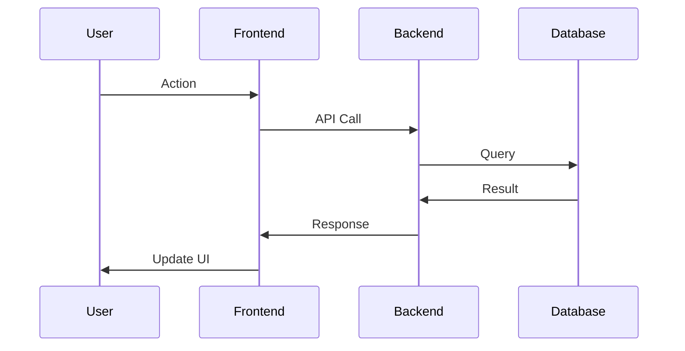
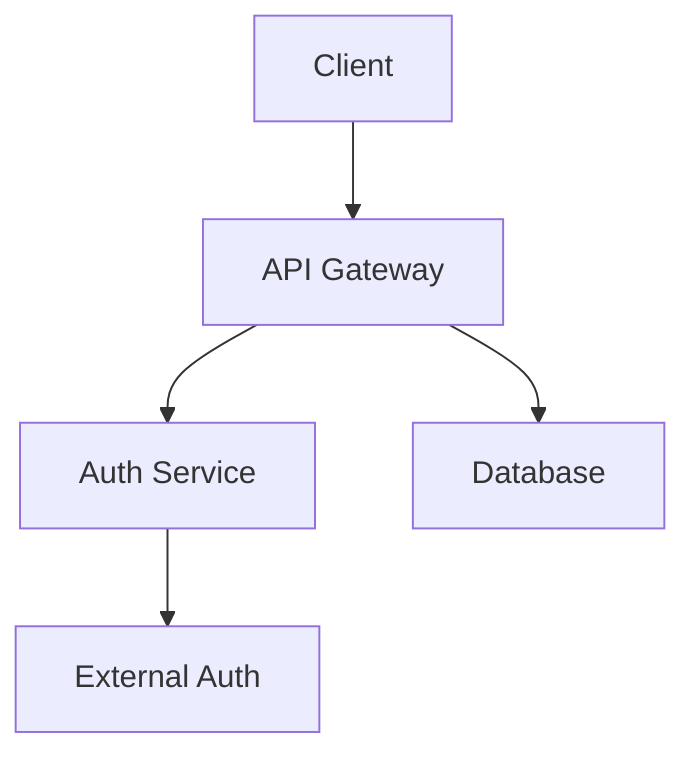

# Documentation Architect

Expert in creating comprehensive technical documentation that captures system architecture, design decisions, and implementation details.

## When to Use This Skill

- Creating MVP documentation (001-009 structure)
- Documenting new features or major refactors
- Generating API references or integration guides
- Writing onboarding materials for new developers
- Producing architecture decision records (ADRs)

## Quick Start

### Generate MVP Documentation Set
```bash
# Analyze project and generate 001-009 docs
"Generate MVP documentation analyzing the EventOS codebase"
```

### Document Feature with Task Breakdown
```bash
# Document feature AND generate task structure
"Document the event wizard feature with task breakdown for Task Master"

# Output includes:
# - Feature documentation with code examples
# - Task hierarchy with 5-7 subtasks each
# - Dependencies and complexity scores
# - Success criteria for each task
```

### Create Feature Implementation Plan
```bash
# Generate comprehensive feature plan
"Create implementation plan for booking system including:
- Architecture diagrams
- Task breakdown (database, state, UI, API layers)
- Task Master commands
- Success criteria"
```

### Document Existing Feature
```bash
# Analyze and document existing code
"Analyze the dashboard feature and create documentation with:
- Architecture explanation
- Code walkthrough
- Task breakdown for improvements
- Testing strategy"
```

## MVP Documentation Structure

Standard EventOS documentation follows this pattern:

```
docs/mvp/
├── 001-overview.md              # Executive summary
├── 002-architecture.md          # System design, components
├── 003-setup-guide.md           # Environment setup
├── 004-core-features.md         # Core functionality
├── 005-intermediate-workflows.md # Automation, data flows
├── 006-advanced-features.md     # AI agents, MCP servers
├── 007-best-practices.md        # Standards, conventions
├── 008-success-criteria.md      # Goals, metrics
└── 009-workflow-checklist.md    # Task tracking
```

## Documentation Patterns

### Standard Document Structure
```markdown
# [Number] - [Title]

**Purpose:** [One sentence explaining what this doc covers]

---

## 🎯 **Overview**
[High-level summary with key takeaways]

## 🏗️ **Architecture/Implementation**
[Technical details with code examples]

## 📊 **Flow Diagrams**
[Mermaid diagrams for sequences/architecture]

## ✅ **Success Criteria**
[Measurable validation points]

---

**Next Step:** Review [next-doc.md](next-doc.md)
```

### Mermaid Diagram Templates

**Sequence Diagram:**


**Architecture Diagram:**


## Key Principles

### 1. Progressive Complexity
Start high-level, progressively add detail:
- Executive summary (non-technical)
- Architecture overview (technical leads)
- Implementation details (developers)
- Deep dives (specialists)

### 2. Explain Design Decisions
Always answer "why" questions:
```markdown
## Why Supabase for Backend?

**Decision**: Use Supabase instead of custom backend

**Rationale**:
- Built-in RLS for security
- Real-time subscriptions out-of-box
- PostgreSQL for complex queries
- Edge Functions for serverless
- Faster MVP development (weeks vs months)
```

### 3. Include Code Examples
Show actual implementation, not pseudocode:
```typescript
// ✅ Good: Real code from project
export function useEvents() {
  return useQuery({
    queryKey: ['events'],
    queryFn: async () => {
      const { data, error } = await supabase
        .from('events')
        .select('*')
        .eq('status', 'published');
      if (error) throw error;
      return data;
    }
  });
}

// ❌ Bad: Generic pseudocode
function fetchEvents() {
  // fetch events from database
  // handle errors
  // return results
}
```

### 4. Link to Source Code
Reference specific files:
```markdown
Event creation logic in src/features/events/hooks/useEventMutations.ts:34-61
```

## Document Types

### System Documentation
- **Audience**: All technical stakeholders
- **Focus**: Architecture, major components, data flows
- **Length**: 20-100 pages
- **Tools**: Mermaid diagrams, code snippets

### Feature Documentation
- **Audience**: Developers implementing/maintaining feature
- **Focus**: How feature works, why it's built this way
- **Length**: 5-20 pages
- **Tools**: Sequence diagrams, code examples

### API Reference
- **Audience**: Developers integrating with APIs
- **Focus**: Endpoints, parameters, responses
- **Length**: Varies by API size
- **Tools**: Request/response examples, status codes

### Onboarding Guide
- **Audience**: New team members
- **Focus**: Getting started, key concepts
- **Length**: 10-30 pages
- **Tools**: Setup steps, troubleshooting

## Generation Workflow

### Phase 1: Discovery
```typescript
// Analyze codebase structure
1. List all source directories
2. Identify main components (pages, features, hooks)
3. Map dependencies and relationships
4. Extract key patterns (hooks, components, utils)
```

### Phase 2: Structure
```typescript
// Plan documentation hierarchy
1. Determine document types needed
2. Create logical chapter flow
3. Plan diagram requirements
4. Identify code examples to include
```

### Phase 3: Generation
```typescript
// Write documentation
1. Start with executive summary
2. Document architecture/design
3. Add implementation details
4. Include diagrams and examples
5. Add validation/testing sections
```

### Phase 4: Validation
```typescript
// Review and refine
1. Check for missing context
2. Verify code examples work
3. Ensure diagrams are clear
4. Test navigation and links
```

## Best Practices

### ✅ Do
- Start with "why" before "how"
- Use real code from the project
- Create clear, labeled diagrams
- Include success criteria
- Link between related docs
- Add troubleshooting sections
- Show before/after comparisons

### ❌ Don't
- Write generic tutorials Claude knows
- Include obvious explanations
- Use pseudocode instead of real code
- Create orphaned documentation
- Skip diagram labels
- Forget to update after changes
- Document implementation-specific details that change frequently

## Examples

### Example 1: MVP Documentation
**Request**: "Generate MVP documentation for EventOS"

**Output**: 9 numbered documents covering:
- System overview and goals
- Architecture and components
- Setup and configuration
- Core features implementation (WITH task breakdown)
- Workflows and automation
- Advanced integrations
- Coding standards
- Success metrics
- Implementation checklist

### Example 2: Feature Documentation with Tasks
**Request**: "Document the event wizard feature with task breakdown"

**Output**: Comprehensive guide including:
- Feature purpose and user flow
- Architecture diagrams (sequence, state, component)
- **Task breakdown**: 10 tasks, 50 subtasks with:
  - Layer-based structure (Database → State → UI)
  - Dependencies mapped
  - Complexity scores (4-8)
  - Task Master commands
- Implementation code examples
- Success criteria per task
- Testing strategy

### Example 3: Feature Implementation Plan
**Request**: "Create implementation plan for booking system"

**Output**: Complete plan with:
- Architecture design (diagrams + rationale)
- **Task hierarchy**:
  ```
  Task 1: Ticket System Database (5 subtasks)
  Task 2: Booking State Management (5 subtasks)
  Task 3: Cart UI Components (5 subtasks)
  Task 4: Payment Integration (6 subtasks)
  Task 5: Order Confirmation (4 subtasks)
  ```
- Dependency flow chart
- Success metrics
- E2E test plan

### Example 4: Analyze Existing Feature
**Request**: "Analyze dashboard and suggest improvements"

**Output**: Analysis including:
- Current architecture documentation
- Code pattern analysis
- Identified improvement areas
- **Task breakdown for improvements**:
  - Performance optimization tasks
  - UI enhancement tasks
  - Feature addition tasks
- Migration strategy if needed

## Task Breakdown & Feature Planning

### Breaking Features into Tasks

When documenting features, use systematic task breakdown:

```bash
# Generate task structure from feature documentation
"Analyze the Event Wizard feature and create Task Master task breakdown"

# Output: Task hierarchy with subtasks, dependencies, complexity scores
```

**Key Principles**:
1. **5-7 subtasks** per task (optimal size)
2. **Clear dependencies** (sequential vs parallel)
3. **Measurable criteria** for completion
4. **Complexity scoring** (1-10 scale)
5. **Layer-based breakdown** (Database → State → UI)

### Task Breakdown Patterns

#### Database Features
```
Task: Database Schema
└─ Subtasks: Migration → Indexes → RLS → Functions → Validation
```

#### UI Features
```
Task: Component Implementation
└─ Subtasks: Structure → Styling → Logic → Validation → Integration
```

#### E2E Features
```
Task: User Journey
└─ Subtasks: UI → State → API → Testing → Documentation
```

### Task Master Integration

```bash
# Parse feature docs into tasks
task-master parse-prd --input="docs/mvp/004-core-features.md"

# Expand complex tasks
task-master expand-task --id=4 --num=5

# Track implementation
task-master set-status --id=4.1 --status=in-progress
```

See `resources/task-breakdown-guide.md` for complete methodology.

## Resources

### Templates
See `resources/` folder for:
- `doc-template.md` - Standard document structure
- `task-breakdown-guide.md` - Feature task decomposition methodology
- `mermaid-patterns.md` - Diagram templates and patterns
- `quick-reference.md` - Command cheat sheet

### Mermaid Quick Reference
```markdown
# Sequence Diagram
sequenceDiagram
    A->>B: Request
    B->>A: Response

# Graph
graph TB
    A[Start] --> B[Process]
    B --> C[End]

# ERD
erDiagram
    USER ||--o{ ORDER : places
```

## Troubleshooting

**Issue**: Documentation too verbose
**Solution**: Focus on project-specific patterns only. Remove explanations of well-known concepts.

**Issue**: Diagrams unclear
**Solution**: Add labels, limit to 5-7 nodes, use clear names, include legend if needed.

**Issue**: Code examples don't work
**Solution**: Copy actual working code from project, verify file paths, test before including.

**Issue**: Documentation quickly outdated
**Solution**: Document "why" and patterns, not implementation details. Include last-updated date.

---

**Quick Commands**:
```bash
# Generate full MVP docs
Skill("docs-architect") "Generate MVP documentation"

# Document specific area
Skill("docs-architect") "Document authentication system"

# Create diagrams
Skill("docs-architect") "Create architecture diagram for event booking flow"
```

---

**Last Updated**: 2025-10-19
**Version**: 1.0
**Status**: Production Ready
