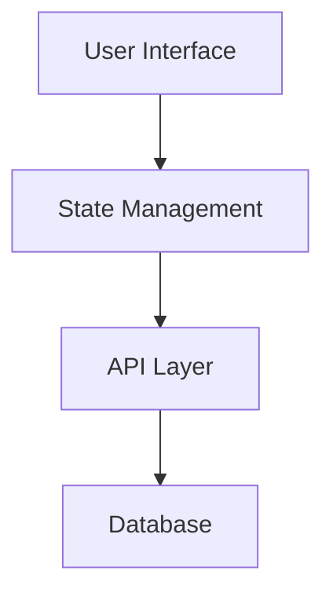
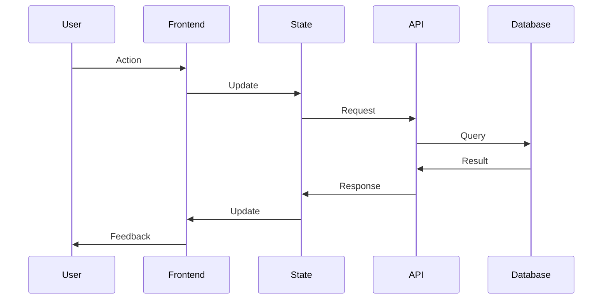
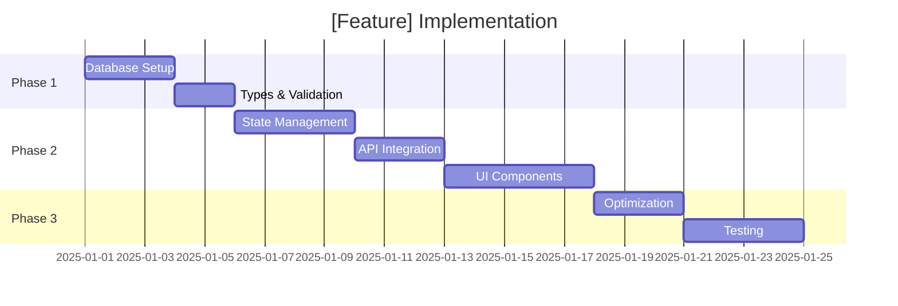

# Feature Analysis Template

Use this template when analyzing existing features or planning new ones.

---

## Feature: [Name]

**Status**: Planning | In Development | Complete | Needs Improvement
**Priority**: High | Medium | Low
**Complexity**: [1-10]

---

## 📊 **Overview**

### User Story
```
As a [user type]
I want to [capability]
So that [benefit]
```

### Business Value
- **Problem Solved**: [What pain point does this address?]
- **Impact**: [How does this improve the product?]
- **Success Metric**: [How do we measure success?]

### Current State
- **Exists**: Yes | No | Partially
- **Quality**: Excellent | Good | Needs Work | Poor
- **Coverage**: [% of requirements implemented]

---

## 🏗️ **Architecture**

### System Components



### Data Flow



### Key Components
1. **Frontend**: [Components, pages, hooks]
2. **State**: [Store structure, actions, selectors]
3. **Backend**: [API endpoints, database tables, functions]
4. **Integration**: [External services, webhooks]

---

## 📋 **Requirements Analysis**

### Functional Requirements
| ID | Requirement | Status | Priority |
|----|-------------|--------|----------|
| FR-1 | [Requirement description] | ✅ Done | High |
| FR-2 | [Requirement description] | 🔄 In Progress | High |
| FR-3 | [Requirement description] | ⏳ Pending | Medium |
| FR-4 | [Requirement description] | ❌ Missing | Low |

### Non-Functional Requirements
| Category | Requirement | Target | Current | Status |
|----------|-------------|--------|---------|--------|
| Performance | Page load time | < 2s | 3.5s | ❌ |
| Performance | API response | < 500ms | 250ms | ✅ |
| Security | RLS coverage | 100% | 100% | ✅ |
| Accessibility | WCAG score | AA | A | 🔄 |
| UX | User satisfaction | > 4.5/5 | 4.2/5 | 🔄 |

---

## 🔍 **Gap Analysis**

### What's Working Well ✅
1. [Strength 1]
2. [Strength 2]
3. [Strength 3]

### What Needs Improvement 🔄
1. [Issue 1] - Impact: High | Medium | Low
2. [Issue 2] - Impact: High | Medium | Low
3. [Issue 3] - Impact: High | Medium | Low

### What's Missing ❌
1. [Missing feature 1] - Priority: High | Medium | Low
2. [Missing feature 2] - Priority: High | Medium | Low
3. [Missing feature 3] - Priority: High | Medium | Low

---

## 🎯 **Task Breakdown**

### Phase 1: Foundation (If new feature)
**Goal**: Set up core infrastructure

#### Task 1: Database Schema
**Complexity**: [1-10]
**Dependencies**: None
**Estimated Time**: [hours/days]

**Subtasks**:
1. [ ] Create migration file with table definitions
2. [ ] Add indexes for query optimization
3. [ ] Implement RLS policies (SELECT, INSERT, UPDATE, DELETE)
4. [ ] Add database functions/triggers
5. [ ] Validate schema and test queries

**Success Criteria**:
- [ ] All CRUD operations work
- [ ] RLS blocks unauthorized access
- [ ] Query performance < 100ms
- [ ] Migration rollback works

#### Task 2: Type Definitions
**Complexity**: [1-10]
**Dependencies**: Task 1

**Subtasks**:
1. [ ] Generate TypeScript types from Supabase schema
2. [ ] Create domain models/interfaces
3. [ ] Add Zod validation schemas
4. [ ] Export types for reuse
5. [ ] Document type usage

**Success Criteria**:
- [ ] All types match database schema
- [ ] No `any` types used
- [ ] Validation schemas cover all inputs
- [ ] Type safety in IDE

---

### Phase 2: Core Implementation
**Goal**: Build main functionality

#### Task 3: State Management
**Complexity**: [1-10]
**Dependencies**: Task 2

**Subtasks**:
1. [ ] Create Zustand store structure
2. [ ] Implement CRUD actions
3. [ ] Add optimistic updates
4. [ ] Integrate with Supabase
5. [ ] Add persistence (localStorage/session)

**Success Criteria**:
- [ ] State updates correctly
- [ ] Persistence works across sessions
- [ ] Optimistic updates feel instant
- [ ] Error handling robust

#### Task 4: API Integration
**Complexity**: [1-10]
**Dependencies**: Task 2

**Subtasks**:
1. [ ] Create TanStack Query hooks
2. [ ] Implement query functions
3. [ ] Add mutation hooks
4. [ ] Configure caching strategy
5. [ ] Add error handling and retries

**Success Criteria**:
- [ ] All endpoints covered
- [ ] Caching reduces redundant requests
- [ ] Error messages user-friendly
- [ ] Loading states handled

#### Task 5: UI Components
**Complexity**: [1-10]
**Dependencies**: Task 3, Task 4

**Subtasks**:
1. [ ] Create base component structure
2. [ ] Implement styling (Tailwind + shadcn/ui)
3. [ ] Add user interactions
4. [ ] Implement form validation
5. [ ] Add loading/error states

**Success Criteria**:
- [ ] Components responsive (mobile/desktop)
- [ ] Accessibility score > 90
- [ ] Dark mode works
- [ ] Loading states smooth

---

### Phase 3: Polish & Optimization
**Goal**: Refine and optimize

#### Task 6: Performance Optimization
**Complexity**: [1-10]
**Dependencies**: Task 5

**Subtasks**:
1. [ ] Implement code splitting
2. [ ] Add lazy loading for images
3. [ ] Optimize bundle size
4. [ ] Add memoization where needed
5. [ ] Run Lighthouse audit

**Success Criteria**:
- [ ] Page load < 2s
- [ ] Lighthouse score > 90
- [ ] Bundle size < target
- [ ] No layout shifts (CLS < 0.1)

#### Task 7: Testing
**Complexity**: [1-10]
**Dependencies**: All above

**Subtasks**:
1. [ ] Write unit tests (components)
2. [ ] Write integration tests (hooks + API)
3. [ ] Write E2E tests (Playwright)
4. [ ] Test error scenarios
5. [ ] Validate accessibility

**Success Criteria**:
- [ ] Test coverage > 80%
- [ ] All happy paths tested
- [ ] Error scenarios covered
- [ ] E2E tests pass consistently

---

## 📈 **Metrics & KPIs**

### Success Metrics
| Metric | Target | Current | Status |
|--------|--------|---------|--------|
| Implementation | 100% | [%] | 🔄 |
| Test Coverage | > 80% | [%] | ⏳ |
| Performance | < 2s load | [s] | ⏳ |
| Accessibility | AA rating | [rating] | ⏳ |
| User Satisfaction | > 4.5/5 | [score] | ⏳ |

### Technical Debt
- **Current**: [assessment of technical debt]
- **Plan**: [how to address it]
- **Timeline**: [when to fix]

---

## 🔗 **Dependencies**

### Internal Dependencies
- **Requires**: [Other features this depends on]
- **Blocks**: [Features waiting for this]
- **Related**: [Features that interact with this]

### External Dependencies
- **APIs**: [External services needed]
- **Libraries**: [Third-party packages]
- **Services**: [Infrastructure requirements]

---

## 🚀 **Implementation Plan**

### Timeline


### Task Master Commands

```bash
# Create feature tasks
task-master add-task \
  --title="[Feature] - Database Schema" \
  --priority=high \
  --tag=feature-name

# Expand into subtasks
task-master expand-task --id=X --num=5

# Track progress
task-master next-task --filter=feature-name
task-master set-status --id=X.Y --status=in-progress
task-master set-status --id=X.Y --status=done
```

---

## ✅ **Validation Checklist**

### Code Quality
- [ ] TypeScript strict mode passes
- [ ] ESLint shows no errors
- [ ] All tests pass
- [ ] Code reviewed

### Functionality
- [ ] All requirements met
- [ ] Happy path works
- [ ] Error cases handled
- [ ] Edge cases covered

### Performance
- [ ] Lighthouse score > 90
- [ ] No performance regressions
- [ ] Bundle size acceptable
- [ ] API responses fast

### Security
- [ ] RLS policies tested
- [ ] Input validation comprehensive
- [ ] XSS prevention verified
- [ ] CSRF protection enabled

### UX
- [ ] Responsive on all devices
- [ ] Accessibility AA compliant
- [ ] Loading states clear
- [ ] Error messages helpful

---

## 📚 **Documentation**

### Required Documentation
- [ ] Update 004-core-features.md with implementation details
- [ ] Add API documentation if applicable
- [ ] Update architecture diagrams
- [ ] Write user guide if needed
- [ ] Document any gotchas or limitations

### Code Documentation
- [ ] All functions have JSDoc comments
- [ ] Complex logic explained
- [ ] Types documented
- [ ] Examples provided

---

## 🔄 **Review & Iteration**

### Review Questions
1. Does this meet all requirements?
2. Is the code maintainable?
3. Are there any performance concerns?
4. Is the UX intuitive?
5. What could be improved?

### Next Steps
1. [Next action item]
2. [Follow-up task]
3. [Future enhancement]

---

**Analysis Date**: [Date]
**Analyst**: [Name/Role]
**Status**: [Draft | Review | Approved]
**Next Review**: [Date]
