# Mermaid Diagram Patterns

Quick reference for common diagram types used in EventOS documentation.

---

## Sequence Diagrams (User Flows)

### Basic Pattern
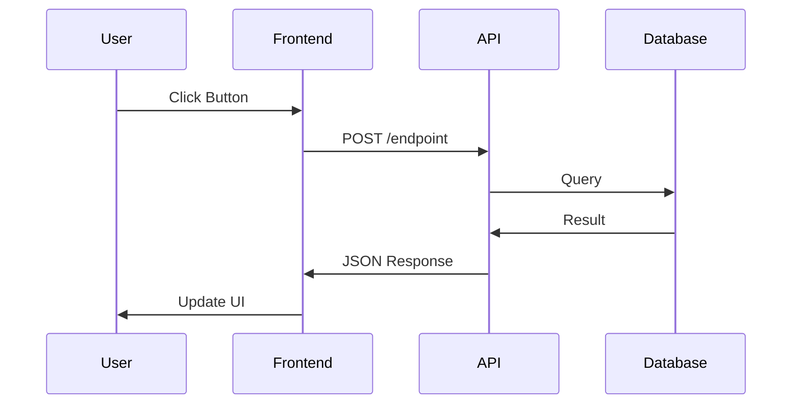

### With Alternative Paths
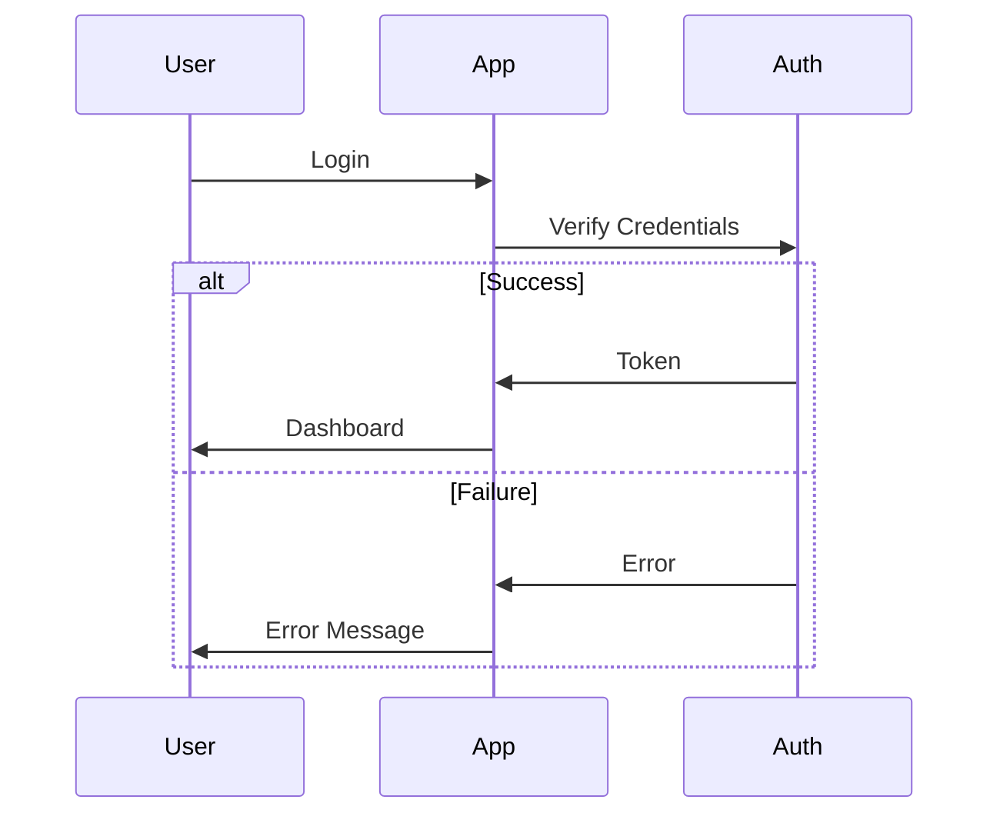

### With Parallel Operations
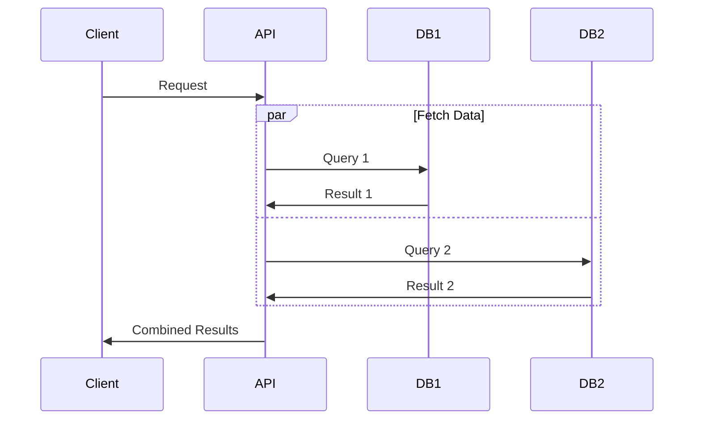

---

## Architecture Diagrams (System Structure)

### Layered Architecture
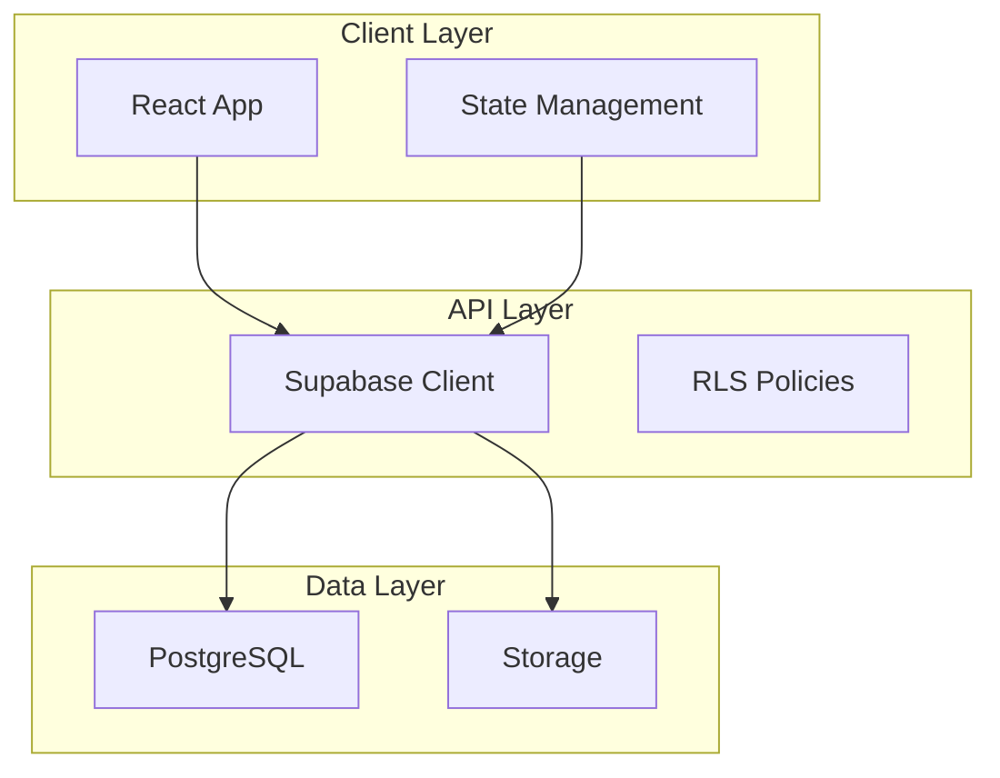

### Microservices Architecture
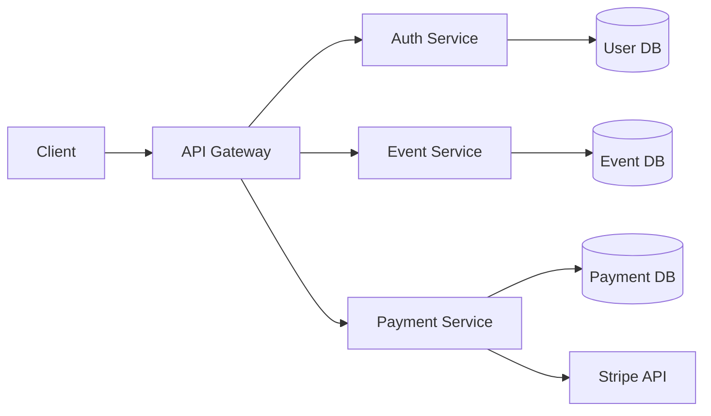

---

## Entity Relationship Diagrams (Database)

### Basic ERD
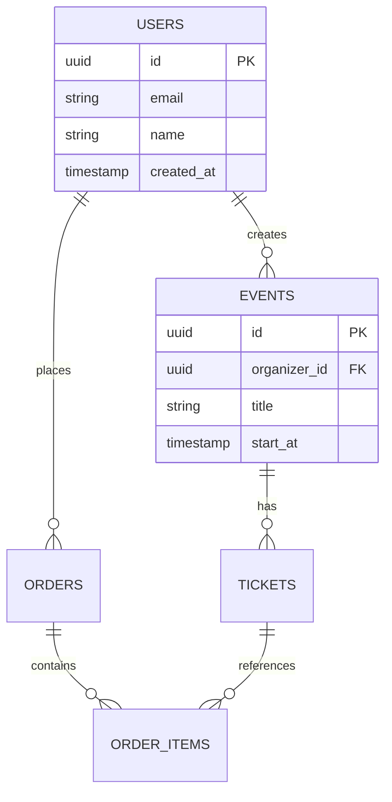

---

## Flow Charts (Process Logic)

### Decision Tree
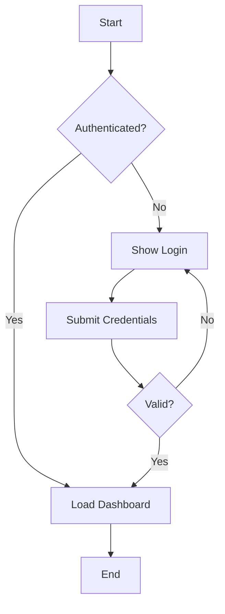

### Process Flow
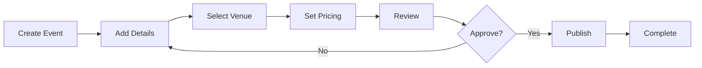

---

## State Diagrams (State Machines)

### Order State Machine
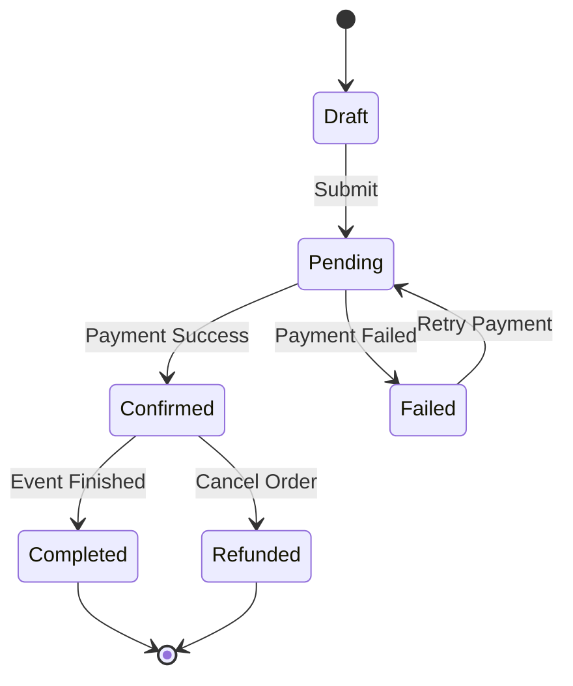

---

## Timeline Diagrams (Project Phases)

### Gantt Chart
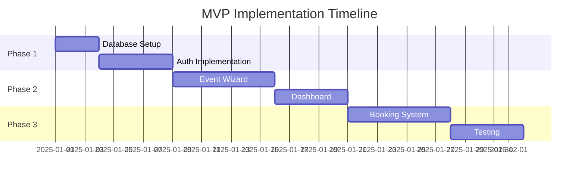

---

## Class Diagrams (Code Structure)

### Component Hierarchy
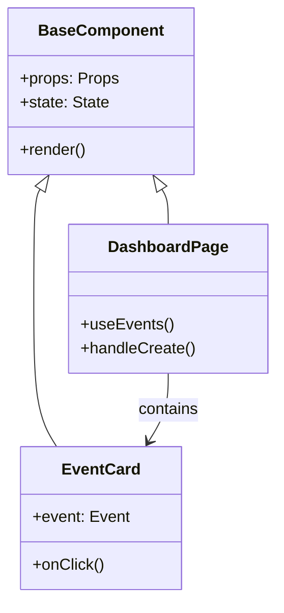

---

## Best Practices

### Clarity
- **Limit nodes**: 5-7 per diagram (split complex flows)
- **Clear labels**: Use descriptive names, avoid abbreviations
- **Legend**: Add legend for colors/shapes if needed

### Layout
- **Direction**: Left-to-right (LR) for processes, Top-to-bottom (TB) for hierarchies
- **Grouping**: Use subgraphs for related components
- **Spacing**: Don't overcrowd, break into multiple diagrams if needed

### Consistency
- **Naming**: Use consistent names across all diagrams
- **Colors**: Use same colors for similar types (e.g., databases always green)
- **Styles**: Keep diagram styles consistent within same doc

---

## EventOS Diagram Standards

### Colors
- **Frontend**: Blue (#3B82F6)
- **Backend**: Green (#10B981)
- **Database**: Purple (#8B5CF6)
- **External**: Orange (#F59E0B)

### Actors
- **User**: person icon
- **System**: box
- **Database**: cylinder
- **External Service**: cloud shape

### Arrows
- **Synchronous**: solid line (-->)
- **Asynchronous**: dashed line (--)
- **Data flow**: thick arrow (==>)
- **Inheritance**: dotted arrow (.->)

---

**Quick Reference**:
```markdown
# Most common diagrams in EventOS docs
1. Sequence: User flows, API interactions
2. Architecture: System components, layers
3. ERD: Database relationships
4. Flowchart: Decision logic, processes
```
