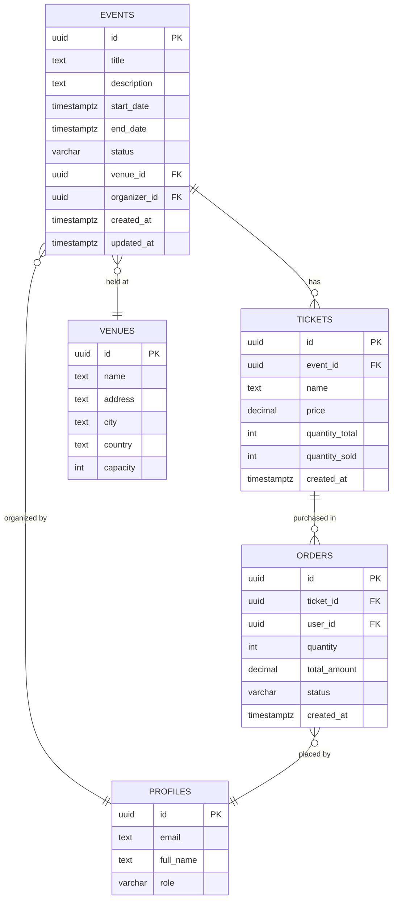

# Additional Planning Documents

Templates for supporting documentation beyond core PRD and Tech Spec.

---

## 1. Roadmap Template

**File**: `{feature}-roadmap.md`
**Purpose**: Timeline and milestone tracking

```markdown
# {Feature Name} - Roadmap

## Timeline Overview

**Start Date**: 2025-10-23
**Target Completion**: 2025-11-15
**Total Duration**: 4 weeks

---

## Milestones

### Week 1: Foundation (Oct 23-27)
**Goal**: Database and backend infrastructure complete

**Tasks**:
- ✅ Database schema design
- ✅ Migrations created
- ✅ RLS policies implemented
- ✅ Edge Functions deployed

**Deliverables**:
- Working database with sample data
- Tested Edge Functions
- API documentation

**Success Criteria**:
- All migrations run successfully
- RLS policies tested
- Edge Functions respond < 200ms

---

### Week 2: Core Features (Oct 28 - Nov 3)
**Goal**: Frontend components and data integration

**Tasks**:
- [ ] React Query hooks created
- [ ] UI components built
- [ ] Forms implemented
- [ ] Data fetching working

**Deliverables**:
- Functional UI
- Real data displayed
- CRUD operations working

**Success Criteria**:
- All pages connected to database
- Forms validate correctly
- Error handling works

---

### Week 3: Testing & Polish (Nov 4-10)
**Goal**: Comprehensive testing and UX improvements

**Tasks**:
- [ ] Unit tests written (80%+ coverage)
- [ ] Integration tests complete
- [ ] E2E tests with Playwright MCP
- [ ] Accessibility audit
- [ ] Performance optimization

**Deliverables**:
- Test suite passing
- Lighthouse score > 90
- Accessibility score > 95

**Success Criteria**:
- All tests pass
- No critical bugs
- Performance requirements met

---

### Week 4: Production (Nov 11-15)
**Goal**: Production deployment and validation

**Tasks**:
- [ ] Staging deployment
- [ ] Production checklist complete
- [ ] Security audit
- [ ] Documentation finalized
- [ ] Production deployment

**Deliverables**:
- Live feature in production
- Documentation published
- Team trained

**Success Criteria**:
- Zero critical issues
- All stakeholders signed off
- Monitoring in place

---

## Dependencies

**External Dependencies**:
- Stripe API integration (Week 2)
- Email service setup (Week 3)

**Internal Dependencies**:
- User authentication complete
- Payment system operational

**Blockers**:
- None currently identified

---

## Risk Assessment

| Risk | Impact | Probability | Mitigation |
|------|--------|-------------|------------|
| Database migration failure | High | Low | Test thoroughly in staging, have rollback plan |
| Third-party API downtime | Medium | Medium | Implement retry logic, fallback options |
| Performance issues | Medium | Low | Load testing, caching strategy |
| Security vulnerability | High | Low | Security audit, penetration testing |

---

## Resource Allocation

**Team Members**:
- Frontend Developer: 60% allocation
- Backend Developer: 40% allocation
- QA Engineer: 20% allocation (Week 3-4)
- Designer: 10% allocation (Week 1-2)

**Budget**:
- Development: $XX,XXX
- Testing: $X,XXX
- Infrastructure: $XXX/month

---

## Communication Plan

**Weekly Updates**: Every Friday at 3 PM
**Stakeholders**: Product Manager, Engineering Lead, QA Lead
**Status Reports**: Shared via Slack #project-updates

**Escalation Path**:
1. Team Lead
2. Engineering Manager
3. VP Engineering

---

**Last Updated**: 2025-10-23
```

---

## 2. Progress Tracker Template

**File**: `{feature}-progress.md`
**Purpose**: Real-time status tracking

```markdown
# {Feature Name} - Progress Tracker

**Last Updated**: 2025-10-23 14:30
**Overall Progress**: 🟡 35% Complete

---

## Quick Status

```
Database:        ████████████████████ 100% ✅
Backend:         ████████████░░░░░░░░  60% 🟡
Frontend:        ████████░░░░░░░░░░░░  40% 🟡
Testing:         ░░░░░░░░░░░░░░░░░░░░   0% 🔴
Documentation:   ████░░░░░░░░░░░░░░░░  20% 🔴
```

---

## Layer Progress

### Layer 1: Database ✅ 100%
- ✅ Schema designed
- ✅ Migrations created
- ✅ RLS policies implemented
- ✅ Testing complete

**Notes**: All database work complete. Migrations tested in staging.

---

### Layer 2: Backend 🟡 60%
- ✅ Edge Functions created (3/5)
- ✅ Validation schemas defined
- 🟡 Error handling (80% complete)
- 🔴 Rate limiting (not started)

**Blockers**: None
**Next Steps**: Complete remaining 2 Edge Functions, add rate limiting

---

### Layer 3: Frontend 🟡 40%
- ✅ Core components built (5/12)
- 🟡 Forms implemented (2/5)
- 🔴 Data integration (3/12 pages)
- 🔴 Loading states (incomplete)

**Blockers**: Waiting for backend Edge Functions
**Next Steps**: Complete remaining forms, add loading states

---

### Layer 4: Testing 🔴 0%
- 🔴 Unit tests (not started)
- 🔴 Integration tests (not started)
- 🔴 E2E tests (not started)
- 🔴 Accessibility audit (not started)

**Blockers**: Frontend must reach 80% first
**Next Steps**: Begin unit test setup

---

### Layer 5: Production 🔴 0%
- 🔴 Staging deployment (not started)
- 🔴 Security audit (not started)
- 🔴 Performance audit (not started)
- 🔴 Documentation (20% complete)

**Blockers**: Testing layer must be complete
**Next Steps**: Continue documentation in parallel

---

## Task Status

### This Week (Oct 23-27)
- ✅ Database schema (DONE)
- ✅ Migrations (DONE)
- 🟡 Edge Functions (60%)
- 🔴 React Query hooks (30%)

### Next Week (Oct 28 - Nov 3)
- Frontend components (0/12)
- Form implementations (2/5)
- Data integration (3/12)

---

## Metrics

**Completed Tasks**: 12 / 45 (27%)
**Remaining Tasks**: 33
**On Schedule**: ⚠️ Slightly behind (2 days)

**Velocity**: 3 tasks/day
**Estimated Completion**: Nov 18 (3 days late)

---

## Recent Updates

**2025-10-23 14:30**:
- ✅ Completed RLS policies for events table
- ✅ Deployed 3 Edge Functions to staging
- 🟡 Started React Query hooks (30% complete)

**2025-10-22 16:45**:
- ✅ Database migrations tested
- ✅ Schema design approved

---

## Notes & Decisions

**Oct 23**: Decided to use Zod for validation instead of Yup (better TypeScript support)
**Oct 22**: Added composite index on (organizer_id, status) for performance

---

**Legend**:
- ✅ Complete
- 🟡 In Progress
- 🔴 Not Started
- ⚠️ Blocked/At Risk
```

---

## 3. API Reference Template

**File**: `{feature}-api-reference.md`
**Purpose**: Complete API endpoint documentation

```markdown
# {Feature Name} - API Reference

## Base URL

```
Production: https://asrzdtpyrdgyggqdfwwl.supabase.co
Staging: https://staging-asrzdtpyrdgyggqdfwwl.supabase.co
```

## Authentication

All API requests require authentication via JWT token in Authorization header:

```bash
Authorization: Bearer <your_jwt_token>
```

---

## Endpoints

### 1. GET /api/events

**Description**: Fetch all published events

**Query Parameters**:
| Parameter | Type | Required | Description |
|-----------|------|----------|-------------|
| status | string | No | Filter by status (published, draft, cancelled) |
| organizer_id | uuid | No | Filter by organizer |
| search | string | No | Search in title and description |
| limit | number | No | Maximum results (default: 50) |
| offset | number | No | Pagination offset (default: 0) |

**Example Request**:
```bash
curl -X GET 'https://api.example.com/api/events?status=published&limit=10' \
  -H 'Authorization: Bearer <token>'
```

**Example Response** (200 OK):
```json
{
  "data": [
    {
      "id": "550e8400-e29b-41d4-a716-446655440000",
      "title": "Tech Conference 2025",
      "description": "Annual technology conference",
      "status": "published",
      "start_date": "2025-12-01T09:00:00Z",
      "end_date": "2025-12-03T18:00:00Z",
      "venue_id": "660e8400-e29b-41d4-a716-446655440000",
      "organizer_id": "770e8400-e29b-41d4-a716-446655440000",
      "created_at": "2025-10-20T10:00:00Z",
      "updated_at": "2025-10-22T14:30:00Z"
    }
  ],
  "count": 1,
  "total": 45
}
```

**Error Responses**:
- `401 Unauthorized`: Missing or invalid token
- `400 Bad Request`: Invalid query parameters
- `500 Internal Server Error`: Server error

---

### 2. POST /api/events

**Description**: Create a new event

**Request Body**:
```typescript
{
  title: string;          // Required, 3-200 characters
  description?: string;   // Optional, max 5000 characters
  start_date: string;     // Required, ISO 8601 format
  end_date: string;       // Required, ISO 8601 format
  venue_id: string;       // Required, valid venue UUID
  status?: string;        // Optional, defaults to 'draft'
}
```

**Example Request**:
```bash
curl -X POST 'https://api.example.com/api/events' \
  -H 'Authorization: Bearer <token>' \
  -H 'Content-Type: application/json' \
  -d '{
    "title": "New Event",
    "description": "Event description",
    "start_date": "2025-12-01T09:00:00Z",
    "end_date": "2025-12-01T18:00:00Z",
    "venue_id": "660e8400-e29b-41d4-a716-446655440000"
  }'
```

**Example Response** (201 Created):
```json
{
  "id": "880e8400-e29b-41d4-a716-446655440000",
  "title": "New Event",
  "status": "draft",
  "created_at": "2025-10-23T15:00:00Z"
}
```

**Error Responses**:
- `400 Bad Request`: Validation error
- `401 Unauthorized`: Not authenticated
- `403 Forbidden`: Not authorized
- `422 Unprocessable Entity`: Invalid data

---

### 3. GET /api/events/:id

**Description**: Fetch single event by ID

**Path Parameters**:
- `id` (uuid): Event ID

**Example Request**:
```bash
curl -X GET 'https://api.example.com/api/events/550e8400-e29b-41d4-a716-446655440000' \
  -H 'Authorization: Bearer <token>'
```

**Example Response** (200 OK):
```json
{
  "id": "550e8400-e29b-41d4-a716-446655440000",
  "title": "Tech Conference 2025",
  "description": "Annual technology conference",
  "status": "published",
  "start_date": "2025-12-01T09:00:00Z",
  "end_date": "2025-12-03T18:00:00Z",
  "venue": {
    "id": "660e8400-e29b-41d4-a716-446655440000",
    "name": "Convention Center",
    "city": "San Francisco"
  },
  "organizer": {
    "id": "770e8400-e29b-41d4-a716-446655440000",
    "name": "Tech Events Inc"
  },
  "tickets_count": 150,
  "attendees_count": 120
}
```

**Error Responses**:
- `404 Not Found`: Event does not exist
- `401 Unauthorized`: Not authenticated

---

## Rate Limiting

**Limits**:
- Authenticated requests: 1000 requests/hour
- Anonymous requests: 100 requests/hour

**Headers**:
```
X-RateLimit-Limit: 1000
X-RateLimit-Remaining: 995
X-RateLimit-Reset: 1635343200
```

---

## Error Format

All errors follow this structure:

```json
{
  "error": {
    "code": "VALIDATION_ERROR",
    "message": "Title must be at least 3 characters",
    "details": {
      "field": "title",
      "constraint": "minLength"
    }
  }
}
```

---

**API Version**: v1
**Last Updated**: 2025-10-23
```

---

## 4. Database Schema Template

**File**: `{feature}-database-schema.md`
**Purpose**: ERD and table documentation

```markdown
# {Feature Name} - Database Schema

## Entity Relationship Diagram



---

## Table Definitions

### `events`

**Purpose**: Store event information

| Column | Type | Constraints | Description |
|--------|------|-------------|-------------|
| id | uuid | PK, DEFAULT gen_random_uuid() | Unique identifier |
| title | text | NOT NULL | Event title |
| description | text | | Event description |
| start_date | timestamptz | NOT NULL | Event start |
| end_date | timestamptz | NOT NULL | Event end |
| status | varchar(20) | NOT NULL, DEFAULT 'draft' | Event status |
| venue_id | uuid | FK → venues(id) | Venue reference |
| organizer_id | uuid | FK → profiles(id) | Organizer reference |
| created_at | timestamptz | DEFAULT now() | Creation time |
| updated_at | timestamptz | DEFAULT now() | Last update time |

**Indexes**:
```sql
CREATE INDEX idx_events_status ON events(status);
CREATE INDEX idx_events_organizer ON events(organizer_id);
CREATE INDEX idx_events_start_date ON events(start_date);
CREATE INDEX idx_events_organizer_status ON events(organizer_id, status);
```

**RLS Policies**:
```sql
-- Public can view published events
CREATE POLICY "public_view_published_events"
  ON events FOR SELECT
  TO public
  USING (status = 'published');

-- Organizers can CRUD own events
CREATE POLICY "organizers_manage_own_events"
  ON events FOR ALL
  TO authenticated
  USING (auth.uid() = organizer_id)
  WITH CHECK (auth.uid() = organizer_id);
```

---

### `tickets`

**Purpose**: Store ticket types for events

| Column | Type | Constraints | Description |
|--------|------|-------------|-------------|
| id | uuid | PK, DEFAULT gen_random_uuid() | Unique identifier |
| event_id | uuid | FK → events(id) ON DELETE CASCADE | Event reference |
| name | text | NOT NULL | Ticket name |
| price | decimal(10,2) | NOT NULL | Ticket price |
| quantity_total | int | NOT NULL | Total available |
| quantity_sold | int | DEFAULT 0 | Tickets sold |
| created_at | timestamptz | DEFAULT now() | Creation time |

**Constraints**:
```sql
ALTER TABLE tickets
  ADD CONSTRAINT check_quantity_valid
  CHECK (quantity_sold <= quantity_total AND quantity_sold >= 0);

ALTER TABLE tickets
  ADD CONSTRAINT check_price_positive
  CHECK (price >= 0);
```

---

## Migration History

| Version | Date | Description | File |
|---------|------|-------------|------|
| 001 | 2025-10-20 | Initial schema | 20251020_create_events.sql |
| 002 | 2025-10-21 | Add RLS policies | 20251021_add_rls_policies.sql |
| 003 | 2025-10-22 | Add indexes | 20251022_add_indexes.sql |

---

**Last Updated**: 2025-10-23
```

---

**Template Version**: 1.0
**Document Purpose**: Supporting templates for comprehensive feature planning
