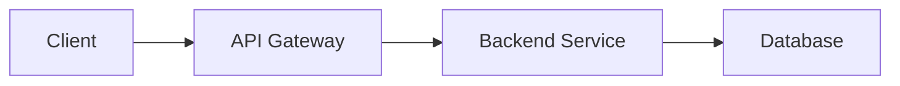

# Technical Specification Template

Use this template when creating technical specifications for features.

## Document Structure

```markdown
# {Feature Name} - Technical Specification

## 1. Overview
Brief 2-3 sentence summary of what is being built.

## 2. Architecture

### System Components
- **Component A**: Purpose and responsibility
- **Component B**: Purpose and responsibility

### Data Flow


## 3. Database Design

### Tables

#### `table_name`
| Column | Type | Constraints | Description |
|--------|------|-------------|-------------|
| id | uuid | PK | Primary key |
| name | text | NOT NULL | Entity name |
| created_at | timestamptz | NOT NULL | Creation timestamp |

### Relationships
- `events` ↔ `tickets` (one-to-many)
- `events` → `venues` (many-to-one)

### Indexes
```sql
CREATE INDEX idx_events_status ON events(status);
CREATE INDEX idx_events_organizer ON events(organizer_id);
```

### RLS Policies
```sql
-- Enable RLS
ALTER TABLE events ENABLE ROW LEVEL SECURITY;

-- Policy: Users can view published events
CREATE POLICY "Public events are viewable by everyone"
  ON events FOR SELECT
  USING (status = 'published');

-- Policy: Organizers can manage their own events
CREATE POLICY "Organizers can manage own events"
  ON events FOR ALL
  USING (auth.uid() = organizer_id);
```

## 4. API Design

### Endpoints

#### POST /api/events
**Purpose**: Create new event

**Request**:
```typescript
interface CreateEventRequest {
  title: string;
  description: string;
  start_date: string; // ISO 8601
  venue_id: string;
}
```

**Response**:
```typescript
interface CreateEventResponse {
  id: string;
  title: string;
  status: 'draft';
  created_at: string;
}
```

**Status Codes**:
- 201: Created successfully
- 400: Validation error
- 401: Unauthorized
- 500: Server error

### Edge Functions

#### `supabase/functions/{name}/index.ts`
```typescript
import { serve } from 'https://deno.land/std@0.168.0/http/server.ts'
import { createClient } from 'https://esm.sh/@supabase/supabase-js@2'

serve(async (req: Request) => {
  // Authentication
  const authHeader = req.headers.get('Authorization')!
  const supabase = createClient(
    Deno.env.get('SUPABASE_URL')!,
    Deno.env.get('SUPABASE_ANON_KEY')!,
    { global: { headers: { Authorization: authHeader } } }
  )

  // Validation
  const body = await req.json()
  // Business logic
  // Response
})
```

## 5. Frontend Components

### Component Hierarchy
```
EventPage
├── EventHeader
├── EventDetails
│   ├── EventInfo
│   └── EventSchedule
├── TicketSelector
└── EventFooter
```

### State Management
```typescript
// Zustand store
interface EventStore {
  selectedEvent: Event | null;
  filters: EventFilters;
  setSelectedEvent: (event: Event) => void;
  updateFilters: (filters: Partial<EventFilters>) => void;
}
```

### React Query Hooks
```typescript
// useEvent.ts
export function useEvent(id: string) {
  return useQuery({
    queryKey: ['event', id],
    queryFn: () => fetchEvent(id),
    staleTime: 5 * 60 * 1000, // 5 minutes
  })
}
```

## 6. Security Considerations

### Authentication
- Use Supabase Auth with PKCE flow
- JWT tokens in Authorization header
- Refresh tokens stored securely

### Authorization
- Row Level Security (RLS) for all tables
- Role-based access control (RBAC)
- Organizer-level permissions

### Input Validation
```typescript
const eventSchema = z.object({
  title: z.string().min(3).max(200),
  description: z.string().max(5000),
  start_date: z.string().datetime(),
})
```

### Security Headers
```typescript
// Edge Function headers
return new Response(JSON.stringify(data), {
  headers: {
    'Content-Type': 'application/json',
    'X-Content-Type-Options': 'nosniff',
    'X-Frame-Options': 'DENY',
    'Strict-Transport-Security': 'max-age=31536000',
  },
})
```

## 7. Dependencies

### Frontend
- React 18+
- TanStack Query v5
- Zustand (state management)
- shadcn/ui (UI components)
- Zod (validation)

### Backend
- Supabase (database, auth, storage)
- Deno (Edge Functions runtime)
- PostgreSQL 15+

### External Services
- Stripe (payments) - API v2023-10-16
- SendGrid (emails) - API v3
- Cloudinary (image uploads) - optional

## 8. Performance Requirements

### Response Times
- API endpoints: < 200ms (p95)
- Page loads: < 2s (p95)
- Database queries: < 100ms (p95)

### Scalability
- Support 10,000 concurrent users
- Handle 1,000 events created per day
- Store 100,000 tickets

### Caching Strategy
- Browser cache: 1 hour for static assets
- API cache: 5 minutes for event lists
- Database cache: Materialized views for dashboards

## 9. Monitoring & Observability

### Metrics to Track
- API response times (by endpoint)
- Error rates (by type)
- Database query performance
- User authentication success rate

### Logging
```typescript
// Structured logging
console.log(JSON.stringify({
  level: 'info',
  timestamp: new Date().toISOString(),
  event: 'event_created',
  data: { eventId, organizerId },
}))
```

### Alerts
- Error rate > 1% (critical)
- Response time > 500ms (warning)
- Database connections > 80% (warning)

## 10. Deployment Strategy

### Environment Variables
```bash
# .env.production
VITE_SUPABASE_URL=https://xxx.supabase.co
VITE_SUPABASE_ANON_KEY=xxx
STRIPE_PUBLIC_KEY=pk_live_xxx
```

### Database Migrations
```sql
-- supabase/migrations/{timestamp}_feature_name.sql

-- Create tables
CREATE TABLE IF NOT EXISTS events (...);

-- Add indexes
CREATE INDEX IF NOT EXISTS idx_events_status ON events(status);

-- Enable RLS
ALTER TABLE events ENABLE ROW LEVEL SECURITY;

-- Rollback script in comments
-- DROP TABLE IF EXISTS events CASCADE;
```

### Edge Function Deployment
```bash
# Deploy function
supabase functions deploy event-handler

# Set secrets
supabase secrets set STRIPE_SECRET_KEY=sk_live_xxx
```

### Frontend Deployment
```bash
# Build
npm run build

# Preview
npm run preview

# Deploy (Vercel/Netlify)
vercel deploy --prod
```

## 11. Testing Strategy

See [testing-template.md](./testing-template.md) for comprehensive testing plan.

### Unit Tests
- All utility functions
- Validation schemas
- State management logic

### Integration Tests
- API endpoints
- Database queries
- Edge Functions

### E2E Tests
- User flows (create event, book ticket)
- Payment processing
- Email notifications

## 12. Rollback Plan

### Database Rollback
```sql
-- Each migration includes rollback script
-- Run migrations in reverse order
-- Restore from backup if needed
```

### Application Rollback
- Vercel: Rollback to previous deployment
- Edge Functions: Redeploy previous version
- Database: Run down migrations

### Communication Plan
- Notify users via status page
- Send email to affected organizers
- Update documentation

## 13. Success Criteria

### Functional
- ✅ All API endpoints respond correctly
- ✅ RLS policies enforce security
- ✅ UI displays real data
- ✅ Error handling works end-to-end

### Non-Functional
- ✅ Performance meets requirements (< 200ms p95)
- ✅ Security audit passes
- ✅ Accessibility score > 95
- ✅ Test coverage > 80%

---

**Template Version**: 1.0
**Last Updated**: 2025-10-23
