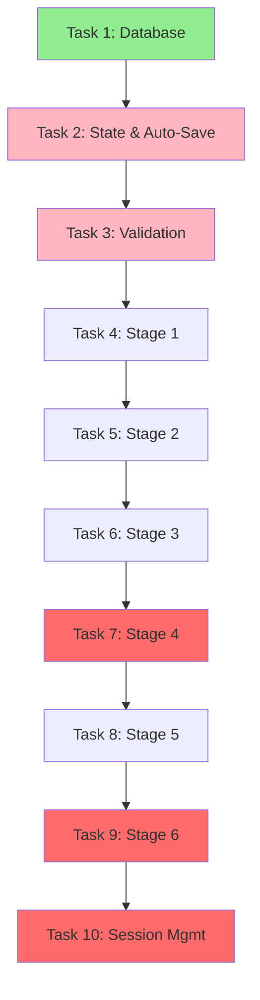

# EventOS AI Event Wizard - MVP Implementation Plan

**Generated:** October 13, 2025
**Project:** EventOS - AI-Powered Event Management Platform
**Focus:** Core MVP - 6-Stage Event Creation Wizard
**Timeline:** 2 Weeks (10 Working Days)

---

## 🎯 Executive Summary

This implementation plan provides a **complete, ordered task breakdown** for building the EventOS AI Event Creation Wizard MVP. The plan follows Task Master AI's analysis and dependency mapping to ensure optimal development flow.

**Key Metrics:**
- **Total Tasks:** 10 high-level tasks
- **Total Subtasks:** 50 detailed implementation steps
- **Complexity Distribution:**
  - High Complexity (8-9): 3 tasks (Ticketing, Publishing, Session Management)
  - Medium Complexity (5-7): 5 tasks (State, Validation, Forms, Venue)
  - Low Complexity (4): 2 tasks (Database, Marketing)
- **Estimated Timeline:** 10 working days
- **Success Metric:** 95% wizard completion rate, <3 minute creation time

---

## 📋 Task Overview

| ID | Task | Complexity | Subtasks | Priority | Dependencies |
|----|------|------------|----------|----------|--------------|
| 1 | Database Schema Setup | 4/10 | 5 | HIGH | None |
| 2 | Zustand Store & Auto-Save | 7/10 | 5 | HIGH | Task 1 |
| 3 | Zod Validation Schemas | 6/10 | 5 | HIGH | Task 2 |
| 4 | Stage 1: Event Basics | 5/10 | 5 | MEDIUM | Task 3 |
| 5 | Stage 2: Event Details | 5/10 | 5 | MEDIUM | Task 4 |
| 6 | Stage 3: Venue Selection | 6/10 | 5 | MEDIUM | Task 5 |
| 7 | Stage 4: Dynamic Ticketing | 8/10 | 5 | MEDIUM | Task 6 |
| 8 | Stage 5: Marketing & SEO | 4/10 | 5 | MEDIUM | Task 7 |
| 9 | Stage 6: Review & Publish | 7/10 | 5 | HIGH | Task 8 |
| 10 | Session Management System | 8/10 | 5 | HIGH | Task 9 |

---

## 🏗️ Ordered Build Plan (Foundation → Features → Polish)

### **PHASE 1: Foundation (Days 1-2)**
**Goal:** Establish database, state management, and validation infrastructure

#### Day 1: Database & State Foundation

**Task 1: Database Schema Setup** [Complexity: 4/10]
```
Priority: HIGH | Dependencies: None
```

**Subtasks:**
1. ✅ Create Supabase migration file for `wizard_sessions` table
   - Schema: id, user_id, event_id, stage, status, state (JSONB), timestamps
   - Foreign keys to profiles and events tables
   - Status enum: in_progress, completed, abandoned

2. ✅ Add database indexes for performance
   - Index on user_id for user session queries
   - Index on status for filtering active sessions
   - Index on last_saved_at for cleanup operations
   - GIN index on state JSONB for fast queries

3. ✅ Implement Row Level Security policies
   - Users can SELECT only their own sessions
   - Users can INSERT their own sessions
   - Users can UPDATE only their own sessions
   - Users can DELETE only their own sessions

4. ✅ Create database helper functions and triggers
   - Trigger for auto-updating last_saved_at timestamp
   - Function for session cleanup (delete abandoned > 24h)
   - Function for session validation

5. ✅ Validate complete schema integration
   - Test CRUD operations
   - Verify RLS policies work correctly
   - Test foreign key relationships
   - Verify indexes improve query performance

**Deliverables:**
- `supabase/migrations/YYYYMMDD_create_wizard_sessions.sql`
- Verified RLS policies
- Performance-optimized indexes

---

#### Day 2: State Management & Auto-Save

**Task 2: Zustand Store and Auto-Save System** [Complexity: 7/10]
```
Priority: HIGH | Dependencies: Task 1
```

**Subtasks:**
1. ✅ Create Zustand store structure and types
   - Define WizardState interface
   - Define WizardActions interface
   - Initialize store with default values
   - Export store hooks

2. ✅ Implement auto-save hook with debouncing
   - Create useAutoSave hook
   - Implement 30-second debouncing
   - Add manual save triggers
   - Handle save success/error states

3. ✅ Implement session management functions
   - initializeSession: Create or load session
   - saveSession: Persist state to database
   - updateStage: Update current stage
   - resetSession: Clear current session

4. ✅ Add offline support with localStorage backup
   - Detect offline state
   - Save to localStorage when offline
   - Sync to Supabase when online
   - Handle conflict resolution

5. ✅ Create visual save indicators and status UI
   - SaveIndicator component (Saving/Saved/Error)
   - LastSaved timestamp display
   - Error toast notifications
   - Manual save button

**Deliverables:**
- `src/stores/wizardStore.ts`
- `src/hooks/useAutoSave.ts`
- `src/components/wizard/SaveIndicator.tsx`
- localStorage backup system

---

### **PHASE 2: Validation & Forms (Days 3-4)**
**Goal:** Build validation framework and first two wizard stages

#### Day 3: Validation Infrastructure

**Task 3: Zod Validation Schemas** [Complexity: 6/10]
```
Priority: HIGH | Dependencies: Task 2
```

**Subtasks:**
1. ✅ Create Stage 1 & 2 Zod validation schemas
   - Event basics schema (type, name, date, attendees, description, image)
   - Event details schema (format, accessibility, branding)
   - Field-level validation rules
   - Custom error messages

2. ✅ Create Stage 3 & 4 Zod validation schemas
   - Venue selection schema with capacity validation
   - Ticketing schema with pricing rules
   - Cross-stage dependencies (venue capacity vs attendees)

3. ✅ Create Stage 5 & 6 Zod validation schemas
   - Marketing schema with SEO rules
   - Review schema with completeness checks
   - Final publish validation

4. ✅ Implement real-time validation hook with debouncing
   - Create useFormValidation hook
   - Debounce validation (300ms)
   - Return field errors and touched state
   - Integrate with React Hook Form

5. ✅ Implement accessibility-compliant error messaging
   - Error components with ARIA attributes
   - aria-invalid on invalid fields
   - aria-describedby for error messages
   - Screen reader announcements

**Deliverables:**
- `src/lib/validations/wizard.ts`
- `src/hooks/useFormValidation.ts`
- `src/components/wizard/ErrorMessage.tsx`

---

#### Day 4: Stage 1 - Event Basics

**Task 4: Stage 1 Implementation** [Complexity: 5/10]
```
Priority: MEDIUM | Dependencies: Task 3
```

**Subtasks:**
1. ✅ Create Stage1 component structure and basic form
   - Set up CreateEvent.tsx with form provider
   - Integrate Zustand store
   - Add FormCard wrapper
   - Initialize form with React Hook Form

2. ✅ Implement event type selection with RadioCard
   - 6 event types: conference, gala, product launch, team building, networking, workshop
   - Use existing RadioCard component
   - Icons for each type
   - Validation integration

3. ✅ Build event name input with character counter
   - Text input with validation
   - Real-time character counter (5-100 chars)
   - Error message display
   - Auto-save on blur

4. ✅ Implement date/time picker with future date validation
   - Use react-datepicker
   - Validate future dates only
   - Timezone handling
   - Calendar icon and clear button

5. ✅ Build attendee count, description, and image upload
   - Number input for attendees (10-10,000)
   - Textarea for description (50-500 chars)
   - Image upload with preview (max 5MB)
   - Drag-and-drop support

**Deliverables:**
- `src/pages/wizard/CreateEvent.tsx`
- Fully validated Stage 1 form
- Auto-save integration

---

### **PHASE 3: Core Wizard Stages (Days 5-7)**
**Goal:** Build remaining wizard stages (2-5)

#### Day 5: Stage 2 & 3

**Task 5: Stage 2 - Event Details** [Complexity: 5/10]
```
Priority: MEDIUM | Dependencies: Task 4
```

**Subtasks:**
1. ✅ Create Stage2 component with form layout
2. ✅ Implement detailed description textarea (500-2000 chars)
3. ✅ Build event format selection (in-person/virtual/hybrid)
4. ✅ Create accessibility checklist and special requirements
5. ✅ Implement color picker and logo upload

**Task 6: Stage 3 - Venue Selection** [Complexity: 6/10]
```
Priority: MEDIUM | Dependencies: Task 5
```

**Subtasks:**
1. ✅ Create Stage3 component with search/filter UI
2. ✅ Implement venue search API with Supabase
3. ✅ Build VenueGrid with venue cards
4. ✅ Implement capacity validation (venue >= attendees)
5. ✅ Integrate with wizard store and navigation

**Deliverables:**
- `src/pages/wizard/EventDetails.tsx`
- `src/pages/wizard/EventVenue.tsx`
- `src/components/wizard/VenueCard.tsx`

---

#### Day 6: Stage 4 - Dynamic Ticketing

**Task 7: Stage 4 Implementation** [Complexity: 8/10] ⚠️ **HIGH COMPLEXITY**
```
Priority: MEDIUM | Dependencies: Task 6
```

**Subtasks:**
1. ✅ Create Stage4 with dynamic ticket tier management
   - Use useFieldArray for dynamic forms
   - Add/remove ticket tiers
   - Minimum 1 tier required

2. ✅ Build TicketTierForm component
   - Ticket name input
   - Price input (min $0.01)
   - Quantity input
   - Description textarea

3. ✅ Implement Canadian tax calculation
   - Province selector
   - GST/PST/HST calculation by province
   - Tax utility functions
   - Real-time total calculation

4. ✅ Add early bird and group discounts
   - Early bird toggle with date picker
   - Percentage discount input
   - Group size input for group discounts
   - Discount validation rules

5. ✅ Create pricing preview component
   - Summary of all ticket tiers
   - Subtotals and tax breakdown
   - Final total calculation
   - Visual pricing table

**Deliverables:**
- `src/pages/wizard/EventTickets.tsx`
- `src/components/wizard/TicketTierForm.tsx`
- `src/lib/utils/taxCalculations.ts`
- `src/components/wizard/PricingPreview.tsx`

---

#### Day 7: Stage 5 - Marketing

**Task 8: Stage 5 Implementation** [Complexity: 4/10]
```
Priority: MEDIUM | Dependencies: Task 7
```

**Subtasks:**
1. ✅ Create Stage5 with marketing description
2. ✅ Implement social media links with URL validation
3. ✅ Add meta title/description with character limits
4. ✅ Implement promotional image upload
5. ✅ Create SEO preview component

**Deliverables:**
- `src/pages/wizard/EventMarketing.tsx`
- `src/components/wizard/SEOPreview.tsx`

---

### **PHASE 4: Review & Integration (Days 8-9)**
**Goal:** Complete review stage and session management

#### Day 8: Review & Publish System

**Task 9: Stage 6 Implementation** [Complexity: 7/10] ⚠️ **HIGH COMPLEXITY**
```
Priority: HIGH | Dependencies: Task 8
```

**Subtasks:**
1. ✅ Create Stage6 review summary component
   - Display all wizard data
   - Organized by stage sections
   - Edit buttons for each section
   - Responsive grid layout

2. ✅ Implement cross-stage validation system
   - Validate all 6 stages
   - Check cross-stage dependencies
   - Return detailed error list
   - Scroll to first error

3. ✅ Build terms and conditions acceptance UI
   - Checkbox with validation
   - Terms modal with full text
   - Required before publish
   - Scroll to review terms

4. ✅ Implement event publishing logic
   - Transform wizard data to event schema
   - Create event record in Supabase
   - Create ticket records
   - Update wizard session to completed
   - Handle errors gracefully

5. ✅ Create success page and confirmation modal
   - Success modal with event URL
   - Share buttons (copy link, social media)
   - Navigation to event dashboard
   - Option to create another event

**Deliverables:**
- `src/pages/wizard/EventReview.tsx`
- `src/components/wizard/EventSummary.tsx`
- `src/components/wizard/PublishConfirmation.tsx`
- `src/lib/utils/publishEvent.ts`

---

#### Day 9: Session Management System

**Task 10: Session Management** [Complexity: 8/10] ⚠️ **HIGH COMPLEXITY**
```
Priority: HIGH | Dependencies: Task 9
```

**Subtasks:**
1. ✅ Create session management core utilities
   - SessionManager class
   - Initialize/load/save/cleanup methods
   - Session state tracking
   - Error handling

2. ✅ Implement browser event handlers
   - beforeunload: Warn about unsaved changes
   - visibilitychange: Save on tab switch
   - storage: Sync across tabs
   - pagehide: Final save

3. ✅ Create Supabase Edge Functions for sessions
   - POST /wizard/sessions - Create session
   - GET /wizard/sessions/:id - Load session
   - PATCH /wizard/sessions/:id - Update session
   - DELETE /wizard/sessions/:id - Delete session
   - Authentication and validation

4. ✅ Add session monitoring and health checks
   - Periodic health checks (every 5 minutes)
   - Detect stale sessions
   - Auto-recovery from errors
   - Session timeout warnings

5. ✅ Integrate with wizard store
   - Connect SessionManager to Zustand
   - Auto-initialize on mount
   - Save on state changes
   - Clean up on unmount

**Deliverables:**
- `src/lib/session/SessionManager.ts`
- `src/hooks/useSessionManagement.ts`
- `supabase/functions/wizard-sessions/index.ts`
- Complete session lifecycle management

---

### **PHASE 5: Testing & Polish (Day 10)**
**Goal:** Integration testing, bug fixes, and performance optimization

#### Day 10: Integration & Polish

**Activities:**
1. **End-to-End Testing**
   - Complete wizard flow (all 6 stages)
   - Auto-save across stages
   - Session recovery after browser close
   - Event publishing success
   - Error handling

2. **Performance Optimization**
   - Lazy load wizard stages
   - Optimize bundle size
   - Image optimization
   - Database query optimization
   - Core Web Vitals audit

3. **Accessibility Testing**
   - Keyboard navigation through all stages
   - Screen reader testing (NVDA/VoiceOver)
   - Focus management
   - ARIA attributes verification
   - Color contrast check

4. **Mobile Testing**
   - Responsive design on iPhone/Android
   - Touch target sizes (min 44x44px)
   - Mobile form validation
   - Image upload on mobile
   - Performance on mobile devices

5. **Bug Fixes & Polish**
   - Fix critical bugs
   - Improve error messages
   - Add loading states
   - Polish animations
   - Final QA pass

**Deliverables:**
- Bug-free wizard flow
- Performance optimized
- Accessibility compliant
- Mobile responsive
- Production ready

---

## 🎨 Component Architecture

```
src/
├── pages/wizard/
│   ├── CreateEvent.tsx          # Stage 1: Event Basics
│   ├── EventDetails.tsx         # Stage 2: Event Details
│   ├── EventVenue.tsx           # Stage 3: Venue Selection
│   ├── EventTickets.tsx         # Stage 4: Ticketing
│   ├── EventMarketing.tsx       # Stage 5: Marketing
│   └── EventReview.tsx          # Stage 6: Review & Publish
├── components/wizard/
│   ├── WizardLayout.tsx         # Main wizard container
│   ├── WizardStepper.tsx        # Progress indicator
│   ├── WizardNavigation.tsx     # Back/Next buttons
│   ├── FormCard.tsx             # Form section wrapper
│   ├── RadioCard.tsx            # Radio button cards
│   ├── TagSelector.tsx          # Multi-select tags
│   ├── SaveIndicator.tsx        # Auto-save status
│   ├── ErrorMessage.tsx         # Accessible errors
│   ├── VenueCard.tsx            # Venue display card
│   ├── TicketTierForm.tsx       # Individual ticket tier
│   ├── PricingPreview.tsx       # Pricing summary
│   ├── SEOPreview.tsx           # Search result preview
│   ├── EventSummary.tsx         # Final review summary
│   └── PublishConfirmation.tsx  # Success modal
├── stores/
│   └── wizardStore.ts           # Zustand state management
├── hooks/
│   ├── useAutoSave.ts           # Auto-save functionality
│   ├── useFormValidation.ts     # Form validation
│   └── useSessionManagement.ts  # Session lifecycle
├── lib/
│   ├── validations/
│   │   └── wizard.ts            # Zod validation schemas
│   ├── utils/
│   │   ├── taxCalculations.ts  # Canadian tax logic
│   │   └── publishEvent.ts     # Event publishing
│   └── session/
│       └── SessionManager.ts    # Session management
└── integrations/supabase/
    ├── client.ts                # Supabase client
    └── types.ts                 # Database types
```

---

## 📊 Complexity Analysis

### High Complexity Tasks (Require Extra Attention)

**1. Task 7: Dynamic Ticketing System** [8/10]
- **Challenge:** Dynamic form arrays, complex pricing calculations, Canadian tax system
- **Risk:** Tax calculation errors, pricing inconsistencies
- **Mitigation:**
  - Comprehensive tax calculation tests
  - Use well-tested libraries (react-hook-form useFieldArray)
  - Manual QA of all provinces
  - Clear pricing preview for transparency

**2. Task 9: Review & Publish System** [7/10]
- **Challenge:** Cross-stage validation, data transformation, event creation
- **Risk:** Data loss during publishing, validation errors
- **Mitigation:**
  - Transaction-based event creation
  - Comprehensive error handling
  - Detailed error messages
  - Rollback on failure

**3. Task 10: Session Management** [8/10]
- **Challenge:** Browser events, offline support, state synchronization
- **Risk:** Data loss, session conflicts, state inconsistencies
- **Mitigation:**
  - localStorage backup
  - Conflict resolution strategy
  - Regular health checks
  - Extensive testing

### Medium Complexity Tasks

**Tasks 2, 3, 6:** State management, validation, and venue selection
- Standard React patterns
- Well-documented libraries
- Clear requirements
- Moderate testing needed

### Low Complexity Tasks

**Tasks 1, 4, 5, 8:** Database, basic forms, and marketing
- Straightforward implementation
- Reusable components
- Clear validation rules
- Standard patterns

---

## 🔄 Dependency Graph



**Legend:**
- 🟢 Green: Low Complexity (4/10)
- 🔵 Blue: Medium Complexity (5-6/10)
- 🔴 Red: High Complexity (7-8/10)

---

## ✅ Definition of Done (DoD)

Each task is considered complete when:

### Code Quality
- [ ] All TypeScript types defined
- [ ] No TypeScript errors
- [ ] ESLint passes with no warnings
- [ ] Code follows project conventions
- [ ] Comments added for complex logic

### Functionality
- [ ] All subtasks completed
- [ ] Feature works as specified in PRD
- [ ] Edge cases handled
- [ ] Error states implemented
- [ ] Loading states implemented

### Testing
- [ ] Manual testing completed
- [ ] Mobile responsive tested
- [ ] Keyboard navigation works
- [ ] Screen reader compatible
- [ ] No console errors

### Integration
- [ ] Integrates with wizard store
- [ ] Auto-save works correctly
- [ ] Validation works correctly
- [ ] Navigation works correctly
- [ ] No regressions in other stages

### Documentation
- [ ] Component documented
- [ ] Complex functions commented
- [ ] README updated if needed
- [ ] Types exported correctly

---

## 🚀 Success Metrics

### Primary Metrics (Must Achieve)

1. **Wizard Completion Rate: >95%**
   - Measurement: (Completed sessions / Started sessions) * 100
   - Target: 95%+
   - Current: TBD (measure post-launch)

2. **Average Creation Time: <3 minutes**
   - Measurement: completed_at - started_at
   - Target: <180 seconds
   - Current: TBD (measure post-launch)

3. **Data Loss Rate: 0%**
   - Measurement: Sessions with null state after save
   - Target: 0%
   - Current: TBD (measure post-launch)

### Secondary Metrics (Monitor)

4. **Mobile Usage: >60%**
   - Measurement: Mobile sessions / Total sessions
   - Target: 60%+

5. **Stage Abandonment: <2% per stage**
   - Measurement: Abandoned at stage / Total sessions
   - Target: <2% each stage

6. **Auto-Save Success Rate: >99%**
   - Measurement: Successful saves / Total save attempts
   - Target: 99%+

---

## ⚠️ Risk Management

### Critical Risks

**1. Data Loss During Auto-Save**
- **Impact:** Critical - Users lose work
- **Probability:** Medium
- **Mitigation:**
  - Implement retry logic (3 attempts)
  - localStorage backup
  - Visual save status
  - Monitor save success rate
  - Alert on save failures

**2. Performance Issues on Mobile**
- **Impact:** High - 60% of users affected
- **Probability:** Medium
- **Mitigation:**
  - Lazy load stages
  - Optimize images
  - Use React.memo
  - Test on real devices
  - Monitor Core Web Vitals

**3. Complex Tax Calculation Errors**
- **Impact:** Critical - Incorrect pricing
- **Probability:** Medium
- **Mitigation:**
  - Unit tests for all provinces
  - Manual QA verification
  - Reference CRA documentation
  - Clear pricing preview
  - Support ticket monitoring

### Medium Risks

**4. Session Timeout During Creation**
- **Impact:** Medium - User frustration
- **Probability:** Low
- **Mitigation:**
  - 24-hour session timeout
  - Warning before timeout
  - Auto-refresh session
  - Easy session recovery

**5. Browser Compatibility Issues**
- **Impact:** Low - <5% users
- **Probability:** Low
- **Mitigation:**
  - Target last 2 browser versions
  - Use babel transpilation
  - Test on Chrome, Firefox, Safari, Edge
  - Graceful degradation

---

## 📦 Deliverables Checklist

### Week 1 Deliverables

- [ ] Database migration for wizard_sessions
- [ ] RLS policies implemented and tested
- [ ] Zustand store with auto-save
- [ ] Zod validation schemas for all stages
- [ ] Stage 1: Event Basics (complete)
- [ ] Stage 2: Event Details (complete)
- [ ] Stage 3: Venue Selection (complete)

### Week 2 Deliverables

- [ ] Stage 4: Dynamic Ticketing (complete)
- [ ] Stage 5: Marketing & SEO (complete)
- [ ] Stage 6: Review & Publish (complete)
- [ ] Session management system (complete)
- [ ] Integration testing passed
- [ ] Mobile testing passed
- [ ] Accessibility testing passed
- [ ] Performance optimization complete
- [ ] Production deployment ready

---

## 🎯 Next Steps

### Immediate Actions (Start Now)

1. **Review this implementation plan** with development team
2. **Set up Task Master tracking** in project
3. **Create feature branch** from main: `feature/ai-event-wizard-mvp`
4. **Begin Task 1:** Database schema setup
5. **Schedule daily standups** for progress tracking

### Day 1 Checklist

- [ ] Review PRD: `.taskmaster/docs/ai-event-wizard-mvp.txt`
- [ ] Review this plan: `.taskmaster/docs/IMPLEMENTATION_PLAN.md`
- [ ] Create feature branch
- [ ] Start Task 1.1: Create migration file
- [ ] Update task status in Task Master

### Communication

- **Daily Updates:** Post progress in team channel
- **Blockers:** Report immediately to unblock
- **Questions:** Use PRD and technical docs first
- **Code Review:** Request review after each major task

---

## 📚 Reference Documents

### Project Documentation
- **PRD:** `.taskmaster/docs/ai-event-wizard-mvp.txt`
- **Implementation Plan:** `.taskmaster/docs/IMPLEMENTATION_PLAN.md` (this document)
- **Complexity Report:** `.taskmaster/reports/task-complexity-report.json`
- **Task List:** `.taskmaster/tasks/tasks.json`

### External Resources
- **Lovable Cloud Docs:** https://docs.lovable.dev/features/cloud
- **Supabase RLS Guide:** https://supabase.com/docs/guides/auth/row-level-security
- **Zustand Docs:** https://docs.pmnd.rs/zustand/getting-started/introduction
- **Zod Docs:** https://zod.dev/
- **React Hook Form:** https://react-hook-form.com/

---

**Generated by Task Master AI v0.28.0**
**Project:** EventOS - AI Event Wizard MVP
**Status:** Ready for Implementation ✅
**Last Updated:** October 13, 2025
