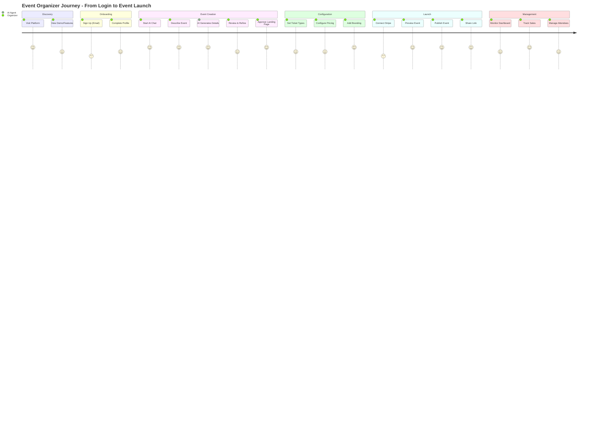
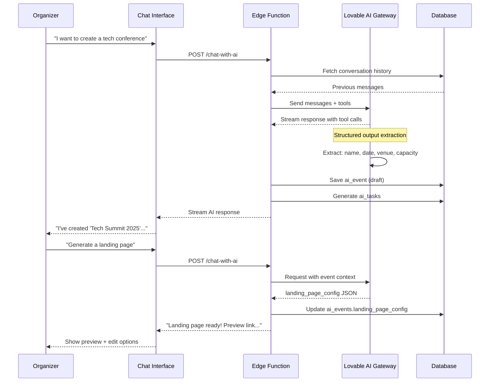
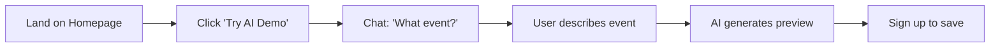
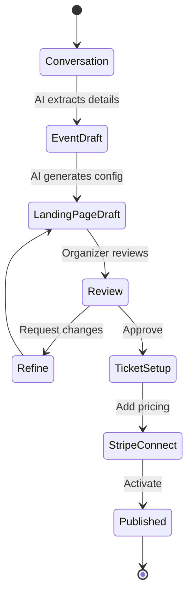
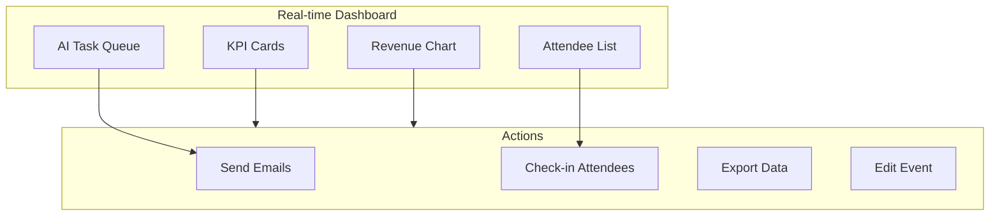
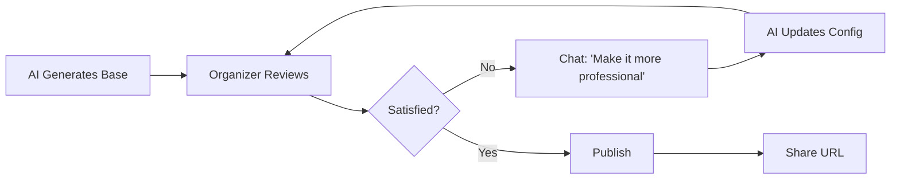

# 03 - User Journey: Event Organizer

## 🎭 User Persona

**Sarah - Corporate Event Planner**
- Works for a mid-size tech company
- Manages 10-15 events per year
- Wants to automate repetitive tasks
- Needs professional landing pages quickly

## 🗺️ Complete User Journey

## 💬 AI Conversation Flow

## 🎯 Key Touchpoints

### 1. First Interaction (Onboarding)

### 2. Event Creation

### 3. Dashboard Management

## 📋 AI Task Automation Examples

| Trigger | AI Task Generated | Status |
|---------|------------------|---------|
| Event created | Generate email welcome series | Pending |
| 7 days before | Send reminder to attendees | Scheduled |
| Day of event | Send check-in instructions | Scheduled |
| Low ticket sales | Suggest marketing tactics | Suggested |
| Venue capacity 80% | Alert organizer | Completed |

## 🎨 Landing Page Customization

## ✅ Success Metrics

- **Time to First Event**: < 10 minutes
- **AI Accuracy**: 90%+ correct extraction
- **Organizer Satisfaction**: Review/edit ratio < 3 iterations
- **Task Completion**: 80%+ automated tasks completed
