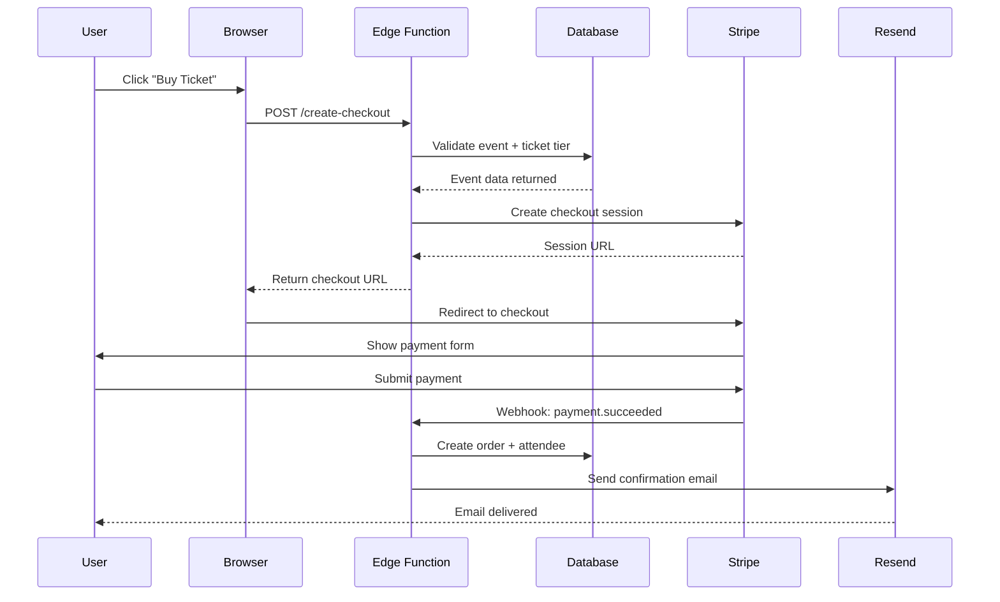
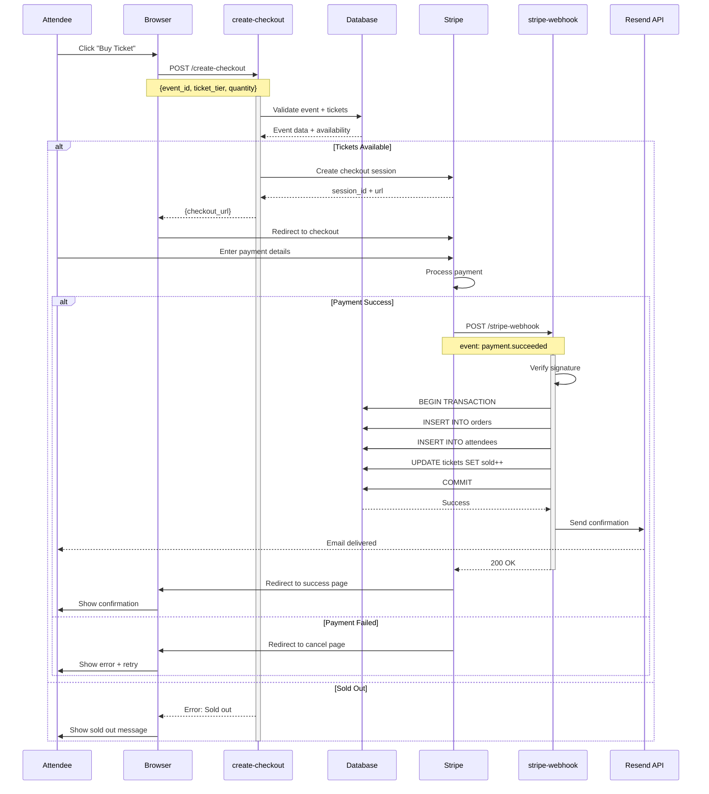

# 🔄 EventOS Sequence Diagram - Claude Prompt

**Diagram Type:** Sequence Diagram
**Purpose:** Visualize step-by-step interactions between system components
**Output Format:** Mermaid sequence diagram syntax

---

## 🎯 Objective

Generate **Mermaid sequence diagrams** that show detailed interactions between:
- Users (Organizers, Attendees, Sponsors)
- Frontend (React application)
- Backend (Supabase Edge Functions)
- Database (PostgreSQL)
- External APIs (Stripe, AI Gateway, Email)

---

## 📋 EventOS Context

**Project:** EventOS - AI-Powered Corporate Event Management Platform

**System Architecture:**
```
User → Frontend (React) → Edge Functions → Database (Supabase PostgreSQL)
                        ↓
                   External APIs (Stripe, AI, Email)
```

**Main Interactions to Model:**

1. **AI Chat Event Creation**
2. **Ticket Purchase with Stripe**
3. **Landing Page Generation**
4. **Email Notification Sending**
5. **Real-Time Chat Streaming (SSE)**
6. **Database Query with RLS**

---

## 🧠 Required Participants

### Internal Actors
- **User** → Event organizer or attendee
- **Browser** → React frontend application
- **Edge Function** → Supabase serverless function
- **Database** → PostgreSQL with RLS
- **Auth** → Supabase Auth service

### External Services
- **AI Gateway** → Lovable AI (google/gemini-2.5-flash)
- **Stripe** → Payment processing
- **Resend** → Email delivery service
- **Storage** → Supabase Storage (images, documents)

---

## 📐 Example Mermaid Sequence Syntax



---

## 🚀 Instructions to Claude

Generate **6 separate Mermaid sequence diagrams** for EventOS:

### 1. **AI Chat Event Creation Flow**

**Scenario:** User creates event through AI conversation

**Participants:**
- User
- Browser (React)
- Edge Function (`chat-with-ai`)
- AI Gateway (Lovable)
- Database

**Sequence:**
1. User types message: "Create corporate conference for 200 people"
2. Browser sends POST to `/chat-with-ai` with message + conversation history
3. Edge Function validates auth token
4. Edge Function loads conversation history from database
5. Edge Function sends prompt to AI Gateway (SSE stream)
6. AI Gateway streams response tokens back
7. Edge Function forwards stream to browser
8. AI decides to use `create_event` tool
9. Edge Function executes tool → inserts event to database
10. Database returns event ID
11. AI includes event details in response
12. Browser displays event preview card
13. Edge Function saves message to `chat_messages` table

**Key Elements:**
- Show SSE streaming with dashed lines
- Show tool execution as nested activation
- Show database transactions
- Show error handling (auth failure, AI timeout)

---

### 2. **Ticket Purchase with Stripe Flow**

**Scenario:** Attendee purchases ticket on event landing page

**Participants:**
- Attendee
- Browser
- Edge Function (`create-checkout`)
- Database
- Stripe API
- Edge Function (`stripe-webhook`)
- Resend (Email)

**Sequence:**
1. Attendee clicks "Buy Ticket" button
2. Browser sends POST to `/create-checkout` with event_id, ticket_tier
3. Edge Function validates event exists and tickets available
4. Edge Function creates Stripe checkout session
5. Stripe returns session URL
6. Browser redirects to Stripe checkout page
7. Attendee enters payment details
8. Stripe processes payment
9. Stripe sends webhook to `/stripe-webhook`
10. Edge Function verifies webhook signature
11. Edge Function creates order record in database
12. Edge Function creates attendee record in database
13. Edge Function sends confirmation email via Resend
14. Stripe redirects user to success page

**Key Elements:**
- Show async webhook processing
- Show database transaction (order + attendee)
- Show email notification
- Show error paths (payment failed, webhook invalid)

---

### 3. **Landing Page Generation Flow**

**Scenario:** AI generates public landing page for event

**Participants:**
- User (Organizer)
- Browser
- Edge Function (`chat-with-ai`)
- AI Gateway
- Database
- Storage (Supabase)

**Sequence:**
1. AI decides to use `generate_landing_page` tool
2. Edge Function calls tool with event_id
3. Tool queries database for event details
4. Tool generates HTML template with event data
5. Tool uploads HTML to Supabase Storage bucket
6. Storage returns public URL
7. Tool updates event record with landing_page_url
8. Database confirms update
9. AI responds: "Landing page created at eventos.app/e/abc123"
10. Browser displays clickable link

**Key Elements:**
- Show tool execution flow
- Show storage upload
- Show database update
- Show URL generation

---

### 4. **Email Notification Flow**

**Scenario:** System sends email confirmation after event creation

**Participants:**
- System (Trigger)
- Edge Function (`send-notification`)
- Database
- Resend API
- Recipient

**Sequence:**
1. Event created (trigger)
2. Database trigger calls Edge Function
3. Edge Function loads event details
4. Edge Function loads organizer profile
5. Edge Function loads email template
6. Edge Function renders template with event data
7. Edge Function sends email via Resend API
8. Resend delivers email
9. Resend returns delivery confirmation
10. Edge Function logs notification in database
11. Recipient receives email

**Key Elements:**
- Show database trigger
- Show template rendering
- Show external API call
- Show notification logging

---

### 5. **Real-Time Chat Streaming (SSE) Flow**

**Scenario:** User sends message, AI streams response in real-time

**Participants:**
- User
- Browser (React)
- Edge Function (`chat-with-ai`)
- AI Gateway
- Database

**Sequence:**
1. User types: "Add VIP ticket tier for $500"
2. Browser sends POST to `/chat-with-ai`
3. Edge Function opens SSE connection
4. Edge Function loads conversation history
5. Edge Function sends prompt to AI Gateway
6. AI Gateway starts streaming response
7. Edge Function forwards first chunk to browser
8. Browser updates UI with partial response
9. AI Gateway sends next chunk
10. Edge Function forwards chunk
11. Browser appends to message
12. *Repeat for all chunks*
13. AI Gateway sends final chunk with tool call
14. Edge Function executes `create_ticket_tier` tool
15. Database creates ticket record
16. Edge Function sends completion event
17. Browser displays final message + ticket card
18. Edge Function saves messages to database

**Key Elements:**
- Show SSE stream with dashed arrows
- Show incremental UI updates
- Show tool execution mid-stream
- Show connection management

---

### 6. **Database Query with RLS (Row-Level Security) Flow**

**Scenario:** User queries their events, RLS enforces access control

**Participants:**
- User
- Browser
- Edge Function (`get-events`)
- Auth Service
- Database (PostgreSQL + RLS)

**Sequence:**
1. Browser sends GET to `/get-events` with auth token
2. Edge Function validates JWT token
3. Edge Function extracts user_id from token
4. Edge Function queries: `SELECT * FROM events`
5. Database executes RLS policy check
6. RLS policy filters: `WHERE organizer_id = auth.uid()`
7. Database returns only user's events
8. Edge Function formats response
9. Browser displays events in dashboard

**Key Elements:**
- Show JWT validation
- Show RLS policy enforcement (highlighted)
- Show filtered results
- Show unauthorized access rejection path

---

## ✅ Output Requirements

**For each sequence diagram, provide:**

1. **Clear title** describing the interaction
2. **All participants** defined at top
3. **Request/response pairs** with arrows
4. **Async operations** shown with dashed lines
5. **Activation boxes** showing processing time
6. **Notes/comments** for complex logic
7. **Error paths** with alt/opt blocks
8. **Valid Mermaid syntax** ready to render

**Styling Preferences:**
```mermaid
%%{init: {'theme': 'base', 'themeVariables': { 'actorBkg': '#3b82f6', 'actorBorder': '#1e40af', 'actorTextColor': '#fff', 'signalColor': '#64748b', 'signalTextColor': '#1e293b'}}}%%
```

---

## 📋 Mermaid Sequence Diagram Features to Use

### Participants
```mermaid
participant Browser
participant API as Edge Function
participant DB as Database
```

### Messages
```mermaid
Browser->>API: HTTP POST request
API-->>Browser: JSON response (dashed = return)
Browser-xAPI: Async message (cross = no response expected)
```

### Activation Boxes
```mermaid
activate API
API->>DB: Query data
DB-->>API: Return results
deactivate API
```

### Alternative Paths
```mermaid
alt Payment Success
    Stripe->>Webhook: payment.succeeded
else Payment Failed
    Stripe->>Webhook: payment.failed
end
```

### Optional Steps
```mermaid
opt Email Enabled
    System->>Resend: Send notification
end
```

### Loops
```mermaid
loop For each ticket
    System->>DB: Create attendee
end
```

### Notes
```mermaid
Note over Browser,API: JWT token validated here
Note right of Database: RLS policy enforced
```

---

## 🎨 Example: Complete Ticket Purchase Flow



---

## 🚀 Final Instruction

> "Generate **6 complete Mermaid sequence diagrams** for EventOS based on the scenarios described above.
> Each diagram should show detailed step-by-step interactions between all participants, include error handling with alt/opt blocks, use activation boxes for processing time, and be production-ready with valid Mermaid syntax.
> Output each diagram separately with a descriptive title and brief explanation."

---

**Created:** October 11, 2025
**For:** EventOS System Documentation
**Purpose:** Generate detailed sequence diagrams for component interactions
**Status:** Ready for Claude ✅
