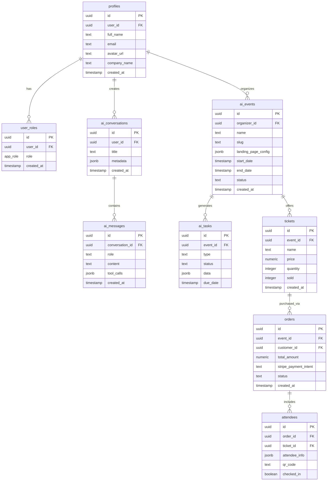
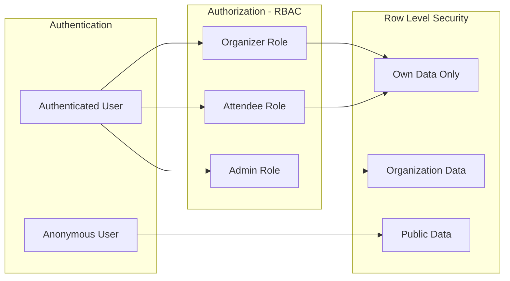

# 02 - Database Schema Design

## 🗄️ Entity Relationship Diagram

## 🔐 Security Model

## 📊 Core Tables

### Security & Identity
- **profiles**: User profile information (auto-created via trigger)
- **user_roles**: RBAC implementation (admin, organizer, attendee)
- **audit_logs**: Security audit trail

### AI Conversation Layer
- **ai_conversations**: Chat sessions between user and AI
- **ai_messages**: Individual messages with tool calls
- **ai_events**: Events created through AI interaction
- **ai_tasks**: Automated tasks generated by AI

### Event Management
- **tickets**: Ticket types and pricing
- **orders**: Payment transactions
- **attendees**: Registered participants
- **email_templates**: Customizable email templates

### System
- **rate_limits**: API rate limiting tracking
- **storage buckets**: File storage for landing pages/images

## 🔑 Key Design Decisions

1. **No direct auth.users references**: Always use `profiles(id)` in RLS policies
2. **SECURITY DEFINER functions**: For role checks to avoid RLS recursion
3. **JSONB for flexibility**: `landing_page_config`, `metadata` for AI-generated content
4. **GIN indexes**: On all JSONB columns for performance
5. **Explicit CASCADE**: Define per FK (CASCADE for messages, RESTRICT for payments)
6. **Auto-timestamps**: Triggers on all tables with `updated_at`
