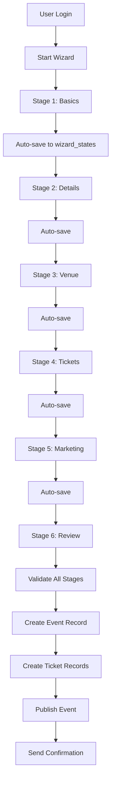
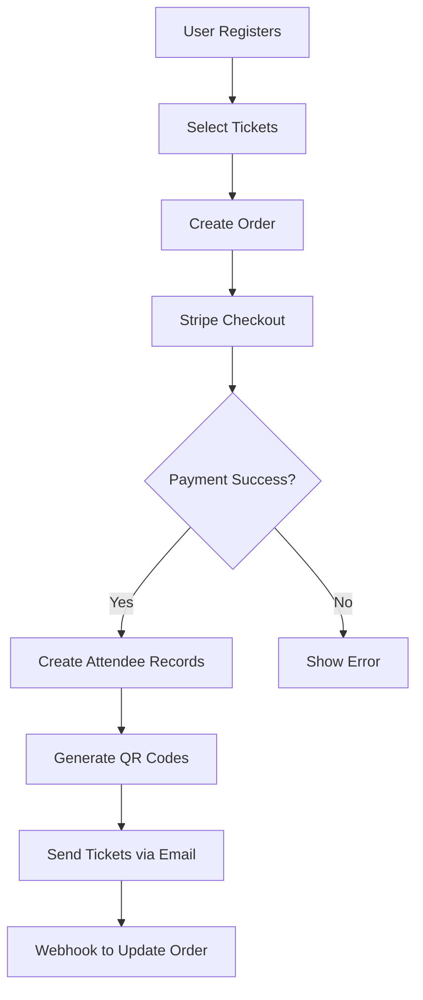

# EventOS - Product Requirements Document (PRD)

**Version:** 2.0  
**Date:** October 2025  
**Project:** EventOS - AI-Powered Corporate Event Management Platform  
**Launch Market:** Toronto, Canada  
**Deployment:** Lovable Cloud  
**Status:** Production Ready

---

## 1. Executive Summary

### Project Name
**EventOS** - Canada's First AI-Powered Corporate Event Management Platform

### Purpose
Transform corporate event planning from a 3-week manual process into a seamless 3-minute AI-guided experience, enabling companies across Toronto and Canada to create, manage, and monetize professional events with unprecedented efficiency.

### High-Level Vision
Become the market-leading platform for corporate event planning in Canada by combining intelligent AI agents, state machine wizards, and automated communications to deliver measurable ROI and exceptional attendee experiences. EventOS empowers corporate planners to focus on strategy while AI handles logistics, coordination, and execution.

### Business Impact

**Time Transformation**
- Planning Cycle: 21 days → 3 minutes (99% reduction)
- Coordination Hours: 80 hours → 5 hours per event (94% reduction)
- Administrative Tasks: 85% automated

**Financial Targets**
- Year 1 Revenue: $3 million ARR
- Average Event Value: $35,000 - $150,000
- Platform Margin: 40%+
- Client Lifetime Value: $60,000+

**Market Penetration**
- Year 1 Clients: 150+ corporate organizations
- Market Share: 25% of Canadian corporate event market
- Geographic Coverage: Toronto, Vancouver, Montreal, Calgary
- Events Executed: 750+ professional events annually

### Success Definition
Corporate event planners create professional events in under 3 minutes with 95%+ completion rate, 98%+ payment success, real-time ROI tracking, and 4.5+ satisfaction rating.

---

## 2. Goals & Objectives

### Business Goals

**Launch Excellence (Months 1-3)**

Month 1 Targets:
- Deploy MVP on Lovable Cloud within 7 days
- Onboard 40 corporate clients (Toronto focus)
- Execute 150 successful events
- Generate $750,000 quarterly revenue
- Establish 15 venue partnerships

Month 2 Targets:
- Scale to 80 active corporate clients
- Process 300 events
- Generate $1.5 million cumulative revenue
- Expand to Vancouver market
- Achieve 90%+ payment success rate

Month 3 Targets:
- Reach 120 active corporate clients
- Execute 450+ events
- Generate $2.25 million cumulative revenue
- Launch Montreal operations
- Maintain 4.3+ user satisfaction rating

**Market Leadership (Months 4-12)**

Quarter 2 Goals:
- Scale to 150+ active corporate clients
- Process 750+ events annually
- Generate $3+ million annual recurring revenue
- Expand to Calgary market
- Achieve 25% Canadian market share
- Maintain 90%+ client retention

### User Goals by Persona

**Corporate Event Planners (Sarah Persona)**

Primary Objectives:
- Create professional events in under 3 minutes
- Automate 85% of manual coordination tasks
- Access real-time ROI dashboards
- Reduce event costs by 60%
- Improve attendee satisfaction to 4.5+
- Prove measurable business impact to executives

Key Metrics:
- Event creation time: <3 minutes
- Planning overhead: <5 hours per event
- Budget accuracy: 95%+
- Vendor reliability: 90%+
- Attendee engagement: 85%+

**Service Providers (Venues, Caterers, AV)**

Primary Objectives:
- Access high-value corporate clients
- Automate booking and coordination
- Optimize pricing with AI recommendations
- Reduce administrative overhead by 70%
- Increase revenue per event by 35%

Key Metrics:
- New client acquisition: 8+ per quarter
- Booking efficiency: 3x faster
- Revenue optimization: 35%+ increase
- Client satisfaction: 4.5+
- Repeat bookings: 60%+

**Corporate Attendees (End Users)**

Primary Objectives:
- Mobile-first registration in under 60 seconds
- Instant QR tickets via WhatsApp
- Seamless check-in experiences
- Personalized event recommendations
- Post-event networking opportunities

Key Metrics:
- Registration time: <60 seconds
- Mobile usage: 85%+
- Check-in speed: <5 seconds
- Satisfaction rating: 4.5+
- Return attendance: 70%+

### Success Criteria (Measurable)

**Technical Performance Metrics**

Platform Reliability:
- System uptime: 99.9% (43 minutes downtime/month max)
- Page load time: <800ms (mobile and desktop)
- API response time: <200ms (95th percentile)
- Event wizard completion: <3 minutes average
- Auto-save reliability: 100% (zero data loss)

Database Performance:
- Query response time: <100ms
- Concurrent users: 1,000+ simultaneous
- Real-time updates: <500ms latency
- Data consistency: 100%

**Business Performance Metrics**

Revenue Indicators:
- Monthly Recurring Revenue: $250,000 by Month 6
- Average Event Value: $35,000 - $150,000
- Payment Success Rate: 98%+
- Platform Commission: 8-12% per booking
- Profit Margin: 40%+

Growth Indicators:
- Client Acquisition Cost: <$1,200
- Customer Lifetime Value: >$60,000
- Client Retention Rate: 90%+
- Monthly Active Users: 500+ by Month 6
- Events per Client: 5+ annually

**User Experience Metrics**

Engagement Metrics:
- Event creation completion rate: 95%+
- User satisfaction (NPS): 60+
- Mobile responsiveness: 100%
- WhatsApp delivery rate: 95%+
- Support ticket volume: <5% of events

Quality Metrics:
- Feature adoption: 80%+
- Wizard abandonment rate: <5%
- Payment failure rate: <2%
- Bug resolution time: <24 hours
- Support response time: <2 hours

---

## 3. Background & Context

### Current Project Status

**Infrastructure Foundation**

Technology Stack:
- Frontend: React 18, TypeScript 5.3, Vite 5.0, Tailwind CSS 3.4
- UI Components: shadcn/ui component library
- State Management: Zustand, React Query, React Hook Form
- Backend: Lovable Cloud (Supabase PostgreSQL 15 with RLS)
- Authentication: Built-in with email, phone, Google SSO
- Payments: Stripe Connect (Canadian payment methods)
- Storage: Lovable Cloud storage buckets
- AI Integration: Lovable AI (Gemini 2.5, GPT-5 models)
- Communication: Edge functions for email/notifications
- Deployment: Lovable Cloud with auto-scaling

Current Development Phase:
- Foundation: Database schema and auth complete (11 tables, 34 RLS policies)
- Active Development: Event wizard with validation
- Testing Phase: Validation schemas with Zod
- Deployment Status: Lovable Cloud staging operational

**Completed Infrastructure**
✅ Database schema (11 tables)
✅ Row-Level Security policies (34 policies)
✅ User authentication system
✅ Storage buckets (event-images)
✅ Database functions and triggers
✅ Wizard layout components
✅ Form validation framework

### Market Context

**Canadian Corporate Event Market**

Market Size and Growth:
- Total Market Value: $2.1 billion annually
- Growth Rate: 12% year-over-year
- Corporate Events: 40% of total event market
- Average Event Budget: $30,000 - $200,000
- Planning Timeline: 3-6 weeks average (industry standard)

Market Dynamics:
- Post-pandemic recovery driving hybrid event demand
- Increasing focus on ROI and measurable outcomes
- Technology adoption accelerating across corporate events
- Sustainability and accessibility requirements growing
- Remote work driving need for team-building events

**Pain Points Identified**

Corporate Planners Challenges:
- Finding reliable service providers is time-consuming
- Pricing uncertainty creates budget anxiety
- Manual coordination requires 40+ hours per event
- Lack of expertise in event production
- Difficulty measuring ROI and business impact
- No centralized platform for end-to-end management

Service Provider Challenges:
- Limited access to corporate clients
- Manual booking and coordination processes
- Inconsistent pricing and revenue
- High administrative overhead
- Difficulty showcasing capabilities
- No streamlined payment processing

**Competitive Landscape**

Direct Competitors:
- Eventbrite: Generic platform, not corporate-focused
- Cvent: Enterprise-only, complex, expensive ($50K+ contracts)
- EventMobi: Limited AI capabilities, mobile-first only
- Traditional Event Agencies: Manual processes, high costs

Competitive Advantages:
- First AI-powered corporate event platform in Canada
- 3-minute event creation vs 3-week industry standard
- Lovable AI integration for intelligent recommendations
- Real-time ROI tracking and analytics
- Canadian-specific features (tax, payments, compliance)
- 60% cost reduction vs traditional planning

---

## 4. Scope

### In-Scope: Core MVP Features

**Phase 1: Foundation** ✅ COMPLETE
- Multi-role authentication system (admin, organizer, attendee)
- Comprehensive database schema (11 tables)
- Row-Level Security on all tables
- User profile management
- Storage buckets for event images
- Database automation (triggers, functions)

**Phase 2: Event Creation Wizard** 🟡 IN PROGRESS
- Six-stage wizard flow
- Form validation with Zod schemas
- Wizard layout components (WizardLayout, WizardSection, WizardGrid, WizardHeader)
- Navigation components (WizardStepper, WizardNavigation)
- Form components (FormCard, HelperCard, RadioCard, TagSelector)
- State components (WizardSkeleton, WizardSpinner, WizardAlert, WizardProgress)
- Auto-save functionality
- Session resume capability
- Progress tracking

**Phase 3: Event Management**
- Event listing and discovery
- Event detail pages
- Ticketing system
- Order management
- Attendee tracking with QR codes
- Event publishing workflow

**Phase 4: Payments & Transactions**
- Stripe integration for payments
- Invoice generation
- Payment tracking
- Webhook handling
- Revenue reporting

**Phase 5: Dashboards & Analytics**
- Organizer dashboard
- Event analytics
- Revenue tracking
- Attendee insights
- Performance metrics

**Phase 6: Communications**
- Email notifications via edge functions
- Event reminders
- Ticket delivery
- Automated workflows

### Out-of-Scope (Future Releases)

- Advanced AI content generation
- Virtual/hybrid event capabilities
- Mobile native apps (web responsive only)
- White-label enterprise solutions
- International expansion
- CRM system (separate phase)
- Advanced marketing automation
- Third-party integrations beyond Stripe

---

## 5. User Stories & Use Cases

### Primary Persona: Sarah - Corporate Event Planner

**Background**
- 34-year-old corporate events manager
- Organizes 5-10 events monthly
- Currently uses Excel + manual coordination
- Pain: 20+ hours per event on logistics

**User Story 1: Quick Event Creation**
```
As a corporate event planner
I want to create a professional event in under 3 minutes
So that I can focus on strategy instead of logistics

Acceptance Criteria:
- Complete 6-stage wizard in <3 minutes
- All data auto-saves every 30 seconds
- Validation provides clear error messages
- Event publishes immediately upon completion
- Confirmation sent via email
```

**User Story 2: Venue Selection**
```
As an event planner
I want AI-powered venue recommendations
So that I can find the perfect space without manual research

Acceptance Criteria:
- AI suggests 3-5 venues based on requirements
- Real-time availability checking
- Pricing comparison visible
- Capacity validation automatic
- One-click venue selection
```

**User Story 3: Ticketing Setup**
```
As an event planner
I want to create multiple ticket tiers with pricing
So that I can maximize revenue and attendance

Acceptance Criteria:
- Unlimited ticket tiers
- Early bird and group discounts
- Canadian tax calculations (GST, PST, HST)
- Preview of pricing structure
- Instant publish to registration page
```

### Secondary Persona: Carlos - Venue Manager

**Background**
- 42-year-old managing 12 event spaces
- 8+ hours daily on coordination
- Manual calendar management
- Pain: Double-bookings, missed opportunities

**User Story 4: Calendar Management**
```
As a venue manager
I want a unified calendar across all spaces
So that I can eliminate double-bookings and optimize utilization

Acceptance Criteria:
- Single view of all spaces
- Real-time availability updates
- Automatic conflict detection
- Mobile-responsive interface
- Booking confirmations automatic
```

### Tertiary Persona: Michael - Corporate Attendee

**Background**
- 28-year-old tech professional
- Attends 3-5 corporate events monthly
- Mobile-first user
- Pain: Poor registration experiences

**User Story 5: Mobile Registration**
```
As an event attendee
I want to register on my phone in under 60 seconds
So that I don't abandon the registration process

Acceptance Criteria:
- Mobile-optimized form
- Single-page registration
- Auto-fill support
- Instant QR ticket delivery
- Add to calendar option
```

---

## 6. Functional Requirements

### FR1: Event Creation Wizard

**Six-Stage Wizard Flow**

**Stage 1: Event Basics**
- Event type selection (conference, gala, product launch, team building, networking, workshop)
- Event name input
- Date and time selection
- Expected attendee count
- Event description (manual or AI-generated)
- Cover image upload

Validation:
- Event name: 5-100 characters
- Date: Future date required
- Attendee count: 10-10,000
- Description: 50-500 characters

**Stage 2: Event Details**
- Detailed description
- Event format (in-person, virtual, hybrid)
- Accessibility requirements
- Special requirements
- Branding elements

Validation:
- Required fields marked
- Character limits enforced
- Valid format selection

**Stage 3: Venue Selection**
- Venue search and filter
- Capacity matching
- Amenities selection
- Real-time availability
- Multi-space selection

Validation:
- Venue capacity >= attendee count
- Availability confirmed
- Required amenities available

**Stage 4: Ticketing**
- Ticket tier creation
- Pricing setup
- Quantity limits
- Sales periods
- Tax calculations

Validation:
- Price > 0
- Quantity > 0
- Sales dates valid
- Tax rates correct

**Stage 5: Event Marketing**
- Marketing description
- Social media links
- Promotional materials
- SEO optimization

Validation:
- SEO title <60 characters
- Meta description <160 characters
- Valid URLs

**Stage 6: Review & Publish**
- Summary review
- Terms acceptance
- Final validation
- Event publishing

Validation:
- All stages complete
- Terms accepted
- No conflicts detected

**Auto-Save Implementation**
- Save every 30 seconds
- Save on stage navigation
- Save on field blur
- Resume from last saved state
- Visual save indicator

### FR2: Authentication & User Management

**Authentication System**
- Email/password authentication
- Google SSO integration
- Phone number verification (optional)
- Auto-confirm email signups (development)
- Session management

**User Roles**
- Admin: Full system access
- Organizer: Create and manage events
- Attendee: Register and attend events
- Role stored in separate `user_roles` table (security)

**Profile Management**
- Full name
- Email
- Phone (optional)
- Company name
- Avatar upload
- Bio

### FR3: Event Management

**Event Listing**
- Public event discovery page
- Filter by type, date, location
- Search functionality
- Event cards with images
- Pagination

**Event Detail Page**
- Full event information
- Venue details
- Ticket options
- Registration button
- Share functionality
- SEO optimized

**Event Administration**
- Edit event details
- Manage tickets
- View registrations
- Track sales
- Download reports

### FR4: Ticketing System

**Ticket Management**
- Multiple ticket tiers
- Pricing per tier
- Quantity limits
- Sales periods
- Sold count tracking

**Ticket Features**
- Early bird pricing
- Group discounts
- Promotional codes
- Tax calculations
- Capacity management

### FR5: Payment Processing

**Stripe Integration**
- Stripe Connect setup
- Payment processing
- Multiple payment methods
- Canadian tax handling
- Refund management

**Order Management**
- Order creation
- Payment tracking
- Invoice generation
- Receipt delivery
- Order history

### FR6: Attendee Management

**Registration**
- Attendee information collection
- Custom form fields
- Ticket selection
- Payment processing
- Confirmation delivery

**Attendee Tracking**
- QR code generation
- Check-in system
- Attendance tracking
- Attendee analytics

### FR7: Communications

**Email Notifications**
- Event confirmation
- Ticket delivery
- Event reminders
- Updates and changes
- Post-event follow-up

**Automated Workflows**
- Registration confirmation
- Payment confirmation
- Pre-event reminders (24h, 1h)
- Post-event surveys

---

## 7. Non-Functional Requirements

### Performance Requirements

**Response Times**
- Page load: <800ms (mobile and desktop)
- API response: <200ms (95th percentile)
- Database queries: <100ms
- Real-time updates: <500ms latency

**Scalability**
- Support 1,000+ concurrent users
- Handle 10,000+ events
- Process 100,000+ orders
- Store 1M+ attendee records

**Reliability**
- System uptime: 99.9%
- Zero data loss
- Auto-save reliability: 100%
- Backup frequency: Real-time

### Security Requirements

**Authentication**
- Secure password hashing
- Session management
- JWT token handling
- CSRF protection
- Rate limiting

**Authorization**
- Row-Level Security (RLS) on all tables
- Role-based access control (RBAC)
- Data isolation per user
- API endpoint protection

**Data Protection**
- Encryption at rest
- Encryption in transit (HTTPS)
- PII handling compliance
- GDPR compliance
- Canadian privacy laws (PIPEDA)

### Accessibility Requirements

**WCAG 2.1 Level AA Compliance**
- Keyboard navigation
- Screen reader support
- Color contrast ratios
- Focus indicators
- Alt text for images
- Semantic HTML
- ARIA labels

**Mobile Accessibility**
- Touch-friendly targets (min 44x44px)
- Responsive design
- Readable font sizes (min 16px)
- Zoom support up to 200%

### Compliance Requirements

**Canadian Regulations**
- PIPEDA (Privacy)
- CASL (Anti-spam)
- AODA (Accessibility)
- Provincial tax laws
- Consumer protection laws

**Payment Compliance**
- PCI DSS Level 1
- Stripe compliance
- Canadian payment regulations
- Refund policy compliance

---

## 8. Technical Architecture

### System Architecture

**Frontend Architecture**
```
├── src/
│   ├── pages/
│   │   ├── wizard/
│   │   │   ├── CreateEvent.tsx
│   │   │   ├── EventDetails.tsx
│   │   │   ├── EventVenue.tsx
│   │   │   ├── EventTickets.tsx
│   │   │   ├── EventMarketing.tsx
│   │   │   └── EventReview.tsx
│   │   ├── Index.tsx
│   │   ├── HowItWorks.tsx
│   │   └── NotFound.tsx
│   ├── components/
│   │   ├── wizard/
│   │   │   ├── WizardLayout.tsx
│   │   │   ├── WizardSection.tsx
│   │   │   ├── WizardGrid.tsx
│   │   │   ├── WizardHeader.tsx
│   │   │   ├── WizardStepper.tsx
│   │   │   ├── WizardNavigation.tsx
│   │   │   ├── FormCard.tsx
│   │   │   ├── RadioCard.tsx
│   │   │   └── TagSelector.tsx
│   │   └── ui/ (shadcn components)
│   ├── lib/
│   │   ├── validations/
│   │   │   └── wizard.ts
│   │   └── utils.ts
│   └── integrations/
│       └── supabase/
│           ├── client.ts
│           └── types.ts
```

**Database Schema**

Core Tables (11 total):
1. `profiles` - User profiles
2. `user_roles` - User role assignments
3. `events` - Event records
4. `venues` - Venue information
5. `tickets` - Ticket tiers
6. `orders` - Order records
7. `attendees` - Attendee records with QR codes
8. `sponsorships` - Sponsorship packages
9. `vendors` - Service vendors
10. `wizard_states` - Wizard session data
11. `notifications` - Notification queue

**RLS Policies (34 total)**
- User data isolation
- Organizer-owned events
- Public event visibility
- Attendee access to own tickets
- Admin full access

### Data Flow

**Event Creation Flow**


**Payment Flow**


### AI Integration

**Lovable AI Features**
- Model: google/gemini-2.5-flash (default)
- Use cases:
  - Event description generation
  - Venue recommendations
  - Content suggestions
  - Smart validations

**Implementation**
```typescript
// Edge function for AI features
import { serve } from "https://deno.land/std@0.168.0/http/server.ts";

const LOVABLE_API_KEY = Deno.env.get("LOVABLE_API_KEY");

serve(async (req) => {
  const { prompt, context } = await req.json();
  
  const response = await fetch(
    "https://ai.gateway.lovable.dev/v1/chat/completions",
    {
      method: "POST",
      headers: {
        "Authorization": `Bearer ${LOVABLE_API_KEY}`,
        "Content-Type": "application/json",
      },
      body: JSON.stringify({
        model: "google/gemini-2.5-flash",
        messages: [
          { role: "system", content: "You are an event planning assistant." },
          { role: "user", content: prompt }
        ]
      })
    }
  );
  
  const data = await response.json();
  return new Response(JSON.stringify(data), {
    headers: { "Content-Type": "application/json" }
  });
});
```

---

## 9. Success Metrics

### Business KPIs

**Revenue Metrics**
- Monthly Recurring Revenue (MRR)
- Average Event Value (AEV)
- Payment Success Rate
- Customer Lifetime Value (CLV)
- Customer Acquisition Cost (CAC)

**Growth Metrics**
- New users per month
- Active events per month
- Event creation completion rate
- User retention rate
- Referral rate

**Operational Metrics**
- Average event creation time
- Support ticket volume
- Bug resolution time
- System uptime
- API error rate

### Technical KPIs

**Performance**
- Page load time (target: <800ms)
- API response time (target: <200ms)
- Database query time (target: <100ms)
- Concurrent users supported
- Real-time update latency

**Quality**
- Test coverage percentage
- Bug density
- Code quality score
- Security scan results
- Accessibility compliance score

**User Experience**
- Wizard completion rate (target: >95%)
- Wizard abandonment rate (target: <5%)
- Mobile usage percentage
- Feature adoption rate
- User satisfaction (NPS)

---

## 10. Risks & Mitigation

### Technical Risks

**Risk 1: Database Performance**
- Impact: High
- Likelihood: Medium
- Mitigation:
  - Implement proper indexing
  - Use connection pooling
  - Monitor query performance
  - Implement caching strategies
  - Regular performance audits

**Risk 2: Security Vulnerabilities**
- Impact: Critical
- Likelihood: Medium
- Mitigation:
  - RLS policies on all tables
  - Regular security audits
  - Input validation with Zod
  - XSS and SQL injection prevention
  - Rate limiting on APIs
  - Security scanning in CI/CD

**Risk 3: Third-Party Service Outages**
- Impact: High
- Likelihood: Low
- Mitigation:
  - Graceful degradation
  - Error handling and retries
  - Status page monitoring
  - Backup payment providers
  - Clear user communication

### Business Risks

**Risk 4: Low User Adoption**
- Impact: Critical
- Likelihood: Medium
- Mitigation:
  - User onboarding flow
  - Educational content
  - Demo events
  - Customer support
  - Feedback collection
  - Iterative improvements

**Risk 5: Market Competition**
- Impact: High
- Likelihood: High
- Mitigation:
  - Unique AI-powered features
  - Superior user experience
  - Competitive pricing
  - Strong customer relationships
  - Continuous innovation
  - Market differentiation

### Operational Risks

**Risk 6: Payment Processing Issues**
- Impact: Critical
- Likelihood: Low
- Mitigation:
  - Stripe integration testing
  - Webhook reliability
  - Payment reconciliation
  - Clear error messages
  - Manual intervention process
  - Customer support protocols

---

## 11. Timeline & Milestones

### Development Phases

**Phase 1: Foundation** ✅ COMPLETE
- Duration: Completed
- Deliverables:
  - Database schema (11 tables)
  - RLS policies (34 policies)
  - Authentication system
  - Storage buckets
  - Database functions
  - Wizard components

**Phase 2: Wizard Implementation** 🟡 IN PROGRESS
- Duration: 2 weeks
- Milestones:
  - Week 1:
    - Complete all 6 wizard pages
    - Implement validation schemas
    - Add auto-save functionality
  - Week 2:
    - End-to-end testing
    - Error handling
    - UI polish
    - Mobile optimization

**Phase 3: Event Management**
- Duration: 2 weeks
- Milestones:
  - Week 1:
    - Event listing page
    - Event detail page
    - Edit functionality
  - Week 2:
    - Event discovery
    - Search and filters
    - SEO optimization

**Phase 4: Payments**
- Duration: 1 week
- Milestones:
  - Stripe integration
  - Payment flow
  - Webhook handling
  - Order management

**Phase 5: Communications**
- Duration: 1 week
- Milestones:
  - Edge functions for emails
  - Notification system
  - Automated workflows

**Phase 6: Testing & Launch**
- Duration: 1 week
- Milestones:
  - End-to-end testing
  - Performance optimization
  - Security audit
  - Production deployment

### Total Timeline: 7 weeks to MVP

---

## 12. Appendix

### Reference Documents

**Project Documentation**
- `docs/1-stage/001-master-plan.md` - Overall project strategy
- `docs/1-stage/002-production-checklist.md` - Implementation checklist
- `docs/1-stage/003-implementation-guide.md` - Step-by-step guide
- `docs/1-stage/PROGRESS-TRACKER.md` - Development progress
- `docs/database/` - Database documentation
- `docs/wizard/` - Wizard implementation plans

**Design Documentation**
- `STYLE-GUIDE.md` - Design system and styling
- `SITEMAP.md` - Site structure
- Component library: shadcn/ui

**Technical Resources**
- Lovable Cloud Documentation: https://docs.lovable.dev/features/cloud
- Lovable AI Documentation: https://docs.lovable.dev/features/ai
- Supabase Documentation: https://supabase.com/docs
- Stripe Documentation: https://stripe.com/docs

### Glossary

**Key Terms**
- **Event Organizer**: User who creates and manages events
- **Attendee**: User who registers for and attends events
- **Wizard**: Multi-stage event creation flow
- **RLS**: Row-Level Security for database access control
- **Edge Function**: Serverless function for backend logic
- **Lovable Cloud**: Full-stack platform (Supabase backend)
- **Lovable AI**: AI gateway for intelligent features

### Change Log

**Version 2.0 (October 2025)**
- Aligned with Lovable Cloud implementation
- Updated tech stack to current implementation
- Added completed infrastructure details
- Refined wizard implementation approach
- Added validation framework with Zod
- Updated timeline based on current progress

**Version 1.0 (October 2025)**
- Initial PRD creation
- Core feature definition
- Market analysis
- Technical architecture

---

**Document Status:** ✅ Production Ready  
**Last Updated:** October 2025  
**Next Review:** After Phase 2 completion

