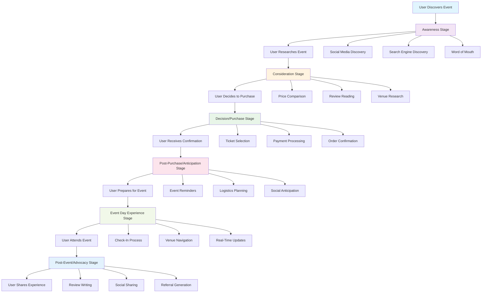

# Event Journey System Overview

## 🎯 **Core Purpose**
Implement a comprehensive event journey system that guides users through the complete lifecycle from awareness to advocacy, based on Eventbrite research and Luma platform insights.

## 📊 **Event Journey System Flow Diagram**



## 📊 **The 6-Stage Event Journey**

### Stage 1: Awareness
**Goal**: Customer realizes need for entertainment and discovers events
- **Touchpoints**: Social media, word-of-mouth, web search, artist websites
- **Key Activities**: Event discovery, initial interest generation
- **Success Metrics**: Event views, social shares, search impressions

### Stage 2: Consideration  
**Goal**: Customer evaluates options and decides if event fits their needs
- **Touchpoints**: Event details, pricing comparison, platform usability
- **Key Activities**: Research event details, compare prices, assess convenience
- **Success Metrics**: Time on event page, comparison actions, bounce rate

### Stage 3: Decision/Purchase
**Goal**: Customer completes ticket purchase transaction
- **Touchpoints**: Seat selection, payment processing, confirmation
- **Key Activities**: Select tickets, provide payment info, receive confirmation
- **Success Metrics**: Conversion rate, cart abandonment, payment success

### Stage 4: Post-Purchase/Anticipation
**Goal**: Customer prepares for event and builds excitement
- **Touchpoints**: Logistics planning, reminders, social anticipation
- **Key Activities**: Travel planning, event updates, friend coordination
- **Success Metrics**: Engagement with updates, social mentions, attendance rate

### Stage 5: Experience/Event Day
**Goal**: Customer attends event and has positive experience
- **Touchpoints**: Venue arrival, ticket scanning, event navigation
- **Key Activities**: Check-in, venue navigation, event participation
- **Success Metrics**: On-time arrival, venue satisfaction, real-time engagement

### Stage 6: Post-Event/Advocacy
**Goal**: Customer reflects on experience and becomes advocate
- **Touchpoints**: Social sharing, reviews, feedback surveys
- **Key Activities**: Photo sharing, review writing, future event interest
- **Success Metrics**: Social shares, review ratings, repeat attendance

## 🏗️ **System Architecture**

### Frontend Components
```typescript
// Event Journey Stage Components
<AwarenessStage />
<ConsiderationStage />
<DecisionStage />
<AnticipationStage />
<ExperienceStage />
<AdvocacyStage />
```

### Backend Services
- **Journey Tracking Service**: Monitor user progression through stages
- **Personalization Engine**: Customize experience based on stage and behavior
- **Analytics Service**: Track metrics and optimize conversion
- **Communication Service**: Automated messaging for each stage

### Database Schema
```sql
-- Journey tracking
CREATE TABLE event_journey_stages (
  id UUID PRIMARY KEY DEFAULT gen_random_uuid(),
  user_id UUID REFERENCES profiles(id),
  event_id UUID REFERENCES events(id),
  stage VARCHAR(50) NOT NULL,
  entered_at TIMESTAMP DEFAULT NOW(),
  completed_at TIMESTAMP,
  metadata JSONB
);

-- Stage-specific data
CREATE TABLE journey_analytics (
  id UUID PRIMARY KEY DEFAULT gen_random_uuid(),
  stage VARCHAR(50) NOT NULL,
  event_id UUID REFERENCES events(id),
  metrics JSONB,
  recorded_at TIMESTAMP DEFAULT NOW()
);
```

## 🎯 **Revenue Impact**

### Direct Revenue Drivers
- **Stage 3 (Purchase)**: Direct ticket sales and commissions
- **Stage 6 (Advocacy)**: Word-of-mouth referrals and repeat purchases
- **Cross-selling**: Additional services during journey stages

### Indirect Revenue Drivers
- **Data Collection**: Rich user behavior data for targeting
- **Engagement**: Higher engagement leads to higher lifetime value
- **Retention**: Better experience reduces churn and increases retention

## 📱 **Implementation Strategy**

### Phase 1: Foundation (Weeks 1-2)
- Implement journey tracking infrastructure
- Create basic stage components
- Set up analytics collection

### Phase 2: Core Journey (Weeks 3-4)
- Build awareness and consideration stages
- Implement decision/purchase flow
- Add post-purchase experience

### Phase 3: Advanced Features (Weeks 5-6)
- Add event day experience features
- Implement advocacy and social sharing
- Optimize based on analytics

## 🔧 **Technical Requirements**

### MCP Server Integration
- **@supabase**: Journey data storage and analytics
- **@n8n**: Automated journey workflows
- **@whatsapp**: Stage-specific messaging
- **@pinecone**: Personalization and recommendations

### Key Features
- **Real-time Tracking**: Monitor user progression
- **Personalization**: Customize experience per stage
- **Automation**: Trigger actions based on stage changes
- **Analytics**: Comprehensive journey metrics
- **Mobile-First**: Optimized for mobile experience

## 📊 **Success Metrics**

### Journey Completion Rate
- **Target**: 70% of users complete full journey
- **Measurement**: Stage progression tracking
- **Optimization**: Identify and fix drop-off points

### Revenue per Journey
- **Target**: $25 average revenue per completed journey
- **Measurement**: Total revenue / completed journeys
- **Optimization**: Increase conversion at each stage

### User Satisfaction
- **Target**: 4.5+ star average rating
- **Measurement**: Post-event surveys and reviews
- **Optimization**: Continuous experience improvement

---

*This system transforms the traditional event experience into a comprehensive journey that maximizes both user satisfaction and revenue generation.*
