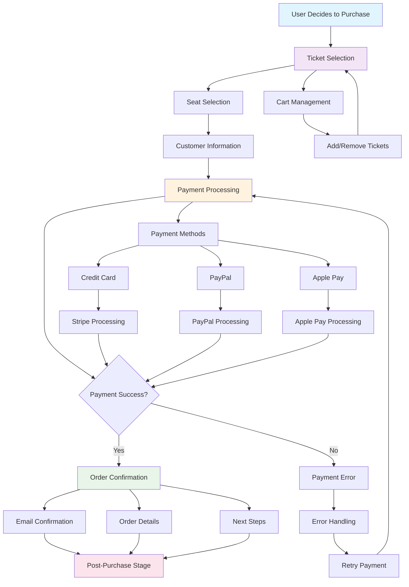

# Decision/Purchase Stage Implementation

## 📊 **Decision/Purchase Stage Flow Diagram**



## 🎯 **Stage Overview**
The decision/purchase stage is where users complete their ticket purchase. This is the critical conversion point that directly impacts revenue and requires seamless, secure, and user-friendly implementation.

## 📊 **Key Metrics & Goals**
- **Primary Goal**: Convert consideration into successful ticket purchases
- **Success Metrics**: Conversion rate, cart abandonment rate, payment success rate, average order value
- **Revenue Impact**: Direct revenue generation through ticket sales and commissions

## 🏗️ **Technical Implementation**

### Frontend Components
```typescript
// Decision/Purchase Stage Components
interface DecisionStageProps {
  eventId: string;
  userId?: string;
  onStageComplete: (stage: string) => void;
}

const DecisionStage: React.FC<DecisionStageProps> = ({ eventId, userId, onStageComplete }) => {
  return (
    <div className="decision-stage">
      <TicketSelection />
      <SeatSelection />
      <CustomerInformation />
      <PaymentProcessing />
      <OrderConfirmation />
    </div>
  );
};
```

### Ticket Selection Component
```typescript
// Ticket Selection Interface
const TicketSelection: React.FC<{ event: Event }> = ({ event }) => {
  const [selectedTickets, setSelectedTickets] = useState<SelectedTicket[]>([]);
  const [totalPrice, setTotalPrice] = useState<number>(0);
  
  const handleTicketSelection = (tierId: string, quantity: number) => {
    const tier = event.ticket_tiers.find(t => t.id === tierId);
    if (!tier) return;
    
    const updatedTickets = [...selectedTickets];
    const existingIndex = updatedTickets.findIndex(t => t.tierId === tierId);
    
    if (quantity === 0) {
      // Remove ticket
      updatedTickets.splice(existingIndex, 1);
    } else {
      // Update or add ticket
      const ticket: SelectedTicket = {
        tierId,
        tierName: tier.name,
        price: tier.price,
        quantity,
        total: tier.price * quantity
      };
      
      if (existingIndex >= 0) {
        updatedTickets[existingIndex] = ticket;
      } else {
        updatedTickets.push(ticket);
      }
    }
    
    setSelectedTickets(updatedTickets);
    setTotalPrice(updatedTickets.reduce((sum, ticket) => sum + ticket.total, 0));
  };
  
  return (
    <div className="ticket-selection">
      <h3>Select Your Tickets</h3>
      
      <div className="ticket-tiers">
        {event.ticket_tiers.map(tier => (
          <TicketTierSelector
            key={tier.id}
            tier={tier}
            selectedQuantity={selectedTickets.find(t => t.tierId === tier.id)?.quantity || 0}
            onQuantityChange={(quantity) => handleTicketSelection(tier.id, quantity)}
          />
        ))}
      </div>
      
      <div className="selection-summary">
        <h4>Order Summary</h4>
        {selectedTickets.map(ticket => (
          <div key={ticket.tierId} className="ticket-summary">
            <span>{ticket.tierName} x {ticket.quantity}</span>
            <span>${ticket.total.toFixed(2)}</span>
          </div>
        ))}
        <div className="total-price">
          <strong>Total: ${totalPrice.toFixed(2)}</strong>
        </div>
      </div>
    </div>
  );
};
```

### Seat Selection Component
```typescript
// Interactive Seat Selection
const SeatSelection: React.FC<{ venue: Venue, selectedTickets: SelectedTicket[] }> = ({ 
  venue, 
  selectedTickets 
}) => {
  const [selectedSeats, setSelectedSeats] = useState<Seat[]>([]);
  const [seatMap, setSeatMap] = useState<SeatMap | null>(null);
  
  useEffect(() => {
    const loadSeatMap = async () => {
      const map = await getSeatMap(venue.id);
      setSeatMap(map);
    };
    
    loadSeatMap();
  }, [venue.id]);
  
  const handleSeatClick = (seat: Seat) => {
    if (seat.status === 'available') {
      const updatedSeats = [...selectedSeats];
      const existingIndex = updatedSeats.findIndex(s => s.id === seat.id);
      
      if (existingIndex >= 0) {
        updatedSeats.splice(existingIndex, 1);
      } else if (selectedSeats.length < getTotalTicketQuantity()) {
        updatedSeats.push(seat);
      }
      
      setSelectedSeats(updatedSeats);
    }
  };
  
  return (
    <div className="seat-selection">
      <h3>Choose Your Seats</h3>
      
      {seatMap && (
        <div className="seat-map">
          <div className="stage-indicator">
            <span>Stage</span>
          </div>
          
          <div className="seats-grid">
            {seatMap.sections.map(section => (
              <div key={section.id} className="seat-section">
                <h4>{section.name}</h4>
                <div className="seats-row">
                  {section.seats.map(seat => (
                    <SeatButton
                      key={seat.id}
                      seat={seat}
                      isSelected={selectedSeats.some(s => s.id === seat.id)}
                      onClick={() => handleSeatClick(seat)}
                    />
                  ))}
                </div>
              </div>
            ))}
          </div>
          
          <div className="seat-legend">
            <div className="legend-item">
              <div className="seat-icon available"></div>
              <span>Available</span>
            </div>
            <div className="legend-item">
              <div className="seat-icon selected"></div>
              <span>Selected</span>
            </div>
            <div className="legend-item">
              <div className="seat-icon occupied"></div>
              <span>Occupied</span>
            </div>
          </div>
        </div>
      )}
    </div>
  );
};
```

### Customer Information Form
```typescript
// Customer Information Collection
const CustomerInformation: React.FC<{ 
  onInfoComplete: (info: CustomerInfo) => void 
}> = ({ onInfoComplete }) => {
  const [formData, setFormData] = useState<CustomerInfo>({
    firstName: '',
    lastName: '',
    email: '',
    phone: '',
    address: {
      street: '',
      city: '',
      state: '',
      postalCode: '',
      country: ''
    }
  });
  
  const [errors, setErrors] = useState<Record<string, string>>({});
  
  const validateForm = (): boolean => {
    const newErrors: Record<string, string> = {};
    
    if (!formData.firstName) newErrors.firstName = 'First name is required';
    if (!formData.lastName) newErrors.lastName = 'Last name is required';
    if (!formData.email) newErrors.email = 'Email is required';
    if (!isValidEmail(formData.email)) newErrors.email = 'Invalid email format';
    if (!formData.phone) newErrors.phone = 'Phone number is required';
    
    setErrors(newErrors);
    return Object.keys(newErrors).length === 0;
  };
  
  const handleSubmit = (e: React.FormEvent) => {
    e.preventDefault();
    if (validateForm()) {
      onInfoComplete(formData);
    }
  };
  
  return (
    <div className="customer-information">
      <h3>Customer Information</h3>
      
      <form onSubmit={handleSubmit} className="customer-form">
        <div className="form-row">
          <div className="form-group">
            <label htmlFor="firstName">First Name *</label>
            <input
              type="text"
              id="firstName"
              value={formData.firstName}
              onChange={(e) => setFormData({...formData, firstName: e.target.value})}
              className={errors.firstName ? 'error' : ''}
            />
            {errors.firstName && <span className="error-message">{errors.firstName}</span>}
          </div>
          
          <div className="form-group">
            <label htmlFor="lastName">Last Name *</label>
            <input
              type="text"
              id="lastName"
              value={formData.lastName}
              onChange={(e) => setFormData({...formData, lastName: e.target.value})}
              className={errors.lastName ? 'error' : ''}
            />
            {errors.lastName && <span className="error-message">{errors.lastName}</span>}
          </div>
        </div>
        
        <div className="form-group">
          <label htmlFor="email">Email Address *</label>
          <input
            type="email"
            id="email"
            value={formData.email}
            onChange={(e) => setFormData({...formData, email: e.target.value})}
            className={errors.email ? 'error' : ''}
          />
          {errors.email && <span className="error-message">{errors.email}</span>}
        </div>
        
        <div className="form-group">
          <label htmlFor="phone">Phone Number *</label>
          <input
            type="tel"
            id="phone"
            value={formData.phone}
            onChange={(e) => setFormData({...formData, phone: e.target.value})}
            className={errors.phone ? 'error' : ''}
          />
          {errors.phone && <span className="error-message">{errors.phone}</span>}
        </div>
        
        <div className="form-group">
          <label htmlFor="street">Street Address</label>
          <input
            type="text"
            id="street"
            value={formData.address.street}
            onChange={(e) => setFormData({
              ...formData, 
              address: {...formData.address, street: e.target.value}
            })}
          />
        </div>
        
        <div className="form-row">
          <div className="form-group">
            <label htmlFor="city">City</label>
            <input
              type="text"
              id="city"
              value={formData.address.city}
              onChange={(e) => setFormData({
                ...formData, 
                address: {...formData.address, city: e.target.value}
              })}
            />
          </div>
          
          <div className="form-group">
            <label htmlFor="state">State</label>
            <input
              type="text"
              id="state"
              value={formData.address.state}
              onChange={(e) => setFormData({
                ...formData, 
                address: {...formData.address, state: e.target.value}
              })}
            />
          </div>
          
          <div className="form-group">
            <label htmlFor="postalCode">Postal Code</label>
            <input
              type="text"
              id="postalCode"
              value={formData.address.postalCode}
              onChange={(e) => setFormData({
                ...formData, 
                address: {...formData.address, postalCode: e.target.value}
              })}
            />
          </div>
        </div>
        
        <button type="submit" className="btn-primary">
          Continue to Payment
        </button>
      </form>
    </div>
  );
};
```

### Payment Processing Component
```typescript
// Payment Processing Interface
const PaymentProcessing: React.FC<{ 
  orderTotal: number,
  onPaymentComplete: (paymentResult: PaymentResult) => void 
}> = ({ orderTotal, onPaymentComplete }) => {
  const [paymentMethod, setPaymentMethod] = useState<'card' | 'paypal' | 'apple_pay'>('card');
  const [isProcessing, setIsProcessing] = useState(false);
  const [paymentError, setPaymentError] = useState<string | null>(null);
  
  const handlePayment = async (paymentData: PaymentData) => {
    setIsProcessing(true);
    setPaymentError(null);
    
    try {
      const result = await processPayment({
        amount: orderTotal,
        paymentMethod,
        paymentData
      });
      
      onPaymentComplete(result);
    } catch (error) {
      setPaymentError(error.message);
    } finally {
      setIsProcessing(false);
    }
  };
  
  return (
    <div className="payment-processing">
      <h3>Payment Information</h3>
      
      <div className="payment-methods">
        <div className="payment-method-options">
          <label className="payment-method-option">
            <input
              type="radio"
              name="paymentMethod"
              value="card"
              checked={paymentMethod === 'card'}
              onChange={(e) => setPaymentMethod(e.target.value as 'card')}
            />
            <span>Credit/Debit Card</span>
          </label>
          
          <label className="payment-method-option">
            <input
              type="radio"
              name="paymentMethod"
              value="paypal"
              checked={paymentMethod === 'paypal'}
              onChange={(e) => setPaymentMethod(e.target.value as 'paypal')}
            />
            <span>PayPal</span>
          </label>
          
          <label className="payment-method-option">
            <input
              type="radio"
              name="paymentMethod"
              value="apple_pay"
              checked={paymentMethod === 'apple_pay'}
              onChange={(e) => setPaymentMethod(e.target.value as 'apple_pay')}
            />
            <span>Apple Pay</span>
          </label>
        </div>
      </div>
      
      {paymentMethod === 'card' && (
        <CardPaymentForm onSubmit={handlePayment} />
      )}
      
      {paymentMethod === 'paypal' && (
        <PayPalPaymentForm onSubmit={handlePayment} />
      )}
      
      {paymentMethod === 'apple_pay' && (
        <ApplePayPaymentForm onSubmit={handlePayment} />
      )}
      
      {paymentError && (
        <div className="payment-error">
          <AlertIcon />
          <span>{paymentError}</span>
        </div>
      )}
      
      {isProcessing && (
        <div className="payment-processing-indicator">
          <Spinner />
          <span>Processing payment...</span>
        </div>
      )}
    </div>
  );
};
```

## 🔧 **Backend Implementation**

### Payment Processing Service
```typescript
// Payment Processing Service
export class PaymentProcessingService {
  async processPayment(paymentData: PaymentRequest): Promise<PaymentResult> {
    try {
      // Validate payment data
      await this.validatePaymentData(paymentData);
      
      // Process payment based on method
      let result: PaymentResult;
      
      switch (paymentData.paymentMethod) {
        case 'card':
          result = await this.processCardPayment(paymentData);
          break;
        case 'paypal':
          result = await this.processPayPalPayment(paymentData);
          break;
        case 'apple_pay':
          result = await this.processApplePayPayment(paymentData);
          break;
        default:
          throw new Error('Unsupported payment method');
      }
      
      // Create order record
      await this.createOrder(paymentData, result);
      
      // Send confirmation email
      await this.sendConfirmationEmail(paymentData, result);
      
      return result;
    } catch (error) {
      throw new Error(`Payment processing failed: ${error.message}`);
    }
  }
  
  private async processCardPayment(paymentData: PaymentRequest): Promise<PaymentResult> {
    // Stripe integration
    const stripe = new Stripe(process.env.STRIPE_SECRET_KEY!);
    
    const paymentIntent = await stripe.paymentIntents.create({
      amount: paymentData.amount * 100, // Convert to cents
      currency: 'usd',
      payment_method: paymentData.paymentMethodId,
      confirmation_method: 'manual',
      confirm: true,
      return_url: `${process.env.FRONTEND_URL}/payment/return`
    });
    
    return {
      success: paymentIntent.status === 'succeeded',
      transactionId: paymentIntent.id,
      amount: paymentData.amount,
      currency: 'usd',
      timestamp: new Date()
    };
  }
}
```

### Order Management Service
```typescript
// Order Management Service
export class OrderManagementService {
  async createOrder(paymentData: PaymentRequest, paymentResult: PaymentResult): Promise<Order> {
    const order = {
      id: generateOrderId(),
      customer_id: paymentData.customerId,
      event_id: paymentData.eventId,
      tickets: paymentData.tickets,
      total_amount: paymentData.amount,
      payment_method: paymentData.paymentMethod,
      payment_status: paymentResult.success ? 'completed' : 'failed',
      transaction_id: paymentResult.transactionId,
      created_at: new Date(),
      status: 'confirmed'
    };
    
    const { data, error } = await supabase
      .from('orders')
      .insert(order)
      .select()
      .single();
    
    if (error) throw new Error(`Failed to create order: ${error.message}`);
    
    return data;
  }
  
  async sendConfirmationEmail(order: Order): Promise<void> {
    const emailData = {
      to: order.customer_email,
      subject: `Order Confirmation - ${order.event_title}`,
      template: 'order-confirmation',
      data: {
        order,
        event: await this.getEventDetails(order.event_id),
        tickets: await this.getTicketDetails(order.tickets)
      }
    };
    
    await this.emailService.send(emailData);
  }
}
```

## 📊 **Success Metrics**

### Key Performance Indicators
- **Conversion Rate**: % of users who complete purchase
- **Cart Abandonment Rate**: % of users who abandon during checkout
- **Payment Success Rate**: % of successful payment transactions
- **Average Order Value**: Revenue per completed order

### Revenue Metrics
- **Total Revenue**: Sum of all successful transactions
- **Revenue per User**: Average revenue per customer
- **Payment Method Distribution**: Revenue by payment method
- **Refund Rate**: % of orders that result in refunds

## 🚀 **Implementation Checklist**

- [ ] **Ticket Selection Interface**: Choose ticket types and quantities
- [ ] **Seat Selection Tool**: Interactive seat map for venue selection
- [ ] **Customer Information Form**: Collect customer details
- [ ] **Payment Processing**: Secure payment handling with Stripe
- [ ] **Order Confirmation**: Success page and email confirmation
- [ ] **Error Handling**: Comprehensive error handling and user feedback
- [ ] **Mobile Optimization**: Touch-friendly checkout experience
- [ ] **Security**: PCI compliance and secure payment processing

---

*The decision/purchase stage is the critical conversion point that directly impacts revenue. A seamless, secure, and user-friendly experience is essential for maximizing conversion rates.*
