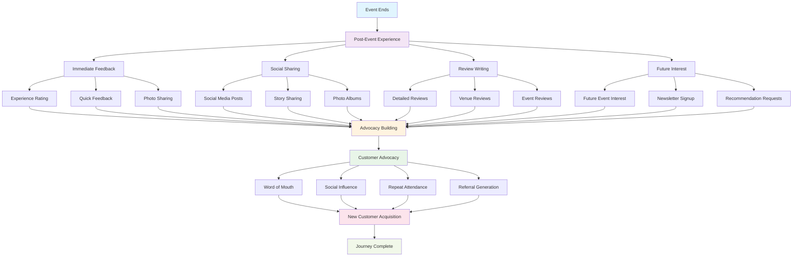

# Post-Event/Advocacy Stage Implementation

## 📊 **Post-Event/Advocacy Stage Flow Diagram**



## 🎯 **Stage Overview**
The post-event/advocacy stage is where customers reflect on their experience and become advocates for the brand. This stage is crucial for generating word-of-mouth marketing, repeat attendance, and long-term customer relationships.

## 📊 **Key Metrics & Goals**
- **Primary Goal**: Transform satisfied customers into brand advocates
- **Success Metrics**: Review ratings, social shares, referral rates, repeat attendance
- **Revenue Impact**: Advocacy drives new customer acquisition and increases lifetime value

## 🏗️ **Technical Implementation**

### Frontend Components
```typescript
// Post-Event/Advocacy Stage Components
interface AdvocacyStageProps {
  eventId: string;
  userId: string;
  onStageComplete: (stage: string) => void;
}

const AdvocacyStage: React.FC<AdvocacyStageProps> = ({ eventId, userId, onStageComplete }) => {
  return (
    <div className="advocacy-stage">
      <ImmediateFeedback />
      <SocialSharing />
      <ReviewWriting />
      <FutureEngagement />
      <ReferralProgram />
    </div>
  );
};
```

### Immediate Feedback Component
```typescript
// Quick Feedback Collection
const ImmediateFeedback: React.FC<{ event: Event }> = ({ event }) => {
  const [feedback, setFeedback] = useState<QuickFeedback>({
    rating: 0,
    highlights: [],
    improvements: []
  });
  
  const [isSubmitting, setIsSubmitting] = useState<boolean>(false);
  
  const handleRatingChange = (rating: number) => {
    setFeedback(prev => ({ ...prev, rating }));
  };
  
  const handleHighlightToggle = (highlight: string) => {
    setFeedback(prev => ({
      ...prev,
      highlights: prev.highlights.includes(highlight)
        ? prev.highlights.filter(h => h !== highlight)
        : [...prev.highlights, highlight]
    }));
  };
  
  const handleSubmitFeedback = async () => {
    setIsSubmitting(true);
    
    try {
      await submitQuickFeedback({
        eventId: event.id,
        feedback: feedback,
        timestamp: new Date()
      });
      
      await trackJourneyStage('advocacy', 'quick_feedback_submitted', {
        eventId: event.id,
        rating: feedback.rating
      });
      
      // Show success message
      alert('Thank you for your feedback!');
    } catch (error) {
      alert('Failed to submit feedback. Please try again.');
    } finally {
      setIsSubmitting(false);
    }
  };
  
  return (
    <div className="immediate-feedback">
      <h3>How was your experience?</h3>
      
      <div className="rating-section">
        <h4>Rate Your Experience</h4>
        <div className="rating-stars">
          {[1, 2, 3, 4, 5].map(star => (
            <button
              key={star}
              className={`star-btn ${star <= feedback.rating ? 'active' : ''}`}
              onClick={() => handleRatingChange(star)}
            >
              <StarIcon />
            </button>
          ))}
        </div>
      </div>
      
      <div className="highlights-section">
        <h4>What did you enjoy most?</h4>
        <div className="highlight-options">
          {['Music', 'Venue', 'Staff', 'Food', 'Atmosphere', 'Value', 'Organization'].map(highlight => (
            <label key={highlight} className="highlight-option">
              <input
                type="checkbox"
                checked={feedback.highlights.includes(highlight)}
                onChange={() => handleHighlightToggle(highlight)}
              />
              <span>{highlight}</span>
            </label>
          ))}
        </div>
      </div>
      
      <button 
        className="submit-feedback-btn"
        onClick={handleSubmitFeedback}
        disabled={isSubmitting}
      >
        {isSubmitting ? 'Submitting...' : 'Submit Feedback'}
      </button>
    </div>
  );
};
```

### Social Sharing Component
```typescript
// Social Sharing Interface
const SocialSharing: React.FC<{ event: Event }> = ({ event }) => {
  const [sharedContent, setSharedContent] = useState<SharedContent[]>([]);
  const [isSharing, setIsSharing] = useState<boolean>(false);
  
  const handleSocialShare = async (platform: string, content: string) => {
    setIsSharing(true);
    
    try {
      const shareData = {
        event: event,
        content: content,
        platform: platform,
        timestamp: new Date()
      };
      
      await shareToSocialMedia(shareData);
      
      await trackJourneyStage('advocacy', 'social_share', {
        eventId: event.id,
        platform: platform
      });
      
      // Add to shared content
      setSharedContent(prev => [...prev, {
        id: generateId(),
        platform: platform,
        content: content,
        timestamp: new Date()
      }]);
      
    } catch (error) {
      alert('Failed to share. Please try again.');
    } finally {
      setIsSharing(false);
    }
  };
  
  return (
    <div className="social-sharing">
      <h3>Share Your Experience</h3>
      
      <div className="sharing-options">
        <button 
          className="share-btn facebook"
          onClick={() => handleSocialShare('facebook', 'Had an amazing time at the event!')}
          disabled={isSharing}
        >
          <FacebookIcon />
          Share on Facebook
        </button>
        
        <button 
          className="share-btn twitter"
          onClick={() => handleSocialShare('twitter', 'Just had an incredible experience! #EventOS')}
          disabled={isSharing}
        >
          <TwitterIcon />
          Share on Twitter
        </button>
        
        <button 
          className="share-btn instagram"
          onClick={() => handleSocialShare('instagram', 'Check out these amazing moments!')}
          disabled={isSharing}
        >
          <InstagramIcon />
          Share on Instagram
        </button>
      </div>
      
      <div className="shared-content">
        <h4>Your Shares</h4>
        {sharedContent.map(content => (
          <div key={content.id} className="shared-item">
            <div className="content-info">
              <span className="platform">{content.platform}</span>
              <span className="content-text">{content.content}</span>
              <span className="share-time">{formatTime(content.timestamp)}</span>
            </div>
          </div>
        ))}
      </div>
    </div>
  );
};
```

### Review Writing Component
```typescript
// Detailed Review Writing
const ReviewWriting: React.FC<{ event: Event }> = ({ event }) => {
  const [review, setReview] = useState<DetailedReview>({
    rating: 0,
    title: '',
    content: '',
    categories: [],
    photos: []
  });
  
  const [isSubmitting, setIsSubmitting] = useState<boolean>(false);
  
  const handleReviewSubmit = async () => {
    setIsSubmitting(true);
    
    try {
      await submitDetailedReview({
        eventId: event.id,
        review: review,
        timestamp: new Date()
      });
      
      await trackJourneyStage('advocacy', 'detailed_review_submitted', {
        eventId: event.id,
        rating: review.rating
      });
      
      alert('Thank you for your detailed review!');
    } catch (error) {
      alert('Failed to submit review. Please try again.');
    } finally {
      setIsSubmitting(false);
    }
  };
  
  return (
    <div className="review-writing">
      <h3>Write a Detailed Review</h3>
      
      <div className="review-form">
        <div className="rating-section">
          <h4>Overall Rating</h4>
          <div className="rating-stars">
            {[1, 2, 3, 4, 5].map(star => (
              <button
                key={star}
                className={`star-btn ${star <= review.rating ? 'active' : ''}`}
                onClick={() => setReview(prev => ({ ...prev, rating: star }))}
              >
                <StarIcon />
              </button>
            ))}
          </div>
        </div>
        
        <div className="title-section">
          <h4>Review Title</h4>
          <input
            type="text"
            value={review.title}
            onChange={(e) => setReview(prev => ({ ...prev, title: e.target.value }))}
            placeholder="Summarize your experience in a few words"
            className="review-title-input"
          />
        </div>
        
        <div className="content-section">
          <h4>Your Review</h4>
          <textarea
            value={review.content}
            onChange={(e) => setReview(prev => ({ ...prev, content: e.target.value }))}
            placeholder="Tell others about your experience..."
            rows={6}
            className="review-content-textarea"
          />
        </div>
        
        <div className="categories-section">
          <h4>What did you like most?</h4>
          <div className="category-options">
            {['Music', 'Venue', 'Staff', 'Food', 'Atmosphere', 'Value', 'Organization', 'Sound Quality'].map(category => (
              <label key={category} className="category-option">
                <input
                  type="checkbox"
                  checked={review.categories.includes(category)}
                  onChange={(e) => {
                    if (e.target.checked) {
                      setReview(prev => ({ ...prev, categories: [...prev.categories, category] }));
                    } else {
                      setReview(prev => ({ ...prev, categories: prev.categories.filter(c => c !== category) }));
                    }
                  }}
                />
                <span>{category}</span>
              </label>
            ))}
          </div>
        </div>
        
        <div className="photos-section">
          <h4>Add Photos</h4>
          <div className="photo-upload">
            <input
              type="file"
              multiple
              accept="image/*"
              onChange={(e) => {
                const files = Array.from(e.target.files || []);
                setReview(prev => ({ ...prev, photos: [...prev.photos, ...files] }));
              }}
            />
            <span>Upload photos from your experience</span>
          </div>
        </div>
        
        <button 
          className="submit-review-btn"
          onClick={handleReviewSubmit}
          disabled={isSubmitting || !review.rating || !review.title || !review.content}
        >
          {isSubmitting ? 'Submitting...' : 'Submit Review'}
        </button>
      </div>
    </div>
  );
};
```

### Future Engagement Component
```typescript
// Future Event Engagement
const FutureEngagement: React.FC<{ event: Event }> = ({ event }) => {
  const [futureEvents, setFutureEvents] = useState<Event[]>([]);
  const [newsletterSignup, setNewsletterSignup] = useState<boolean>(false);
  const [preferences, setPreferences] = useState<EventPreferences>({
    categories: [],
    locations: [],
    priceRange: { min: 0, max: 1000 }
  });
  
  useEffect(() => {
    const loadFutureEvents = async () => {
      const events = await getRecommendedEvents(event.category, event.location);
      setFutureEvents(events);
    };
    
    loadFutureEvents();
  }, [event.category, event.location]);
  
  const handleNewsletterSignup = async () => {
    try {
      await subscribeToNewsletter({
        email: user.email,
        preferences: preferences,
        timestamp: new Date()
      });
      
      setNewsletterSignup(true);
      await trackJourneyStage('advocacy', 'newsletter_signup', {
        eventId: event.id
      });
    } catch (error) {
      alert('Failed to subscribe. Please try again.');
    }
  };
  
  return (
    <div className="future-engagement">
      <h3>Stay Connected</h3>
      
      <div className="newsletter-section">
        <h4>Get Event Updates</h4>
        <div className="newsletter-signup">
          <label className="newsletter-option">
            <input
              type="checkbox"
              checked={newsletterSignup}
              onChange={(e) => setNewsletterSignup(e.target.checked)}
            />
            <span>Subscribe to our newsletter for event updates</span>
          </label>
          
          {newsletterSignup && (
            <div className="preferences-section">
              <h5>Your Preferences</h5>
              <div className="preference-options">
                <div className="category-preferences">
                  <h6>Event Categories</h6>
                  {['Music', 'Sports', 'Arts', 'Technology', 'Business', 'Food'].map(category => (
                    <label key={category} className="preference-option">
                      <input
                        type="checkbox"
                        checked={preferences.categories.includes(category)}
                        onChange={(e) => {
                          if (e.target.checked) {
                            setPreferences(prev => ({ ...prev, categories: [...prev.categories, category] }));
                          } else {
                            setPreferences(prev => ({ ...prev, categories: prev.categories.filter(c => c !== category) }));
                          }
                        }}
                      />
                      <span>{category}</span>
                    </label>
                  ))}
                </div>
              </div>
            </div>
          )}
          
          <button 
            className="subscribe-btn"
            onClick={handleNewsletterSignup}
            disabled={newsletterSignup}
          >
            {newsletterSignup ? 'Subscribed!' : 'Subscribe'}
          </button>
        </div>
      </div>
      
      <div className="recommended-events">
        <h4>Recommended for You</h4>
        <div className="events-grid">
          {futureEvents.map(futureEvent => (
            <EventCard key={futureEvent.id} event={futureEvent} />
          ))}
        </div>
      </div>
    </div>
  );
};
```

### Referral Program Component
```typescript
// Referral Program
const ReferralProgram: React.FC<{ event: Event }> = ({ event }) => {
  const [referralCode, setReferralCode] = useState<string>('');
  const [referralStats, setReferralStats] = useState<ReferralStats | null>(null);
  
  useEffect(() => {
    const loadReferralData = async () => {
      const code = await generateReferralCode(event.id);
      setReferralCode(code);
      
      const stats = await getReferralStats(event.id);
      setReferralStats(stats);
    };
    
    loadReferralData();
  }, [event.id]);
  
  const handleReferralShare = async (platform: string) => {
    const referralMessage = `I had an amazing time at ${event.title}! Use my code ${referralCode} for 10% off your next event.`;
    
    await shareReferralLink({
      platform: platform,
      message: referralMessage,
      code: referralCode
    });
    
    await trackJourneyStage('advocacy', 'referral_shared', {
      eventId: event.id,
      platform: platform
    });
  };
  
  return (
    <div className="referral-program">
      <h3>Refer Friends & Earn Rewards</h3>
      
      <div className="referral-info">
        <div className="referral-code">
          <h4>Your Referral Code</h4>
          <div className="code-display">
            <span className="code-text">{referralCode}</span>
            <button 
              className="copy-btn"
              onClick={() => navigator.clipboard.writeText(referralCode)}
            >
              Copy
            </button>
          </div>
        </div>
        
        <div className="referral-benefits">
          <h4>Referral Benefits</h4>
          <ul>
            <li>10% off your next event for each successful referral</li>
            <li>Free ticket for every 5 successful referrals</li>
            <li>Early access to exclusive events</li>
          </ul>
        </div>
      </div>
      
      <div className="referral-sharing">
        <h4>Share Your Code</h4>
        <div className="sharing-buttons">
          <button 
            className="share-btn facebook"
            onClick={() => handleReferralShare('facebook')}
          >
            <FacebookIcon />
            Share on Facebook
          </button>
          
          <button 
            className="share-btn twitter"
            onClick={() => handleReferralShare('twitter')}
          >
            <TwitterIcon />
            Share on Twitter
          </button>
          
          <button 
            className="share-btn whatsapp"
            onClick={() => handleReferralShare('whatsapp')}
          >
            <WhatsAppIcon />
            Share on WhatsApp
          </button>
        </div>
      </div>
      
      {referralStats && (
        <div className="referral-stats">
          <h4>Your Referral Stats</h4>
          <div className="stats-grid">
            <div className="stat-item">
              <span className="stat-number">{referralStats.totalReferrals}</span>
              <span className="stat-label">Total Referrals</span>
            </div>
            <div className="stat-item">
              <span className="stat-number">{referralStats.successfulReferrals}</span>
              <span className="stat-label">Successful</span>
            </div>
            <div className="stat-item">
              <span className="stat-number">{referralStats.totalEarnings}</span>
              <span className="stat-label">Total Earnings</span>
            </div>
          </div>
        </div>
      )}
    </div>
  );
};
```

## 🔧 **Backend Implementation**

### Advocacy Analytics Service
```typescript
// Advocacy Analytics Service
export class AdvocacyAnalyticsService {
  async trackAdvocacyAction(action: string, data: any): Promise<void> {
    await supabase
      .from('advocacy_analytics')
      .insert({
        action: action,
        data: data,
        timestamp: new Date()
      });
  }
  
  async getAdvocacyMetrics(eventId: string): Promise<AdvocacyMetrics> {
    const { data } = await supabase
      .from('advocacy_analytics')
      .select('*')
      .eq('event_id', eventId);
    
    return this.calculateAdvocacyMetrics(data);
  }
  
  private calculateAdvocacyMetrics(data: any[]): AdvocacyMetrics {
    const totalActions = data.length;
    const socialShares = data.filter(d => d.action === 'social_share').length;
    const reviews = data.filter(d => d.action === 'review_written').length;
    const referrals = data.filter(d => d.action === 'referral_shared').length;
    
    return {
      totalActions,
      socialShares,
      reviews,
      referrals,
      advocacyRate: (socialShares + reviews + referrals) / totalActions
    };
  }
}
```

### Referral Program Service
```typescript
// Referral Program Service
export class ReferralProgramService {
  async generateReferralCode(eventId: string, userId: string): Promise<string> {
    const code = `REF${eventId.slice(-4)}${userId.slice(-4)}`;
    
    await supabase
      .from('referral_codes')
      .insert({
        code: code,
        event_id: eventId,
        user_id: userId,
        created_at: new Date()
      });
    
    return code;
  }
  
  async processReferral(referralCode: string, newUserId: string): Promise<ReferralResult> {
    const referral = await this.getReferralByCode(referralCode);
    if (!referral) {
      throw new Error('Invalid referral code');
    }
    
    // Create referral record
    await supabase
      .from('referrals')
      .insert({
        referral_code: referralCode,
        referrer_id: referral.user_id,
        referred_id: newUserId,
        status: 'pending',
        created_at: new Date()
      });
    
    // Award referrer
    await this.awardReferrer(referral.user_id);
    
    return {
      success: true,
      referrerId: referral.user_id,
      discount: 0.1 // 10% discount
    };
  }
}
```

## 📊 **Success Metrics**

### Key Performance Indicators
- **Review Submission Rate**: % of attendees who write reviews
- **Social Sharing Rate**: % of attendees who share on social media
- **Referral Generation**: Number of referrals generated per event
- **Newsletter Signup Rate**: % of attendees who subscribe to updates

### Revenue Metrics
- **Advocacy Revenue**: Revenue generated through referrals
- **Repeat Attendance Rate**: % of attendees who attend future events
- **Customer Lifetime Value**: Total revenue from advocacy-driven customers
- **Word-of-Mouth Impact**: New customers acquired through advocacy

## 🚀 **Implementation Checklist**

- [ ] **Immediate Feedback**: Quick rating and feedback collection
- [ ] **Social Sharing**: Easy sharing to social media platforms
- [ ] **Review Writing**: Detailed review submission system
- [ ] **Future Engagement**: Newsletter signup and event recommendations
- [ ] **Referral Program**: Referral code generation and tracking
- [ ] **Analytics Tracking**: Comprehensive advocacy metrics
- [ ] **Mobile Optimization**: Mobile-friendly advocacy experience
- [ ] **Gamification**: Rewards and incentives for advocacy actions

---

*The post-event/advocacy stage transforms satisfied customers into brand advocates, driving word-of-mouth marketing and long-term customer relationships.*
