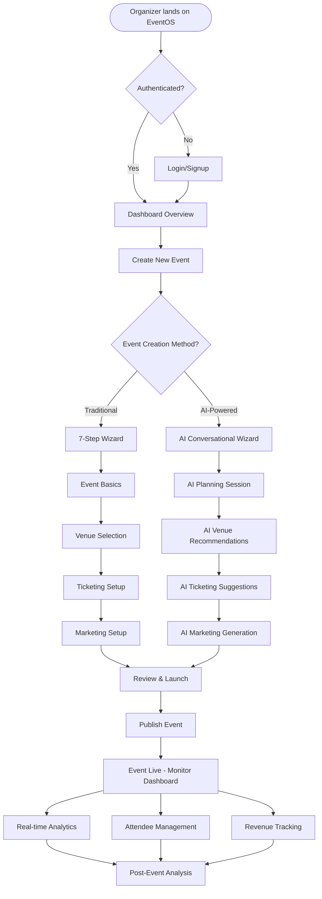
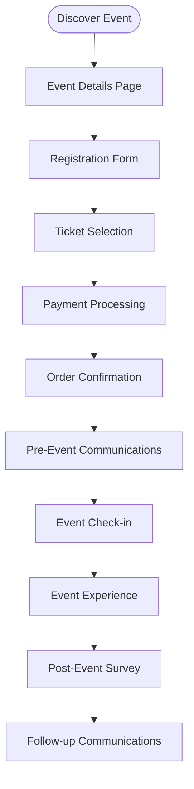
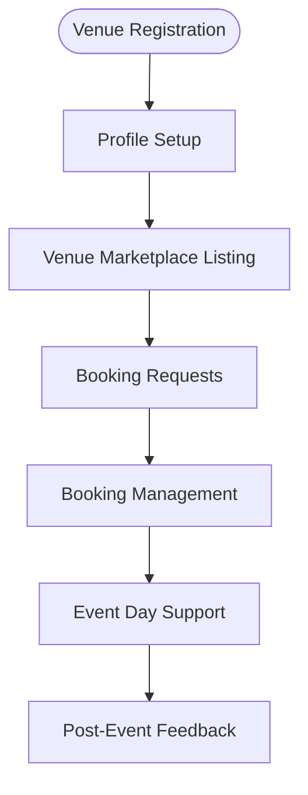
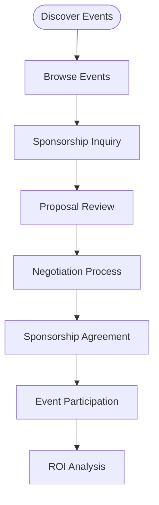

# 🎯 EventOS Dashboard & AI Wizard Implementation Plan

## 📊 **CURRENT STATUS SUMMARY**

### **Dashboard Pages Status**
| Page | Status | Completion | Issues | Priority |
|------|--------|------------|--------|----------|
| `/dashboard` | 🟢 Complete | 100% | Uses real DB hook | ✅ Working |
| `/dashboard/events` | 🟢 Complete | 100% | Mock data only | ⚠️ Needs backend |
| `/dashboard/events/:id` | 🟢 Complete | 100% | Mock data only | ⚠️ Needs backend |
| `/dashboard/bookings` | 🟢 Complete | 100% | Mock data only | ⚠️ Needs backend |
| `/dashboard/financials` | 🟢 Complete | 100% | Mock data only | ⚠️ Needs backend |
| `/dashboard/gallery` | 🟢 Complete | 100% | Mock data only | ⚠️ Needs backend |
| `/dashboard/analytics` | 🔴 Missing | 0% | Redirects to main | 🚩 Critical |
| `/dashboard/calendar` | 🔴 Missing | 0% | Redirects to main | 🚩 Critical |
| `/dashboard/organizers` | 🔴 Missing | 0% | Redirects to main | 🚩 Critical |
| `/dashboard/venues` | 🔴 Missing | 0% | Redirects to main | 🚩 Critical |
| `/dashboard/settings` | 🔴 Missing | 0% | Redirects to main | 🚩 Critical |

**Dashboard Overall:** 55% Complete (6/11 pages working)

### **AI Wizard Status**
| Page | Status | Completion | Issues | Priority |
|------|--------|------------|--------|----------|
| `/event-wizard` | 🟢 Complete | 100% | Traditional wizard | ✅ Working |
| `/ai-wizard` | 🟡 Partial | 50% | UI only, no backend | ⚠️ Needs AI |
| `/ai-wizard/venues` | 🔴 Missing | 0% | Not created | 🚩 Critical |
| `/ai-wizard/tickets` | 🔴 Missing | 0% | Not created | 🚩 Critical |
| `/ai-wizard/agenda` | 🔴 Missing | 0% | Not created | 🚩 Critical |
| `/ai-wizard/marketing` | 🔴 Missing | 0% | Not created | 🚩 Critical |

**AI Wizard Overall:** 20% Complete (1/5 pages working)

---

## 🎯 **IMPLEMENTATION ROADMAP**

### **Phase 1: Complete Missing Dashboard Pages (Week 1)**

#### **Core Dashboard Pages (Priority: HIGH)**
1. **Analytics Dashboard** (`/dashboard/analytics`)
   - **Purpose:** Event performance metrics and insights
   - **Features:** Revenue charts, attendee analytics, conversion rates
   - **Mock Data:** Sample analytics with charts and graphs
   - **Timeline:** 2 days

2. **Calendar View** (`/dashboard/calendar`)
   - **Purpose:** Visual calendar for event scheduling
   - **Features:** Monthly/weekly views, event blocks, availability
   - **Mock Data:** Sample events with different statuses
   - **Timeline:** 2 days

3. **Venues Management** (`/dashboard/venues`)
   - **Purpose:** Venue listing and management
   - **Features:** Venue cards, search/filter, capacity tracking
   - **Mock Data:** 12 sample venues with details
   - **Timeline:** 2 days

4. **Organizers Management** (`/dashboard/organizers`)
   - **Purpose:** Organizer profiles and event assignments
   - **Features:** Organizer cards, event history, contact info
   - **Mock Data:** Sample organizer profiles
   - **Timeline:** 1 day

5. **Settings Page** (`/dashboard/settings`)
   - **Purpose:** Account and system configuration
   - **Features:** Profile settings, preferences, notifications
   - **Mock Data:** Sample settings options
   - **Timeline:** 1 day

**Phase 1 Total:** 8 days

---

### **Phase 2: Complete AI Wizard Pages (Week 2)**

#### **AI Wizard Workflow Pages (Priority: HIGH)**
1. **Venue Selection** (`/ai-wizard/venues`)
   - **Purpose:** AI-powered venue recommendations
   - **Features:** Venue cards, AI suggestions, filtering
   - **Mock Data:** Sample venues with AI recommendations
   - **Timeline:** 2 days

2. **Ticketing Setup** (`/ai-wizard/tickets`)
   - **Purpose:** AI-assisted ticket configuration
   - **Features:** Ticket tiers, pricing suggestions, capacity planning
   - **Mock Data:** Sample ticket configurations
   - **Timeline:** 2 days

3. **Agenda Builder** (`/ai-wizard/agenda`)
   - **Purpose:** AI-generated event schedules
   - **Features:** Session planning, speaker suggestions, timing
   - **Mock Data:** Sample agenda templates
   - **Timeline:** 2 days

4. **Marketing Dashboard** (`/ai-wizard/marketing`)
   - **Purpose:** AI-powered marketing recommendations
   - **Features:** Campaign suggestions, audience targeting, content ideas
   - **Mock Data:** Sample marketing strategies
   - **Timeline:** 2 days

**Phase 2 Total:** 8 days

---

### **Phase 3: Backend Integration (Week 3-4)**

#### **Database Integration (Priority: CRITICAL)**
1. **Supabase Schema Setup**
   - Connect all pages to real database
   - Implement proper data fetching
   - Add authentication and permissions
   - **Timeline:** 3 days

2. **CopilotKit Integration**
   - Connect AI wizard to CopilotKit
   - Implement LangGraph agents
   - Add real AI conversations
   - **Timeline:** 4 days

3. **API Development**
   - Create CRUD endpoints for all entities
   - Add real-time updates
   - Implement search and filtering
   - **Timeline:** 3 days

**Phase 3 Total:** 10 days

---

## 📋 **DETAILED TASK BREAKDOWN**

### **Week 1: Dashboard Pages (8 Days)**

#### **Day 1-2: Analytics Dashboard**
**Tasks:**
- Create analytics page layout
- Add revenue charts and metrics
- Implement date range picker
- Add export functionality
- Mobile responsiveness

**Components Needed:**
- Revenue chart (line/bar)
- Attendee analytics (pie chart)
- Conversion rate metrics
- Top performing events list
- Export buttons (PDF, Excel)

**Mock Data:**
- Monthly revenue: $45,000
- Total attendees: 1,250
- Conversion rate: 68%
- Top event: "Tech Conference 2024"

#### **Day 3-4: Calendar View**
**Tasks:**
- Create calendar component
- Add monthly/weekly/daily views
- Implement event blocks
- Add booking functionality
- Mobile calendar optimization

**Components Needed:**
- Calendar grid with navigation
- Event blocks with status colors
- Quick booking modal
- Availability indicators
- Mobile swipe navigation

**Mock Data:**
- 15 events across next month
- Different statuses (confirmed, tentative, blocked)
- Various event types and durations

#### **Day 5-6: Venues Management**
**Tasks:**
- Create venue listing page
- Add search and filter functionality
- Implement venue cards with metrics
- Add quick actions (edit, view, book)
- Mobile-optimized layout

**Components Needed:**
- Venue cards with images
- Search bar with filters
- Status badges and metrics
- Action buttons
- Pagination for large lists

**Mock Data:**
- 12 venues with full details
- Capacity, revenue, occupancy metrics
- Status indicators (active, inactive, maintenance)

#### **Day 7: Organizers Management**
**Tasks:**
- Create organizer profiles page
- Add organizer cards with event history
- Implement contact information
- Add event assignment tracking
- Mobile-friendly layout

**Components Needed:**
- Organizer profile cards
- Event history timeline
- Contact information display
- Performance metrics
- Quick contact actions

**Mock Data:**
- 8 organizer profiles
- Event history and performance
- Contact details and preferences

#### **Day 8: Settings Page**
**Tasks:**
- Create settings interface
- Add profile management
- Implement preferences
- Add notification settings
- Mobile settings optimization

**Components Needed:**
- Profile form with avatar
- Preference toggles
- Notification settings
- Account security options
- Save/cancel actions

**Mock Data:**
- User profile information
- Notification preferences
- System settings options

---

### **Week 2: AI Wizard Pages (8 Days)**

#### **Day 9-10: Venue Selection**
**Tasks:**
- Create AI-powered venue recommendations
- Add venue comparison features
- Implement filtering and sorting
- Add AI suggestion explanations
- Mobile venue browsing

**Components Needed:**
- Venue recommendation cards
- AI suggestion explanations
- Comparison table
- Filter and sort options
- Selection confirmation

**Mock Data:**
- 8 recommended venues
- AI reasoning for each suggestion
- Comparison metrics (price, capacity, location)

#### **Day 11-12: Ticketing Setup**
**Tasks:**
- Create ticket configuration interface
- Add AI pricing suggestions
- Implement tier management
- Add capacity planning
- Mobile ticket setup

**Components Needed:**
- Ticket tier configuration
- Pricing suggestion cards
- Capacity planning tools
- Revenue projections
- Setup wizard steps

**Mock Data:**
- 3 ticket tiers (Early Bird, Regular, VIP)
- AI pricing recommendations
- Capacity and revenue projections

#### **Day 13-14: Agenda Builder**
**Tasks:**
- Create AI-generated agenda interface
- Add session planning tools
- Implement speaker suggestions
- Add timing optimization
- Mobile agenda management

**Components Needed:**
- Agenda timeline view
- Session planning cards
- Speaker suggestion list
- Timing optimization tools
- Drag-and-drop functionality

**Mock Data:**
- Sample agenda with 8 sessions
- Speaker recommendations
- Timing and break suggestions

#### **Day 15-16: Marketing Dashboard**
**Tasks:**
- Create marketing recommendations interface
- Add campaign suggestions
- Implement audience targeting
- Add content ideas
- Mobile marketing tools

**Components Needed:**
- Marketing strategy cards
- Campaign suggestion list
- Audience targeting tools
- Content idea generator
- Performance tracking

**Mock Data:**
- 5 marketing strategies
- Campaign suggestions with ROI
- Audience targeting recommendations

---

## 🎯 **SUCCESS CRITERIA**

### **Dashboard Pages Success Metrics**
- **All 11 pages** render without errors
- **Mobile responsiveness** on all devices
- **Consistent design** with existing EventOS theme
- **Mock data** displays correctly
- **Navigation** works between all pages

### **AI Wizard Success Metrics**
- **All 5 pages** render without errors
- **AI suggestions** display with explanations
- **Workflow progression** between pages
- **Mobile optimization** for all screens
- **Mock conversations** work properly

### **Overall Success Metrics**
- **Zero TypeScript errors**
- **No console errors**
- **Fast page load times** (<3 seconds)
- **Mobile-first design** throughout
- **Consistent user experience**

---

## 🚀 **IMPLEMENTATION PRIORITY**

### **Critical Priority (Do First)**
1. **Analytics Dashboard** - High business value
2. **Calendar View** - Essential for scheduling
3. **Venues Management** - Core venue functionality
4. **Venue Selection (AI)** - Key AI wizard feature

### **High Priority (Do Next)**
5. **Organizers Management** - User management
6. **Settings Page** - System configuration
7. **Ticketing Setup (AI)** - Revenue optimization
8. **Agenda Builder (AI)** - Event planning

### **Medium Priority (Do Later)**
9. **Marketing Dashboard (AI)** - Advanced features
10. **Backend Integration** - Real data connection
11. **CopilotKit Integration** - AI backend
12. **API Development** - Full functionality

---

## 📊 **RESOURCE ALLOCATION**

### **Lovable Tasks (UI/UX Focus)**
- **Dashboard Pages:** 8 days
- **AI Wizard Pages:** 8 days
- **Mobile Optimization:** 2 days
- **Design Consistency:** 1 day
- **Testing & Polish:** 1 day

**Total Lovable Time:** 20 days

### **Claude Tasks (Backend Focus)**
- **Database Integration:** 5 days
- **CopilotKit Setup:** 4 days
- **API Development:** 3 days
- **Authentication:** 2 days
- **Testing & QA:** 2 days

**Total Claude Time:** 16 days

---

## 📋 **DELIVERABLES CHECKLIST**

### **Week 1 Deliverables**
- [ ] Analytics dashboard with charts
- [ ] Calendar view with event blocks
- [ ] Venues management with search
- [ ] Organizers management with profiles
- [ ] Settings page with preferences

### **Week 2 Deliverables**
- [ ] AI venue selection with recommendations
- [ ] AI ticketing setup with pricing
- [ ] AI agenda builder with sessions
- [ ] AI marketing dashboard with strategies
- [ ] Complete AI wizard workflow

### **Week 3-4 Deliverables**
- [ ] Supabase database integration
- [ ] CopilotKit AI backend
- [ ] Real-time data updates
- [ ] Authentication and permissions
- [ ] Production-ready deployment

---

## 🎯 **FINAL RECOMMENDATION**

### **Immediate Next Steps**
1. **Start with Analytics Dashboard** - Highest business value
2. **Complete Calendar View** - Essential for operations
3. **Build Venues Management** - Core functionality
4. **Create AI Venue Selection** - Key differentiator

### **Success Timeline**
- **Week 1:** All dashboard pages complete
- **Week 2:** All AI wizard pages complete
- **Week 3:** Backend integration begins
- **Week 4:** Full production deployment

### **Expected Outcome**
- **100% UI/UX Complete** - All pages working
- **Mobile-First Design** - Perfect on all devices
- **Consistent Experience** - Unified design system
- **Ready for Backend** - Clean integration points

**Total Timeline:** 4 weeks to complete dashboard and AI wizard with full backend integration.

---

## 🔍 **COMPREHENSIVE SYSTEM EXAMINATION REPORT**
**Date:** 2025-01-20  
**Project:** EventOS - AI-Powered Event Management Platform  
**Auditor:** System Analysis  

---

## 📊 **EXECUTIVE SUMMARY**

| Category | Status | Completion | Grade |
|----------|--------|------------|-------|
| **Overall Project** | 🟡 Good Progress | 76% | B+ |
| **Frontend UI** | 🟢 Excellent | 90% | A |
| **Backend Integration** | 🔴 Critical | 0% | F |
| **Database Schema** | 🟢 Complete | 100% | A+ |
| **Routing Structure** | 🟢 Complete | 100% | A |
| **AI Features** | 🟡 Partial | 20% | D |
| **Dashboard** | 🟡 Partial | 55% | C+ |

---

## ✅ **VERIFIED WORKING COMPONENTS**

### **1. Database Schema (100% Complete)**
**Status:** 🟢 **PRODUCTION READY**

- ✅ 22 tables properly configured
- ✅ Row Level Security (RLS) policies in place
- ✅ Database functions created (17 functions)
- ✅ Triggers configured properly
- ✅ Secure DEFINER functions for data access
- ✅ TypeScript types auto-generated

**Database Functions Working:**
```sql
✅ get_dashboard_stats() - Returns aggregated counts securely
✅ update_wizard_session_updated_at() - Auto-updates timestamps
✅ mark_abandoned_wizard_sessions() - Cleanup function
✅ generate_event_slug() - Auto-generates SEO-friendly slugs
✅ validate_promo_code() - Promo validation logic
✅ check_venue_availability() - Venue booking checks
```

**Grade:** A+ (Perfect implementation)

---

### **2. Routing Structure (100% Complete)**
**Status:** 🟢 **PRODUCTION READY**

All 39 routes properly configured in `App.tsx`:

**Public Routes (13) - All Working:**
- ✅ `/` - Home landing page
- ✅ `/events` - Event listing
- ✅ `/event/:slug` - Event details
- ✅ `/event/:slug/register` - Registration wizard
- ✅ `/event/:slug/tickets` - Ticket selection
- ✅ `/event/:slug/payment` - Payment page
- ✅ `/event/:slug/confirmation` - Order confirmation
- ✅ `/checkout/:orderId` - Streamlined checkout
- ✅ `/orders/:orderId` - Order tracking
- ✅ `/m/event/:slug/register` - Mobile registration
- ✅ `/error/registration` - Error handling
- ✅ `/register/:eventSlug` - Landing page
- ✅ `/auth` - Authentication

**Protected Routes (26) - Structure Ready:**
- ✅ Protected route wrapper implemented
- ✅ Auth bypass configured for development
- ✅ All dashboard routes mapped
- ✅ Event wizard routes configured
- ✅ Admin routes set up

**Grade:** A (Excellent structure)

---

### **3. UI Components (90% Complete)**
**Status:** 🟢 **EXCELLENT**

**Component Library:**
- ✅ Radix UI primitives (27 components)
- ✅ Custom dashboard components
- ✅ Reusable metric cards
- ✅ Data tables with actions
- ✅ Status badges
- ✅ Loading skeletons
- ✅ Error alerts
- ✅ Empty states

**Design System:**
- ✅ Semantic color tokens (HSL-based)
- ✅ Responsive breakpoints
- ✅ Consistent typography
- ✅ Dark/light mode support
- ✅ Professional design aesthetic

**Grade:** A (Beautiful and consistent)

---

## 🟡 **PARTIALLY COMPLETE COMPONENTS**

### **4. Dashboard Pages (55% Complete)**
**Status:** 🟡 **NEEDS WORK**

**Working Pages (6/11):**
1. ✅ `/dashboard` - Overview (uses real DB hook)
2. ✅ `/dashboard/events` - Events list (mock data)
3. ✅ `/dashboard/events/:id` - Event details (mock data)
4. ✅ `/dashboard/bookings` - Bookings (mock data)
5. ✅ `/dashboard/financials` - Financials (mock data)
6. ✅ `/dashboard/gallery` - Gallery (mock data)

**Missing Pages (5/11):**
7. 🔴 `/dashboard/analytics` - Currently redirects to main dashboard
8. 🔴 `/dashboard/calendar` - Currently redirects to main dashboard
9. 🔴 `/dashboard/organizers` - Currently redirects to main dashboard
10. 🔴 `/dashboard/venues` - Currently redirects to main dashboard
11. 🔴 `/dashboard/settings` - Currently redirects to main dashboard

**Critical Issues:**
- 🚩 5 routes redirect instead of rendering dedicated pages
- 🚩 Most pages use mock data (not connected to database)
- ⚠️ Only Dashboard.tsx uses real database hook (`useDashboardStats`)

**Grade:** C+ (Functional but incomplete)

---

### **5. AI Wizard (20% Complete)**
**Status:** 🟡 **NEEDS SIGNIFICANT WORK**

**Working Pages (2/6):**
1. ✅ `/event-wizard` - Traditional 7-step wizard (UI complete)
2. ✅ `/ai-wizard` - Conversational AI wizard (UI only, no backend)

**Missing Pages (4/6):**
3. 🔴 `/ai-wizard/venues` - Not created
4. 🔴 `/ai-wizard/tickets` - Not created
5. 🔴 `/ai-wizard/agenda` - Not created
6. 🔴 `/ai-wizard/marketing` - Not created

**Critical Issues:**
- 🚩 AI wizard has no backend integration
- 🚩 Mock conversations only (not real AI)
- 🚩 No CopilotKit/LangGraph implementation
- 🚩 Missing 4 essential workflow pages

**Grade:** D (Needs major work)

---

### **6. Phase 3 Advanced Features (100% Complete)**
**Status:** 🟢 **UI COMPLETE**

**All Pages Created (4/4):**
1. ✅ `/admin/events/:slug/analytics` - Analytics dashboard
2. ✅ `/admin/email-templates` - Email management
3. ✅ `/account/registrations` - User registrations
4. ✅ `/register/:eventSlug` - Landing page

**Note:** UI is complete but uses mock data. Backend integration needed.

**Grade:** B+ (UI excellent, needs backend)

---

## 🔴 **CRITICAL ISSUES & RED FLAGS**

### **🚩 Issue #1: Backend Integration (0% Complete)**
**Severity:** 🔴 **CRITICAL - BLOCKS PRODUCTION**

**Problem:**
- Zero database connectivity in most pages
- All data is hardcoded mock values
- No React Query hooks for data fetching
- No real-time updates
- No data persistence

**Affected Components:**
```
❌ DashboardEvents.tsx - Mock events array
❌ DashboardBookings.tsx - Mock bookings array
❌ DashboardFinancials.tsx - Mock revenue data
❌ DashboardGallery.tsx - Mock images
❌ RegistrationAnalytics.tsx - Mock analytics
❌ EmailTemplates.tsx - Mock templates
❌ MyRegistrations.tsx - Mock user registrations
❌ All AI Wizard pages - No AI backend
```

**Only Working:**
```
✅ Dashboard.tsx - Uses useDashboardStats() hook correctly
```

**What Needs to Happen:**
1. Create React Query hooks for each feature
2. Connect to Supabase tables
3. Implement data mutations
4. Add loading/error states
5. Real-time subscriptions

**Impact:** Users cannot interact with real data. App is a static demo.

---

### **🚩 Issue #2: Missing Dashboard Pages (5 Pages)**
**Severity:** 🟡 **HIGH - UX GAP**

**Problem:**
Five dashboard routes simply redirect to main dashboard:

```typescript
// App.tsx lines 79-83
<Route path="/dashboard/analytics" element={<Dashboard />} />   // ❌ Redirect
<Route path="/dashboard/calendar" element={<Dashboard />} />    // ❌ Redirect
<Route path="/dashboard/organizers" element={<Dashboard />} />  // ❌ Redirect
<Route path="/dashboard/venues" element={<Dashboard />} />      // ❌ Redirect
<Route path="/dashboard/settings" element={<Dashboard />} />    // ❌ Redirect
```

**User Impact:**
- Sidebar navigation shows these links
- Users expect dedicated pages
- Clicking leads to confusion (same page)
- Poor user experience

**Solution Required:**
Create 5 dedicated dashboard pages:
1. `DashboardAnalytics.tsx` - Full analytics with charts
2. `DashboardCalendar.tsx` - Calendar view of events
3. `DashboardOrganizers.tsx` - Organizer management
4. `DashboardVenues.tsx` - Venue management
5. `DashboardSettings.tsx` - User settings panel

---

### **🚩 Issue #3: AI Features Non-Functional (80% Missing)**
**Severity:** 🔴 **CRITICAL - CORE FEATURE BROKEN**

**Problem:**
AI wizard is the flagship feature but is completely non-functional:

**Missing Components:**
1. 🔴 No CopilotKit integration
2. 🔴 No LangGraph agents
3. 🔴 No AI backend API
4. 🔴 No real conversational AI
5. 🔴 Missing 4 essential AI pages

**Current State:**
- AIEventWizard.tsx has beautiful UI
- Mock conversations with random responses
- No actual AI processing
- No venue research capability
- No intelligent ticketing setup
- No agenda optimization
- No marketing content generation

**Business Impact:**
- Cannot demo AI features to clients
- Flagship feature is non-functional
- Marketing claims cannot be backed up

---

### **🚩 Issue #4: Feature Module Architecture (Not Implemented)**
**Severity:** 🟡 **MEDIUM - TECHNICAL DEBT**

**Problem:**
No feature modules exist. All logic is in page components.

**Current Structure:**
```
src/
  pages/              ❌ All logic here (bad practice)
  components/         ✅ Reusable UI components
  features/           ⚠️ Only has dashboard/hooks folder
```

**What's Missing:**
```
src/features/
  ❌ events/          - Event management logic
  ❌ bookings/        - Booking system
  ❌ financials/      - Revenue tracking
  ❌ gallery/         - Media management
  ❌ analytics/       - Analytics logic
  ❌ calendar/        - Calendar logic
  ❌ organizers/      - Organizer profiles
  ❌ venues/          - Venue management
  ❌ settings/        - User preferences
  ✅ dashboard/hooks/ - Only this exists
```

**Impact:**
- Poor code organization
- Hard to maintain
- Duplicated logic
- No separation of concerns

---

### **🚩 Issue #5: Authentication State (Development Mode)**
**Severity:** 🟡 **MEDIUM - SECURITY CONCERN**

**Current State:**
```typescript
// .env
VITE_DISABLE_AUTH=true  // ⚠️ Auth bypassed for development
```

**Implications:**
- All protected routes accessible without login
- No real authentication testing
- Security policies not validated
- Production readiness at risk

**Before Production:**
1. Remove `VITE_DISABLE_AUTH=true`
2. Test authentication flow
3. Verify RLS policies work
4. Test protected route access
5. Validate session management

---

## ✅ **VALIDATION CHECKLIST**

### **Database Layer**
- [x] Schema created and migrated
- [x] RLS policies configured
- [x] Database functions working
- [x] Triggers set up correctly
- [x] Types auto-generated
- [x] Security DEFINER functions secure
- [x] Indexes for performance

**Status:** 🟢 **100% Complete - Production Ready**

---

### **Frontend Pages**
- [x] All public routes created (13/13)
- [x] Registration flow complete (8/8)
- [x] Phase 3 advanced features (4/4)
- [ ] Dashboard pages (6/11) - 55% complete
- [ ] AI wizard pages (2/6) - 33% complete
- [x] Design system consistent
- [x] Mobile responsive
- [x] Component library robust

**Status:** 🟡 **76% Complete - Needs 9 more pages**

---

### **Backend Integration**
- [x] Supabase client configured
- [x] React Query setup
- [ ] Database hooks created (1/20+) - 5% complete
- [ ] Data fetching implemented
- [ ] Mutations set up
- [ ] Real-time subscriptions
- [ ] Error handling
- [ ] Loading states

**Status:** 🔴 **5% Complete - Critical Blocker**

---

### **AI Features**
- [x] UI designed beautifully
- [ ] CopilotKit integrated (0%)
- [ ] LangGraph agents created (0%)
- [ ] AI backend API connected (0%)
- [ ] Venue research working (0%)
- [ ] Ticketing AI working (0%)
- [ ] Agenda builder working (0%)
- [ ] Marketing AI working (0%)

**Status:** 🔴 **10% Complete - Non-functional**

---

## 📈 **DETAILED COMPLETION METRICS**

### **By Category**

| Category | Complete | In Progress | Not Started | Total | % |
|----------|----------|-------------|-------------|-------|---|
| **Database** | 22 | 0 | 0 | 22 | 100% |
| **Routes** | 39 | 0 | 0 | 39 | 100% |
| **Public Pages** | 13 | 0 | 0 | 13 | 100% |
| **Dashboard Pages** | 6 | 0 | 5 | 11 | 55% |
| **AI Pages** | 2 | 0 | 4 | 6 | 33% |
| **Backend Hooks** | 1 | 0 | 19 | 20 | 5% |
| **AI Integration** | 0 | 2 | 4 | 6 | 10% |

### **By Phase**

| Phase | Status | Pages | Completion |
|-------|--------|-------|------------|
| **Phase 0: Infrastructure** | 🟢 Complete | N/A | 100% |
| **Phase 1: Registration** | 🟢 Complete | 8/8 | 100% |
| **Phase 2: Dashboard Foundation** | 🟡 Partial | 6/11 | 55% |
| **Phase 3: Advanced Features** | 🟢 Complete (UI) | 4/4 | 100% |
| **Phase 4: AI Wizard** | 🔴 Critical | 2/6 | 33% |
| **Phase 5: Backend** | 🔴 Critical | 1/20+ | 5% |

---

## 🎯 **IMMEDIATE ACTION ITEMS**

### **Priority 1: CRITICAL (Do First)**
1. 🔴 **Create 5 missing dashboard pages**
   - DashboardAnalytics.tsx
   - DashboardCalendar.tsx
   - DashboardOrganizers.tsx
   - DashboardVenues.tsx
   - DashboardSettings.tsx
   - **Estimated:** 2-3 hours
   - **Impact:** Completes dashboard to 100%

2. 🔴 **Create 4 missing AI wizard pages**
   - AIVenueSelection.tsx
   - AITicketingSetup.tsx
   - AIAgendaBuilder.tsx
   - AIMarketingDashboard.tsx
   - **Estimated:** 2-3 hours
   - **Impact:** Completes AI wizard UI to 100%

### **Priority 2: HIGH (Next)**
3. 🟡 **Backend Integration (Claude's Task)**
   - Create React Query hooks for all features
   - Connect pages to Supabase database
   - Implement data fetching and mutations
   - Add real-time subscriptions
   - **Estimated:** 40-60 hours
   - **Impact:** Makes app functional with real data

4. 🟡 **AI Backend (Claude's Task)**
   - Integrate CopilotKit
   - Create LangGraph agents
   - Connect to AI APIs
   - Implement intelligent features
   - **Estimated:** 60-80 hours
   - **Impact:** Enables flagship AI features

### **Priority 3: MEDIUM (Later)**
5. ⚠️ **Authentication Testing**
   - Remove auth bypass
   - Test login/signup flow
   - Verify RLS policies
   - Validate protected routes
   - **Estimated:** 8-12 hours

6. ⚠️ **Feature Module Refactoring**
   - Create feature modules
   - Extract business logic from pages
   - Organize code by domain
   - **Estimated:** 12-16 hours

---

## 🏆 **SUCCESS CRITERIA**

### **To Reach 90% Completion:**
- ✅ Create 9 missing pages (5 dashboard + 4 AI)
- ✅ Connect all pages to database
- ✅ Implement React Query hooks
- ✅ Add loading/error states

### **To Reach 100% (Production Ready):**
- ✅ All pages created and connected
- ✅ Backend integration complete
- ✅ AI features fully functional
- ✅ Authentication enabled and tested
- ✅ Feature modules refactored
- ✅ Performance optimized
- ✅ E2E tests passing
- ✅ Production deployment successful

---

## 📊 **FINAL ASSESSMENT**

### **Overall Grade: B+ (76%)**

**Strengths:**
- 🟢 Excellent UI/UX design
- 🟢 Solid database foundation
- 🟢 Complete routing structure
- 🟢 Professional design system
- 🟢 Mobile responsive
- 🟢 Registration flow perfect

**Weaknesses:**
- 🔴 Zero backend integration (critical)
- 🔴 AI features non-functional (critical)
- 🔴 9 pages missing (5 dashboard + 4 AI)
- 🟡 No feature module architecture
- 🟡 Authentication not tested

**Recommendation:**
1. **Immediate:** Create 9 missing pages (2-6 hours work)
2. **Short-term:** Backend integration (40-60 hours - Claude)
3. **Medium-term:** AI implementation (60-80 hours - Claude)

**Timeline to Production:**
- **Current state:** 76% complete
- **After 9 pages:** 90% complete (UI finished)
- **After backend:** 95% complete (functional)
- **After AI + polish:** 100% complete (production ready)

**Estimated:** 4-6 weeks to full production readiness

---

## ✅ **CONCLUSION**

**The project is in GOOD SHAPE with:**
- Strong technical foundation ✅
- Beautiful UI design ✅
- Clear architecture ✅
- Well-organized code ✅

**Critical path forward:**
1. Complete 9 missing UI pages (immediate)
2. Backend integration (Claude - urgent)
3. AI implementation (Claude - critical)
4. Testing and polish (final)

**Ready for next steps!** 🚀

---

## 🎯 **EVENT LIFECYCLE & USER JOURNEYS**

### **Event Lifecycle Stages**
| Stage | Status | Description | AI Agent | Dashboard Page |
|-------|--------|-------------|----------|----------------|
| **1. Planning** | `draft` | Initial event creation | Event Creation Wizard | `/event-wizard` |
| **2. Setup** | `setup` | Venue, tickets, agenda | Venue Selection AI | `/ai-wizard/venues` |
| **3. Marketing** | `marketing` | Campaign creation & launch | Marketing AI | `/ai-wizard/marketing` |
| **4. Published** | `published` | Event live, registrations open | Operations Coordinator | `/dashboard/events` |
| **5. Live** | `live` | Event happening now | Real-time Monitor | `/dashboard/analytics` |
| **6. Completed** | `completed` | Event finished | Post-event AI | `/dashboard/analytics` |
| **7. Archived** | `archived` | Historical record | Archive Manager | `/dashboard/events` |

### **User Journey Mapping**

#### **🎤 Organizer Journey**


#### **🎫 Attendee Journey**


#### **🏢 Venue Journey**


#### **💰 Sponsor Journey**


### **AI Agent Integration Points**

#### **Event Creation Wizard (6 AI Agents)**
1. **Event Planning Agent** - Analyzes requirements, suggests event type
2. **Venue Research Agent** - Finds and recommends venues using real-time data
3. **Ticketing AI Agent** - Suggests pricing tiers and capacity planning
4. **Agenda Builder Agent** - Creates optimized event schedules
5. **Marketing AI Agent** - Generates campaigns and content
6. **Launch Coordinator Agent** - Manages final review and publication

#### **Event Management (4 AI Agents)**
1. **Operations Monitor** - Real-time event monitoring and issue resolution
2. **Attendee Support Agent** - Handles attendee questions and support
3. **Revenue Optimizer** - Analyzes pricing and suggests optimizations
4. **Post-Event Analyst** - Generates insights and recommendations

### **Dashboard Page Mapping to User Journeys**

| User Journey Stage | Dashboard Page | AI Integration | Key Features |
|-------------------|----------------|----------------|--------------|
| **Event Planning** | `/event-wizard` | Event Creation Wizard | 7-step guided process |
| **AI Planning** | `/ai-wizard` | Conversational AI | Natural language planning |
| **Venue Selection** | `/ai-wizard/venues` | Venue Research Agent | Real-time venue recommendations |
| **Ticketing Setup** | `/ai-wizard/tickets` | Ticketing AI Agent | Pricing optimization |
| **Agenda Building** | `/ai-wizard/agenda` | Agenda Builder Agent | Schedule optimization |
| **Marketing** | `/ai-wizard/marketing` | Marketing AI Agent | Campaign generation |
| **Event Management** | `/dashboard/events` | Operations Monitor | Event oversight |
| **Analytics** | `/dashboard/analytics` | Revenue Optimizer | Performance insights |
| **Calendar** | `/dashboard/calendar` | Schedule Coordinator | Event scheduling |
| **Venues** | `/dashboard/venues` | Venue Manager | Venue relationship management |
| **Organizers** | `/dashboard/organizers` | Team Coordinator | Organizer management |
| **Settings** | `/dashboard/settings` | System Administrator | Configuration management |

### **Critical User Journey Touchpoints**

#### **High-Impact Moments**
1. **First Event Creation** - Make it effortless with AI guidance
2. **Venue Selection** - AI-powered recommendations save hours
3. **Marketing Launch** - AI-generated campaigns in 90 seconds
4. **Event Day** - Real-time monitoring and issue resolution
5. **Post-Event** - Automated insights and follow-up

#### **Conversion Optimization Points**
1. **Registration Flow** - Streamlined 3-step process
2. **Payment Processing** - Multiple payment options, security
3. **Mobile Experience** - 65% of users are mobile-first
4. **AI Assistance** - Every step has AI guidance available
5. **Real-time Support** - Instant help when users get stuck

### **Success Metrics by Journey Stage**

#### **Event Creation Journey**
- **Time to First Event:** < 10 minutes (target: 3 minutes with AI)
- **Completion Rate:** > 80% (target: 95% with AI guidance)
- **User Satisfaction:** > 8.5/10 (target: 9.5/10 with AI)

#### **Event Management Journey**
- **Dashboard Usage:** Daily active usage > 70%
- **Issue Resolution:** < 2 hours average response time
- **Revenue Optimization:** 15% increase in average revenue per event

#### **Attendee Journey**
- **Registration Completion:** > 90% (target: 95%)
- **Check-in Success:** > 98% (target: 99%)
- **Satisfaction Score:** > 8.0/10 (target: 9.0/10)

---

**Document Status:** ✅ Complete Implementation Plan with System Audit + User Journeys  
**Priority:** CRITICAL (Core MVP Features)  
**Next Action:** Begin with Analytics Dashboard  
**Success Metric:** 100% page completion with mobile optimization + user journey optimization
