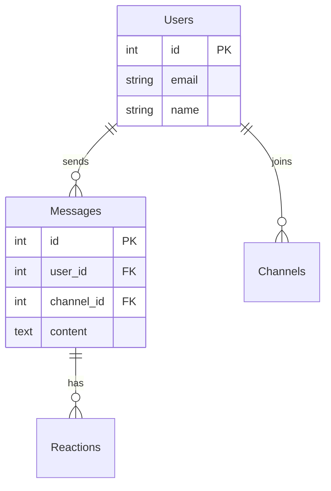
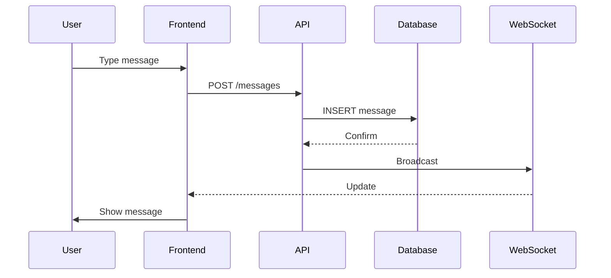
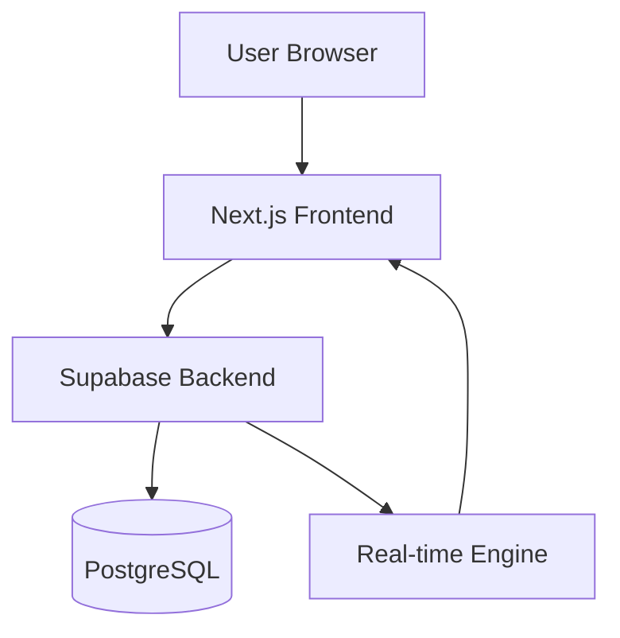

# Using Documentation Agents - Simple Guide

## Two Powerful Documentation Agents

You have access to two specialized documentation agents that can transform your EventOS codebase into professional documentation.

---

## Agent 1: mermaid-expert

**What it does:** Creates visual diagrams (flowcharts, ERDs, sequence diagrams, architecture diagrams)

**When to use:**
- Need to visualize database schemas
- Want to show API flows
- Explaining system architecture
- Documenting user journeys
- Creating process flowcharts

### Quick Examples

#### Example 1: Database Schema
```
"Use mermaid-expert to create an ERD for the EventOS chat system showing:
- messages table
- users table
- channels table
- reactions table"
```

**You get:**


#### Example 2: API Flow
```
"Use mermaid-expert to create a sequence diagram for the chat message flow:
1. User sends message
2. Frontend validates
3. API receives request
4. Database stores message
5. WebSocket broadcasts
6. UI updates"
```

**You get:**


#### Example 3: System Architecture
```
"Use mermaid-expert to diagram the EventOS architecture:
- Next.js frontend
- Supabase backend
- PostgreSQL database
- Real-time subscriptions"
```

**You get:**


### Diagram Types Available

| Type | Use For | Command Hint |
|------|---------|--------------|
| **ERD** | Database schemas | `erDiagram` |
| **Sequence** | API flows, interactions | `sequenceDiagram` |
| **Flowchart** | Process flows, logic | `graph TB` or `flowchart` |
| **Class** | Object relationships | `classDiagram` |
| **State** | State machines, workflows | `stateDiagram-v2` |
| **Gantt** | Project timelines | `gantt` |
| **Journey** | User flows | `journey` |

---

## Agent 2: docs-architect

**What it does:** Creates comprehensive technical documentation (10-100+ pages) from your codebase

**When to use:**
- Onboarding new developers
- Creating system documentation
- Architecture documentation
- API documentation
- Technical specifications
- Explaining design decisions

### What You Get

The docs-architect creates **professional-grade documentation** including:

1. **Executive Summary** - High-level overview
2. **Architecture Overview** - System design and components
3. **Design Decisions** - Why things are built this way
4. **Core Components** - Deep dive into each part
5. **Data Models** - Database design and schemas
6. **Integration Points** - APIs and external services
7. **Deployment** - How to deploy and run
8. **Performance** - Optimization and benchmarks
9. **Security** - Auth, permissions, data protection
10. **Troubleshooting** - Common issues and fixes

### Quick Examples

#### Example 1: Document Chat System
```
"Use docs-architect to create comprehensive documentation for the EventOS chat system.

Analyze:
- src/components/ChatWizard.tsx
- src/lib/chat/
- Database schema for messages, channels, users
- Real-time subscription logic

Create documentation covering:
- Architecture overview
- Component structure
- Database design
- Real-time flow
- API integration
- Common issues"
```

**You get:** 20-30 page technical document with:
- System architecture diagrams (described)
- Component breakdown
- Data flow explanations
- Code examples with explanations
- Design decision rationale
- Troubleshooting guide

#### Example 2: Document CRM Module
```
"Use docs-architect to document the EventOS CRM system.

Include:
- Contact management architecture
- Database schema design
- API endpoints
- Frontend components
- State management
- Search and filtering logic"
```

**You get:** Complete technical reference for the CRM including:
- Architecture decisions
- Implementation details
- API documentation
- Database design rationale
- Performance considerations

#### Example 3: Authentication Documentation
```
"Use docs-architect to create authentication documentation.

Cover:
- Supabase auth integration
- Session management
- Protected routes
- User permissions
- Security model"
```

**You get:** Security-focused documentation with:
- Auth flow diagrams
- Security model explanation
- Implementation guide
- Best practices
- Common pitfalls

---

## Real EventOS Use Cases

### Use Case 1: Onboarding Documentation

**Goal:** Help new developers understand EventOS architecture

**Steps:**
```
1. "Use mermaid-expert to create system architecture diagram for EventOS"
   ’ Visual overview

2. "Use docs-architect to document the overall EventOS architecture
   analyzing src/, database schema, and deployment setup"
   ’ Comprehensive onboarding doc
```

**Result:** New developers get visual diagram + detailed documentation

---

### Use Case 2: Feature Documentation

**Goal:** Document the Chat Wizard feature

**Steps:**
```
1. "Use mermaid-expert to create a flowchart of the chat wizard user flow"
   ’ Visual user journey

2. "Use mermaid-expert to create ERD for chat-related tables"
   ’ Database visualization

3. "Use docs-architect to create technical documentation for the Chat Wizard
   covering components, logic, database, and real-time features"
   ’ Complete technical spec
```

**Result:** Visual flows + database diagram + detailed technical documentation

---

### Use Case 3: API Documentation

**Goal:** Document all EventOS APIs

**Steps:**
```
1. "Use mermaid-expert to create sequence diagrams for key API flows:
   - User registration
   - Contact creation
   - Message sending"
   ’ API interaction diagrams

2. "Use docs-architect to document the EventOS API layer
   including endpoints, request/response formats, error handling"
   ’ API reference documentation
```

**Result:** Visual API flows + comprehensive API documentation

---

## Workflow Patterns

### Pattern 1: Visual First
```
Step 1: Use mermaid-expert to create diagrams
Step 2: Use docs-architect to create detailed documentation
Step 3: Embed diagrams in documentation
```

**Best for:** Complex systems that benefit from visual explanation

### Pattern 2: Documentation First
```
Step 1: Use docs-architect to analyze and document system
Step 2: Use mermaid-expert to create diagrams for key sections
Step 3: Add diagrams to enhance documentation
```

**Best for:** New features or modules that need comprehensive docs

### Pattern 3: Component-by-Component
```
For each component:
1. Use mermaid-expert for component diagram
2. Use docs-architect for component documentation
3. Combine into component reference
```

**Best for:** Large systems broken into modules

---

## Pro Tips

### For mermaid-expert

**Be Specific:**
```
L "Create a diagram for the database"
 "Create an ERD showing users, messages, channels, and reactions tables with their relationships"
```

**Specify Diagram Type:**
```
 "Create a sequence diagram for..."
 "Create a flowchart showing..."
 "Create an ERD for..."
```

**Include Details:**
```
 "Show primary keys, foreign keys, and key fields"
 "Include error handling paths in the flowchart"
 "Show all API calls in the sequence"
```

### For docs-architect

**Point to Code:**
```
 "Analyze src/components/ChatWizard.tsx and src/lib/chat/"
 "Document based on the database schema and API routes"
```

**Specify Audience:**
```
 "Create documentation for new developers joining the team"
 "Create technical specification for architects"
 "Create operations guide for deployment team"
```

**Define Scope:**
```
 "Focus on the authentication system"
 "Cover the entire chat module"
 "Document only the API layer"
```

---

## Integration with Task Master

### Document as You Build

```bash
# Get task
task-master next
# ’ Task 2.1: Implement contact management

# Build the feature
# ... implement code ...

# Document it
"Use mermaid-expert to create ERD for contact tables"
"Use docs-architect to document the contact management system"

# Update task
task-master update-subtask --id=2.1 --prompt="
Feature complete and documented:
- Created ERD with mermaid-expert
- Generated comprehensive docs with docs-architect
- Docs saved to docs/features/contact-management.md
"

# Complete
task-master set-status --id=2.1 --status=done
```

---

## Output Management

### Where to Save Documentation

Create organized documentation structure:

```
docs/
 architecture/
    system-overview.md       (docs-architect output)
    diagrams/                (mermaid-expert outputs)
       system-architecture.mmd
       database-erd.mmd
    design-decisions.md
 features/
    chat/
       overview.md          (docs-architect)
       flows.mmd            (mermaid-expert)
       database.mmd         (mermaid-expert)
    crm/
        overview.md
        api-flows.mmd
 api/
     reference.md             (docs-architect)
     sequences.mmd            (mermaid-expert)
```

### Mermaid Rendering

Mermaid diagrams can be viewed in:
- **GitHub** - Renders automatically in .md files
- **VS Code** - Install Mermaid preview extension
- **Mermaid Live Editor** - https://mermaid.live
- **Documentation sites** - GitBook, Docusaurus, etc.

---

## Quick Command Reference

### mermaid-expert Commands

```bash
# Database diagrams
"Use mermaid-expert to create ERD for [tables]"

# API flows
"Use mermaid-expert to create sequence diagram for [flow]"

# System architecture
"Use mermaid-expert to create architecture diagram for [system]"

# Process flows
"Use mermaid-expert to create flowchart for [process]"

# User journeys
"Use mermaid-expert to create user journey for [feature]"
```

### docs-architect Commands

```bash
# Feature documentation
"Use docs-architect to document [feature] analyzing [code paths]"

# System documentation
"Use docs-architect to create architecture documentation for EventOS"

# API documentation
"Use docs-architect to document the API layer including [endpoints]"

# Component documentation
"Use docs-architect to create technical reference for [component]"

# Onboarding docs
"Use docs-architect to create onboarding guide covering [topics]"
```

---

## Real Examples to Try Now

### Example 1: Document Current Chat System
```
"Use mermaid-expert to create:
1. ERD for chat tables (messages, users, channels)
2. Sequence diagram for sending a message
3. Flowchart for the chat wizard flow"

Then:

"Use docs-architect to create comprehensive chat system documentation
analyzing src/components/ChatWizard.tsx and related files"
```

### Example 2: CRM Architecture
```
"Use mermaid-expert to create system architecture diagram showing:
- Frontend (Next.js)
- Backend (Supabase)
- Database (PostgreSQL)
- Real-time subscriptions"

Then:

"Use docs-architect to document the CRM module architecture
and implementation details"
```

### Example 3: Authentication Flow
```
"Use mermaid-expert to create sequence diagram for:
1. User login flow
2. Session validation
3. Protected route access"

Then:

"Use docs-architect to document the authentication system
including security model and implementation"
```

---

## Expected Output Quality

### mermaid-expert Output
-  Syntactically correct Mermaid code
-  Renders without errors
-  Clear, readable diagrams
-  Proper relationships and flows
-  Appropriate detail level

### docs-architect Output
-  10-100+ pages of comprehensive documentation
-  Executive summary + detailed technical content
-  Code examples with explanations
-  Design decision rationale
-  Architecture diagrams (described)
-  Troubleshooting guides
-  Multiple audience perspectives

---

## Summary

### mermaid-expert
- **Purpose:** Visual diagrams
- **Input:** System/feature description
- **Output:** Mermaid diagram code
- **Use for:** ERDs, flowcharts, sequences, architecture diagrams

### docs-architect
- **Purpose:** Comprehensive technical documentation
- **Input:** Codebase paths, system description
- **Output:** 10-100+ page technical documentation
- **Use for:** Onboarding, architecture docs, API docs, technical specs

### When to Use Both
1. **mermaid-expert** for visual diagrams
2. **docs-architect** for detailed explanations
3. Combine for complete documentation package

---

## Next Steps

1. **Try mermaid-expert:**
   ```
   "Use mermaid-expert to create ERD for EventOS core tables"
   ```

2. **Try docs-architect:**
   ```
   "Use docs-architect to document the chat wizard feature"
   ```

3. **Combine them:**
   - Create diagrams first
   - Then create comprehensive docs
   - Include diagrams in documentation

Both agents are production-ready and create professional-quality output.
