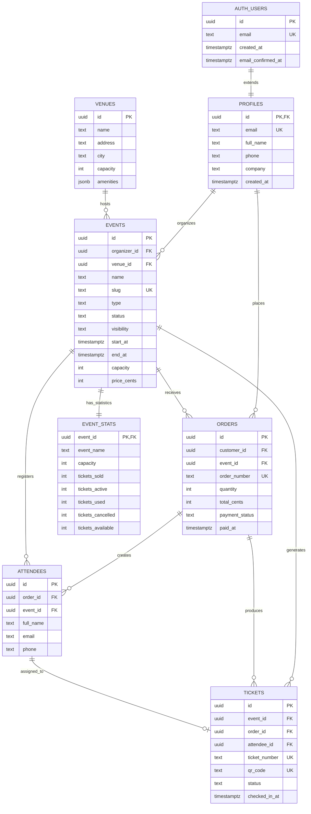

# EventOS Database Entity-Relationship Diagram

**Version:** 1.0
**Last Updated:** October 13, 2025
**Database:** PostgreSQL 15+ via Supabase
**Migration:** `20251013060000_core_eventos_schema_production.sql`

---

## =Ê Mermaid ERD



---

## = Relationship Explanations

### 1. AUTH_USERS ||--|| PROFILES : extends
- **Cardinality:** One-to-One (1:1)
- **Implementation:** `profiles.id` references `auth.users.id`
- **Purpose:** Extends Supabase Auth with custom profile data
- **Delete Behavior:** CASCADE (profile deleted when auth user deleted)
- **Example:** User `organizer@eventos.com` has exactly one profile with name "Sarah Johnson"

### 2. PROFILES ||--o{ EVENTS : organizes
- **Cardinality:** One-to-Many (1:N)
- **Implementation:** `events.organizer_id` references `profiles.id`
- **Purpose:** Tracks which user created/owns each event
- **Delete Behavior:** RESTRICT (cannot delete profile with events)
- **Example:** Organizer Sarah Johnson creates multiple events: "AI Summit 2025", "Leadership Seminar"

### 3. VENUES ||--o{ EVENTS : hosts
- **Cardinality:** One-to-Zero-or-Many (1:0..N)
- **Implementation:** `events.venue_id` references `venues.id` (nullable)
- **Purpose:** Links events to physical locations
- **Delete Behavior:** RESTRICT (cannot delete venue with scheduled events)
- **Example:** Metro Toronto Convention Centre hosts both "AI Summit" and future conferences

### 4. PROFILES ||--o{ ORDERS : places
- **Cardinality:** One-to-Many (1:N)
- **Implementation:** `orders.customer_id` references `profiles.id`
- **Purpose:** Tracks purchase history per customer
- **Delete Behavior:** RESTRICT (cannot delete profile with orders)
- **Example:** Customer Michael Chen places orders for "AI Summit" tickets and "Product Design Workshop"

### 5. EVENTS ||--o{ ORDERS : receives
- **Cardinality:** One-to-Many (1:N)
- **Implementation:** `orders.event_id` references `events.id`
- **Purpose:** Tracks all orders/sales for each event
- **Delete Behavior:** RESTRICT (cannot delete event with orders)
- **Example:** "AI Summit 2025" receives orders from multiple customers totaling 500 tickets

### 6. ORDERS ||--o{ ATTENDEES : creates
- **Cardinality:** One-to-Many (1:N)
- **Implementation:** `attendees.order_id` references `orders.id`
- **Purpose:** Links attendee information to purchase transaction
- **Delete Behavior:** CASCADE (attendees deleted when order cancelled)
- **Example:** Order #ORD-20251013-01111111 creates 2 attendees: Michael Chen and Emily Rodriguez

### 7. EVENTS ||--o{ ATTENDEES : registers
- **Cardinality:** One-to-Many (1:N)
- **Implementation:** `attendees.event_id` references `events.id`
- **Purpose:** Tracks attendance roster for each event
- **Delete Behavior:** RESTRICT (cannot delete event with registered attendees)
- **Example:** "AI Summit 2025" has 500 registered attendees from various orders

### 8. EVENTS ||--o{ TICKETS : generates
- **Cardinality:** One-to-Many (1:N)
- **Implementation:** `tickets.event_id` references `events.id`
- **Purpose:** Associates tickets with specific events
- **Delete Behavior:** RESTRICT (cannot delete event with issued tickets)
- **Example:** "AI Summit" generates 500 unique QR-coded tickets

### 9. ORDERS ||--o{ TICKETS : produces
- **Cardinality:** One-to-Many (1:N)
- **Implementation:** `tickets.order_id` references `orders.id`
- **Purpose:** Links tickets to purchase transaction (quantity control)
- **Delete Behavior:** CASCADE (tickets cancelled when order refunded)
- **Example:** Order for 2 tickets produces ticket #TKT-B1111111-251013 and #TKT-B2222222-251013

### 10. ATTENDEES ||--o| TICKETS : assigned_to
- **Cardinality:** One-to-Zero-or-One (1:0..1)
- **Implementation:** `tickets.attendee_id` references `attendees.id` (nullable)
- **Purpose:** Assigns specific ticket to specific attendee (transferable tickets remain unassigned)
- **Delete Behavior:** SET NULL (ticket becomes unassigned if attendee record deleted)
- **Example:** Ticket #TKT-B1111111 assigned to attendee "Michael Chen", but can be reassigned later

### 11. EVENTS ||--|| EVENT_STATS : has_statistics
- **Cardinality:** One-to-One (1:1)
- **Implementation:** Computed view joins events with aggregated ticket counts
- **Purpose:** Provides real-time analytics without denormalization
- **Delete Behavior:** N/A (view auto-updates based on underlying data)
- **Example:** "AI Summit" statistics show: 500 capacity, 450 sold, 425 active, 25 used, 0 cancelled, 50 available

---

## <¯ Design Rationale

### Why Attendees are Separate from Profiles
- **Reason:** Allows non-users to attend events (purchased by someone else)
- **Benefit:** Customers can buy tickets for family/colleagues without requiring them to create accounts
- **Implementation:** `attendees.email` doesn't require matching `profiles.email`

### Why venue_id is Nullable
- **Reason:** Events in "draft" status may not have venue confirmed yet
- **Benefit:** Organizers can create event placeholders before booking venues
- **Implementation:** `events.venue_id` allows NULL, validated by application logic

### Why attendee_id is Nullable
- **Reason:** Tickets can be transferable/unassigned until check-in
- **Benefit:** Supports ticket resale, gifting, and name changes
- **Implementation:** `tickets.attendee_id` NULL until explicitly assigned

### Why EVENT_STATS is a View Not a Table
- **Reason:** Avoids denormalization risks with RLS-protected tables
- **Benefit:** Always accurate, no sync issues, RLS-safe queries
- **Trade-off:** Slightly slower than cached columns, but negligible for ticket volumes <10K
- **Implementation:** Real-time calculation via SQL aggregation

### Delete Behavior Strategy
- **RESTRICT:** Used for core business entities (profiles with orders, events with tickets)
- **CASCADE:** Used for dependent data (attendees when order cancelled)
- **SET NULL:** Used for flexible references (tickets when attendee reassigned)

### Check Constraints for Data Validation
- **orders:** `total_cents = quantity * unit_price_cents` (prevents pricing errors)
- **events:** `end_at > start_at` (prevents invalid date ranges)
- **tickets:** `status IN ('active', 'used', 'cancelled', 'refunded')` (enforces valid states)

---

## =Ë Entity Categories

### Identity & Authentication
- **AUTH_USERS** - Supabase Auth managed users
- **PROFILES** - Extended user profile information

### Event Setup
- **VENUES** - Physical event locations
- **EVENTS** - Corporate events (conferences, seminars, workshops, networking)

### Commerce
- **ORDERS** - Purchase transactions with Stripe integration
- **ATTENDEES** - Event attendee information (may differ from purchaser)
- **TICKETS** - Individual tickets with QR codes for check-in

### Analytics
- **EVENT_STATS** - Real-time computed statistics (view, not table)

---

## = Key Design Patterns

### Auto-Generation Triggers
- **Event Slugs:** `ai-ml-summit-2025-e1111111` (name + UUID suffix)
- **Order Numbers:** `ORD-20251013-01111111` (date + UUID prefix)
- **Ticket Numbers:** `TKT-B1111111-251013` (UUID prefix + date suffix)
- **QR Codes:** Base64-encoded UUID with event/ticket metadata

### Timestamp Audit Trail
- All tables have `created_at` and `updated_at` columns
- Auto-updated via `update_updated_at_column()` trigger
- Timezone-aware: `timestamptz` (stores UTC, displays local)

### Row Level Security (RLS)
- **28 granular policies** across 6 tables
- **Public read** for published events and venues
- **Customer access** to own orders, attendees, tickets
- **Organizer access** to own events and related data
- **Admin access** via service role (bypasses RLS)

---

## =Ê Data Flow Example

**Complete Purchase Journey:**

1. **Customer browses public events**
   ```sql
   -- Anonymous user queries EVENT_STATS view
   SELECT * FROM event_stats WHERE status = 'published' AND visibility = 'public'
   ```

2. **Customer signs up**
   ```sql
   -- Supabase Auth creates auth.users record
   -- Trigger automatically creates matching profiles record
   ```

3. **Customer places order**
   ```sql
   INSERT INTO orders (customer_id, event_id, quantity, total_cents)
   -- Trigger generates order_number: ORD-20251013-01111111
   ```

4. **System creates attendee records**
   ```sql
   INSERT INTO attendees (order_id, event_id, full_name, email)
   -- Can be customer + guests
   ```

5. **System generates tickets**
   ```sql
   INSERT INTO tickets (event_id, order_id, attendee_id)
   -- Triggers generate ticket_number and qr_code
   -- One ticket per quantity in order
   ```

6. **Customer views tickets**
   ```sql
   -- RLS ensures customer only sees own tickets
   SELECT * FROM tickets WHERE order_id IN (
     SELECT id FROM orders WHERE customer_id = auth.uid()
   )
   ```

7. **Event day check-in**
   ```sql
   -- Scan QR code, mark ticket as used
   UPDATE tickets SET status = 'used', checked_in_at = now()
   WHERE qr_code = '[scanned_code]'
   ```

8. **Organizer views event statistics**
   ```sql
   -- Real-time stats via computed view
   SELECT * FROM event_stats WHERE event_id = '[event_id]'
   ```

---

## ¡ Performance Optimizations

### Strategic Indexes
- **Primary Keys:** All tables use UUID with `gen_random_uuid()` default
- **Foreign Keys:** Auto-indexed for join performance
- **Unique Constraints:** `slug`, `order_number`, `ticket_number`, `qr_code`, `email`
- **Composite Indexes:** None required yet (low volume <100K records)

### Query Optimization
- **Auth Caching:** `(select auth.uid())` pattern caches per statement, not per row
- **View Efficiency:** EVENT_STATS uses aggregation without nested subqueries
- **Join Elimination:** Denormalized `event_name` in EVENT_STATS avoids extra join

### RLS Performance
- Separate policies for `anon` and `authenticated` roles (no OR conditions)
- Simple equality checks: `organizer_id = (select auth.uid())`
- Indexes on foreign keys support RLS filtering

---

## =È Database Statistics

- **Total Tables:** 6 (profiles, venues, events, orders, attendees, tickets)
- **Total Views:** 1 (event_stats - computed analytics)
- **Total RLS Policies:** 28 (granular by role and operation)
- **Total Triggers:** 8 (slug/number generation, timestamp updates)
- **Total Functions:** 6 (trigger handlers + utilities)
- **Total Extensions:** 2 (pgcrypto for UUIDs, unaccent for search)

---

## = Related Documentation

- **Data Plan:** `/docs/supabase/07-data-plan.md` (detailed table specifications)
- **Migration:** `/supabase/migrations/20251013060000_core_eventos_schema_production.sql`
- **Seed Data:** `/supabase/seed/seed.sql` (test data for development)
- **TypeScript Types:** `/src/types/supabase.ts` (auto-generated from schema)
- **Migration Completion:** `/supabase/docs/MIGRATION_COMPLETE.md` (production readiness checklist)

---

## <‰ Production Ready

**Status:**  COMPLETE
**Migration Applied:** October 13, 2025
**Verification:** All relationships tested, RLS policies verified, triggers functional
**Next Steps:** Frontend integration with Supabase client library
