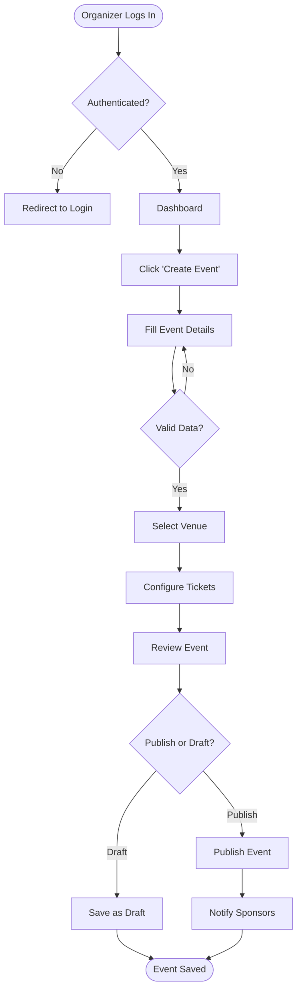
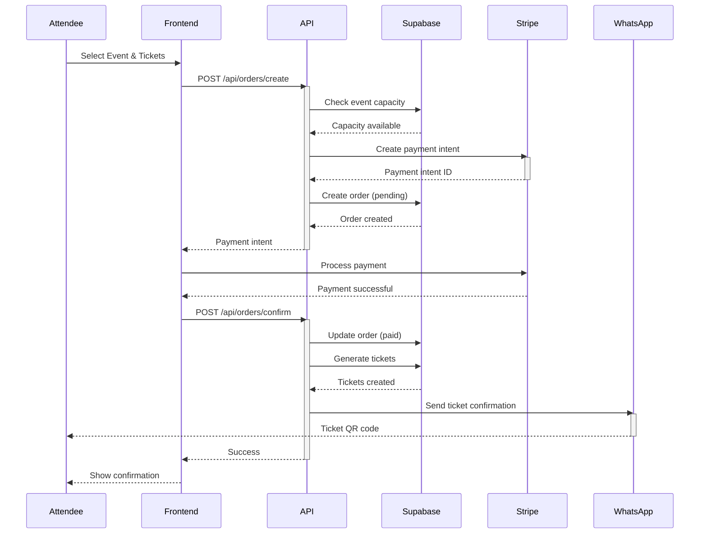
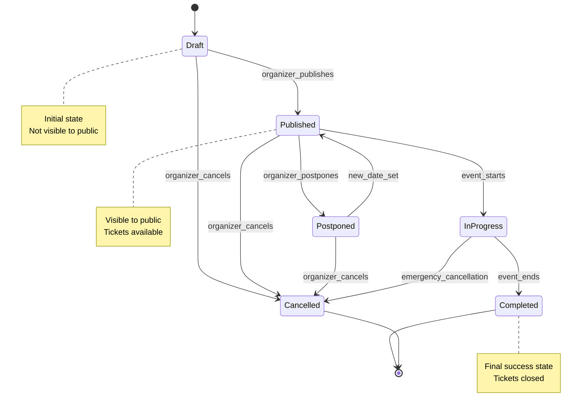
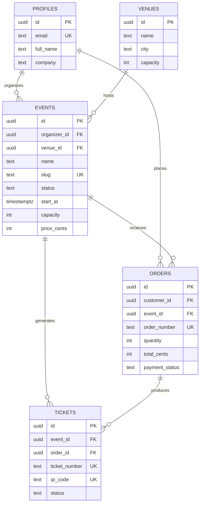
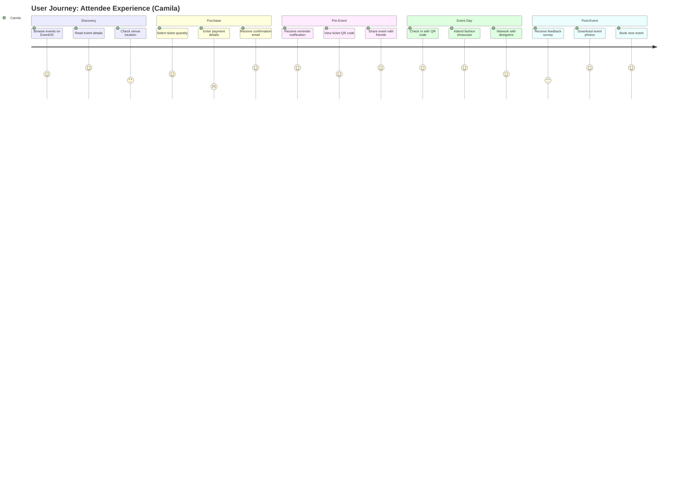
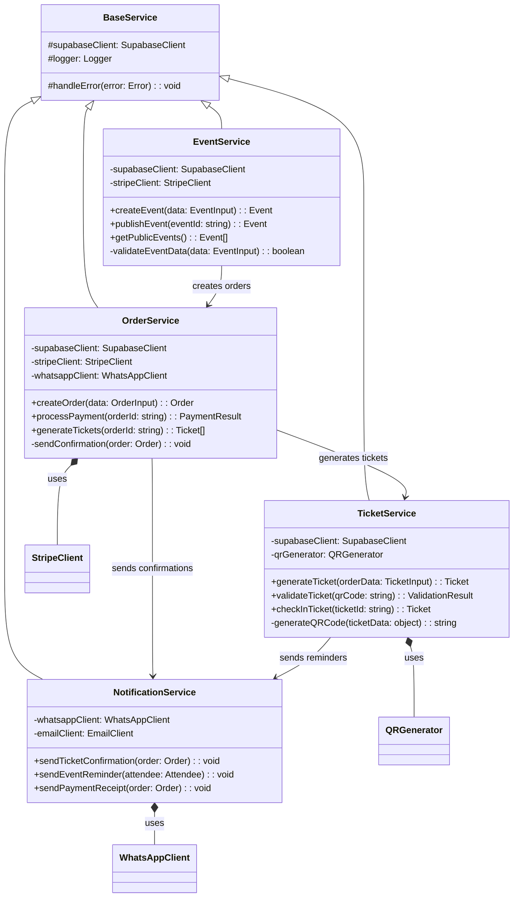

# 🧩 Mermaid Diagram Prompt Suite

**Version:** 1.0
**Last Updated:** October 13, 2025
**Purpose:** Professional Mermaid diagram creation guide for EventOS documentation
**Author:** EventOS Development Team

---

## 📖 Overview

This guide provides **ready-to-use prompts** for creating professional Mermaid diagrams across six common use cases. Each section includes purpose, guidelines, and practical examples tailored for EventOS system documentation.

### When to Use Each Diagram Type

| Diagram Type | Use Case | Example |
|--------------|----------|---------|
| **Flowchart** | Process flows, workflows | Event creation wizard, ticket purchase flow |
| **Sequence** | System interactions, API calls | User ↔ API ↔ Supabase ↔ Stripe |
| **State** | Lifecycle, status transitions | Event: Draft → Published → Completed |
| **ER Diagram** | Database schema, data models | Events, Tickets, Orders relationships |
| **User Journey** | UX flows, user experiences | Attendee registration to event attendance |
| **Class Diagram** | Object models, code structure | API models, backend architecture |

---

## 1️⃣ Flowchart — System or Process Overview

### 🎯 Purpose

Show how a process flows — e.g., event creation, ticket purchase, or API request handling.

### ✅ Prompt Template

```markdown
**Create a Mermaid flowchart** that clearly shows how this process works.

**Guidelines:**

* Start with `graph TD` (top-down) or `graph LR` (left-to-right).
* Use short, descriptive labels in boxes.
* Use diamonds for decisions (`{ }`) and arrows (`-->`, `-.->`) for flow.
* Group related steps with `subgraph` for clarity.
* Avoid naming nodes `end` (it breaks rendering).
* Keep it under 15 nodes for readability.
* Add a short title comment (e.g., `%% Flowchart: Event Creation Wizard`).

**Input:**
[Paste the workflow or process description here]

**Output:**
Valid Mermaid syntax + a short summary of key decisions.
```

### 💡 EventOS Example

**Scenario:** Show how a fashion event is created in the EventOS platform.



**Summary:** Three key decision points: Authentication check, data validation, and publish vs draft selection.

---

## 2️⃣ Sequence Diagram — Interactions Between Systems or Users

### 🎯 Purpose

Visualize how components or users interact — e.g., organizer ↔ API ↔ Supabase ↔ Stripe.

### ✅ Prompt Template

```markdown
**Create a Mermaid sequence diagram** that illustrates the interactions between systems or people.

**Guidelines:**

* Define participants first (e.g., `participant User`, `participant API`).
* Use arrows (`->>`, `-->>`) for messages or requests.
* Add short notes with `note over` or `note right`.
* Show activation if relevant (`activate A` / `deactivate A`).
* Keep order chronological — don't over-branch.
* Add a title comment (e.g., `%% Sequence: Ticket Purchase Flow`).

**Input:**
[Paste the interaction or API flow]

**Output:**
Mermaid code + 2-3 line summary of the interaction.
```

### 💡 EventOS Example

**Scenario:** Show how an attendee purchases a ticket through the EventOS platform.



**Summary:** Payment flow involves 5 systems: Frontend collects data → API orchestrates → Supabase stores data → Stripe processes payment → WhatsApp sends confirmation. Critical path: Capacity check before payment, ticket generation after payment confirmation.

---

## 3️⃣ State Diagram — Lifecycle or Status Transitions

### 🎯 Purpose

Model how something changes state — e.g., Event → Draft → Published → Completed.

### ✅ Prompt Template

```markdown
**Create a Mermaid state diagram** showing the lifecycle of an object or process.

**Guidelines:**

* Start with `stateDiagram-v2`.
* Define each state clearly (`Draft`, `Published`, etc.).
* Use transitions like `A --> B : action`.
* Include optional entry/exit actions.
* Avoid loops unless meaningful.
* Title it clearly (e.g., `%% State Diagram: Event Lifecycle`).

**Input:**
[Paste your states and transitions]

**Output:**
Mermaid code + short explanation of main transitions.
```

### 💡 EventOS Example

**Scenario:** Model the complete lifecycle of an event in the EventOS platform.



**Summary:** Events begin in `Draft` state (private), transition to `Published` (public), become `InProgress` during the event, and end in `Completed` (final state). Two exit paths: Normal completion or cancellation. Postponed events can return to Published with a new date.

---

## 4️⃣ ER Diagram — Data Model & Relationships

### 🎯 Purpose

Show how database tables or entities relate — e.g., Events, Tickets, Sponsors.

### ✅ Prompt Template

```markdown
**Create a Mermaid ER diagram** (`erDiagram`) for the system's data model.

**Guidelines:**

* Use `Entity { field type }` format.
* Show relationships (e.g., `Events ||--o{ Tickets : has`).
* Keep only key fields per table.
* Label relations clearly (e.g., `Users ||--o{ Orders : places`).
* Add a clear title (e.g., `%% ERD: Event Management Schema`).

**Input:**
[Paste entity definitions or relationships]

**Output:**
Mermaid ER diagram + one-sentence description per main entity.
```

### 💡 EventOS Example

**Scenario:** Core EventOS database schema (simplified version).



**Entity Descriptions:**
- **PROFILES:** User accounts with contact information
- **EVENTS:** Corporate events organized by profiles at venues
- **VENUES:** Physical locations hosting events
- **ORDERS:** Purchase transactions for event tickets
- **TICKETS:** Individual QR-coded tickets linked to orders

---

## 5️⃣ User Journey — Experience Flow

### 🎯 Purpose

Map the steps a user takes — e.g., discovering, registering, and attending an event.

### ✅ Prompt Template

```markdown
**Create a Mermaid userJourney** diagram for the scenario below.

**Guidelines:**

* Start with `journey`.
* Break it into stages (Discovery, Purchase, Attendance, etc.).
* Keep 3–6 steps per stage.
* Use satisfaction scores (1=frustrated, 5=delighted).
* Keep labels short.
* Add a title (e.g., `%% User Journey: Attendee Experience`).

**Input:**
[Paste your user story or persona journey]

**Output:**
Mermaid diagram + quick insight into friction points or success steps.
```

### 💡 EventOS Example

**Scenario:** "Camila" discovers, purchases, and attends a fashion event.



**Insights:**
- **Friction Point:** Payment entry (score: 2) — consider adding saved payment methods
- **Delight Moments:** Confirmation email, reminders, QR check-in, photo downloads (score: 5)
- **Improvement Opportunity:** Venue location info (score: 3) — add map integration

---

## 6️⃣ Class Diagram — Object or Code Structure

### 🎯 Purpose

Show how classes, modules, or components are structured — great for backend or API models.

### ✅ Prompt Template

```markdown
**Create a Mermaid classDiagram** that represents the object model.

**Guidelines:**

* Use `classDiagram`.
* Define each class with key attributes/methods:
  `ClassName { +attribute: Type +method(): Return }`
* Use `+` for public, `-` for private, `#` for protected.
* Show relationships:
  * `ClassA <|-- ClassB` (inheritance)
  * `ClassA o-- ClassB` (aggregation)
  * `ClassA *-- ClassB` (composition)
  * `ClassA --> ClassB` (association)
* Title the diagram (e.g., `%% Class Diagram: Event System`).

**Input:**
[Paste your class or API model details]

**Output:**
Mermaid diagram + summary of how main classes connect.
```

### 💡 EventOS Example

**Scenario:** EventOS API service layer architecture.



**Summary:**
- **Inheritance:** All services extend `BaseService` for shared Supabase client and error handling
- **Composition:** Services contain external clients (Stripe, WhatsApp, QRGenerator) as dependencies
- **Association:** EventService creates orders → OrderService generates tickets → TicketService handles check-ins
- **Encapsulation:** Private methods (prefixed with `-`) handle internal validation and business logic

---

## 🧠 Best Practices

### ✅ Choosing the Right Diagram

| Your Goal | Use This Diagram |
|-----------|------------------|
| Show **how a process works** | Flowchart |
| Show **who talks to whom** | Sequence |
| Show **status changes over time** | State |
| Show **database structure** | ER Diagram |
| Show **user experience** | User Journey |
| Show **code architecture** | Class Diagram |

### ✅ General Guidelines

1. **Keep it simple:** Aim for clarity over complexity (max 15-20 nodes per diagram)
2. **Test before committing:** Always verify in [Mermaid Live Editor](https://mermaid.live)
3. **Add context:** Include short explanations below each diagram
4. **Use consistent styling:** Follow EventOS naming conventions (PascalCase entities, snake_case fields)
5. **Version control:** Add version numbers and last updated dates to documentation
6. **Accessibility:** Provide text summaries for screen readers

### ✅ EventOS-Specific Standards

- **Entities:** PascalCase (e.g., `EventService`, `OrderInput`)
- **Database fields:** snake_case (e.g., `organizer_id`, `created_at`)
- **Methods:** camelCase (e.g., `createEvent`, `processPayment`)
- **Constants:** UPPER_SNAKE_CASE (e.g., `MAX_CAPACITY`, `DEFAULT_STATUS`)
- **File naming:** kebab-case (e.g., `event-lifecycle.md`, `ticket-flow.md`)

### ✅ Common Mistakes to Avoid

❌ **Don't** use `end` as a node name (breaks Mermaid parser)
✅ **Do** use descriptive names like `Complete`, `Finish`, `Done`

❌ **Don't** create circular flows without clear exit conditions
✅ **Do** ensure all loops have termination conditions

❌ **Don't** overcrowd diagrams (>20 nodes becomes unreadable)
✅ **Do** split complex flows into multiple focused diagrams

❌ **Don't** forget to add comments and titles
✅ **Do** include `%% Title: Description` at the top of each diagram

❌ **Don't** hardcode test data in diagrams
✅ **Do** use placeholder data that represents real scenarios

---

## 🚀 Quick Start Workflow

### For New Features

1. **Copy the relevant prompt template** from this document
2. **Paste your feature specification** into the input section
3. **Generate the diagram** using Claude or AI assistant
4. **Test in Mermaid Live Editor** to verify rendering
5. **Add explanatory text** below the diagram
6. **Commit to documentation** in appropriate docs folder

### For System Documentation

**Example:** Creating comprehensive event creation documentation

```markdown
1. Start with Flowchart (process overview)
2. Add Sequence diagram (API interactions)
3. Include State diagram (event lifecycle)
4. Reference ER diagram (data model)
5. Show User Journey (organizer experience)
6. Add Class diagram (service architecture)
```

### For Code Reviews

**Use Class diagrams** to explain:
- New service architecture
- API endpoint structure
- Database model changes
- Dependency relationships

---

## 📁 Documentation Structure

```
docs/
├── main/
│   ├── mermaid-diagram-suite.md (this file)
│   └── README.md
├── supabase/
│   ├── erd.md (database ER diagrams)
│   └── 07-data-plan.md
├── planning/
│   ├── event-creation-flow.md (flowcharts)
│   └── ticket-purchase-sequence.md (sequence diagrams)
└── architecture/
    ├── service-architecture.md (class diagrams)
    └── event-lifecycle.md (state diagrams)
```

---

## 🔗 Related Resources

### EventOS Documentation
- **Database ERD:** `/docs/supabase/erd.md` (complete database schema)
- **Data Plan:** `/docs/supabase/07-data-plan.md` (table specifications)
- **API Documentation:** `/docs/api/` (endpoint specifications)

### External Resources
- **Mermaid Live Editor:** https://mermaid.live (test diagrams)
- **Mermaid Documentation:** https://mermaid.js.org/intro/ (syntax reference)
- **Mermaid Cheat Sheet:** https://jojozhuang.github.io/tutorial/mermaid-cheat-sheet/ (quick reference)

---

## 📝 Changelog

### Version 1.0 (October 13, 2025)
- Initial release with 6 diagram types
- EventOS-specific examples for each type
- Best practices and guidelines
- Quick start workflow documentation

---

## 🤝 Contributing

To add new diagram types or improve examples:

1. Follow the existing template structure
2. Include practical EventOS examples
3. Test all Mermaid code in Live Editor
4. Add explanatory summaries
5. Update changelog with your changes

---

**Maintained by:** EventOS Development Team
**Last Review:** October 13, 2025
**Status:** ✅ Production Ready
