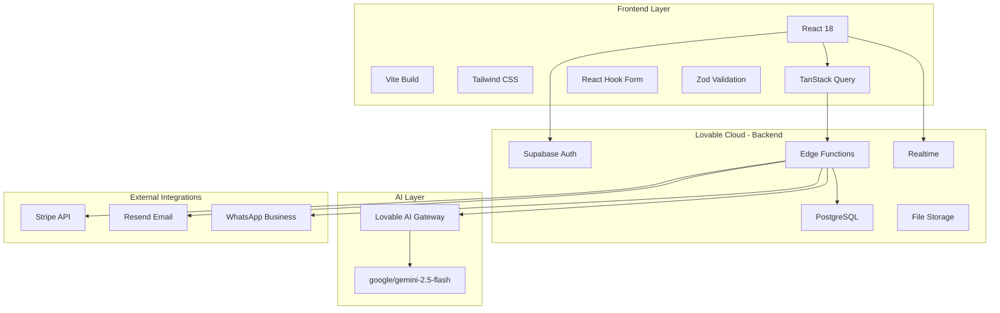

# 04 - Technology Stack

## 🏗️ Architecture Overview



## 🎨 Frontend Stack

### Core Framework
- **React 18.3.1**: UI framework with concurrent features
- **Vite**: Lightning-fast build tool and dev server
- **TypeScript**: Type safety across the application
- **React Router 6.30**: Client-side routing

### UI & Styling
- **Tailwind CSS**: Utility-first CSS framework
- **Shadcn/ui**: Headless component library
- **Radix UI**: Accessible component primitives
- **Lucide React**: Icon library

### State & Data
- **TanStack Query 5**: Server state management
- **React Hook Form 7**: Form handling
- **Zod 4**: Runtime validation
- **@hookform/resolvers**: Form validation integration

### Charts & Visualization
- **Recharts 2**: Declarative charts for dashboards

## ☁️ Lovable Cloud (Supabase)

### Authentication
```typescript
// Supabase Auth - NOT Clerk
// Implementation deferred to Phase 2-3
import { supabase } from '@/integrations/supabase/client';

// Email/Password signup (auto-confirm enabled)
await supabase.auth.signUp({
  email,
  password,
  options: {
    emailRedirectTo: `${window.location.origin}/`
  }
});
```

### Database
- **PostgreSQL 15**: Primary database
- **Row Level Security**: Fine-grained access control
- **JSONB**: Flexible schema for AI-generated data
- **Full-text Search**: Event and content search

### Edge Functions (Deno)
```typescript
// Auto-deployed serverless functions
// supabase/functions/chat-with-ai/index.ts
// supabase/functions/stripe-webhook/index.ts
// supabase/functions/send-event-email/index.ts
```

### Storage
- **Buckets**: `event-images`, `landing-pages`
- **RLS Policies**: User-scoped file access
- **Auto-optimization**: Image resizing and compression

### Realtime
- **WebSocket subscriptions**: Live dashboard updates
- **Presence**: Online attendee tracking
- **Broadcast**: Event notifications

## 🤖 AI Integration

### Lovable AI Gateway
- **URL**: `https://ai.gateway.lovable.dev/v1/chat/completions`
- **API Key**: Auto-provisioned as `LOVABLE_API_KEY` secret
- **Default Model**: `google/gemini-2.5-flash`
- **Free Tier**: Until Oct 13, 2025 (all Gemini models)

### Model Selection Guide

| Model | Use Case | Speed | Cost |
|-------|----------|-------|------|
| `google/gemini-2.5-flash` | **Default** - Event extraction, chat | Fast | Low |
| `google/gemini-2.5-flash-lite` | Simple classification, summaries | Fastest | Lowest |
| `google/gemini-2.5-pro` | Complex reasoning, large context | Slower | High |
| `openai/gpt-5-mini` | If Gemini fails, fallback option | Medium | Medium |

### Implementation Pattern
```typescript
// Edge Function call (streaming)
const response = await fetch('https://ai.gateway.lovable.dev/v1/chat/completions', {
  method: 'POST',
  headers: {
    'Authorization': `Bearer ${LOVABLE_API_KEY}`,
    'Content-Type': 'application/json'
  },
  body: JSON.stringify({
    model: 'google/gemini-2.5-flash',
    messages: conversationHistory,
    tools: eventExtractionTools,
    stream: true
  })
});
```

## 💳 External Integrations

### Stripe (Phase 3)
- **Checkout Sessions**: Ticket purchases
- **Webhooks**: Payment confirmation with signature verification
- **Idempotency**: Prevent duplicate charges

### Resend (Phase 3)
- **Transactional Emails**: Order confirmations, reminders
- **Templates**: React Email components
- **Batch Sending**: Bulk attendee communications

### WhatsApp Business API (Future)
- **Notifications**: Event reminders via WhatsApp
- **Rate Limiting**: 80 msg/sec (varies by tier)
- **Templates**: Pre-approved message formats

## 📦 Development Tools

### Code Quality
- **ESLint**: Linting with React + TypeScript rules
- **Prettier**: Code formatting (auto-configured)

### Testing (Phase 4)
- **Vitest**: Unit testing
- **Playwright**: E2E testing
- **Testing Library**: Component testing

### Deployment
- **Lovable Cloud**: Auto-deployment on push
- **Edge Functions**: Auto-deployed from `/supabase/functions`
- **Environment Variables**: Auto-configured in `.env`

## 🚫 What We're NOT Using

| Technology | Why Not | Alternative |
|------------|---------|-------------|
| **Clerk** | Lovable Cloud uses Supabase Auth | Supabase Auth |
| **Firebase** | Lovable Cloud is Supabase | Supabase |
| **Next.js** | Lovable uses React + Vite | Vite SPA |
| **OpenAI Direct** | Lovable AI Gateway handles this | Lovable AI |
| **Custom Backend** | Lovable Cloud provides full backend | Edge Functions |

## ⚙️ Environment Configuration

```bash
# Auto-configured by Lovable Cloud (DO NOT EDIT .env)
VITE_SUPABASE_URL=https://jnmfterqvevgusfckxbt.supabase.co
VITE_SUPABASE_PUBLISHABLE_KEY=eyJhbGci...
VITE_SUPABASE_PROJECT_ID=jnmfterqvevgusfckxbt

# Secrets (managed via Lovable tools)
LOVABLE_API_KEY=<auto-provisioned>
STRIPE_SECRET_KEY=<add in Phase 3>
RESEND_API_KEY=<add in Phase 3>
```

## 📊 Tech Stack Decision Matrix

| Requirement | Solution | Rationale |
|-------------|----------|-----------|
| Fast UI Development | React + Shadcn | Pre-built accessible components |
| Type Safety | TypeScript + Zod | Catch errors early |
| AI Chat | Lovable AI + Gemini Flash | Pre-configured, free tier, fast |
| Authentication | Supabase Auth | Integrated with Lovable Cloud |
| Database | PostgreSQL + RLS | Secure, relational, JSONB support |
| Payments | Stripe | Industry standard, PCI compliant |
| Email | Resend | Developer-friendly, React templates |
| Real-time Updates | Supabase Realtime | WebSocket built-in |
| File Storage | Supabase Storage | Integrated, RLS-enabled |
