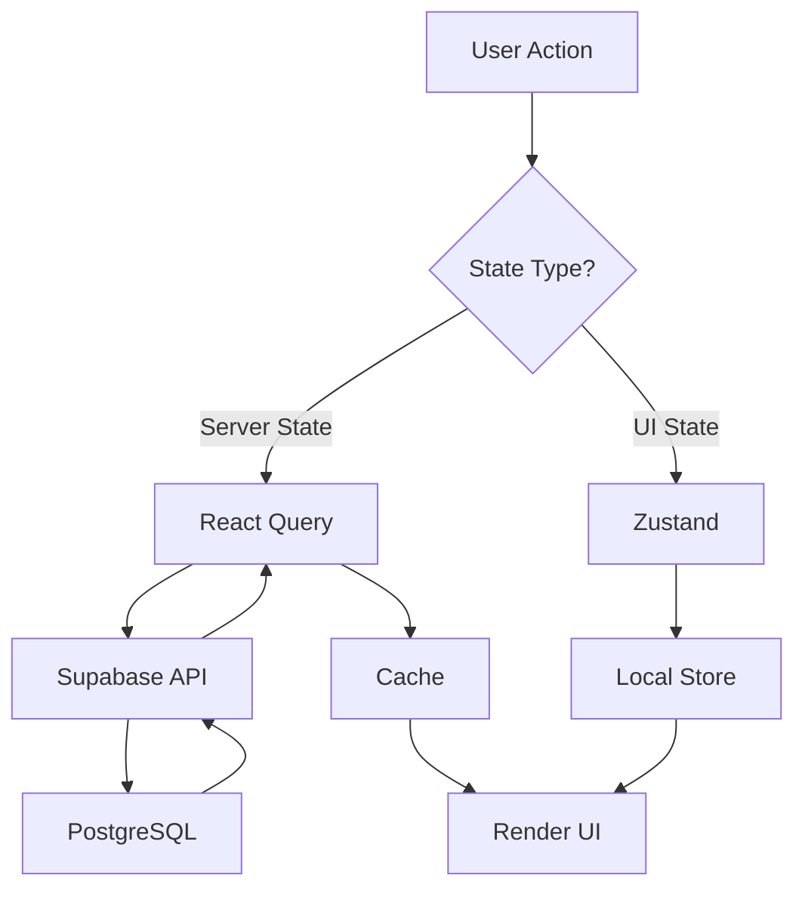

# 📊 Data and State Management Guide — EventOS

**Version:** 1.0
**Last Updated:** 2025-10-17
**Stack:** React Query + Zustand + Supabase

---

## 📋 Table of Contents

1. [Architecture Overview](#architecture-overview)
2. [React Query Setup](#react-query-setup)
3. [Data Fetching Patterns](#data-fetching-patterns)
4. [Mutations](#mutations)
5. [Real-time Subscriptions](#real-time-subscriptions)
6. [Client State with Zustand](#client-state-with-zustand)
7. [Error Handling](#error-handling)
8. [Loading States](#loading-states)
9. [Testing Strategy](#testing-strategy)
10. [Success Criteria](#success-criteria)

---

## 🏗️ Architecture Overview

### State Management Strategy



### Data Flow Layers

| Layer | Tool | Purpose | Example |
|-------|------|---------|---------|
| **Server State** | React Query | Cache, fetch, mutations | Events, orders, tickets |
| **Real-time** | Supabase Channels | Live updates | Order status changes |
| **UI State** | Zustand | Client-only state | Modal open, filters, cart |
| **Form State** | React Hook Form | Form validation | Event creation form |

---

## ⚙️ React Query Setup

### Query Client Configuration

**File:** `src/lib/queryClient.ts`

```typescript
import { QueryClient } from '@tanstack/react-query'

export const queryClient = new QueryClient({
  defaultOptions: {
    queries: {
      // Stale time: How long until data is considered stale
      staleTime: 60 * 1000, // 1 minute

      // GC time: How long to keep unused data in cache
      gcTime: 5 * 60 * 1000, // 5 minutes

      // Retry failed queries once
      retry: 1,

      // Refetch on window focus
      refetchOnWindowFocus: true,

      // Refetch on network reconnect
      refetchOnReconnect: true,

      // Don't refetch on mount if data is fresh
      refetchOnMount: false,
    },
    mutations: {
      // Don't retry failed mutations
      retry: 0,
    },
  },
})
```

### React Query DevTools

```typescript
// main.tsx
import { ReactQueryDevtools } from '@tanstack/react-query-devtools'

ReactDOM.createRoot(document.getElementById('root')!).render(
  <QueryClientProvider client={queryClient}>
    <App />
    {/* Only in development */}
    <ReactQueryDevtools initialIsOpen={false} position="bottom-right" />
  </QueryClientProvider>
)
```

---

## 📥 Data Fetching Patterns

### Basic Query

**File:** `src/features/events/hooks/useEvents.ts`

```typescript
import { useQuery } from '@tanstack/react-query'
import { supabase } from '@/lib/supabase'
import type { Database } from '@/types/database.types'

type Event = Database['public']['Tables']['events']['Row']

export function useEvents() {
  return useQuery({
    queryKey: ['events'],
    queryFn: async () => {
      const { data, error } = await supabase
        .from('events')
        .select('*')
        .eq('status', 'published')
        .order('start_at', { ascending: true })

      if (error) throw error
      return data as Event[]
    },
  })
}
```

**Usage:**

```typescript
// components/EventsList.tsx
import { useEvents } from '@/features/events/hooks/useEvents'

export function EventsList() {
  const { data: events, isLoading, error } = useEvents()

  if (isLoading) return <EventsSkeleton />
  if (error) return <ErrorMessage error={error} />

  return (
    <div className="grid gap-4 md:grid-cols-2 lg:grid-cols-3">
      {events?.map(event => (
        <EventCard key={event.id} event={event} />
      ))}
    </div>
  )
}
```

### Query with Parameters

```typescript
// hooks/useEventsByOrganizer.ts
import { useQuery } from '@tanstack/react-query'
import { supabase } from '@/lib/supabase'

export function useEventsByOrganizer(organizerId: string) {
  return useQuery({
    queryKey: ['events', 'organizer', organizerId],
    queryFn: async () => {
      const { data, error } = await supabase
        .from('events')
        .select('*, ticket_tiers(count)')
        .eq('organizer_id', organizerId)
        .order('created_at', { ascending: false })

      if (error) throw error
      return data
    },
    enabled: !!organizerId, // Only fetch if organizerId exists
    staleTime: 2 * 60 * 1000, // 2 minutes
  })
}
```

### Dependent Queries

```typescript
// hooks/useEventWithDetails.ts
import { useQuery } from '@tanstack/react-query'
import { supabase } from '@/lib/supabase'

export function useEvent(eventId: string) {
  return useQuery({
    queryKey: ['event', eventId],
    queryFn: async () => {
      const { data, error } = await supabase
        .from('events')
        .select('*')
        .eq('id', eventId)
        .single()

      if (error) throw error
      return data
    },
    enabled: !!eventId,
  })
}

export function useEventTicketTiers(eventId: string) {
  return useQuery({
    queryKey: ['ticketTiers', eventId],
    queryFn: async () => {
      const { data, error } = await supabase
        .from('ticket_tiers')
        .select('*')
        .eq('event_id', eventId)
        .eq('status', 'active')
        .order('price', { ascending: true })

      if (error) throw error
      return data
    },
    enabled: !!eventId,
  })
}

// Usage with dependent data
export function EventDetailsPage({ eventId }: { eventId: string }) {
  const { data: event } = useEvent(eventId)
  const { data: tiers } = useEventTicketTiers(eventId)

  // Both queries run in parallel if eventId exists
  return (
    <div>
      <h1>{event?.name}</h1>
      <TicketTiersList tiers={tiers} />
    </div>
  )
}
```

### Paginated Queries

```typescript
// hooks/useOrdersPaginated.ts
import { useInfiniteQuery } from '@tanstack/react-query'
import { supabase } from '@/lib/supabase'

const PAGE_SIZE = 20

export function useOrdersPaginated(eventId: string) {
  return useInfiniteQuery({
    queryKey: ['orders', 'paginated', eventId],
    queryFn: async ({ pageParam = 0 }) => {
      const from = pageParam * PAGE_SIZE
      const to = from + PAGE_SIZE - 1

      const { data, error, count } = await supabase
        .from('orders')
        .select('*, attendees(count)', { count: 'exact' })
        .eq('event_id', eventId)
        .order('created_at', { ascending: false })
        .range(from, to)

      if (error) throw error

      return {
        orders: data,
        nextPage: data.length === PAGE_SIZE ? pageParam + 1 : undefined,
        totalCount: count,
      }
    },
    getNextPageParam: (lastPage) => lastPage.nextPage,
    initialPageParam: 0,
  })
}
```

**Usage:**

```typescript
export function OrdersList({ eventId }: { eventId: string }) {
  const {
    data,
    fetchNextPage,
    hasNextPage,
    isFetchingNextPage,
  } = useOrdersPaginated(eventId)

  return (
    <div>
      {data?.pages.map((page) => (
        page.orders.map((order) => <OrderCard key={order.id} order={order} />)
      ))}

      {hasNextPage && (
        <Button onClick={() => fetchNextPage()} disabled={isFetchingNextPage}>
          {isFetchingNextPage ? 'Loading...' : 'Load more'}
        </Button>
      )}
    </div>
  )
}
```

---

## ✏️ Mutations

### Basic Mutation

**File:** `src/features/events/hooks/useCreateEvent.ts`

```typescript
import { useMutation, useQueryClient } from '@tanstack/react-query'
import { useNavigate } from 'react-router-dom'
import { toast } from 'sonner'
import { supabase } from '@/lib/supabase'
import type { Database } from '@/types/database.types'

type EventInsert = Database['public']['Tables']['events']['Insert']

export function useCreateEvent() {
  const queryClient = useQueryClient()
  const navigate = useNavigate()

  return useMutation({
    mutationFn: async (eventData: EventInsert) => {
      const { data, error } = await supabase
        .from('events')
        .insert(eventData)
        .select()
        .single()

      if (error) throw error
      return data
    },
    onSuccess: (data) => {
      // Invalidate and refetch events list
      queryClient.invalidateQueries({ queryKey: ['events'] })

      toast.success('Event created!', {
        description: `${data.name} has been created successfully`,
      })

      navigate(`/dashboard/events/${data.id}`)
    },
    onError: (error: Error) => {
      toast.error('Failed to create event', {
        description: error.message,
      })
    },
  })
}
```

**Usage:**

```typescript
// components/EventForm.tsx
import { useCreateEvent } from '@/features/events/hooks/useCreateEvent'

export function EventForm() {
  const createEvent = useCreateEvent()

  const onSubmit = (data: EventFormData) => {
    createEvent.mutate({
      name: data.name,
      event_type: data.type,
      start_at: data.startDate.toISOString(),
      end_at: data.endDate.toISOString(),
      capacity: data.capacity,
      organizer_id: userId,
    })
  }

  return (
    <form onSubmit={handleSubmit(onSubmit)}>
      {/* Form fields */}
      <Button type="submit" disabled={createEvent.isPending}>
        {createEvent.isPending ? 'Creating...' : 'Create Event'}
      </Button>
    </form>
  )
}
```

### Optimistic Updates

```typescript
// hooks/useUpdateEvent.ts
import { useMutation, useQueryClient } from '@tanstack/react-query'
import { supabase } from '@/lib/supabase'
import { toast } from 'sonner'

export function useUpdateEvent() {
  const queryClient = useQueryClient()

  return useMutation({
    mutationFn: async ({ id, updates }: { id: string; updates: any }) => {
      const { data, error } = await supabase
        .from('events')
        .update(updates)
        .eq('id', id)
        .select()
        .single()

      if (error) throw error
      return data
    },
    // Optimistic update: Update UI immediately
    onMutate: async ({ id, updates }) => {
      // Cancel outgoing refetches
      await queryClient.cancelQueries({ queryKey: ['event', id] })

      // Snapshot previous value
      const previousEvent = queryClient.getQueryData(['event', id])

      // Optimistically update cache
      queryClient.setQueryData(['event', id], (old: any) => ({
        ...old,
        ...updates,
      }))

      // Return snapshot for rollback
      return { previousEvent }
    },
    onError: (err, { id }, context) => {
      // Rollback on error
      if (context?.previousEvent) {
        queryClient.setQueryData(['event', id], context.previousEvent)
      }

      toast.error('Failed to update event', {
        description: err.message,
      })
    },
    onSettled: (data, error, { id }) => {
      // Refetch to ensure consistency
      queryClient.invalidateQueries({ queryKey: ['event', id] })
    },
  })
}
```

### Delete Mutation

```typescript
// hooks/useDeleteEvent.ts
import { useMutation, useQueryClient } from '@tanstack/react-query'
import { supabase } from '@/lib/supabase'
import { toast } from 'sonner'

export function useDeleteEvent() {
  const queryClient = useQueryClient()

  return useMutation({
    mutationFn: async (eventId: string) => {
      const { error } = await supabase
        .from('events')
        .delete()
        .eq('id', eventId)

      if (error) throw error
    },
    onSuccess: () => {
      queryClient.invalidateQueries({ queryKey: ['events'] })
      toast.success('Event deleted successfully')
    },
    onError: (error: Error) => {
      toast.error('Failed to delete event', {
        description: error.message,
      })
    },
  })
}
```

---

## ⚡ Real-time Subscriptions

### Subscribe to Table Changes

**File:** `src/features/orders/hooks/useOrdersRealtime.ts`

```typescript
import { useEffect } from 'react'
import { useQueryClient } from '@tanstack/react-query'
import { supabase } from '@/lib/supabase'
import type { Database } from '@/types/database.types'

type Order = Database['public']['Tables']['orders']['Row']

export function useOrdersRealtime(eventId: string) {
  const queryClient = useQueryClient()

  useEffect(() => {
    const channel = supabase
      .channel(`orders:${eventId}`)
      .on(
        'postgres_changes',
        {
          event: '*', // INSERT, UPDATE, DELETE
          schema: 'public',
          table: 'orders',
          filter: `event_id=eq.${eventId}`,
        },
        (payload) => {
          console.log('Order change:', payload)

          // Handle different event types
          if (payload.eventType === 'INSERT') {
            // Add new order to cache
            queryClient.setQueryData(['orders', eventId], (old: Order[] = []) => {
              return [payload.new as Order, ...old]
            })
          }

          if (payload.eventType === 'UPDATE') {
            // Update existing order
            queryClient.setQueryData(['orders', eventId], (old: Order[] = []) => {
              return old.map(order =>
                order.id === payload.new.id ? (payload.new as Order) : order
              )
            })
          }

          if (payload.eventType === 'DELETE') {
            // Remove deleted order
            queryClient.setQueryData(['orders', eventId], (old: Order[] = []) => {
              return old.filter(order => order.id !== payload.old.id)
            })
          }

          // Or simply invalidate to refetch
          // queryClient.invalidateQueries({ queryKey: ['orders', eventId] })
        }
      )
      .subscribe()

    // Cleanup on unmount
    return () => {
      supabase.removeChannel(channel)
    }
  }, [eventId, queryClient])
}
```

**Usage:**

```typescript
// components/OrdersList.tsx
export function OrdersList({ eventId }: { eventId: string }) {
  const { data: orders } = useOrders(eventId)

  // Enable real-time updates
  useOrdersRealtime(eventId)

  return (
    <div>
      {orders?.map(order => (
        <OrderCard key={order.id} order={order} />
      ))}
    </div>
  )
}
```

### Real-time Presence

```typescript
// hooks/usePresence.ts
import { useEffect, useState } from 'react'
import { supabase } from '@/lib/supabase'
import { useAuth } from '@/contexts/AuthContext'

interface PresenceState {
  user_id: string
  email: string
  online_at: string
}

export function usePresence(channelName: string) {
  const { user } = useAuth()
  const [onlineUsers, setOnlineUsers] = useState<PresenceState[]>([])

  useEffect(() => {
    if (!user) return

    const channel = supabase.channel(channelName, {
      config: { presence: { key: user.id } },
    })

    channel
      .on('presence', { event: 'sync' }, () => {
        const state = channel.presenceState<PresenceState>()
        const users = Object.values(state).flat()
        setOnlineUsers(users)
      })
      .subscribe(async (status) => {
        if (status === 'SUBSCRIBED') {
          await channel.track({
            user_id: user.id,
            email: user.email,
            online_at: new Date().toISOString(),
          })
        }
      })

    return () => {
      supabase.removeChannel(channel)
    }
  }, [channelName, user])

  return onlineUsers
}
```

---

## 🗂️ Client State with Zustand

### Create Store

**File:** `src/store/useCartStore.ts`

```typescript
import { create } from 'zustand'
import { persist } from 'zustand/middleware'

interface CartItem {
  ticketTierId: string
  tierName: string
  price: number
  quantity: number
}

interface CartStore {
  items: CartItem[]
  addItem: (item: CartItem) => void
  removeItem: (ticketTierId: string) => void
  updateQuantity: (ticketTierId: string, quantity: number) => void
  clearCart: () => void
  totalAmount: () => number
  totalItems: () => number
}

export const useCartStore = create<CartStore>()(
  persist(
    (set, get) => ({
      items: [],

      addItem: (item) => {
        set((state) => {
          const existing = state.items.find(
            (i) => i.ticketTierId === item.ticketTierId
          )

          if (existing) {
            return {
              items: state.items.map((i) =>
                i.ticketTierId === item.ticketTierId
                  ? { ...i, quantity: i.quantity + item.quantity }
                  : i
              ),
            }
          }

          return { items: [...state.items, item] }
        })
      },

      removeItem: (ticketTierId) => {
        set((state) => ({
          items: state.items.filter((i) => i.ticketTierId !== ticketTierId),
        }))
      },

      updateQuantity: (ticketTierId, quantity) => {
        set((state) => ({
          items: state.items.map((i) =>
            i.ticketTierId === ticketTierId ? { ...i, quantity } : i
          ),
        }))
      },

      clearCart: () => {
        set({ items: [] })
      },

      totalAmount: () => {
        const { items } = get()
        return items.reduce((sum, item) => sum + item.price * item.quantity, 0)
      },

      totalItems: () => {
        const { items } = get()
        return items.reduce((sum, item) => sum + item.quantity, 0)
      },
    }),
    {
      name: 'cart-storage', // LocalStorage key
    }
  )
)
```

**Usage:**

```typescript
// components/AddToCartButton.tsx
import { useCartStore } from '@/store/useCartStore'

export function AddToCartButton({ tier }: { tier: TicketTier }) {
  const addItem = useCartStore((state) => state.addItem)

  const handleAddToCart = () => {
    addItem({
      ticketTierId: tier.id,
      tierName: tier.name,
      price: tier.price,
      quantity: 1,
    })

    toast.success('Added to cart')
  }

  return <Button onClick={handleAddToCart}>Add to Cart</Button>
}

// components/CartSummary.tsx
export function CartSummary() {
  const items = useCartStore((state) => state.items)
  const totalAmount = useCartStore((state) => state.totalAmount())
  const clearCart = useCartStore((state) => state.clearCart)

  return (
    <div>
      <h3>Cart ({items.length} items)</h3>
      {items.map((item) => (
        <div key={item.ticketTierId}>
          {item.tierName} x {item.quantity} = ${item.price * item.quantity}
        </div>
      ))}
      <div>Total: ${totalAmount}</div>
      <Button onClick={clearCart}>Clear Cart</Button>
    </div>
  )
}
```

### UI State Store

**File:** `src/store/useUIStore.ts`

```typescript
import { create } from 'zustand'

interface UIStore {
  isSidebarOpen: boolean
  toggleSidebar: () => void
  setSidebarOpen: (open: boolean) => void

  activeModal: string | null
  openModal: (modalId: string) => void
  closeModal: () => void
}

export const useUIStore = create<UIStore>((set) => ({
  isSidebarOpen: true,
  toggleSidebar: () => set((state) => ({ isSidebarOpen: !state.isSidebarOpen })),
  setSidebarOpen: (open) => set({ isSidebarOpen: open }),

  activeModal: null,
  openModal: (modalId) => set({ activeModal: modalId }),
  closeModal: () => set({ activeModal: null }),
}))
```

---

## ❌ Error Handling

### Global Error Boundary

**File:** `src/components/ErrorBoundary.tsx`

```typescript
import { Component, ReactNode } from 'react'
import { Alert, AlertDescription, AlertTitle } from '@/components/ui/alert'
import { Button } from '@/components/ui/button'
import { AlertCircle } from 'lucide-react'

interface Props {
  children: ReactNode
}

interface State {
  hasError: boolean
  error: Error | null
}

export class ErrorBoundary extends Component<Props, State> {
  constructor(props: Props) {
    super(props)
    this.state = { hasError: false, error: null }
  }

  static getDerivedStateFromError(error: Error): State {
    return { hasError: true, error }
  }

  componentDidCatch(error: Error, errorInfo: any) {
    console.error('ErrorBoundary caught:', error, errorInfo)
  }

  render() {
    if (this.state.hasError) {
      return (
        <div className="flex min-h-screen items-center justify-center p-4">
          <Alert variant="destructive" className="max-w-md">
            <AlertCircle className="h-4 w-4" />
            <AlertTitle>Something went wrong</AlertTitle>
            <AlertDescription>
              {this.state.error?.message || 'An unexpected error occurred'}
            </AlertDescription>
            <Button
              className="mt-4"
              onClick={() => window.location.reload()}
            >
              Reload page
            </Button>
          </Alert>
        </div>
      )
    }

    return this.props.children
  }
}
```

### Query Error Handling

```typescript
// components/ErrorMessage.tsx
export function ErrorMessage({ error }: { error: Error }) {
  return (
    <Alert variant="destructive">
      <AlertCircle className="h-4 w-4" />
      <AlertTitle>Error</AlertTitle>
      <AlertDescription>{error.message}</AlertDescription>
    </Alert>
  )
}

// Usage
export function EventsList() {
  const { data, error, isLoading } = useEvents()

  if (isLoading) return <Skeleton />
  if (error) return <ErrorMessage error={error} />

  return <div>{/* Render data */}</div>
}
```

---

## ⏳ Loading States

### Skeleton Components

**File:** `src/components/ui/skeleton.tsx`

```typescript
import { cn } from '@/lib/utils'

export function Skeleton({ className, ...props }: React.HTMLAttributes<HTMLDivElement>) {
  return (
    <div
      className={cn('animate-pulse rounded-md bg-muted', className)}
      {...props}
    />
  )
}

// Specific skeletons
export function EventCardSkeleton() {
  return (
    <div className="space-y-3 rounded-lg border p-4">
      <Skeleton className="h-4 w-3/4" />
      <Skeleton className="h-3 w-1/2" />
      <Skeleton className="h-20 w-full" />
    </div>
  )
}

export function EventsSkeleton() {
  return (
    <div className="grid gap-4 md:grid-cols-2 lg:grid-cols-3">
      {Array.from({ length: 6 }).map((_, i) => (
        <EventCardSkeleton key={i} />
      ))}
    </div>
  )
}
```

---

## 🧪 Testing Strategy

### Test 1: Data Fetching

```typescript
// Visit events page
// Expected: Skeleton shows → data loads → list renders
// Verify: Network tab shows 200 response from Supabase
```

### Test 2: Mutations

```typescript
// 1. Create new event
// 2. Expected: "Creating..." button state
// 3. Expected: Success toast appears
// 4. Expected: Redirect to event page
// 5. Verify: Event appears in list immediately
```

### Test 3: Optimistic Updates

```typescript
// 1. Update event name
// 2. Expected: UI updates immediately (before API response)
// 3. Simulate network error
// 4. Expected: UI rolls back to previous state
// 5. Expected: Error toast displays
```

### Test 4: Real-time

```typescript
// 1. Open orders page in browser
// 2. Open Supabase Studio in another tab
// 3. Insert new order manually
// 4. Expected: Order appears in UI within 2 seconds
// 5. Verify: No duplicate entries
```

### Test 5: Cache Invalidation

```typescript
// 1. View events list (cached)
// 2. Create new event
// 3. Expected: Events list refetches automatically
// 4. Expected: New event appears in correct position
```

---

## ✅ Success Criteria

### Performance
- ✅ Queries cached for 1 minute minimum
- ✅ Stale data refetches in background
- ✅ Optimistic updates feel instant
- ✅ Real-time updates < 2 seconds

### UX
- ✅ Loading skeletons prevent layout shift
- ✅ Error toasts display for all failures
- ✅ Success feedback for all mutations
- ✅ No infinite loading states

### Data Integrity
- ✅ Cache always consistent with server
- ✅ Failed mutations roll back UI
- ✅ No stale data displayed
- ✅ Real-time events deduplicated

---

**Next:** [05-UI_COMPONENTS_AND_PATTERNS.md](./05-UI_COMPONENTS_AND_PATTERNS.md)
