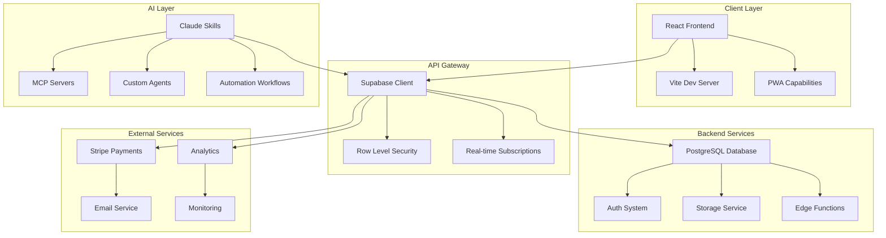
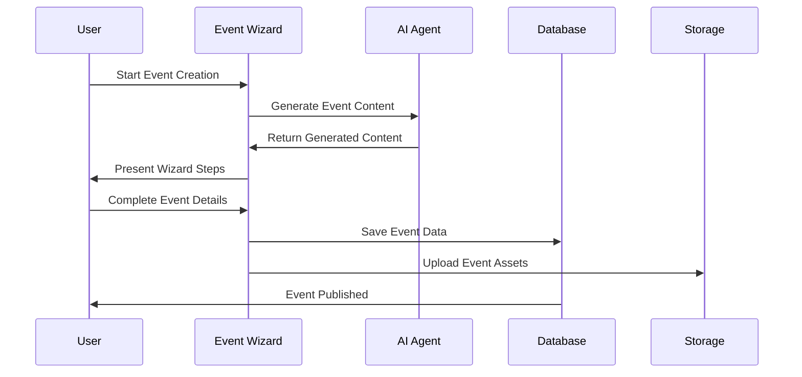
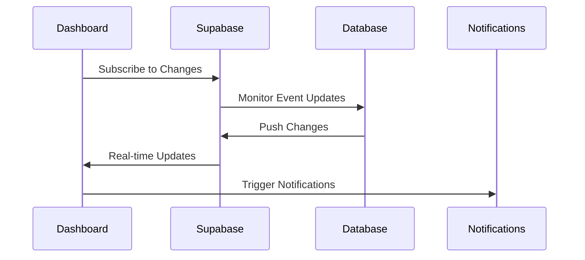
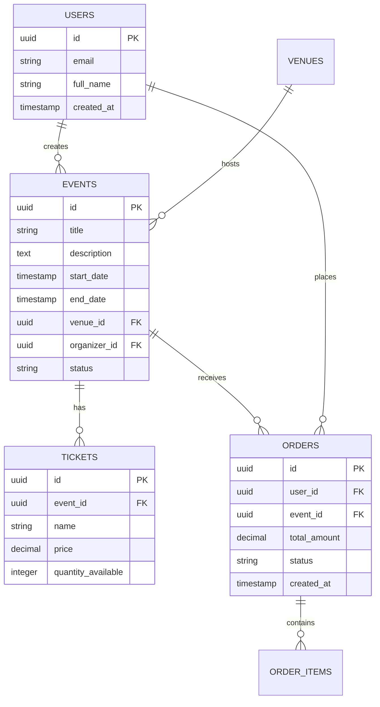

# 002 - EventOS Architecture

**Purpose:** System boundaries, major components, and flow diagrams that define the EventOS architecture and data flow patterns.

---

## 🏗️ **System Architecture Overview**

### **High-Level Architecture**
EventOS follows a modern, scalable architecture pattern with clear separation of concerns:

---

## 🧩 **Core Components**

### **1. Frontend Layer (React + TypeScript)**
- **Dashboard:** Real-time event management interface
- **Event Wizard:** 6-step event creation process
- **Analytics:** Data visualization and reporting
- **Admin Panel:** System configuration and user management

### **2. Backend Layer (Supabase)**
- **Database:** PostgreSQL with optimized schemas
- **Authentication:** Multi-provider auth with RLS
- **Storage:** File upload and CDN integration
- **Real-time:** WebSocket subscriptions for live updates

### **3. AI Integration Layer**
- **Claude Skills:** Specialized AI capabilities
- **MCP Servers:** Model Context Protocol integration
- **Custom Agents:** Event-specific automation
- **Workflow Engine:** AI-powered process automation

---

## 📊 **Data Flow Architecture**

### **Event Creation Flow**

### **Real-time Dashboard Flow**

---

## 🔧 **Component Relationships**

### **Database Schema Relationships**

---

## 🚀 **Technology Integration Points**

### **Supabase Integration**
- **Database:** Optimized PostgreSQL with custom functions
- **Auth:** JWT-based authentication with social providers
- **Storage:** CDN-backed file storage for event assets
- **Real-time:** WebSocket connections for live updates

### **AI Integration Architecture**
- **Claude Skills:** Modular AI capabilities for specific tasks
- **MCP Servers:** Protocol-based communication with AI models
- **Custom Agents:** Event-specific automation and optimization
- **Workflow Engine:** AI-powered business process automation

### **External Service Integration**
- **Stripe:** Payment processing with webhook handling
- **Email Services:** Transactional and marketing email automation
- **Analytics:** User behavior and event performance tracking
- **Monitoring:** Application performance and error tracking

---

## 🔒 **Security Architecture**

### **Authentication & Authorization**
- **Multi-factor Authentication:** SMS and TOTP support
- **Role-based Access Control:** Granular permissions system
- **Row Level Security:** Database-level access control
- **API Security:** Rate limiting and request validation

### **Data Protection**
- **Encryption at Rest:** All sensitive data encrypted
- **Encryption in Transit:** TLS 1.3 for all communications
- **Data Privacy:** GDPR and CCPA compliance ready
- **Audit Logging:** Comprehensive activity tracking

---

## 📈 **Scalability Design**

### **Horizontal Scaling**
- **Database:** Read replicas and connection pooling
- **API Layer:** Load balancing and auto-scaling
- **Storage:** CDN distribution for global performance
- **Real-time:** WebSocket connection management

### **Performance Optimization**
- **Caching Strategy:** Redis for session and data caching
- **Database Optimization:** Indexed queries and query optimization
- **Frontend Optimization:** Code splitting and lazy loading
- **CDN Integration:** Global content delivery network

---

## 🧪 **Development Architecture**

### **Local Development**
- **Supabase Local:** Docker-based local development
- **Hot Reloading:** Vite for fast development cycles
- **Type Safety:** TypeScript with generated database types
- **Testing:** Jest unit tests and Playwright E2E tests

### **Deployment Pipeline**
- **CI/CD:** GitHub Actions for automated deployment
- **Environment Management:** Separate dev, staging, and production
- **Database Migrations:** Version-controlled schema changes
- **Monitoring:** Real-time performance and error tracking

---

## ✅ **Architecture Validation**

### **Success Criteria**
- **Performance:** < 2s page load times with real-time updates
- **Scalability:** Support 10,000+ concurrent users
- **Reliability:** 99.9% uptime with automated failover
- **Security:** Zero critical security vulnerabilities

### **Validation Steps**
1. **Load Testing:** Simulate high concurrent user scenarios
2. **Security Audit:** Penetration testing and vulnerability scanning
3. **Performance Testing:** Core Web Vitals and Lighthouse scores
4. **Integration Testing:** End-to-end workflow validation

---

**Next Step:** Review [003-setup-guide.md](003-setup-guide.md) to set up your development environment.

---

**Generated:** 2025-01-17  
**Version:** MVP 1.0  
**Status:** Architecture Complete
