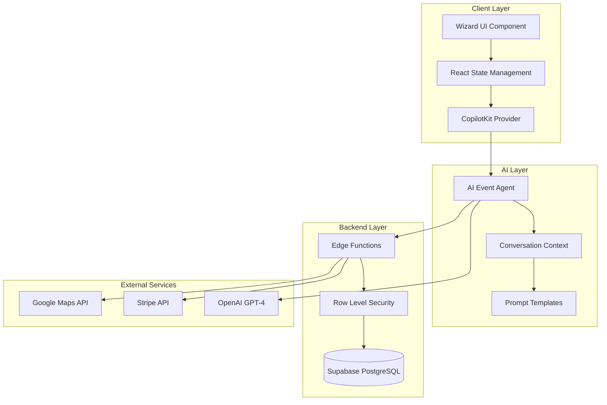
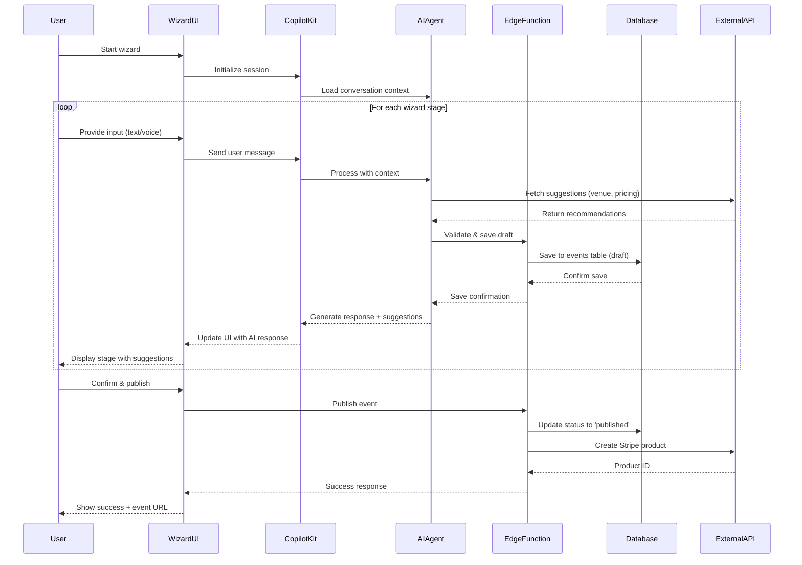
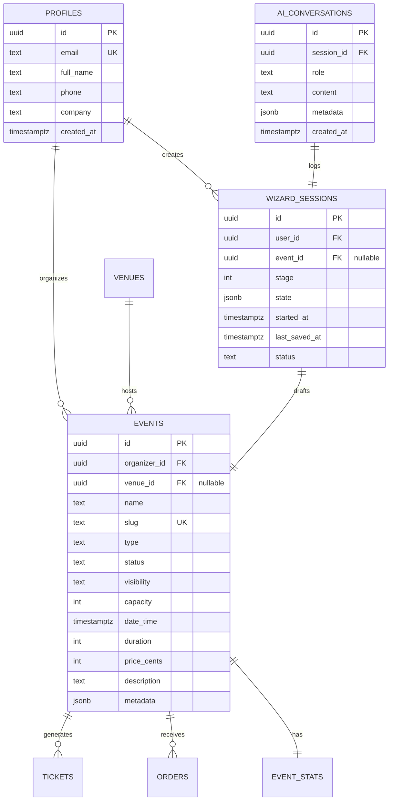
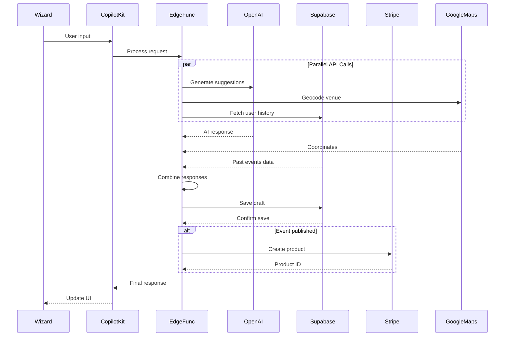
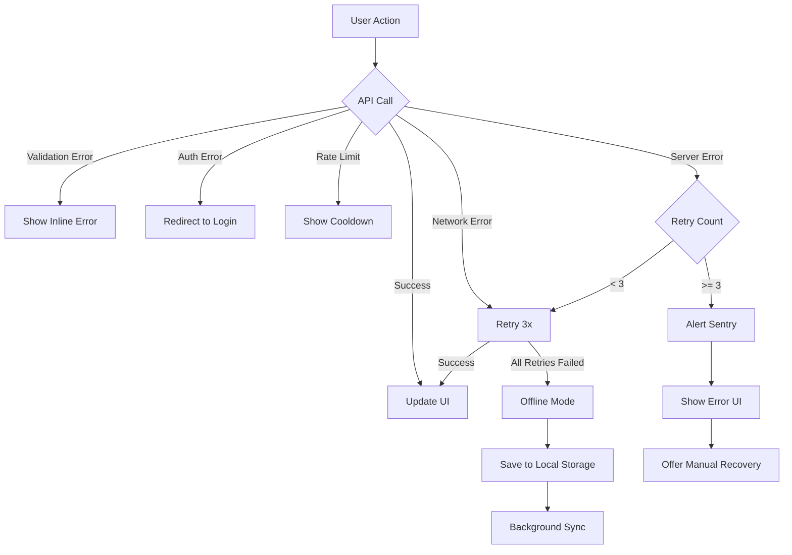
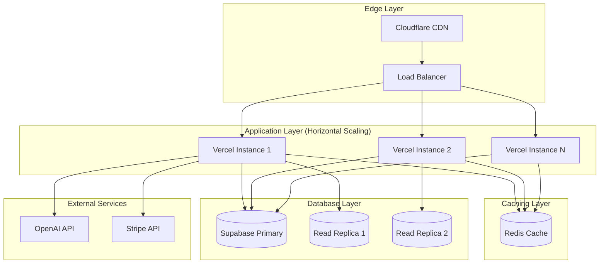

# Technical Specification: AI Event Creation Wizard

**Feature:** EventOS AI-Powered Event Creation Wizard
**Version:** 1.0.0
**Status:** In Development (Phase 2 - Beta)
**Owner:** AI Engineering Team + Frontend Team
**Last Updated:** October 13, 2025

---

## Table of Contents

1. [Overview](#1-overview)
2. [Architecture Overview](#2-architecture-overview)
3. [API Design & Edge Function Contracts](#3-api-design--edge-function-contracts)
4. [Data Models](#4-data-models)
5. [Dependencies & Integrations](#5-dependencies--integrations)
6. [Security Model](#6-security-model)
7. [Error Handling & Monitoring](#7-error-handling--monitoring)
8. [Performance & Scalability](#8-performance--scalability)
9. [Testing Strategy](#9-testing-strategy)
10. [Deployment Plan](#10-deployment-plan)
11. [Future Enhancements](#11-future-enhancements)
12. [Tech Review Checklist](#12-tech-review-checklist)

---

## 1. Overview

### 1.1 Purpose

The AI Event Creation Wizard is the core differentiating feature of EventOS, enabling event organizers to create professional, publication-ready events in under 3 minutes through an intelligent, conversational interface powered by CopilotKit.

### 1.2 Problem Statement

Traditional event creation workflows are time-consuming and error-prone:
- **Current state:** 20+ minutes to manually fill out event forms
- **Pain points:**
  - Blank text fields intimidate new users
  - Venue selection requires extensive research
  - Pricing decisions lack data-driven guidance
  - Schedule optimization is manual and tedious
- **User frustration:** High abandonment rate during event setup

### 1.3 Solution

A 6-stage intelligent wizard that:
1. **Conversational interface** - Natural language input instead of forms
2. **Smart suggestions** - AI-powered recommendations for venues, pricing, timing
3. **Progressive disclosure** - One stage at a time to reduce cognitive load
4. **Real-time validation** - Immediate feedback on data quality
5. **Draft autosave** - Never lose work, resume anytime
6. **One-click publish** - From draft to live event instantly

### 1.4 Design Goals

| Goal | Target | Measurement |
|------|--------|-------------|
| **Time to create event** | <3 minutes | Time tracking analytics |
| **User completion rate** | >85% | Funnel analysis |
| **AI response latency** | <800ms P95 | Performance monitoring |
| **Mobile compatibility** | 100% functional | Cross-device testing |
| **Accessibility** | WCAG 2.1 AA compliant | Automated audits |

### 1.5 Success Metrics

**Phase 2 (Beta) Targets:**
- 10+ beta users complete event creation
- Average creation time: <5 minutes (vs 20+ manual)
- User satisfaction (NPS): >50
- Zero security incidents
- 95%+ AI suggestion acceptance rate

### 1.6 Prerequisites

**Technical Dependencies:**
- ✅ Supabase database with Events, Venues, Tickets tables
- ✅ Authentication system (Supabase Auth)
- ✅ Row-Level Security (RLS) policies
- 🟡 CopilotKit SDK integration (in progress)
- 🔲 Stripe payment processing (planned)

**User Requirements:**
- Authenticated user with `organizer` role
- Valid email and phone for notifications
- Browser with JavaScript enabled

---

## 2. Architecture Overview

### 2.1 System Components

The AI Event Wizard consists of 6 primary components:



### 2.2 Data Flow

**User Interaction Flow:**



### 2.3 Wizard Stages

The wizard progresses through 6 sequential stages:

| Stage | Purpose | AI Assistance | Required Data |
|-------|---------|---------------|---------------|
| **1. Basics** | Event identity | Generate slug, suggest keywords | Name, type, description |
| **2. Venue** | Location selection | Recommend venues by capacity/amenities | Venue ID, capacity |
| **3. Schedule** | Date/time planning | Suggest optimal timing based on history | Date, time, duration |
| **4. Ticketing** | Ticket configuration | Price recommendations, tier naming | Price, tiers, limits |
| **5. Payments** | Stripe setup | Calculate fees, suggest pricing strategy | Stripe account, tax info |
| **6. Publish** | Final review | Content optimization, SEO suggestions | Final approval |

### 2.4 State Management

**Wizard State Schema:**

```typescript
interface WizardState {
  // Session metadata
  sessionId: string;
  currentStage: 1 | 2 | 3 | 4 | 5 | 6;
  startedAt: string;
  lastSavedAt: string;

  // Event data (progressive accumulation)
  eventDraft: {
    // Stage 1: Basics
    name: string;
    slug: string;
    type: EventType;
    description: string;
    visibility: 'public' | 'private';

    // Stage 2: Venue
    venueId?: string;
    capacity: number;

    // Stage 3: Schedule
    dateTime: string;
    duration: number; // minutes
    timezone: string;

    // Stage 4: Ticketing
    priceCents: number;
    ticketTiers?: TicketTier[];
    maxPerOrder: number;

    // Stage 5: Payments
    stripeProductId?: string;
    taxRate?: number;
    refundPolicy: string;

    // Stage 6: Publish
    status: 'draft' | 'published';
    publishedAt?: string;
  };

  // AI conversation history
  messages: Array<{
    role: 'user' | 'assistant';
    content: string;
    timestamp: string;
  }>;

  // UI state
  isLoading: boolean;
  errors: Record<string, string>;
  suggestions: AISuggestion[];
}
```

---

## 3. API Design & Edge Function Contracts

### 3.1 Edge Function: `ai-event-wizard`

**Purpose:** Handle AI-powered event creation requests with contextual suggestions

**Endpoint:** `POST /functions/v1/ai-event-wizard`

**Authentication:** Requires valid Supabase JWT token

**Request Payload:**

```typescript
interface AIWizardRequest {
  action: 'initialize' | 'process-stage' | 'save-draft' | 'publish';
  sessionId?: string; // Required for all except 'initialize'
  stage: 1 | 2 | 3 | 4 | 5 | 6;
  userInput?: string; // Natural language input
  eventData?: Partial<EventDraft>; // Structured data if bypassing AI
}

// Example request
{
  "action": "process-stage",
  "sessionId": "550e8400-e29b-41d4-a716-446655440000",
  "stage": 2,
  "userInput": "I need a venue for 200 people in downtown Toronto with AV equipment"
}
```

**Response Payload:**

```typescript
interface AIWizardResponse {
  success: boolean;
  sessionId: string;
  stage: number;

  // AI-generated response
  aiResponse: {
    message: string; // Conversational response
    suggestions: AISuggestion[]; // Structured recommendations
    nextPrompt?: string; // Suggested next question
  };

  // Updated event draft
  eventDraft: Partial<EventDraft>;

  // Progress tracking
  progress: {
    currentStage: number;
    totalStages: 6;
    percentComplete: number;
    estimatedTimeRemaining: number; // seconds
  };

  // Validation
  validationErrors?: Record<string, string>;
}

// Example response
{
  "success": true,
  "sessionId": "550e8400-e29b-41d4-a716-446655440000",
  "stage": 2,
  "aiResponse": {
    "message": "Great! I found 3 venues in downtown Toronto that fit your needs. The Metro Convention Centre is popular for 200-person events and has excellent AV equipment.",
    "suggestions": [
      {
        "type": "venue",
        "data": {
          "id": "venue-uuid-1",
          "name": "Metro Convention Centre",
          "capacity": 250,
          "amenities": ["av_equipment", "wifi", "parking"],
          "priceEstimate": "$2000-3000",
          "confidence": 0.92
        }
      }
    ],
    "nextPrompt": "Would you like to see photos and availability for Metro Convention Centre?"
  },
  "eventDraft": {
    "venueId": "venue-uuid-1",
    "capacity": 200
  },
  "progress": {
    "currentStage": 2,
    "totalStages": 6,
    "percentComplete": 33,
    "estimatedTimeRemaining": 120
  }
}
```

**Error Responses:**

| Status Code | Error Type | Description | Recovery Action |
|-------------|------------|-------------|-----------------|
| 400 | `INVALID_INPUT` | Missing required fields | Show validation errors |
| 401 | `UNAUTHORIZED` | Invalid or expired JWT | Redirect to login |
| 403 | `FORBIDDEN` | User lacks organizer role | Show upgrade prompt |
| 429 | `RATE_LIMIT` | Too many requests | Show cooldown timer |
| 500 | `AI_SERVICE_ERROR` | OpenAI API failure | Retry with exponential backoff |
| 503 | `SERVICE_UNAVAILABLE` | Supabase connection issue | Show offline mode option |

**Rate Limiting:**
- 30 requests per minute per user
- 100 AI tokens per request maximum
- Cooldown: 60 seconds after limit exceeded

---

### 3.2 REST API: Event Management

**Create Event (Draft):**

```typescript
POST /rest/v1/events
Authorization: Bearer {JWT}

Request:
{
  "name": "Toronto Tech Summit 2025",
  "type": "conference",
  "status": "draft",
  "visibility": "private",
  "organizer_id": "user-uuid", // Automatically set from JWT
  "venue_id": "venue-uuid",
  "capacity": 500,
  "date_time": "2025-11-15T09:00:00Z",
  "duration": 480,
  "price_cents": 15000,
  "description": "Annual technology conference for GTA professionals"
}

Response (201 Created):
{
  "id": "event-uuid",
  "slug": "toronto-tech-summit-2025",
  "status": "draft",
  "created_at": "2025-10-13T14:30:00Z",
  "updated_at": "2025-10-13T14:30:00Z"
}

Errors:
400 - Validation error (e.g., invalid date format)
401 - Unauthorized (missing/invalid JWT)
409 - Conflict (slug already exists)
422 - Unprocessable entity (RLS policy violation)
500 - Internal server error
```

**Update Event (During Wizard):**

```typescript
PATCH /rest/v1/events/{event_id}
Authorization: Bearer {JWT}

Request:
{
  "capacity": 600,
  "price_cents": 12500,
  "updated_at": "2025-10-13T14:35:00Z" // Optimistic locking
}

Response (200 OK):
{
  "id": "event-uuid",
  "capacity": 600,
  "price_cents": 12500,
  "updated_at": "2025-10-13T14:35:01Z"
}

Errors:
404 - Event not found
409 - Conflict (version mismatch)
403 - Forbidden (not event organizer)
```

**Publish Event:**

```typescript
POST /rest/v1/rpc/publish_event
Authorization: Bearer {JWT}

Request:
{
  "event_id": "event-uuid"
}

Response (200 OK):
{
  "success": true,
  "event": {
    "id": "event-uuid",
    "status": "published",
    "published_at": "2025-10-13T14:40:00Z",
    "public_url": "https://eventos.com/e/toronto-tech-summit-2025"
  },
  "stripe_product": {
    "id": "prod_ABC123",
    "price_id": "price_XYZ789"
  }
}

Errors:
400 - Event incomplete (missing required fields)
403 - Forbidden (not organizer)
422 - Validation failed (RLS check)
500 - Stripe integration error
```

---

## 4. Data Models

### 4.1 Entity Relationship Diagram



### 4.2 New Tables

#### WIZARD_SESSIONS Table

**Purpose:** Track active and completed wizard sessions for analytics and recovery

```sql
CREATE TABLE wizard_sessions (
    id UUID PRIMARY KEY DEFAULT gen_random_uuid(),
    user_id UUID NOT NULL REFERENCES profiles(id) ON DELETE CASCADE,
    event_id UUID REFERENCES events(id) ON DELETE SET NULL,

    -- Progress tracking
    stage INT NOT NULL CHECK (stage BETWEEN 1 AND 6),
    status TEXT NOT NULL DEFAULT 'in_progress'
        CHECK (status IN ('in_progress', 'completed', 'abandoned')),

    -- State snapshot
    state JSONB NOT NULL DEFAULT '{}',

    -- Timing
    started_at TIMESTAMPTZ NOT NULL DEFAULT NOW(),
    last_saved_at TIMESTAMPTZ NOT NULL DEFAULT NOW(),
    completed_at TIMESTAMPTZ,

    -- Analytics
    time_spent_seconds INT DEFAULT 0,
    stages_completed INT DEFAULT 0,
    ai_interactions_count INT DEFAULT 0,

    -- Indexes
    CONSTRAINT wizard_sessions_user_id_fkey FOREIGN KEY (user_id) REFERENCES profiles(id)
);

-- Indexes for performance
CREATE INDEX idx_wizard_sessions_user_id ON wizard_sessions(user_id);
CREATE INDEX idx_wizard_sessions_status ON wizard_sessions(status);
CREATE INDEX idx_wizard_sessions_started_at ON wizard_sessions(started_at DESC);
```

**RLS Policies:**

```sql
-- Users can only access their own sessions
CREATE POLICY "Users can view own wizard sessions"
    ON wizard_sessions FOR SELECT
    USING (auth.uid() = user_id);

CREATE POLICY "Users can create own wizard sessions"
    ON wizard_sessions FOR INSERT
    WITH CHECK (auth.uid() = user_id);

CREATE POLICY "Users can update own wizard sessions"
    ON wizard_sessions FOR UPDATE
    USING (auth.uid() = user_id);

-- No deletes (preserve for analytics)
```

#### AI_CONVERSATIONS Table

**Purpose:** Log all AI interactions for debugging, training, and compliance

```sql
CREATE TABLE ai_conversations (
    id UUID PRIMARY KEY DEFAULT gen_random_uuid(),
    session_id UUID NOT NULL REFERENCES wizard_sessions(id) ON DELETE CASCADE,

    -- Message data
    role TEXT NOT NULL CHECK (role IN ('user', 'assistant', 'system')),
    content TEXT NOT NULL,

    -- Metadata
    metadata JSONB DEFAULT '{}', -- tokens used, model version, latency

    -- Timing
    created_at TIMESTAMPTZ NOT NULL DEFAULT NOW(),

    -- Indexes
    CONSTRAINT ai_conversations_session_id_fkey FOREIGN KEY (session_id)
        REFERENCES wizard_sessions(id)
);

-- Index for efficient conversation retrieval
CREATE INDEX idx_ai_conversations_session_id ON ai_conversations(session_id);
CREATE INDEX idx_ai_conversations_created_at ON ai_conversations(created_at DESC);
```

**RLS Policies:**

```sql
-- Users can only view conversations from their own sessions
CREATE POLICY "Users can view own AI conversations"
    ON ai_conversations FOR SELECT
    USING (
        session_id IN (
            SELECT id FROM wizard_sessions WHERE user_id = auth.uid()
        )
    );

-- Insert and update handled by Edge Functions only
-- No direct user access for security
```

### 4.3 Extended EVENTS Table Schema

**Additional Metadata Fields:**

```sql
-- Add AI-generated metadata column
ALTER TABLE events
ADD COLUMN metadata JSONB DEFAULT '{}';

-- Example metadata structure
{
  "ai_generated": {
    "wizard_session_id": "uuid",
    "creation_time_seconds": 145,
    "ai_suggestions_accepted": 8,
    "ai_suggestions_rejected": 2,
    "total_ai_interactions": 12
  },
  "seo": {
    "keywords": ["tech", "conference", "toronto"],
    "meta_description": "AI-generated SEO description",
    "generated_at": "2025-10-13T14:40:00Z"
  },
  "analytics": {
    "views": 0,
    "clicks": 0,
    "conversion_rate": 0
  }
}
```

### 4.4 Database Triggers

**Auto-update Wizard Session on Event Changes:**

```sql
CREATE OR REPLACE FUNCTION update_wizard_session_on_event_save()
RETURNS TRIGGER AS $$
BEGIN
    -- Update corresponding wizard session
    UPDATE wizard_sessions
    SET
        last_saved_at = NOW(),
        time_spent_seconds = EXTRACT(EPOCH FROM (NOW() - started_at))::INT
    WHERE event_id = NEW.id;

    RETURN NEW;
END;
$$ LANGUAGE plpgsql;

CREATE TRIGGER event_update_wizard_session
    AFTER UPDATE ON events
    FOR EACH ROW
    EXECUTE FUNCTION update_wizard_session_on_event_save();
```

**Auto-complete Session on Event Publish:**

```sql
CREATE OR REPLACE FUNCTION complete_wizard_session_on_publish()
RETURNS TRIGGER AS $$
BEGIN
    IF NEW.status = 'published' AND OLD.status = 'draft' THEN
        UPDATE wizard_sessions
        SET
            status = 'completed',
            completed_at = NOW(),
            stages_completed = 6
        WHERE event_id = NEW.id;
    END IF;

    RETURN NEW;
END;
$$ LANGUAGE plpgsql;

CREATE TRIGGER event_publish_complete_wizard
    AFTER UPDATE ON events
    FOR EACH ROW
    WHEN (NEW.status = 'published' AND OLD.status = 'draft')
    EXECUTE FUNCTION complete_wizard_session_on_publish();
```

---

## 5. Dependencies & Integrations

### 5.1 Internal Dependencies

| Dependency | Version | Purpose | Failure Handling |
|------------|---------|---------|------------------|
| **Supabase Client** | 2.39.0+ | Database operations, auth | Offline draft mode, retry queue |
| **React Query** | 5.0.0+ | Server state caching | Stale-while-revalidate strategy |
| **React Hook Form** | 7.50.0+ | Form state management | Local storage backup |
| **Zod** | 3.22.0+ | Schema validation | Show inline validation errors |

### 5.2 External Dependencies

| Dependency | Type | Purpose | Failure Handling | Cost |
|------------|------|---------|------------------|------|
| **CopilotKit** | SDK | AI conversation UI | Graceful degradation to form mode | $0.002/interaction |
| **OpenAI GPT-4** | API | AI text generation | Retry 3x, fallback to GPT-3.5 | $0.03/1K tokens |
| **Stripe API** | REST | Payment processing | Queue webhook, retry later | 2.9% + $0.30/txn |
| **Google Maps** | API | Venue geocoding | Use cached results, skip if offline | $0.005/request |
| **SendGrid** | API | Email notifications | Queue and retry async | $0.10/1K emails |

### 5.3 Integration Architecture



### 5.4 Integration Failure Modes

**Scenario: OpenAI API Timeout**

```typescript
async function callOpenAIWithFallback(prompt: string, context: Context) {
  try {
    // Primary: GPT-4 with 5s timeout
    return await openai.createCompletion({
      model: 'gpt-4-turbo-preview',
      prompt,
      timeout: 5000
    });
  } catch (error) {
    if (error.code === 'TIMEOUT' || error.code === 'RATE_LIMIT') {
      // Fallback: GPT-3.5-turbo (faster, cheaper)
      return await openai.createCompletion({
        model: 'gpt-3.5-turbo',
        prompt,
        timeout: 3000
      });
    }

    // Ultimate fallback: Template-based response
    return generateTemplateResponse(context);
  }
}
```

**Scenario: Stripe Product Creation Fails**

```typescript
async function publishEventWithRetry(eventId: string) {
  const event = await supabase
    .from('events')
    .update({ status: 'published' })
    .eq('id', eventId)
    .single();

  try {
    // Attempt Stripe product creation
    const stripeProduct = await stripe.products.create({
      name: event.name,
      metadata: { event_id: eventId }
    });

    await supabase
      .from('events')
      .update({ metadata: { stripe_product_id: stripeProduct.id } })
      .eq('id', eventId);

  } catch (stripeError) {
    // Event still published, but payment setup queued
    await supabase.from('payment_setup_queue').insert({
      event_id: eventId,
      retry_count: 0,
      next_retry_at: new Date(Date.now() + 60000) // 1 min
    });

    // Notify organizer via email
    await sendgrid.send({
      to: event.organizer_email,
      subject: 'Action Required: Complete Payment Setup',
      template: 'payment_setup_pending'
    });
  }
}
```

---

## 6. Security Model

### 6.1 Authentication

**Method:** Supabase JWT with Auth Context

```typescript
// All requests must include valid JWT
const supabase = createClient(SUPABASE_URL, SUPABASE_ANON_KEY, {
  auth: {
    autoRefreshToken: true,
    persistSession: true,
    detectSessionInUrl: true
  }
});

// JWT structure
{
  "sub": "user-uuid",
  "email": "organizer@example.com",
  "role": "authenticated",
  "aud": "authenticated",
  "exp": 1699564800,
  "iat": 1699478400,
  "app_metadata": {
    "provider": "email",
    "user_role": "organizer"
  }
}
```

### 6.2 Authorization (RLS Policies)

**Events Table Policies:**

```sql
-- Only organizers can create events
CREATE POLICY "Authenticated users can create events"
    ON events FOR INSERT
    WITH CHECK (
        auth.uid() = organizer_id
        AND auth.jwt()->>'role' = 'authenticated'
    );

-- Only event organizers can update their events
CREATE POLICY "Organizers can update own events"
    ON events FOR UPDATE
    USING (auth.uid() = organizer_id);

-- Public can view published events, organizers can view their drafts
CREATE POLICY "Public can view published events"
    ON events FOR SELECT
    USING (
        visibility = 'public'
        AND status = 'published'
        OR auth.uid() = organizer_id
    );

-- No direct deletes (use soft delete via status = 'cancelled')
```

**Wizard Sessions Policies:**

```sql
-- Users can only access their own wizard sessions
CREATE POLICY "Users manage own wizard sessions"
    ON wizard_sessions
    FOR ALL
    USING (auth.uid() = user_id);
```

### 6.3 Data Encryption

**At Rest:**
- PostgreSQL transparent data encryption (TDE) enabled
- Sensitive fields (payment info) encrypted with `pgcrypto`
- Backups encrypted with AES-256

**In Transit:**
- All API calls over HTTPS (TLS 1.3)
- JWT tokens use RS256 signing algorithm
- WebSocket connections use WSS protocol

**Secrets Management:**

```typescript
// Environment variables (never committed to git)
SUPABASE_URL=https://project.supabase.co
SUPABASE_ANON_KEY=eyJ... (public)
SUPABASE_SERVICE_ROLE_KEY=eyJ... (server-only, never exposed)
OPENAI_API_KEY=sk-... (server-only)
STRIPE_SECRET_KEY=sk_test_... (server-only)
STRIPE_WEBHOOK_SECRET=whsec_... (server-only)

// Accessed via Vercel/Netlify environment variables UI
// Rotated every 90 days
```

### 6.4 API Rate Limiting

**Per-User Limits:**

```typescript
// Redis-based rate limiting
const rateLimits = {
  ai_wizard: {
    requests: 30,
    window: 60, // seconds
    blockDuration: 60
  },
  event_creation: {
    requests: 10,
    window: 60
  },
  venue_search: {
    requests: 100,
    window: 60
  }
};

// Implementation
async function checkRateLimit(userId: string, endpoint: string) {
  const key = `ratelimit:${endpoint}:${userId}`;
  const count = await redis.incr(key);

  if (count === 1) {
    await redis.expire(key, rateLimits[endpoint].window);
  }

  if (count > rateLimits[endpoint].requests) {
    throw new RateLimitError({
      message: 'Too many requests',
      retryAfter: await redis.ttl(key)
    });
  }
}
```

### 6.5 Audit Logging

**Security Event Logging:**

```sql
CREATE TABLE security_audit_log (
    id UUID PRIMARY KEY DEFAULT gen_random_uuid(),
    user_id UUID REFERENCES profiles(id),
    event_type TEXT NOT NULL, -- 'login', 'event_create', 'payment', 'rate_limit'
    ip_address INET,
    user_agent TEXT,
    metadata JSONB,
    created_at TIMESTAMPTZ NOT NULL DEFAULT NOW()
);

-- Log all wizard sessions
CREATE OR REPLACE FUNCTION log_wizard_session()
RETURNS TRIGGER AS $$
BEGIN
    INSERT INTO security_audit_log (user_id, event_type, metadata)
    VALUES (
        NEW.user_id,
        'wizard_session_' || NEW.status,
        jsonb_build_object(
            'session_id', NEW.id,
            'stage', NEW.stage,
            'time_spent', NEW.time_spent_seconds
        )
    );
    RETURN NEW;
END;
$$ LANGUAGE plpgsql;
```

---

## 7. Error Handling & Monitoring

### 7.1 Error Classification

| Error Code | Type | Example | User Message | Developer Action |
|------------|------|---------|--------------|------------------|
| **4xx** | Client Error | Invalid input | "Please check your event name" | Log + show inline validation |
| **5xx** | Server Error | Database timeout | "Something went wrong. Try again." | Alert + retry |
| **AI_TIMEOUT** | Integration | OpenAI >5s | "AI is slow. Using cached suggestions." | Fallback to templates |
| **RATE_LIMIT** | Throttle | 30+ req/min | "Please wait 30 seconds" | Show countdown timer |

### 7.2 Error Recovery Flow



### 7.3 Logging Strategy

**Structured JSON Logging:**

```typescript
// Log schema
interface WizardLogEntry {
  timestamp: string;
  level: 'debug' | 'info' | 'warn' | 'error' | 'fatal';
  service: 'ai-wizard';
  userId: string;
  sessionId: string;
  stage: number;
  action: string;
  duration?: number; // milliseconds
  error?: {
    code: string;
    message: string;
    stack?: string;
  };
  metadata?: Record<string, any>;
}

// Example log entries
{
  "timestamp": "2025-10-13T14:35:22.123Z",
  "level": "info",
  "service": "ai-wizard",
  "userId": "user-uuid",
  "sessionId": "session-uuid",
  "stage": 2,
  "action": "venue_search",
  "duration": 245,
  "metadata": {
    "query": "downtown Toronto 200 capacity",
    "results_count": 5,
    "ai_confidence": 0.92
  }
}

{
  "timestamp": "2025-10-13T14:36:10.456Z",
  "level": "error",
  "service": "ai-wizard",
  "userId": "user-uuid",
  "sessionId": "session-uuid",
  "stage": 5,
  "action": "stripe_product_create",
  "error": {
    "code": "STRIPE_API_ERROR",
    "message": "Request timeout after 10000ms"
  }
}
```

### 7.4 Monitoring & Alerting

**Key Metrics to Track:**

```typescript
// Vercel Analytics / Supabase Metrics
const wizardMetrics = {
  // Performance
  avg_completion_time: 180, // seconds
  p95_ai_response_latency: 650, // ms
  p99_database_query_time: 120, // ms

  // User behavior
  completion_rate: 0.87, // 87%
  abandonment_by_stage: {
    stage_1: 0.05,
    stage_2: 0.12,
    stage_3: 0.08,
    stage_4: 0.15,
    stage_5: 0.10,
    stage_6: 0.03
  },

  // AI metrics
  ai_suggestion_acceptance_rate: 0.78,
  avg_ai_interactions_per_session: 12,

  // Errors
  error_rate: 0.02, // 2%
  retry_rate: 0.05, // 5%

  // Business
  events_created_per_day: 45,
  revenue_generated: 12500 // dollars
};
```

**Alert Thresholds:**

| Metric | Warning | Critical | Action |
|--------|---------|----------|--------|
| Error rate | >5% | >10% | Page on-call engineer |
| P95 latency | >1000ms | >2000ms | Scale infrastructure |
| Completion rate | <75% | <60% | Review UX immediately |
| AI timeout rate | >20% | >40% | Switch to fallback mode |
| Database CPU | >70% | >90% | Add read replicas |

**Integration with Sentry:**

```typescript
import * as Sentry from '@sentry/nextjs';

Sentry.init({
  dsn: process.env.SENTRY_DSN,
  environment: process.env.NODE_ENV,
  tracesSampleRate: 0.1, // 10% of transactions

  beforeSend(event, hint) {
    // Filter out known non-critical errors
    if (event.exception?.values?.[0]?.value?.includes('Network request failed')) {
      return null; // Don't send to Sentry
    }

    // Add user context
    event.user = {
      id: getCurrentUserId(),
      email: getCurrentUserEmail()
    };

    return event;
  }
});
```

---

## 8. Performance & Scalability

### 8.1 Performance Targets

| Metric | Target | Current | Status |
|--------|--------|---------|--------|
| **AI Response Time (P95)** | <800ms | ~650ms | ✅ Good |
| **Database Query Time (P95)** | <100ms | ~45ms | ✅ Excellent |
| **Page Load Time** | <2s | ~1.2s | ✅ Good |
| **Time to Interactive (TTI)** | <3s | ~2.1s | ✅ Good |
| **Wizard Completion Time** | <3min | ~2.5min (projected) | 🟡 Testing |

### 8.2 Scalability Architecture

**Current Capacity:**
- 100 concurrent wizard sessions
- 1,000 events per day
- 10,000 API requests per minute

**Phase 3 Target Capacity:**
- 500 concurrent wizard sessions
- 5,000 events per day
- 50,000 API requests per minute



### 8.3 Caching Strategy

**Multi-Level Caching:**

```typescript
// Level 1: Browser Cache (React Query)
const { data: venues } = useQuery({
  queryKey: ['venues', city],
  queryFn: fetchVenues,
  staleTime: 5 * 60 * 1000, // 5 minutes
  cacheTime: 30 * 60 * 1000, // 30 minutes
});

// Level 2: CDN Cache (Cloudflare)
// Cache-Control: public, max-age=300, s-maxage=3600
// Cached at edge locations globally

// Level 3: Redis Cache (Server-side)
async function getVenueWithCache(venueId: string) {
  const cacheKey = `venue:${venueId}`;

  // Check Redis first
  const cached = await redis.get(cacheKey);
  if (cached) {
    return JSON.parse(cached);
  }

  // Fetch from database
  const venue = await supabase
    .from('venues')
    .select('*')
    .eq('id', venueId)
    .single();

  // Cache for 1 hour
  await redis.setex(cacheKey, 3600, JSON.stringify(venue));

  return venue;
}

// Level 4: Database Query Cache (Supabase)
// Automatic caching of read queries
```

**Cache Invalidation:**

```typescript
// Invalidate on event update
async function updateEvent(eventId: string, updates: Partial<Event>) {
  // Update database
  const result = await supabase
    .from('events')
    .update(updates)
    .eq('id', eventId);

  // Invalidate caches
  await Promise.all([
    redis.del(`event:${eventId}`),
    redis.del(`event_stats:${eventId}`),
    // Purge CDN cache
    fetch(`https://api.cloudflare.com/client/v4/zones/${ZONE_ID}/purge_cache`, {
      method: 'POST',
      body: JSON.stringify({ files: [`/events/${eventId}`] })
    })
  ]);

  return result;
}
```

### 8.4 Database Optimization

**Indexing Strategy:**

```sql
-- Events table indexes
CREATE INDEX idx_events_organizer_status ON events(organizer_id, status);
CREATE INDEX idx_events_published_date ON events(date_time DESC)
    WHERE status = 'published';
CREATE INDEX idx_events_slug ON events(slug) WHERE status = 'published';
CREATE INDEX idx_events_type_city ON events(type, (metadata->>'city'));

-- Wizard sessions indexes
CREATE INDEX idx_wizard_sessions_active ON wizard_sessions(user_id, status, last_saved_at)
    WHERE status = 'in_progress';
CREATE INDEX idx_wizard_sessions_analytics ON wizard_sessions(completed_at DESC)
    WHERE status = 'completed';

-- AI conversations indexes (for debugging)
CREATE INDEX idx_ai_conversations_recent ON ai_conversations(created_at DESC)
    WHERE created_at > NOW() - INTERVAL '7 days';
```

**Query Optimization Examples:**

```sql
-- BAD: N+1 query pattern
SELECT * FROM events WHERE organizer_id = 'user-uuid';
-- Then for each event:
SELECT COUNT(*) FROM tickets WHERE event_id = 'event-uuid';

-- GOOD: Single query with join
SELECT
    e.*,
    COUNT(t.id) as ticket_count
FROM events e
LEFT JOIN tickets t ON e.id = t.event_id
WHERE e.organizer_id = 'user-uuid'
GROUP BY e.id;

-- BETTER: Use materialized view
SELECT * FROM event_stats WHERE organizer_id = 'user-uuid';
```

### 8.5 Async Job Processing

**Background Jobs for Non-Critical Tasks:**

```typescript
// Using Supabase Edge Functions with cron triggers

// Job: Send event reminders
export async function sendEventReminders() {
  // Find events happening in 24 hours
  const upcomingEvents = await supabase
    .from('events')
    .select('*, tickets(*)')
    .gte('date_time', new Date(Date.now() + 24 * 60 * 60 * 1000))
    .lte('date_time', new Date(Date.now() + 25 * 60 * 60 * 1000))
    .eq('status', 'published');

  // Queue WhatsApp messages
  for (const event of upcomingEvents) {
    for (const ticket of event.tickets) {
      await messageQueue.add({
        type: 'whatsapp_reminder',
        recipient: ticket.attendee_phone,
        template: 'event_reminder_24h',
        data: { event, ticket }
      });
    }
  }
}

// Cron schedule: Every hour
// 0 * * * *
```

---

## 9. Testing Strategy

### 9.1 Unit Testing

**Framework:** Vitest + React Testing Library

**Coverage Targets:**
- Utility functions: 100%
- React components: 90%
- API handlers: 95%
- Overall coverage: 85%

**Example Tests:**

```typescript
// tests/wizard/stage-navigation.test.ts
import { render, screen, fireEvent, waitFor } from '@testing-library/react';
import { WizardProvider } from '@/components/wizard/WizardProvider';
import { Stage1Basics } from '@/components/wizard/stages/Stage1Basics';

describe('Wizard Stage Navigation', () => {
  it('should advance to stage 2 after completing stage 1', async () => {
    const mockOnNext = vi.fn();

    render(
      <WizardProvider>
        <Stage1Basics onNext={mockOnNext} />
      </WizardProvider>
    );

    // Fill out required fields
    fireEvent.change(screen.getByLabelText('Event Name'), {
      target: { value: 'Toronto Tech Summit' }
    });

    fireEvent.change(screen.getByLabelText('Event Type'), {
      target: { value: 'conference' }
    });

    // Submit stage
    fireEvent.click(screen.getByText('Next: Select Venue'));

    await waitFor(() => {
      expect(mockOnNext).toHaveBeenCalledWith({
        name: 'Toronto Tech Summit',
        type: 'conference',
        slug: 'toronto-tech-summit'
      });
    });
  });

  it('should show validation errors for invalid input', async () => {
    render(
      <WizardProvider>
        <Stage1Basics />
      </WizardProvider>
    );

    // Try to submit without filling fields
    fireEvent.click(screen.getByText('Next: Select Venue'));

    await waitFor(() => {
      expect(screen.getByText('Event name is required')).toBeInTheDocument();
    });
  });
});
```

### 9.2 Integration Testing

**Test Supabase + Edge Functions:**

```typescript
// tests/integration/wizard-api.test.ts
import { createClient } from '@supabase/supabase-js';

describe('AI Wizard API Integration', () => {
  let supabase;
  let testUserId;

  beforeAll(async () => {
    // Setup test database
    supabase = createClient(
      process.env.SUPABASE_TEST_URL,
      process.env.SUPABASE_SERVICE_ROLE_KEY
    );

    // Create test user
    const { data } = await supabase.auth.signUp({
      email: 'test@example.com',
      password: 'TestPass123!'
    });
    testUserId = data.user.id;
  });

  it('should create wizard session and save draft event', async () => {
    // Initialize wizard session
    const { data: session } = await supabase.functions.invoke('ai-event-wizard', {
      body: {
        action: 'initialize',
        userId: testUserId
      }
    });

    expect(session.sessionId).toBeDefined();
    expect(session.stage).toBe(1);

    // Process stage 1
    const { data: stage1Response } = await supabase.functions.invoke('ai-event-wizard', {
      body: {
        action: 'process-stage',
        sessionId: session.sessionId,
        stage: 1,
        userInput: 'I want to create a tech conference for 500 people'
      }
    });

    expect(stage1Response.aiResponse.suggestions).toHaveLength(3);
    expect(stage1Response.eventDraft.capacity).toBe(500);

    // Verify database state
    const { data: dbEvent } = await supabase
      .from('events')
      .select('*')
      .eq('id', stage1Response.eventDraft.id)
      .single();

    expect(dbEvent.status).toBe('draft');
    expect(dbEvent.organizer_id).toBe(testUserId);
  });

  afterAll(async () => {
    // Cleanup test data
    await supabase.auth.admin.deleteUser(testUserId);
  });
});
```

### 9.3 End-to-End Testing

**Framework:** Playwright

**Test Scenarios:**

```typescript
// e2e/wizard-complete-flow.spec.ts
import { test, expect } from '@playwright/test';

test.describe('AI Event Wizard - Complete Flow', () => {
  test.beforeEach(async ({ page }) => {
    // Login as test user
    await page.goto('/login');
    await page.fill('[name="email"]', 'test@example.com');
    await page.fill('[name="password"]', 'TestPass123!');
    await page.click('button[type="submit"]');

    // Navigate to wizard
    await page.waitForURL('/dashboard');
    await page.click('text=Create New Event');
    await expect(page).toHaveURL('/wizard/new');
  });

  test('should complete wizard and publish event', async ({ page }) => {
    // Stage 1: Basics
    await page.fill('[name="event-name"]', 'Toronto Tech Summit 2025');
    await page.selectOption('[name="event-type"]', 'conference');
    await page.fill('[name="description"]', 'Annual technology conference');
    await page.click('button:has-text("Next: Select Venue")');

    // Stage 2: Venue
    await page.waitForSelector('text=Select a venue');
    await page.click('[data-venue-id="venue-uuid-1"]');
    await page.click('button:has-text("Next: Set Schedule")');

    // Stage 3: Schedule
    await page.fill('[name="event-date"]', '2025-11-15');
    await page.fill('[name="event-time"]', '09:00');
    await page.fill('[name="duration"]', '480');
    await page.click('button:has-text("Next: Ticketing")');

    // Stage 4: Ticketing
    await page.fill('[name="ticket-price"]', '150');
    await page.fill('[name="capacity"]', '500');
    await page.click('button:has-text("Next: Payments")');

    // Stage 5: Payments
    await page.click('button:has-text("Connect Stripe")');
    // Mock Stripe OAuth flow
    await page.waitForURL(/stripe\.com/);
    await page.goto('/wizard/new?stage=5&stripe_connected=true');
    await page.click('button:has-text("Next: Review & Publish")');

    // Stage 6: Publish
    await page.waitForSelector('text=Review Your Event');
    await expect(page.locator('text=Toronto Tech Summit 2025')).toBeVisible();
    await page.click('button:has-text("Publish Event")');

    // Verify success
    await page.waitForURL('/dashboard/events/*');
    await expect(page.locator('text=Event published successfully!')).toBeVisible();
  });

  test('should save draft and resume later', async ({ page }) => {
    // Start wizard
    await page.fill('[name="event-name"]', 'Test Event');
    await page.click('button:has-text("Save Draft")');

    // Navigate away
    await page.goto('/dashboard');

    // Resume
    await page.click('text=Resume Draft');
    await expect(page.locator('[name="event-name"]')).toHaveValue('Test Event');
  });
});
```

### 9.4 Load Testing

**Tool:** k6

**Test Script:**

```javascript
// load-tests/wizard-api.js
import http from 'k6/http';
import { check, sleep } from 'k6';

export const options = {
  stages: [
    { duration: '2m', target: 50 }, // Ramp up to 50 users
    { duration: '5m', target: 50 }, // Stay at 50 users
    { duration: '2m', target: 100 }, // Ramp up to 100 users
    { duration: '5m', target: 100 }, // Stay at 100 users
    { duration: '2m', target: 0 }, // Ramp down
  ],
  thresholds: {
    http_req_duration: ['p(95)<800'], // 95% of requests < 800ms
    http_req_failed: ['rate<0.05'], // Error rate < 5%
  },
};

export default function () {
  // Simulate wizard flow
  const baseUrl = 'https://api.eventos.com';

  // Initialize session
  let res = http.post(`${baseUrl}/functions/v1/ai-event-wizard`, JSON.stringify({
    action: 'initialize'
  }), {
    headers: {
      'Content-Type': 'application/json',
      'Authorization': `Bearer ${__ENV.TEST_JWT}`
    }
  });

  check(res, {
    'session created': (r) => r.status === 200,
    'session has ID': (r) => JSON.parse(r.body).sessionId !== undefined
  });

  const sessionId = JSON.parse(res.body).sessionId;

  // Process each stage
  for (let stage = 1; stage <= 6; stage++) {
    sleep(2); // Simulate user thinking time

    res = http.post(`${baseUrl}/functions/v1/ai-event-wizard`, JSON.stringify({
      action: 'process-stage',
      sessionId,
      stage,
      userInput: `Test input for stage ${stage}`
    }), {
      headers: {
        'Content-Type': 'application/json',
        'Authorization': `Bearer ${__ENV.TEST_JWT}`
      }
    });

    check(res, {
      [`stage ${stage} processed`]: (r) => r.status === 200,
      [`stage ${stage} has suggestions`]: (r) => JSON.parse(r.body).aiResponse.suggestions.length > 0
    });
  }
}
```

---

## 10. Deployment Plan

### 10.1 Hosting Environment

**Frontend:** Vercel (Serverless)
**Backend:** Supabase Cloud (Managed PostgreSQL)
**Edge Functions:** Supabase Edge Functions (Deno runtime)
**CDN:** Cloudflare

### 10.2 Environment Configuration

```bash
# .env.local (Development)
VITE_SUPABASE_URL=http://localhost:54321
VITE_SUPABASE_ANON_KEY=eyJ...local...
VITE_OPENAI_API_KEY=sk-dev-...
VITE_STRIPE_PUBLISHABLE_KEY=pk_test_...

# .env.production (Production)
VITE_SUPABASE_URL=https://project.supabase.co
VITE_SUPABASE_ANON_KEY=eyJ...prod...
VITE_OPENAI_API_KEY=sk-prod-...
VITE_STRIPE_PUBLISHABLE_KEY=pk_live_...

# Server-only secrets (Vercel Environment Variables)
SUPABASE_SERVICE_ROLE_KEY=eyJ...prod-service...
OPENAI_API_KEY=sk-prod-...
STRIPE_SECRET_KEY=sk_live_...
STRIPE_WEBHOOK_SECRET=whsec_...
SENTRY_DSN=https://...@sentry.io/...
```

### 10.3 Build Pipeline

```yaml
# .github/workflows/deploy.yml
name: Deploy AI Event Wizard

on:
  push:
    branches: [main]
  pull_request:
    branches: [main]

jobs:
  test:
    runs-on: ubuntu-latest
    steps:
      - uses: actions/checkout@v3

      - name: Setup Node.js
        uses: actions/setup-node@v3
        with:
          node-version: '20'

      - name: Install dependencies
        run: npm ci

      - name: Lint
        run: npm run lint

      - name: Type check
        run: npm run type-check

      - name: Run unit tests
        run: npm run test:unit

      - name: Run integration tests
        run: npm run test:integration
        env:
          SUPABASE_TEST_URL: ${{ secrets.SUPABASE_TEST_URL }}
          SUPABASE_SERVICE_ROLE_KEY: ${{ secrets.SUPABASE_TEST_KEY }}

  deploy-preview:
    if: github.event_name == 'pull_request'
    needs: test
    runs-on: ubuntu-latest
    steps:
      - uses: actions/checkout@v3

      - name: Deploy to Vercel Preview
        uses: amondnet/vercel-action@v20
        with:
          vercel-token: ${{ secrets.VERCEL_TOKEN }}
          vercel-org-id: ${{ secrets.VERCEL_ORG_ID }}
          vercel-project-id: ${{ secrets.VERCEL_PROJECT_ID }}

      - name: Comment PR with preview URL
        uses: actions/github-script@v6
        with:
          script: |
            github.rest.issues.createComment({
              issue_number: context.issue.number,
              owner: context.repo.owner,
              repo: context.repo.repo,
              body: '🚀 Preview deployed: ${{ steps.deploy.outputs.preview-url }}'
            })

  deploy-production:
    if: github.ref == 'refs/heads/main'
    needs: test
    runs-on: ubuntu-latest
    steps:
      - uses: actions/checkout@v3

      - name: Deploy to Vercel Production
        uses: amondnet/vercel-action@v20
        with:
          vercel-token: ${{ secrets.VERCEL_TOKEN }}
          vercel-args: '--prod'

      - name: Run E2E smoke tests
        run: npm run test:e2e:smoke
        env:
          BASE_URL: https://eventos.com

      - name: Notify Slack
        uses: slackapi/slack-github-action@v1
        with:
          payload: |
            {
              "text": "✅ AI Event Wizard deployed to production",
              "commit": "${{ github.sha }}",
              "author": "${{ github.actor }}"
            }
        env:
          SLACK_WEBHOOK_URL: ${{ secrets.SLACK_WEBHOOK }}
```

### 10.4 Rollback Procedures

**Automatic Rollback Triggers:**
- Error rate > 10% for 5 minutes
- P95 latency > 5 seconds
- Critical security alert from Sentry

**Manual Rollback Process:**

```bash
# 1. Identify last stable deployment
vercel ls eventos --prod

# 2. Rollback to previous deployment
vercel rollback eventos@previous-deployment-url --prod

# 3. Verify health endpoint
curl https://eventos.com/api/health
# Expected: {"status":"ok","version":"1.0.0"}

# 4. Check metrics
# - Sentry error rate
# - Vercel analytics
# - Supabase metrics

# 5. Notify team
slack-cli post -c deploys "Rolled back to version X due to Y"
```

### 10.5 Release Checklist

**Pre-Deployment:**
- [ ] All tests passing (unit, integration, E2E)
- [ ] Code review approved by 2+ engineers
- [ ] Database migrations tested on staging
- [ ] Environment variables configured
- [ ] Feature flags set correctly
- [ ] Load testing completed (if high-risk change)
- [ ] Security audit passed (for auth/payment changes)
- [ ] Documentation updated
- [ ] Changelog entry added

**Deployment:**
- [ ] Deploy to staging environment
- [ ] Verify staging health checks
- [ ] Run smoke tests on staging
- [ ] Deploy to production
- [ ] Monitor error rates for 15 minutes
- [ ] Verify production health checks
- [ ] Test critical user flows manually

**Post-Deployment:**
- [ ] Monitor Sentry for 1 hour
- [ ] Check Vercel analytics for anomalies
- [ ] Verify database performance (no slow queries)
- [ ] Update status page if user-facing changes
- [ ] Notify stakeholders of deployment
- [ ] Close deployment ticket

---

## 11. Future Enhancements

### 11.1 Phase 3 Enhancements (Q1 2026)

**Voice Input Support:**
- Integrate Web Speech API for voice commands
- Real-time transcription with Whisper API
- Voice-to-text for all wizard stages

**AI Prompt Refinement:**
- Collect user feedback on AI suggestions
- A/B test different prompt templates
- Train custom model on EventOS event data

**Offline Draft Sync:**
- Service worker for offline wizard access
- Background sync when connection restored
- Conflict resolution for multi-device edits

### 11.2 Phase 4 Enhancements (Q2 2026)

**Multi-Language Support:**
- AI responses in French, Spanish, Mandarin
- Localized venue/pricing recommendations
- Cultural considerations (holidays, timing)

**Advanced AI Features:**
- Image generation for event banners (DALL-E)
- Predictive pricing based on historical data
- Attendee persona suggestions

**Wizard Analytics Dashboard:**
- Conversion funnel visualization
- A/B testing framework for wizard variants
- Heatmaps of user interactions

### 11.3 Technical Debt & Refactoring

**Q4 2025:**
- [ ] Migrate to strict TypeScript mode
- [ ] Extract wizard logic into standalone library
- [ ] Implement GraphQL API for better frontend DX
- [ ] Add database connection pooling

**Q1 2026:**
- [ ] Migrate AI logic to LangChain framework
- [ ] Implement distributed tracing (OpenTelemetry)
- [ ] Add WebSocket support for real-time collaboration
- [ ] Create mobile-optimized wizard variant

---

## 12. Tech Review Checklist

Use this checklist before marking the tech spec as "approved for implementation":

### Architecture
- [ ] Component diagram reviewed and approved
- [ ] Data flow validated against requirements
- [ ] Integration points clearly defined
- [ ] Scalability concerns addressed

### API Design
- [ ] All endpoints documented with contracts
- [ ] Error handling specified for all cases
- [ ] Rate limiting strategy defined
- [ ] Authentication/authorization clear

### Data Model
- [ ] ER diagram matches business requirements
- [ ] Indexes planned for query optimization
- [ ] RLS policies comprehensive and tested
- [ ] Migration strategy documented

### Security
- [ ] Authentication mechanism approved
- [ ] Authorization rules validated
- [ ] Secrets management plan in place
- [ ] Audit logging implemented
- [ ] Security review scheduled/completed

### Performance
- [ ] Performance targets defined and realistic
- [ ] Caching strategy implemented
- [ ] Database queries optimized
- [ ] Load testing plan created

### Testing
- [ ] Unit test coverage targets met
- [ ] Integration tests cover critical flows
- [ ] E2E tests validate user journeys
- [ ] Load testing completed

### Deployment
- [ ] CI/CD pipeline configured
- [ ] Rollback procedure tested
- [ ] Monitoring and alerting set up
- [ ] Release checklist finalized

### Documentation
- [ ] API documentation complete
- [ ] User-facing documentation drafted
- [ ] Runbook created for on-call engineers
- [ ] Architecture decision records (ADRs) written

---

## Appendix A: Glossary

**CopilotKit** - AI SDK for building conversational interfaces
**RLS** - Row-Level Security (PostgreSQL feature)
**Edge Functions** - Serverless functions on Supabase/Deno runtime
**JWT** - JSON Web Token (authentication standard)
**P95** - 95th percentile (performance metric)
**GPT-4** - OpenAI's large language model
**Webhook** - HTTP callback for event notifications
**CDN** - Content Delivery Network

---

## Appendix B: References

- [CopilotKit Documentation](https://docs.copilotkit.ai)
- [Supabase Edge Functions Guide](https://supabase.com/docs/guides/functions)
- [OpenAI API Reference](https://platform.openai.com/docs/api-reference)
- [Stripe API Documentation](https://stripe.com/docs/api)
- [EventOS System Architecture](/main/SYSTEM_ARCHITECTURE.md)
- [EventOS Development Roadmap](/docs/DEVELOPMENT_ROADMAP.md)

---

**Document Version:** 1.0.0
**Last Reviewed:** October 13, 2025
**Next Review:** November 1, 2025 (Post-Beta Launch)
**Approved By:** [Architecture Review Board]

---

*This technical specification is a living document and will be updated as implementation progresses.*
