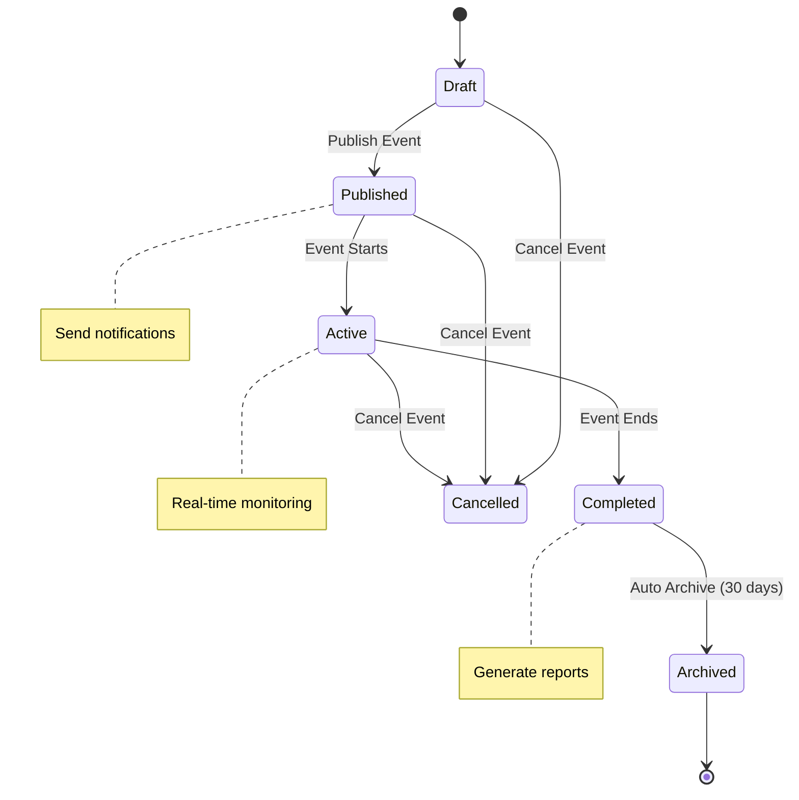
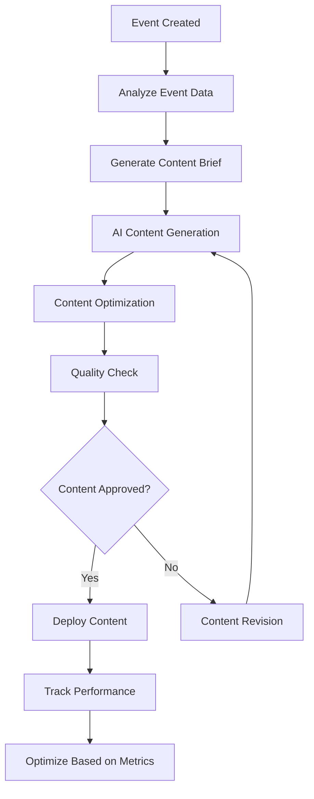

# 005 - EventOS Intermediate Workflows

**Purpose:** Automations, Supabase triggers, data flow patterns, and intermediate-level features that enhance the core MVP functionality.

---

## 🔄 **Automated Workflows Overview**

EventOS intermediate workflows focus on reducing manual work through intelligent automation:

1. **Event Lifecycle Automation** - Automated status updates and notifications
2. **Booking Management Automation** - Smart ticket allocation and customer communication
3. **Analytics Automation** - Real-time data processing and insights generation
4. **Content Generation Automation** - AI-powered content creation and optimization

---

## 🎯 **Event Lifecycle Automation**

### **Purpose**
Automatically manage event status changes, notifications, and follow-up actions based on predefined rules and triggers.

### **Event Status Workflow**


### **Supabase Trigger Implementation**
```sql
-- Event status change trigger
CREATE OR REPLACE FUNCTION handle_event_status_change()
RETURNS TRIGGER AS $$
BEGIN
  -- Send notification when event is published
  IF NEW.status = 'published' AND OLD.status = 'draft' THEN
    PERFORM pg_notify('event_published', json_build_object(
      'event_id', NEW.id,
      'title', NEW.title,
      'organizer_id', NEW.organizer_id
    )::text);
  END IF;
  
  -- Send notification when event is cancelled
  IF NEW.status = 'cancelled' AND OLD.status != 'cancelled' THEN
    PERFORM pg_notify('event_cancelled', json_build_object(
      'event_id', NEW.id,
      'title', NEW.title,
      'attendee_count', (
        SELECT COUNT(*) FROM orders 
        WHERE event_id = NEW.id AND status = 'confirmed'
      )
    )::text);
  END IF;
  
  RETURN NEW;
END;
$$ LANGUAGE plpgsql;

-- Create trigger
CREATE TRIGGER event_status_change_trigger
  AFTER UPDATE ON events
  FOR EACH ROW
  EXECUTE FUNCTION handle_event_status_change();
```

### **Frontend Event Status Management**
```typescript
// src/features/events/hooks/useEventStatusManagement.ts
export const useEventStatusManagement = (eventId: string) => {
  const supabase = useSupabaseClient();
  
  const updateEventStatus = async (status: EventStatus) => {
    const { error } = await supabase
      .from('events')
      .update({ status })
      .eq('id', eventId);
    
    if (error) throw error;
    
    // Trigger status-specific actions
    switch (status) {
      case 'published':
        await notifyEventPublished(eventId);
        break;
      case 'cancelled':
        await handleEventCancellation(eventId);
        break;
      case 'completed':
        await generateEventReport(eventId);
        break;
    }
  };
  
  const notifyEventPublished = async (eventId: string) => {
    // Send email notifications to subscribers
    await supabase.functions.invoke('send-event-notifications', {
      body: { eventId, type: 'published' }
    });
  };
  
  const handleEventCancellation = async (eventId: string) => {
    // Process refunds and notify attendees
    await supabase.functions.invoke('handle-cancellation', {
      body: { eventId }
    });
  };
  
  return { updateEventStatus };
};
```

---

## 🎫 **Booking Management Automation**

### **Purpose**
Automate ticket allocation, payment processing, and customer communication to reduce manual overhead.

### **Smart Ticket Allocation**
```typescript
// src/features/bookings/hooks/useSmartTicketAllocation.ts
export const useSmartTicketAllocation = () => {
  const allocateTickets = async (orderData: OrderData) => {
    // Check ticket availability
    const availableTickets = await checkTicketAvailability(orderData.eventId);
    
    if (availableTickets < orderData.quantity) {
      // Try to allocate from waitlist
      const waitlistAllocation = await allocateFromWaitlist(orderData);
      if (waitlistAllocation.success) {
        return { success: true, source: 'waitlist' };
      }
      
      // Add to waitlist if no tickets available
      await addToWaitlist(orderData);
      return { success: false, reason: 'sold_out', waitlistPosition: waitlistAllocation.position };
    }
    
    // Allocate tickets normally
    const allocation = await performTicketAllocation(orderData);
    return { success: true, tickets: allocation.tickets };
  };
  
  const checkTicketAvailability = async (eventId: string) => {
    const { data } = await supabase
      .from('tickets')
      .select('quantity_available, quantity_sold')
      .eq('event_id', eventId)
      .eq('status', 'active');
    
    return data?.reduce((total, ticket) => 
      total + (ticket.quantity_available - ticket.quantity_sold), 0
    ) || 0;
  };
  
  return { allocateTickets };
};
```

### **Automated Customer Communication**
```typescript
// src/features/bookings/hooks/useCustomerCommunication.ts
export const useCustomerCommunication = () => {
  const sendBookingConfirmation = async (orderId: string) => {
    const order = await getOrderDetails(orderId);
    const event = await getEventDetails(order.event_id);
    
    // Generate personalized confirmation email
    const emailContent = await generateConfirmationEmail(order, event);
    
    // Send email via Supabase Edge Function
    await supabase.functions.invoke('send-email', {
      body: {
        to: order.customer_email,
        subject: `Booking Confirmation: ${event.title}`,
        template: 'booking-confirmation',
        data: {
          order,
          event,
          tickets: order.tickets,
          qrCodes: await generateQRCodes(order.tickets)
        }
      }
    });
  };
  
  const sendReminderNotifications = async (eventId: string) => {
    // Send 24-hour reminder
    await scheduleNotification(eventId, '24_hour_reminder');
    
    // Send 2-hour reminder
    await scheduleNotification(eventId, '2_hour_reminder');
  };
  
  return { sendBookingConfirmation, sendReminderNotifications };
};
```

---

## 📊 **Analytics Automation**

### **Purpose**
Automatically process and analyze event data to provide real-time insights and recommendations.

### **Real-time Analytics Processing**
```sql
-- Analytics aggregation function
CREATE OR REPLACE FUNCTION update_event_analytics()
RETURNS TRIGGER AS $$
BEGIN
  -- Update event metrics when new booking is created
  IF TG_TABLE_NAME = 'orders' AND TG_OP = 'INSERT' THEN
    UPDATE events SET
      total_bookings = total_bookings + NEW.quantity,
      total_revenue = total_revenue + NEW.total_amount,
      last_booking_at = NOW()
    WHERE id = NEW.event_id;
  END IF;
  
  -- Update conversion metrics
  IF TG_TABLE_NAME = 'event_views' AND TG_OP = 'INSERT' THEN
    UPDATE events SET
      total_views = total_views + 1,
      conversion_rate = (
        SELECT (COUNT(*)::float / GREATEST(total_views, 1)) * 100
        FROM orders
        WHERE event_id = NEW.event_id AND status = 'confirmed'
      )
    WHERE id = NEW.event_id;
  END IF;
  
  RETURN COALESCE(NEW, OLD);
END;
$$ LANGUAGE plpgsql;

-- Create triggers for analytics
CREATE TRIGGER orders_analytics_trigger
  AFTER INSERT ON orders
  FOR EACH ROW
  EXECUTE FUNCTION update_event_analytics();

CREATE TRIGGER views_analytics_trigger
  AFTER INSERT ON event_views
  FOR EACH ROW
  EXECUTE FUNCTION update_event_analytics();
```

### **Automated Insights Generation**
```typescript
// src/features/analytics/hooks/useInsightsGeneration.ts
export const useInsightsGeneration = () => {
  const generateInsights = async (eventId: string) => {
    const analytics = await getEventAnalytics(eventId);
    
    const insights = await Promise.all([
      generateBookingInsights(analytics.bookings),
      generateRevenueInsights(analytics.revenue),
      generateAttendanceInsights(analytics.attendance),
      generateMarketingInsights(analytics.marketing)
    ]);
    
    // Store insights in database
    await supabase
      .from('event_insights')
      .upsert({
        event_id: eventId,
        insights: insights.flat(),
        generated_at: new Date().toISOString()
      });
    
    return insights.flat();
  };
  
  const generateBookingInsights = async (bookingData: any[]) => {
    const insights = [];
    
    // Peak booking times
    const peakHours = analyzeBookingPatterns(bookingData);
    if (peakHours.length > 0) {
      insights.push({
        type: 'booking_pattern',
        title: 'Peak Booking Times',
        description: `Most bookings occur between ${peakHours[0]} and ${peakHours[1]}`,
        recommendation: 'Consider promoting events during these hours'
      });
    }
    
    return insights;
  };
  
  return { generateInsights };
};
```

---

## 🤖 **Content Generation Automation**

### **Purpose**
Automatically generate and optimize event content using AI to improve engagement and conversion rates.

### **AI Content Generation Workflow**


### **Content Generation Implementation**
```typescript
// src/features/content/hooks/useContentGeneration.ts
export const useContentGeneration = () => {
  const generateEventContent = async (eventData: EventData) => {
    const contentBrief = await createContentBrief(eventData);
    
    const generatedContent = await Promise.all([
      generateDescription(eventData, contentBrief),
      generateMarketingCopy(eventData, contentBrief),
      generateSocialMediaPosts(eventData, contentBrief),
      generateEmailTemplates(eventData, contentBrief)
    ]);
    
    // Store generated content
    await supabase
      .from('generated_content')
      .insert({
        event_id: eventData.id,
        content_type: 'event_content',
        content: generatedContent,
        generated_at: new Date().toISOString()
      });
    
    return generatedContent;
  };
  
  const createContentBrief = async (eventData: EventData) => {
    return {
      targetAudience: analyzeTargetAudience(eventData),
      keyMessages: extractKeyMessages(eventData),
      tone: determineContentTone(eventData),
      goals: defineContentGoals(eventData)
    };
  };
  
  const generateDescription = async (eventData: EventData, brief: ContentBrief) => {
    const prompt = `
      Generate an engaging event description for:
      Title: ${eventData.title}
      Type: ${eventData.eventType}
      Audience: ${brief.targetAudience}
      Tone: ${brief.tone}
      
      Requirements:
      - 200-300 words
      - Include key benefits
      - Call-to-action
      - SEO optimized
    `;
    
    const response = await supabase.functions.invoke('generate-content', {
      body: { prompt, type: 'description' }
    });
    
    return response.data;
  };
  
  return { generateEventContent };
};
```

---

## 🔄 **Data Flow Automation**

### **Purpose**
Ensure data consistency and real-time updates across all system components.

### **Real-time Data Synchronization**
```typescript
// src/hooks/useRealtimeSync.ts
export const useRealtimeSync = () => {
  const supabase = useSupabaseClient();
  
  useEffect(() => {
    // Subscribe to event updates
    const eventSubscription = supabase
      .channel('event-updates')
      .on('postgres_changes', 
        { event: '*', schema: 'public', table: 'events' },
        (payload) => {
          queryClient.invalidateQueries(['events']);
          toast.info('Event updated');
        }
      )
      .subscribe();
    
    // Subscribe to booking updates
    const bookingSubscription = supabase
      .channel('booking-updates')
      .on('postgres_changes',
        { event: '*', schema: 'public', table: 'orders' },
        (payload) => {
          queryClient.invalidateQueries(['bookings']);
          queryClient.invalidateQueries(['dashboard-stats']);
        }
      )
      .subscribe();
    
    return () => {
      eventSubscription.unsubscribe();
      bookingSubscription.unsubscribe();
    };
  }, [supabase]);
};
```

---

## ✅ **Workflow Validation**

### **Success Criteria**
- ✅ Event status changes trigger appropriate actions within 5 seconds
- ✅ Ticket allocation accuracy > 99%
- ✅ Customer notifications sent within 2 minutes of booking
- ✅ Analytics data updated in real-time
- ✅ Content generation completed within 30 seconds

### **Testing Commands**
```bash
# Test automation workflows
npm run test:e2e -- --grep "Automation"

# Test real-time updates
npm run test:e2e -- --grep "Real-time"

# Test content generation
npm run test:unit -- --grep "Content Generation"

# Test analytics automation
npm run test:unit -- --grep "Analytics"
```

---

**Next Step:** Review [006-advanced-features.md](006-advanced-features.md) to understand AI agents and advanced capabilities.

---

**Generated:** 2025-01-17  
**Version:** MVP 1.0  
**Status:** Intermediate Workflows Complete
