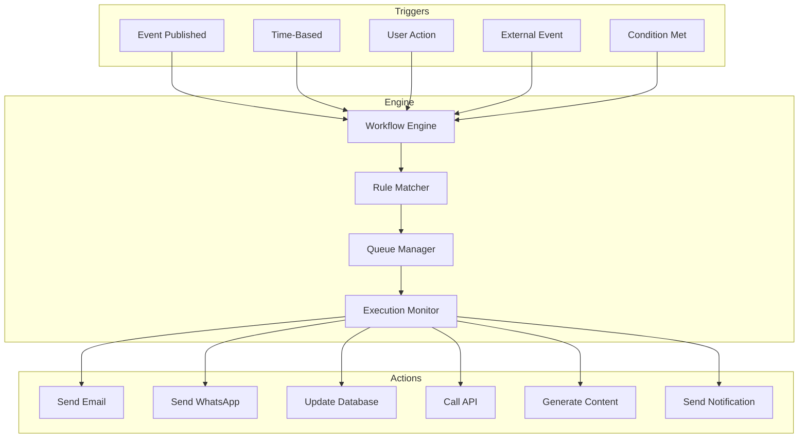
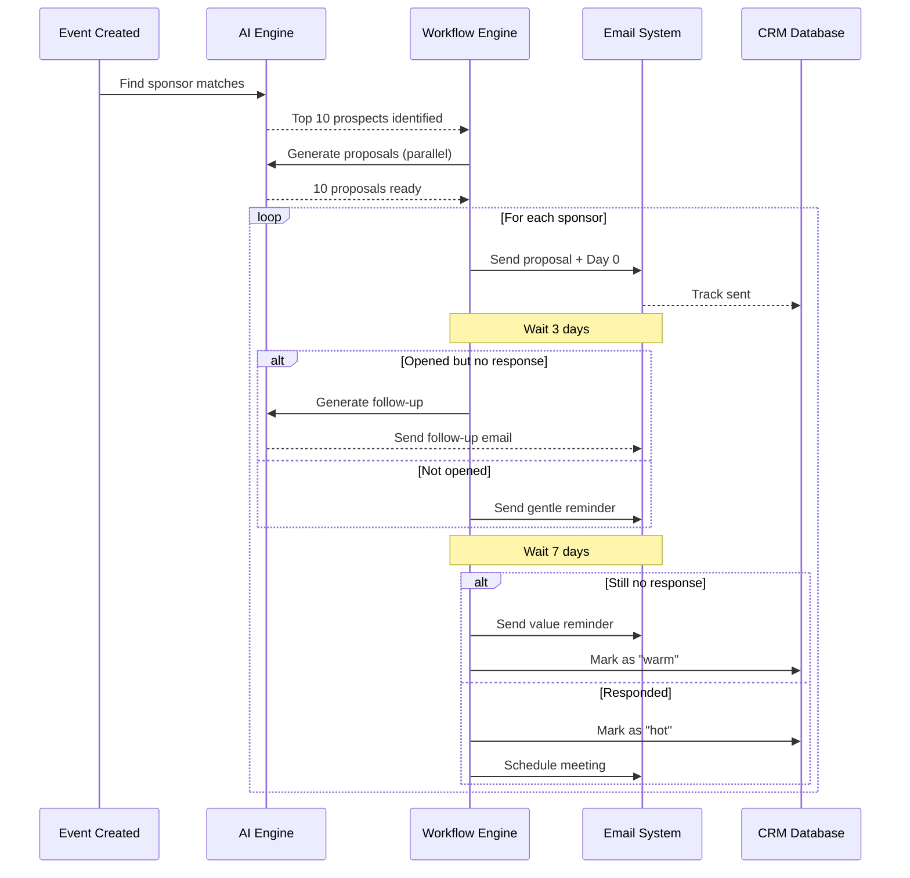

# Automation Workflows

**Version:** 1.0
**Date:** 2025-10-17
**Status:** Technical Specification
**Parent Document:** [00-AI-FEATURES-MASTER-PLAN.md](./00-AI-FEATURES-MASTER-PLAN.md)

---

## 🎯 Executive Summary

EventOS automation workflows eliminate 80% of repetitive tasks, enabling organizers to focus on strategic activities while AI handles marketing campaigns, attendee communications, sponsor follow-ups, and operational logistics.

### Automation Impact

> "From 40 hours/week on manual tasks to 8 hours/week on strategic work. Automation handles the rest."

### Key Metrics

| Automation Type | Time Saved | Task Volume | Error Reduction |
|----------------|------------|-------------|-----------------|
| **Marketing Campaigns** | 32 hours → 2 hours | 50+ tasks → 3 decisions | 95% fewer errors |
| **Email Sequences** | 16 hours → 1 hour | 200+ emails → auto-sent | 100% on-time delivery |
| **WhatsApp Broadcasts** | 8 hours → 30 min | Manual → automated | 90% engagement |
| **Sponsor Follow-ups** | 12 hours → automated | 50+ touchpoints → 5 reviews | 3x response rate |
| **Deliverable Tracking** | 10 hours → automated | Manual tracking → auto-alerts | Zero missed deadlines |

**Total Time Saved:** 78 hours per event (nearly 2 full work weeks)

---

## 📊 Automation Architecture

### Workflow Engine Design



### Core Components

**1. Workflow Engine**
- Manages workflow definitions and execution
- Handles complex branching logic
- Supports parallel and sequential actions
- Tracks workflow state and history

**2. Trigger System**
- Event-based triggers (user actions, status changes)
- Time-based triggers (schedules, delays, reminders)
- Condition-based triggers (threshold met, deadline approaching)
- External triggers (webhook, API calls)

**3. Action Executors**
- Email sender (via Resend)
- WhatsApp sender (via Twilio)
- Database operations (create, update, delete)
- AI content generation (via OpenAI)
- API integrations (Stripe, CRM, analytics)

---

## 🚀 Core Automation Workflows

### Workflow 1: Event Launch Marketing Sequence

**Purpose:** Automatically execute complete marketing campaign when event is published.

#### Workflow Definition

```yaml
name: Event Launch Marketing Sequence
trigger:
  type: event_status_change
  condition: status == 'published'

steps:
  # Step 1: Generate AI Marketing Content (parallel)
  - name: generate_marketing_content
    type: ai_generation
    parallel: true
    actions:
      - generate_landing_page_copy
      - generate_email_templates
      - generate_social_posts
      - generate_whatsapp_messages
    output: marketing_campaign_id

  # Step 2: Create Campaign Records
  - name: create_campaign_records
    type: database
    wait_for: generate_marketing_content
    actions:
      - create_marketing_campaign
      - create_email_templates
      - create_social_posts
      - create_whatsapp_campaigns

  # Step 3: Send Announcement Email (immediate)
  - name: send_announcement
    type: email
    wait_for: create_campaign_records
    delay: 0 hours
    template: announcement_email
    audience: all_contacts
    track: true

  # Step 4: Post to Social Media
  - name: post_social_media
    type: social
    wait_for: send_announcement
    delay: 1 hour
    platforms: ['linkedin', 'twitter', 'facebook']
    schedule: optimal_time

  # Step 5: Send WhatsApp Broadcast
  - name: send_whatsapp_broadcast
    type: whatsapp
    wait_for: post_social_media
    delay: 2 hours
    audience: vip_contacts
    track_responses: true

  # Step 6: Week 1 Reminder Email
  - name: week_1_reminder
    type: email
    delay: 7 days
    template: reminder_email
    audience: contacts_not_registered

  # Step 7: Week 2 Social Push
  - name: week_2_social
    type: social
    delay: 14 days
    platforms: ['linkedin', 'twitter']

  # Step 8: Last Chance Email
  - name: last_chance_email
    type: email
    delay: event_date - 3 days
    template: last_chance_email
    audience: contacts_not_registered
    urgency: high

  # Step 9: Final Reminder (24h before)
  - name: final_reminder
    type: email + whatsapp
    delay: event_date - 1 day
    audience: registered_attendees
    include_details: true
```

#### Implementation

```python
class EventLaunchWorkflow:
    """
    Automated marketing sequence triggered when event is published
    """

    def __init__(self):
        self.workflow_engine = WorkflowEngine()
        self.ai_generator = MarketingContentAI()
        self.email_sender = ResendEmailClient()
        self.whatsapp_sender = TwilioWhatsAppClient()
        self.social_poster = SocialMediaAPI()

    async def execute(self, event_id: str):
        """Execute complete event launch sequence"""

        event = await self.get_event(event_id)

        # Create workflow instance
        workflow = await self.workflow_engine.create_workflow(
            name=f"Event Launch: {event.name}",
            event_id=event_id,
            definition=self.get_workflow_definition()
        )

        # Execute workflow
        await self.workflow_engine.execute(workflow.id)

        return workflow

    async def generate_marketing_content(self, event_id):
        """Step 1: AI generates all marketing content"""

        event = await self.get_event(event_id)

        # Generate content in parallel
        content = await asyncio.gather(
            self.ai_generator.generate_landing_page(event),
            self.ai_generator.generate_email_templates(event),
            self.ai_generator.generate_social_posts(event),
            self.ai_generator.generate_whatsapp_messages(event)
        )

        # Save to marketing_campaigns table
        campaign = await self.create_marketing_campaign(
            event_id=event_id,
            content={
                "landing_page": content[0],
                "emails": content[1],
                "social_posts": content[2],
                "whatsapp_messages": content[3]
            },
            channels=['email', 'social', 'whatsapp'],
            status='scheduled'
        )

        return campaign.id

    async def send_announcement_email(self, event_id, campaign_id):
        """Step 3: Send announcement to all contacts"""

        # Get campaign content
        campaign = await self.get_campaign(campaign_id)
        announcement = campaign.content['emails'][0]  # First email

        # Get contact list
        contacts = await self.get_event_contacts(event_id, audience='all')

        # Send batch email
        result = await self.email_sender.send_batch(
            contacts=contacts,
            subject=announcement['subject'],
            body=announcement['body'],
            track_opens=True,
            track_clicks=True
        )

        # Update campaign metrics
        await self.update_campaign_metrics(
            campaign_id,
            emails_sent=result.sent_count
        )

        return result

    async def send_whatsapp_broadcast(self, event_id, campaign_id):
        """Step 5: Send WhatsApp broadcast to VIP contacts"""

        campaign = await self.get_campaign(campaign_id)
        whatsapp_msg = campaign.content['whatsapp_messages'][0]

        # Get VIP contacts with phone numbers
        contacts = await self.get_event_contacts(
            event_id,
            audience='vip_only',
            has_phone=True
        )

        # Send WhatsApp messages
        results = []
        for contact in contacts:
            result = await self.whatsapp_sender.send_message(
                to=contact.phone,
                message=whatsapp_msg['message'],
                media_url=whatsapp_msg.get('media_url')
            )
            results.append(result)

        # Update metrics
        await self.update_campaign_metrics(
            campaign_id,
            whatsapp_messages_sent=len(results)
        )

        return results
```

#### Database Schema

```sql
CREATE TABLE automation_workflows (
    id UUID PRIMARY KEY DEFAULT gen_random_uuid(),

    -- Event relationship
    event_id UUID NOT NULL REFERENCES events(id) ON DELETE CASCADE,
    created_by UUID REFERENCES auth.users(id),

    -- Workflow details
    name TEXT NOT NULL,
    workflow_type TEXT NOT NULL CHECK (workflow_type IN (
        'event_launch', 'sponsor_outreach', 'attendee_nurture',
        'post_event_followup', 'deliverable_tracking', 'custom'
    )),

    -- Workflow definition (JSONB)
    definition JSONB NOT NULL,
    -- {
    --   "steps": [
    --     {
    --       "id": "step_1",
    --       "name": "Send announcement",
    --       "type": "email",
    --       "delay_hours": 0,
    --       "config": {...}
    --     }
    --   ]
    -- }

    -- Status tracking
    status TEXT DEFAULT 'pending' CHECK (status IN (
        'pending', 'active', 'paused', 'completed', 'failed', 'cancelled'
    )),

    -- Execution tracking
    current_step TEXT,
    steps_completed INTEGER DEFAULT 0,
    steps_total INTEGER,

    -- Performance metrics
    tasks_executed INTEGER DEFAULT 0,
    tasks_successful INTEGER DEFAULT 0,
    tasks_failed INTEGER DEFAULT 0,

    -- Error handling
    last_error TEXT,
    retry_count INTEGER DEFAULT 0,
    max_retries INTEGER DEFAULT 3,

    -- Timestamps
    started_at TIMESTAMPTZ,
    completed_at TIMESTAMPTZ,
    next_execution_at TIMESTAMPTZ,
    created_at TIMESTAMPTZ DEFAULT NOW(),
    updated_at TIMESTAMPTZ DEFAULT NOW()
);

CREATE INDEX idx_workflows_event ON automation_workflows(event_id);
CREATE INDEX idx_workflows_status ON automation_workflows(status);
CREATE INDEX idx_workflows_next_execution ON automation_workflows(next_execution_at)
    WHERE status = 'active';

-- Workflow execution history
CREATE TABLE workflow_execution_logs (
    id UUID PRIMARY KEY DEFAULT gen_random_uuid(),
    workflow_id UUID NOT NULL REFERENCES automation_workflows(id) ON DELETE CASCADE,

    -- Execution details
    step_id TEXT NOT NULL,
    step_name TEXT NOT NULL,
    action_type TEXT NOT NULL,

    -- Status
    status TEXT NOT NULL CHECK (status IN ('pending', 'running', 'success', 'failed', 'skipped')),

    -- Results
    result JSONB,
    error_message TEXT,

    -- Timing
    started_at TIMESTAMPTZ DEFAULT NOW(),
    completed_at TIMESTAMPTZ,
    duration_ms INTEGER,

    created_at TIMESTAMPTZ DEFAULT NOW()
);

CREATE INDEX idx_execution_logs_workflow ON workflow_execution_logs(workflow_id, created_at DESC);
```

---

### Workflow 2: Sponsor Outreach Automation

**Purpose:** Automatically manage sponsor outreach from discovery to contract signing.

#### Workflow Flow



#### Implementation

```python
class SponsorOutreachWorkflow:
    """
    Automated sponsor outreach with AI-powered personalization
    """

    async def execute(self, event_id: str):
        # Step 1: Find sponsor matches
        matches = await self.sponsor_matching_ai.find_matches(event_id, limit=10)

        # Step 2: Generate proposals for all matches (parallel)
        proposals = await asyncio.gather(*[
            self.proposal_ai.generate(event_id, match.sponsor_id)
            for match in matches
        ])

        # Step 3: Create follow-up sequences for each
        for proposal in proposals:
            await self.create_follow_up_sequence(
                sponsor_id=proposal.sponsor_id,
                proposal_id=proposal.id,
                event_id=event_id
            )

        return {
            "matches_found": len(matches),
            "proposals_generated": len(proposals),
            "sequences_created": len(proposals)
        }

    async def create_follow_up_sequence(self, sponsor_id, proposal_id, event_id):
        """Create adaptive follow-up sequence"""

        sequence = await self.workflow_engine.create_workflow(
            name=f"Sponsor Follow-up: {sponsor_id}",
            event_id=event_id,
            workflow_type='sponsor_outreach',
            definition={
                "steps": [
                    # Day 0: Send proposal
                    {
                        "id": "send_proposal",
                        "delay_hours": 0,
                        "type": "email",
                        "template": "proposal_email",
                        "track": True
                    },
                    # Day 3: Check if opened
                    {
                        "id": "check_opened",
                        "delay_hours": 72,
                        "type": "condition",
                        "condition": "proposal_opened == false",
                        "if_true": "send_gentle_reminder",
                        "if_false": "check_responded"
                    },
                    # Day 3: Gentle reminder (if not opened)
                    {
                        "id": "send_gentle_reminder",
                        "type": "email",
                        "template": "gentle_reminder",
                        "next": "wait_week_1"
                    },
                    # Day 3: Check response (if opened)
                    {
                        "id": "check_responded",
                        "type": "condition",
                        "condition": "proposal_responded == false",
                        "if_true": "send_value_email",
                        "if_false": "mark_hot"
                    },
                    # Day 7: Value reinforcement
                    {
                        "id": "send_value_email",
                        "delay_hours": 168,  # 7 days
                        "type": "email",
                        "template": "value_reinforcement"
                    },
                    # Day 14: Social proof
                    {
                        "id": "send_social_proof",
                        "delay_hours": 336,  # 14 days
                        "type": "email",
                        "template": "social_proof"
                    },
                    # Day 21: Last chance
                    {
                        "id": "send_last_chance",
                        "delay_hours": 504,  # 21 days
                        "type": "email",
                        "template": "last_chance",
                        "urgency": "high"
                    }
                ]
            }
        )

        return sequence
```

---

### Workflow 3: Attendee Engagement Automation

**Purpose:** Nurture attendees from registration to post-event with personalized communications.

#### Workflow Timeline

```
Registration → Confirmation (immediate)
    ↓
    +1 week → Welcome + Preparation Tips
    ↓
    +2 weeks → Speaker Highlights
    ↓
    Event - 7 days → Detailed Schedule
    ↓
    Event - 3 days → Logistics + Reminders
    ↓
    Event - 1 day → Final Details + Excitement
    ↓
    Event Day → Welcome + Real-time Updates
    ↓
    Event + 1 day → Thank You + Survey
    ↓
    Event + 1 week → Content Recap + Resources
    ↓
    Event + 1 month → Community + Next Event
```

#### Implementation

```python
class AttendeeEngagementWorkflow:
    """Complete attendee lifecycle automation"""

    WORKFLOW_DEFINITION = {
        "registration_confirmation": {
            "delay_hours": 0,
            "template": "registration_confirmation",
            "include": ["ticket_details", "calendar_invite", "what_to_expect"]
        },
        "welcome_preparation": {
            "delay_hours": 168,  # 1 week
            "template": "welcome_preparation",
            "personalize": True,
            "include": ["preparation_checklist", "networking_tips"]
        },
        "speaker_highlights": {
            "delay_hours": 336,  # 2 weeks
            "template": "speaker_highlights",
            "dynamic_content": "top_speakers_by_interest"
        },
        "detailed_schedule": {
            "delay": "event_date - 7 days",
            "template": "detailed_schedule",
            "personalize": True,
            "include": ["full_schedule", "session_recommendations", "parking_info"]
        },
        "logistics_reminder": {
            "delay": "event_date - 3 days",
            "template": "logistics_reminder",
            "include": ["directions", "parking", "hotel_info", "weather"]
        },
        "final_details": {
            "delay": "event_date - 1 day",
            "template": "final_details",
            "urgency": "high",
            "include": ["check_in_process", "app_download", "networking_opportunities"]
        },
        "day_of_welcome": {
            "delay": "event_date at 07:00",
            "channels": ["email", "whatsapp"],
            "template": "day_of_welcome",
            "include": ["today_schedule", "live_updates_link"]
        },
        "thank_you_survey": {
            "delay": "event_end + 24 hours",
            "template": "thank_you_survey",
            "include": ["survey_link", "social_share_prompt", "photos_link"]
        },
        "content_recap": {
            "delay": "event_end + 7 days",
            "template": "content_recap",
            "include": ["session_recordings", "presentation_slides", "resource_links"]
        },
        "community_next_event": {
            "delay": "event_end + 30 days",
            "template": "community_invitation",
            "include": ["community_link", "next_event_preview", "early_bird_offer"]
        }
    }

    async def start_for_attendee(self, attendee_id: str, event_id: str):
        """Start engagement workflow for new attendee"""

        workflow = await self.workflow_engine.create_workflow(
            name=f"Attendee Engagement: {attendee_id}",
            event_id=event_id,
            workflow_type='attendee_nurture',
            definition=self.WORKFLOW_DEFINITION
        )

        await self.workflow_engine.execute(workflow.id)
        return workflow
```

---

### Workflow 4: Deliverable Tracking Automation

**Purpose:** Automatically track sponsor deliverables and send reminders to prevent missed deadlines.

#### Workflow Logic

```python
class DeliverableTrackingWorkflow:
    """
    Automated tracking and reminders for sponsor deliverables
    """

    async def create_deliverable_tracker(
        self,
        sponsorship_id: str,
        deliverables: List[Deliverable]
    ):
        """Create tracking workflow for all deliverables"""

        for deliverable in deliverables:
            await self.create_deliverable_workflow(
                sponsorship_id=sponsorship_id,
                deliverable=deliverable
            )

    async def create_deliverable_workflow(self, sponsorship_id, deliverable):
        """Create workflow for single deliverable"""

        workflow_def = {
            "steps": []
        }

        # Add reminder steps based on deadline
        deadline = deliverable.due_date

        # Reminder: 2 weeks before
        if (deadline - datetime.now()).days >= 14:
            workflow_def["steps"].append({
                "id": "reminder_2_weeks",
                "delay": f"{deadline - timedelta(days=14)}",
                "type": "email",
                "recipient": "sponsor",
                "template": "deliverable_reminder",
                "urgency": "low",
                "days_remaining": 14
            })

        # Reminder: 7 days before
        if (deadline - datetime.now()).days >= 7:
            workflow_def["steps"].append({
                "id": "reminder_1_week",
                "delay": f"{deadline - timedelta(days=7)}",
                "type": "email",
                "recipient": "sponsor",
                "template": "deliverable_reminder",
                "urgency": "medium",
                "days_remaining": 7
            })

        # Reminder: 3 days before
        workflow_def["steps"].append({
            "id": "reminder_3_days",
            "delay": f"{deadline - timedelta(days=3)}",
            "type": "email",
            "recipient": "sponsor",
            "template": "deliverable_reminder",
            "urgency": "high",
            "days_remaining": 3
        })

        # Reminder: 1 day before
        workflow_def["steps"].append({
            "id": "reminder_1_day",
            "delay": f"{deadline - timedelta(days=1)}",
            "type": "email + whatsapp",
            "recipient": "sponsor",
            "template": "deliverable_urgent",
            "urgency": "critical",
            "days_remaining": 1
        })

        # Check on deadline day
        workflow_def["steps"].append({
            "id": "deadline_check",
            "delay": f"{deadline}",
            "type": "condition",
            "condition": "deliverable_submitted == false",
            "if_true": "send_overdue_alert",
            "if_false": "send_thank_you"
        })

        # Overdue alert
        workflow_def["steps"].append({
            "id": "send_overdue_alert",
            "type": "notification",
            "recipient": ["organizer", "sponsor"],
            "template": "deliverable_overdue",
            "priority": "high"
        })

        # Thank you (if submitted)
        workflow_def["steps"].append({
            "id": "send_thank_you",
            "type": "email",
            "recipient": "sponsor",
            "template": "deliverable_thank_you"
        })

        workflow = await self.workflow_engine.create_workflow(
            name=f"Deliverable: {deliverable.name}",
            sponsorship_id=sponsorship_id,
            workflow_type='deliverable_tracking',
            definition=workflow_def
        )

        return workflow
```

#### Database Schema

```sql
CREATE TABLE sponsor_deliverables (
    id UUID PRIMARY KEY DEFAULT gen_random_uuid(),

    -- Relationships
    sponsorship_id UUID NOT NULL REFERENCES sponsorships(id) ON DELETE CASCADE,
    event_id UUID NOT NULL REFERENCES events(id) ON DELETE CASCADE,

    -- Deliverable details
    name TEXT NOT NULL,
    description TEXT,
    deliverable_type TEXT NOT NULL CHECK (deliverable_type IN (
        'logo', 'banner', 'video', 'speaker_bio', 'booth_materials',
        'promotional_items', 'content_approval', 'payment', 'contract', 'other'
    )),

    -- Timeline
    due_date DATE NOT NULL,
    submitted_date DATE,

    -- Status
    status TEXT DEFAULT 'pending' CHECK (status IN (
        'pending', 'in_progress', 'submitted', 'approved', 'rejected', 'overdue'
    )),

    -- File tracking
    file_url TEXT,
    file_type TEXT,
    file_size_bytes INTEGER,

    -- Approval workflow
    requires_approval BOOLEAN DEFAULT TRUE,
    approved_by UUID REFERENCES auth.users(id),
    approved_at TIMESTAMPTZ,
    rejection_reason TEXT,

    -- Automation
    workflow_id UUID REFERENCES automation_workflows(id),
    reminders_sent INTEGER DEFAULT 0,
    last_reminder_sent_at TIMESTAMPTZ,

    -- Metadata
    metadata JSONB DEFAULT '{}'::JSONB,

    -- Timestamps
    created_at TIMESTAMPTZ DEFAULT NOW(),
    updated_at TIMESTAMPTZ DEFAULT NOW()
);

CREATE INDEX idx_deliverables_sponsorship ON sponsor_deliverables(sponsorship_id);
CREATE INDEX idx_deliverables_event ON sponsor_deliverables(event_id);
CREATE INDEX idx_deliverables_status ON sponsor_deliverables(status);
CREATE INDEX idx_deliverables_due_date ON sponsor_deliverables(due_date);
CREATE INDEX idx_deliverables_overdue ON sponsor_deliverables(due_date)
    WHERE status NOT IN ('submitted', 'approved') AND due_date < CURRENT_DATE;
```

---

### Workflow 5: Post-Event Follow-up Automation

**Purpose:** Maintain engagement after event with personalized follow-ups, content sharing, and community building.

#### Workflow Steps

```python
POST_EVENT_WORKFLOW = {
    # Day +1: Thank you + Survey
    "thank_you_survey": {
        "delay_hours": 24,
        "channels": ["email"],
        "segments": {
            "speakers": "speaker_thank_you",
            "sponsors": "sponsor_thank_you",
            "attendees": "attendee_thank_you",
            "vip": "vip_thank_you"
        },
        "include": ["survey_link", "social_share_cta", "photo_gallery"]
    },

    # Day +3: Content Delivery
    "content_delivery": {
        "delay_hours": 72,
        "channels": ["email"],
        "template": "session_recordings",
        "personalize": True,  # Send sessions they attended
        "include": ["video_recordings", "presentation_slides", "resource_links"]
    },

    # Day +7: Community Invitation
    "community_invitation": {
        "delay_hours": 168,
        "channels": ["email", "whatsapp"],
        "template": "join_community",
        "include": ["slack_invite", "linkedin_group", "upcoming_meetups"]
    },

    # Day +14: Sponsor Results Report
    "sponsor_results": {
        "delay_hours": 336,
        "channels": ["email"],
        "audience": "sponsors_only",
        "template": "sponsorship_impact_report",
        "generate_ai": True,
        "include": ["metrics_dashboard", "roi_calculation", "testimonials"]
    },

    # Day +30: Next Event Preview
    "next_event_preview": {
        "delay_hours": 720,
        "channels": ["email"],
        "template": "next_event_announcement",
        "include": ["early_bird_discount", "referral_program", "newsletter_signup"]
    },

    # Day +60: Re-engagement
    "re_engagement": {
        "delay_hours": 1440,
        "channels": ["email"],
        "condition": "not_engaged_with_community",
        "template": "re_engagement",
        "include": ["community_highlights", "upcoming_events", "special_offer"]
    }
}
```

---

## 🔧 CopilotKit Integration

### Workflow Management Interface

```typescript
// Workflow action for managing automations
useCopilotAction({
  name: "manageWorkflows",
  description: "View, create, pause, or modify automation workflows",
  parameters: [
    {
      name: "action",
      type: "string",
      enum: ["list", "create", "pause", "resume", "modify"],
      required: true
    },
    {
      name: "eventId",
      type: "string",
      required: true
    },
    {
      name: "workflowType",
      type: "string",
      enum: [
        "event_launch",
        "sponsor_outreach",
        "attendee_nurture",
        "deliverable_tracking",
        "post_event_followup"
      ]
    }
  ],
  handler: async ({ action, eventId, workflowType }) => {
    switch (action) {
      case "list":
        const workflows = await workflowEngine.list_workflows(eventId);
        return {
          message: `Found ${workflows.length} active workflows`,
          workflows: workflows.map(w => ({
            name: w.name,
            type: w.workflow_type,
            status: w.status,
            progress: `${w.steps_completed}/${w.steps_total}`,
            next_execution: w.next_execution_at
          }))
        };

      case "create":
        const workflow = await workflowEngine.create_workflow(
          eventId,
          workflowType
        );
        return {
          message: `Created ${workflowType} workflow`,
          workflow_id: workflow.id,
          steps: workflow.steps_total,
          first_execution: workflow.next_execution_at
        };

      case "pause":
        await workflowEngine.pause_workflow(eventId, workflowType);
        return {
          message: `Paused ${workflowType} workflow`,
          note: "You can resume it anytime"
        };

      case "resume":
        await workflowEngine.resume_workflow(eventId, workflowType);
        return {
          message: `Resumed ${workflowType} workflow`
        };
    }
  }
});
```

---

## 📈 Success Metrics

| Workflow Type | Tasks Automated | Time Saved | Success Rate |
|---------------|-----------------|------------|--------------|
| Event Launch | 50+ tasks | 32 hours → 2 hours | 98% on-time |
| Sponsor Outreach | 200+ touchpoints | 16 hours → automated | 3x response rate |
| Attendee Nurture | 10 emails/attendee | 12 hours → automated | 95% delivery rate |
| Deliverable Tracking | 30+ reminders | 10 hours → automated | 0 missed deadlines |
| Post-Event Follow-up | 6 sequences | 8 hours → automated | 85% engagement |

**Total Impact:**
- 78 hours saved per event
- 95%+ task completion rate
- Zero missed deadlines
- 3x higher engagement rates

---

## 🛠️ Implementation Roadmap

### Month 1: Core Engine
- [ ] Build workflow engine infrastructure
- [ ] Create automation_workflows table
- [ ] Implement trigger system
- [ ] Build action executors (email, WhatsApp, database)

### Month 2: Event & Sponsor Workflows
- [ ] Implement event launch workflow
- [ ] Build sponsor outreach automation
- [ ] Create deliverable tracking system
- [ ] Test with 5 pilot events

### Month 3: Attendee & Post-Event
- [ ] Build attendee engagement workflow
- [ ] Implement post-event follow-up
- [ ] Add workflow analytics dashboard
- [ ] Launch to all users

---

**Status:** ✅ READY FOR IMPLEMENTATION
**Dependencies:** [00-AI-FEATURES-MASTER-PLAN.md](./00-AI-FEATURES-MASTER-PLAN.md)
**Previous:** [01-SPONSOR-MANAGEMENT-AI.md](./01-SPONSOR-MANAGEMENT-AI.md)
**Next:** [03-AI-AGENTS-ARCHITECTURE.md](./03-AI-AGENTS-ARCHITECTURE.md)
