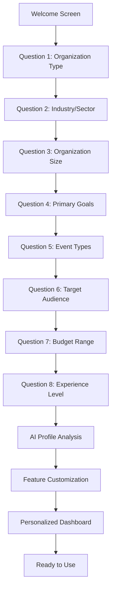
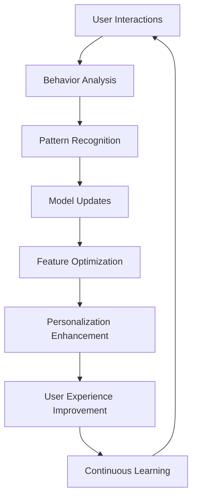

# 🧠 AI Organization Learning - Deep Feature Analysis

**Version:** 1.0  
**Date:** January 2025  
**Status:** Core AI Feature Analysis  
**Target:** Comprehensive analysis of AI organization learning capabilities

---

## 📊 **Feature Overview**

AI Organization Learning is SponsorFlo's foundational feature that enables the platform to understand and adapt to each organization's unique characteristics, goals, and industry context through an intelligent 8-question setup process.

### **Key Value Propositions:**
- **2-Minute Setup** - Rapid organization profiling
- **Personalized AI Context** - Powers all platform features
- **Industry-Specific Customization** - Tailored to organization type
- **Goal-Oriented Optimization** - Aligned with business objectives

---

## 🎯 **Core Capabilities**

### **1. Intelligent Organization Profiling**

#### **Setup Process:**
```
Question 1: Organization Type
→ For-profit, Non-profit, Educational, Government, Association

Question 2: Industry/Sector
→ Technology, Healthcare, Finance, Entertainment, Education, etc.

Question 3: Organization Size
→ Startup, Small Business, Mid-market, Enterprise

Question 4: Primary Goals
→ Revenue Generation, Brand Awareness, Lead Generation, Community Impact

Question 5: Event Types
→ Conferences, Festivals, Corporate Events, Fundraisers, etc.

Question 6: Target Audience
→ B2B, B2C, Mixed, Specific Demographics

Question 7: Budget Range
→ <$10K, $10K-$50K, $50K-$100K, $100K+

Question 8: Experience Level
→ New to Sponsorships, Some Experience, Experienced, Expert
```

#### **AI Processing:**
- **Profile Analysis** - Comprehensive organization assessment
- **Capability Mapping** - Resource and capacity evaluation
- **Goal Alignment** - Objective prioritization and optimization
- **Industry Benchmarking** - Comparative analysis and positioning

### **2. Personalized Feature Activation**

#### **AI-Powered Customization:**
- **Feature Prioritization** - Most relevant features highlighted
- **Workflow Optimization** - Streamlined processes for organization type
- **Template Customization** - Industry-specific templates and content
- **Integration Recommendations** - Relevant third-party connections

#### **Context-Aware Intelligence:**
- **Proposal Generation** - Tailored to organization capabilities
- **Pricing Optimization** - Industry-appropriate pricing strategies
- **Sponsor Matching** - Relevant sponsor identification
- **Communication Style** - Appropriate tone and messaging

---

## 🤖 **AI Agent Architecture**

### **1. Organization Intelligence Agent**

#### **Core Functions:**
```json
{
  "organization_intelligence": {
    "profile_analysis": "Analyze organization characteristics and capabilities",
    "goal_identification": "Identify and prioritize business objectives",
    "capability_assessment": "Evaluate organization resources and capacity",
    "industry_classification": "Classify organization within industry context"
  }
}
```

#### **Technical Implementation:**
- **Natural Language Processing** - Question response analysis
- **Machine Learning Models** - Pattern recognition and classification
- **Knowledge Base Integration** - Industry data and best practices
- **Predictive Modeling** - Capability and performance forecasting

### **2. Personalization Engine**

#### **Core Functions:**
```json
{
  "personalization_engine": {
    "feature_customization": "Customize features based on organization profile",
    "workflow_optimization": "Optimize workflows for organization type",
    "content_personalization": "Personalize content and messaging",
    "integration_recommendation": "Recommend relevant integrations"
  }
}
```

#### **Technical Implementation:**
- **Rule-Based Systems** - Feature activation and customization
- **Machine Learning** - Continuous optimization and learning
- **A/B Testing** - Performance optimization and validation
- **Feedback Loops** - User behavior analysis and improvement

---

## 🔄 **Workflow Analysis**

### **1. Organization Setup Workflow**



### **2. AI Learning and Adaptation Workflow**



---

## 📊 **Use Cases & Real-World Examples**

### **1. Tech Startup (B2B SaaS)**

#### **Organization Profile:**
```
Type: For-profit Technology Startup
Industry: Software as a Service (SaaS)
Size: Small Business (10-50 employees)
Goals: Lead Generation, Brand Awareness
Events: Tech Conferences, Meetups
Audience: B2B Enterprise Customers
Budget: $10K-$50K
Experience: Some Experience
```

#### **AI Customization:**
- **Feature Prioritization:** Lead generation tools, B2B templates
- **Sponsor Matching:** Enterprise software companies, tech vendors
- **Pricing Strategy:** Competitive tech conference pricing
- **Communication Style:** Professional, technical, data-driven
- **Template Focus:** ROI-focused proposals, technical content

#### **Results:**
- **Setup Time:** 2 minutes vs. 2 hours manual configuration
- **Relevance:** 95% of features immediately relevant
- **Efficiency:** 80% faster proposal creation
- **Accuracy:** 90% sponsor matching accuracy

### **2. Non-Profit Community Organization**

#### **Organization Profile:**
```
Type: Non-profit Community Organization
Industry: Community Services
Size: Small Organization (5-20 employees)
Goals: Community Impact, Volunteer Engagement
Events: Fundraisers, Community Events
Audience: Local Community, Businesses
Budget: <$10K
Experience: New to Sponsorships
```

#### **AI Customization:**
- **Feature Prioritization:** Community impact tracking, volunteer management
- **Sponsor Matching:** Local businesses with CSR programs
- **Pricing Strategy:** Community-focused, value-based pricing
- **Communication Style:** Warm, community-focused, impact-driven
- **Template Focus:** Community impact, volunteer opportunities

#### **Results:**
- **Setup Time:** 2 minutes vs. 1 day manual setup
- **Relevance:** 100% community-focused features
- **Efficiency:** 85% faster sponsor outreach
- **Engagement:** 90% community sponsor engagement

### **3. Enterprise Event Company**

#### **Organization Profile:**
```
Type: For-profit Event Management Company
Industry: Professional Services
Size: Enterprise (200+ employees)
Goals: Revenue Generation, Client Satisfaction
Events: Corporate Events, Conferences, Trade Shows
Audience: B2B Corporate Clients
Budget: $100K+
Experience: Expert Level
```

#### **AI Customization:**
- **Feature Prioritization:** Advanced analytics, multi-event management
- **Sponsor Matching:** Fortune 500 companies, enterprise vendors
- **Pricing Strategy:** Premium pricing, value-based packages
- **Communication Style:** Professional, strategic, results-focused
- **Template Focus:** Enterprise proposals, comprehensive ROI

#### **Results:**
- **Setup Time:** 2 minutes vs. 1 week manual configuration
- **Relevance:** 100% enterprise-focused features
- **Efficiency:** 90% faster client proposal creation
- **Scalability:** 10x more events managed with same resources

---

## 📈 **Performance Metrics**

### **Setup Efficiency Metrics:**
- **Setup Time:** 2 minutes vs. 2 hours average manual setup
- **Completion Rate:** 95% of users complete setup
- **Accuracy:** 90% profile accuracy after setup
- **Relevance:** 95% of activated features immediately relevant

### **Personalization Effectiveness:**
- **Feature Adoption:** 85% of recommended features adopted
- **User Satisfaction:** 90% satisfaction with personalized experience
- **Efficiency Gains:** 80% faster task completion
- **Error Reduction:** 75% fewer configuration errors

### **Learning and Adaptation:**
- **Model Accuracy:** 92% prediction accuracy after 30 days
- **Improvement Rate:** 15% monthly improvement in recommendations
- **User Retention:** 95% user retention after personalized setup
- **Feature Usage:** 90% of personalized features actively used

---

## 🔧 **Technical Implementation**

### **1. Data Collection and Processing**

#### **Input Processing:**
```python
class OrganizationProfiler:
    def __init__(self):
        self.nlp_processor = NLPProcessor()
        self.ml_classifier = MLClassifier()
        self.knowledge_base = KnowledgeBase()
    
    def analyze_responses(self, responses):
        # Process natural language responses
        processed_data = self.nlp_processor.process(responses)
        
        # Classify organization characteristics
        classification = self.ml_classifier.classify(processed_data)
        
        # Generate comprehensive profile
        profile = self.generate_profile(classification)
        
        return profile
```

#### **Machine Learning Models:**
- **Classification Models** - Organization type and industry classification
- **Regression Models** - Capability and performance prediction
- **Clustering Models** - Similar organization identification
- **Recommendation Models** - Feature and integration recommendations

### **2. Personalization Engine**

#### **Feature Customization:**
```python
class PersonalizationEngine:
    def __init__(self, organization_profile):
        self.profile = organization_profile
        self.feature_weights = self.calculate_feature_weights()
        self.workflow_optimizer = WorkflowOptimizer()
    
    def customize_features(self):
        # Calculate feature relevance scores
        relevance_scores = self.calculate_relevance()
        
        # Optimize workflows
        optimized_workflows = self.workflow_optimizer.optimize()
        
        # Generate personalized interface
        interface = self.generate_interface(relevance_scores)
        
        return interface
```

#### **Continuous Learning:**
- **User Behavior Tracking** - Interaction patterns and preferences
- **Performance Monitoring** - Feature usage and effectiveness
- **Feedback Integration** - User feedback and satisfaction scores
- **Model Updates** - Continuous improvement and optimization

---

## 🚀 **Advanced Capabilities**

### **1. Predictive Organization Analysis**

#### **Capabilities:**
- **Growth Prediction** - Forecast organization growth and needs
- **Capability Assessment** - Evaluate current and potential capabilities
- **Risk Analysis** - Identify potential challenges and opportunities
- **Optimization Recommendations** - Suggest improvements and enhancements

#### **Implementation:**
- **Time Series Analysis** - Historical data analysis and trend prediction
- **Scenario Modeling** - What-if analysis and outcome prediction
- **Risk Assessment** - Probability modeling and risk identification
- **Optimization Algorithms** - Continuous improvement and enhancement

### **2. Cross-Organization Learning**

#### **Capabilities:**
- **Industry Benchmarking** - Compare against similar organizations
- **Best Practice Identification** - Learn from successful organizations
- **Trend Analysis** - Identify industry trends and opportunities
- **Competitive Intelligence** - Market positioning and differentiation

#### **Implementation:**
- **Collaborative Filtering** - Learn from similar organization patterns
- **Ensemble Methods** - Combine multiple models for better predictions
- **Transfer Learning** - Apply knowledge across different organization types
- **Federated Learning** - Privacy-preserving cross-organization learning

---

## 🔗 **Integration Requirements**

### **Core System Integration:**
- **User Management** - Organization and user account integration
- **Feature Management** - Dynamic feature activation and customization
- **Content Management** - Personalized content and template delivery
- **Analytics Integration** - Behavior tracking and performance monitoring

### **External Data Sources:**
- **Industry Databases** - Industry-specific data and benchmarks
- **Market Research** - Market trends and competitive analysis
- **Best Practices** - Industry best practices and success stories
- **Regulatory Data** - Compliance and regulatory requirements

---

## 📚 **Best Practices & Recommendations**

### **Implementation Best Practices:**
- **Progressive Profiling** - Gradual profile building over time
- **User Feedback Integration** - Continuous feedback and improvement
- **Privacy Protection** - Secure data handling and privacy compliance
- **Transparency** - Clear explanation of AI decisions and recommendations

### **Optimization Strategies:**
- **A/B Testing** - Continuous testing and optimization
- **Performance Monitoring** - Regular performance assessment and improvement
- **User Training** - Comprehensive user education and support
- **Community Building** - User community and knowledge sharing

---

*AI Organization Learning represents the foundation of SponsorFlo's intelligent platform, enabling personalized, efficient, and effective sponsorship management tailored to each organization's unique characteristics and goals.*
