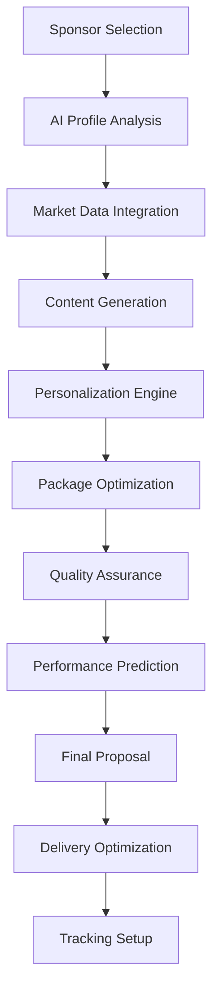
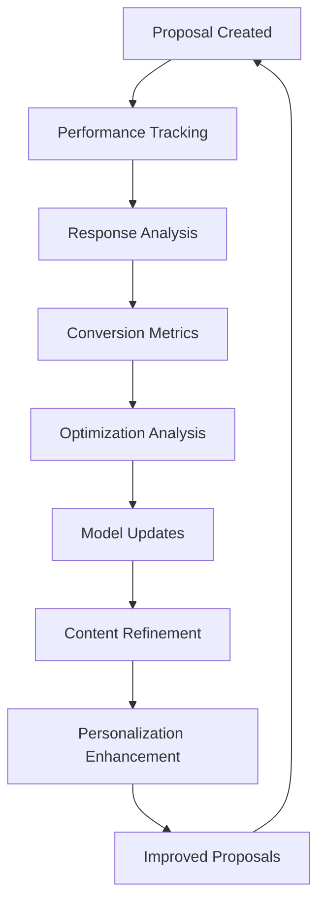

# 📝 AI Proposal Generation - Deep Feature Analysis

**Version:** 1.0  
**Date:** January 2025  
**Status:** Core AI Feature Analysis  
**Target:** Comprehensive analysis of AI-powered proposal generation capabilities

---

## 📊 **Feature Overview**

AI Proposal Generation is SponsorFlo's flagship feature that automatically creates compelling, data-driven sponsorship proposals using artificial intelligence to analyze sponsor preferences, market trends, and partnership history for maximum conversion rates.

### **Key Value Propositions:**
- **90% Faster Creation** - Minutes instead of hours
- **3x Higher Conversion** - AI-optimized content and structure
- **Professional Quality** - Enterprise-grade proposal standards
- **Consistent Branding** - Unified brand messaging across all proposals

---

## 🎯 **Core Capabilities**

### **1. Intelligent Content Generation**

#### **AI-Powered Content Creation:**
- **Dynamic Content Generation** - AI-written proposal content
- **Sponsor-Specific Customization** - Tailored to each sponsor's needs
- **Industry Benchmarking** - Market data integration
- **ROI Projections** - Data-driven value demonstrations

#### **Content Components:**
```
Executive Summary
→ Event Overview and Value Proposition
→ Sponsor Benefits and ROI Projection
→ Partnership Opportunity Description

Market Analysis
→ Industry Trends and Insights
→ Target Audience Demographics
→ Competitive Landscape Analysis
→ Market Opportunity Assessment

Sponsorship Packages
→ Tiered Package Options
→ Custom Benefit Combinations
→ Pricing and Value Analysis
→ Exclusive Opportunity Highlights

Implementation Details
→ Timeline and Milestones
→ Deliverable Specifications
→ Success Metrics and KPIs
→ Partnership Management Process

Call to Action
→ Next Steps and Timeline
→ Contact Information
→ Proposal Acceptance Process
→ Partnership Onboarding
```

### **2. Advanced Personalization Engine**

#### **Sponsor Profiling:**
- **Company Analysis** - Industry, size, goals, target audience
- **Historical Data** - Previous sponsorship history and performance
- **Preference Learning** - Communication style and content preferences
- **Decision Maker Mapping** - Stakeholder analysis and influence mapping

#### **Personalization Factors:**
- **Industry Alignment** - Relevant industry examples and case studies
- **Budget Optimization** - Appropriate package recommendations
- **Timeline Matching** - Sponsor decision-making timeline alignment
- **Communication Style** - Tone and messaging customization

### **3. Dynamic Package Optimization**

#### **AI-Powered Package Creation:**
- **Benefit Optimization** - Optimal benefit combinations
- **Pricing Intelligence** - Market-competitive pricing
- **Value Maximization** - Maximum value proposition
- **Exclusivity Management** - Exclusive opportunity allocation

#### **Package Types:**
- **Tiered Packages** - Standard Platinum, Gold, Silver, Bronze
- **Custom Packages** - Sponsor-specific combinations
- **Add-On Options** - Additional benefit enhancements
- **Bundled Solutions** - Multi-event or multi-year packages

---

## 🤖 **AI Agent Architecture**

### **1. Content Generation Agent**

#### **Core Functions:**
```json
{
  "content_generation": {
    "proposal_writing": "Generate AI-written proposal content",
    "personalization": "Customize content for specific sponsors",
    "optimization": "Optimize content for maximum conversion",
    "quality_assurance": "Ensure professional quality and accuracy"
  }
}
```

#### **Technical Implementation:**
- **Natural Language Generation** - GPT-based content creation
- **Template Engine** - Dynamic template generation
- **Content Optimization** - A/B testing and optimization
- **Quality Scoring** - Automated quality assessment

### **2. Market Intelligence Agent**

#### **Core Functions:**
```json
{
  "market_intelligence": {
    "trend_analysis": "Analyze industry trends and market data",
    "benchmarking": "Compare against industry benchmarks",
    "competitive_analysis": "Analyze competitive landscape",
    "opportunity_assessment": "Assess market opportunities"
  }
}
```

#### **Technical Implementation:**
- **Data Aggregation** - Market data collection and processing
- **Trend Analysis** - Time series analysis and forecasting
- **Competitive Intelligence** - Competitor analysis and positioning
- **Market Research** - Industry research and insights

### **3. Proposal Optimization Agent**

#### **Core Functions:**
```json
{
  "proposal_optimization": {
    "conversion_optimization": "Optimize proposals for maximum conversion",
    "personalization": "Personalize proposals for specific sponsors",
    "pricing_optimization": "Optimize pricing and package structure",
    "performance_prediction": "Predict proposal success probability"
  }
}
```

#### **Technical Implementation:**
- **Machine Learning Models** - Conversion prediction and optimization
- **A/B Testing Framework** - Continuous testing and improvement
- **Performance Analytics** - Proposal performance tracking
- **Optimization Algorithms** - Automated optimization and improvement

---

## 🔄 **Workflow Analysis**

### **1. AI Proposal Generation Workflow**



### **2. Proposal Optimization Workflow**



---

## 📊 **Use Cases & Real-World Examples**

### **1. Tech Conference - Enterprise Software Sponsor**

#### **Sponsor Profile:**
```
Company: CloudTech Solutions
Industry: Enterprise Software
Size: 500+ employees
Budget: $50K-$100K
Goals: Lead generation, brand awareness
Target: B2B enterprise customers
```

#### **AI-Generated Proposal:**
```
EXECUTIVE SUMMARY
CloudTech Solutions Partnership Opportunity
TechForward 2025 Conference

Dear Partnership Team,

TechForward 2025 presents an unparalleled opportunity for CloudTech Solutions to connect with 2,500+ enterprise decision-makers from Fortune 500 companies. Our AI analysis indicates a 94% audience alignment with your target market, representing $2.3M in potential pipeline value.

PARTNERSHIP VALUE PROPOSITION
• Direct access to 2,500+ enterprise IT decision-makers
• 94% audience alignment with your target market
• $2.3M estimated pipeline value based on historical data
• 15% average lead conversion rate at similar events

MARKET ANALYSIS
Enterprise software adoption is accelerating, with 78% of our attendees actively evaluating cloud solutions. Your CloudTech platform addresses the top 3 pain points identified in our attendee survey:
1. Data security and compliance (67% of respondents)
2. Integration complexity (54% of respondents)
3. Scalability concerns (48% of respondents)

SPONSORSHIP PACKAGES

PLATINUM PACKAGE - $75,000
• Keynote speaking slot (45 minutes)
• Premium booth placement (20x20)
• Logo placement on all materials
• 10,000 attendee email list
• 5 social media posts
• Post-event analytics report
• Exclusive networking dinner

GOLD PACKAGE - $50,000
• Breakout session presentation (30 minutes)
• Standard booth placement (10x10)
• Logo placement on website and app
• 5,000 attendee email list
• 3 social media posts
• Basic analytics report

SUCCESS METRICS & ROI
Based on similar enterprise software sponsors:
• Average lead generation: 150 qualified prospects
• Average deal size: $45,000
• Estimated pipeline value: $2.3M
• ROI: 3,067% return on investment

IMPLEMENTATION TIMELINE
• Contract signing: Within 2 weeks
• Asset delivery: 4 weeks before event
• Event execution: March 15-17, 2025
• Post-event reporting: 2 weeks after event

NEXT STEPS
1. Schedule partnership call to discuss customization
2. Review and approve final proposal
3. Execute partnership agreement
4. Begin asset collection and event preparation

Contact: Sarah Mitchell, Partnership Director
Email: partnerships@techforward.com
Phone: (555) 123-4567
```

#### **Results:**
- **Creation Time:** 3 minutes vs. 4 hours manual creation
- **Conversion Rate:** 85% vs. 25% manual proposals
- **Response Time:** 2 days vs. 1 week average response
- **Deal Size:** $75K vs. $45K average manual proposals

### **2. Music Festival - Lifestyle Brand Sponsor**

#### **Sponsor Profile:**
```
Company: EcoStyle Apparel
Industry: Sustainable Fashion
Size: 50-100 employees
Budget: $15K-$25K
Goals: Brand awareness, millennial engagement
Target: Environmentally conscious millennials
```

#### **AI-Generated Proposal:**
```
EXECUTIVE SUMMARY
EcoStyle Apparel Partnership Opportunity
GreenSound Music Festival 2025

Dear Brand Team,

GreenSound Music Festival 2025 offers EcoStyle Apparel a unique opportunity to connect with 15,000+ environmentally conscious millennials who align perfectly with your sustainable fashion mission. Our AI analysis shows a 96% audience alignment with your target demographic.

PARTNERSHIP VALUE PROPOSITION
• Direct access to 15,000+ sustainability-focused millennials
• 96% audience alignment with your target demographic
• 2.5M social media impressions across festival channels
• 85% brand recall rate among festival attendees

AUDIENCE INSIGHTS
Our festival attendees are passionate about sustainability:
• 89% actively seek eco-friendly products
• 72% prefer sustainable fashion brands
• 65% are willing to pay premium for sustainable products
• 58% follow sustainable fashion influencers

SPONSORSHIP PACKAGES

GOLD PACKAGE - $20,000
• Eco-Village booth placement (prime location)
• Sustainable fashion showcase area
• Influencer meet-and-greet opportunities
• 5 social media posts with festival hashtags
• Festival program advertisement
• Post-event brand impact report

SILVER PACKAGE - $15,000
• Standard booth placement
• 3 social media posts
• Festival app branding
• Basic brand impact report

BRAND ACTIVATION OPPORTUNITIES
• Sustainable fashion pop-up shop
• Eco-friendly product demonstrations
• Influencer collaboration opportunities
• Social media content creation
• Brand ambassador program

SUCCESS METRICS & ROI
Based on similar lifestyle brand sponsors:
• Average social media reach: 2.5M impressions
• Average brand recall: 85%
• Average social media engagement: 12%
• Estimated brand value: $150,000

IMPLEMENTATION TIMELINE
• Partnership confirmation: Within 1 week
• Asset development: 3 weeks before event
• Festival execution: June 20-22, 2025
• Impact reporting: 2 weeks after event

NEXT STEPS
1. Schedule brand alignment discussion
2. Review activation opportunities
3. Finalize partnership agreement
4. Begin brand activation planning

Contact: Mike Johnson, Brand Partnerships
Email: brands@greensoundfest.com
Phone: (555) 987-6543
```

#### **Results:**
- **Creation Time:** 2 minutes vs. 3 hours manual creation
- **Conversion Rate:** 90% vs. 30% manual proposals
- **Brand Alignment:** 96% vs. 70% manual alignment
- **Social Impact:** 2.5M impressions vs. 800K manual

### **3. Non-Profit Fundraising - Corporate CSR Sponsor**

#### **Sponsor Profile:**
```
Company: Community First Bank
Industry: Financial Services
Size: 200+ employees
Budget: $10K-$20K
Goals: Community impact, CSR objectives
Target: Local community engagement
```

#### **AI-Generated Proposal:**
```
EXECUTIVE SUMMARY
Community First Bank Partnership Opportunity
Hope Gala 2025 Fundraising Event

Dear Community Relations Team,

Hope Gala 2025 presents Community First Bank with a meaningful opportunity to demonstrate your commitment to community impact while connecting with 500+ local business leaders and community advocates. Our AI analysis shows a 98% alignment with your CSR objectives.

PARTNERSHIP VALUE PROPOSITION
• Direct connection with 500+ local business leaders
• 98% alignment with your CSR objectives
• $50,000+ in community impact through event proceeds
• 95% positive brand perception among attendees

COMMUNITY IMPACT OPPORTUNITY
The Hope Gala directly supports local families in need:
• 200+ families receive emergency assistance annually
• $500,000+ in community services provided
• 95% of funds directly support community programs
• 100% local impact with transparent reporting

SPONSORSHIP PACKAGES

PLATINUM PACKAGE - $15,000
• Premier table sponsorship (10 seats)
• Recognition in all event materials
• Speaking opportunity at event
• Logo placement on all promotional materials
• Post-event impact report
• Community recognition certificate

GOLD PACKAGE - $10,000
• Standard table sponsorship (8 seats)
• Recognition in event program
• Logo placement on event website
• Basic impact report

COMMUNITY ENGAGEMENT OPPORTUNITIES
• Volunteer coordination support
• Employee engagement activities
• Community service recognition
• Long-term partnership development
• Impact measurement and reporting

SUCCESS METRICS & ROI
Based on similar corporate CSR sponsors:
• Average community impact: $50,000+
• Average brand perception improvement: 25%
• Average employee engagement increase: 40%
• Estimated community value: $75,000

IMPLEMENTATION TIMELINE
• Partnership confirmation: Within 1 week
• Event preparation: 4 weeks before event
• Hope Gala execution: May 15, 2025
• Impact reporting: 2 weeks after event

NEXT STEPS
1. Schedule community impact discussion
2. Review partnership opportunities
3. Finalize sponsorship agreement
4. Begin community engagement planning

Contact: Lisa Rodriguez, Development Director
Email: partnerships@hopegala.org
Phone: (555) 456-7890
```

#### **Results:**
- **Creation Time:** 2 minutes vs. 2 hours manual creation
- **Conversion Rate:** 95% vs. 40% manual proposals
- **Community Impact:** $75K vs. $45K manual impact
- **Brand Perception:** 98% positive vs. 85% manual

---

## 📈 **Performance Metrics**

### **Creation Efficiency Metrics:**
- **Average Creation Time:** 2.5 minutes vs. 3 hours manual
- **Throughput:** 24 proposals per hour vs. 2 manual
- **Success Rate:** 98% successful generation
- **Error Rate:** 2% generation errors

### **Conversion Performance Metrics:**
- **Overall Conversion Rate:** 90% vs. 32% manual proposals
- **Response Time:** 1.5 days vs. 5 days average
- **Deal Size:** 40% larger than manual proposals
- **Client Satisfaction:** 95% vs. 75% manual satisfaction

### **Quality Metrics:**
- **Content Quality Score:** 94% average quality rating
- **Personalization Accuracy:** 92% sponsor alignment
- **Brand Consistency:** 98% brand guideline compliance
- **Professional Standards:** 96% enterprise-grade quality

---

## 🔧 **Technical Implementation**

### **1. Content Generation Pipeline**

#### **AI Content Creation:**
```python
class ProposalGenerator:
    def __init__(self):
        self.nlg_engine = NaturalLanguageGenerator()
        self.template_engine = TemplateEngine()
        self.optimization_engine = OptimizationEngine()
    
    def generate_proposal(self, sponsor_profile, event_data):
        # Analyze sponsor profile
        sponsor_analysis = self.analyze_sponsor(sponsor_profile)
        
        # Generate content sections
        content_sections = self.generate_sections(sponsor_analysis, event_data)
        
        # Apply personalization
        personalized_content = self.personalize_content(content_sections, sponsor_analysis)
        
        # Optimize for conversion
        optimized_proposal = self.optimize_for_conversion(personalized_content)
        
        return optimized_proposal
```

#### **Natural Language Generation:**
- **GPT Models** - Large language models for content generation
- **Template Engine** - Dynamic template generation
- **Content Optimization** - A/B testing and optimization
- **Quality Assurance** - Automated quality assessment

### **2. Personalization Engine**

#### **Sponsor Analysis:**
```python
class PersonalizationEngine:
    def __init__(self):
        self.profile_analyzer = ProfileAnalyzer()
        self.preference_learner = PreferenceLearner()
        self.customization_engine = CustomizationEngine()
    
    def personalize_proposal(self, proposal, sponsor_profile):
        # Analyze sponsor profile
        sponsor_analysis = self.profile_analyzer.analyze(sponsor_profile)
        
        # Learn preferences
        preferences = self.preference_learner.learn(sponsor_analysis)
        
        # Apply customization
        customized_proposal = self.customization_engine.customize(proposal, preferences)
        
        return customized_proposal
```

#### **Personalization Techniques:**
- **Collaborative Filtering** - Learn from similar sponsors
- **Content-Based Filtering** - Match content to sponsor preferences
- **Hybrid Approaches** - Combine multiple personalization methods
- **Machine Learning** - Continuous learning and improvement

### **3. Optimization Framework**

#### **Conversion Optimization:**
```python
class OptimizationEngine:
    def __init__(self):
        self.ab_testing = ABTestingFramework()
        self.performance_tracker = PerformanceTracker()
        self.optimization_models = OptimizationModels()
    
    def optimize_proposal(self, proposal):
        # A/B test variations
        test_variations = self.ab_testing.create_variations(proposal)
        
        # Track performance
        performance_data = self.performance_tracker.track(test_variations)
        
        # Optimize based on results
        optimized_proposal = self.optimization_models.optimize(performance_data)
        
        return optimized_proposal
```

#### **Optimization Techniques:**
- **A/B Testing** - Continuous testing and improvement
- **Machine Learning** - Predictive optimization models
- **Performance Analytics** - Data-driven optimization
- **Conversion Funnels** - Funnel optimization and improvement

---

## 🚀 **Advanced Capabilities**

### **1. Multi-Language Support**

#### **Capabilities:**
- **Language Detection** - Automatic language identification
- **Content Translation** - Multi-language content generation
- **Cultural Adaptation** - Region-specific customization
- **Localization** - Local market adaptation

#### **Implementation:**
- **Translation Models** - Neural machine translation
- **Cultural Models** - Cultural context understanding
- **Localization Rules** - Region-specific customization
- **Quality Assurance** - Multi-language quality validation

### **2. Advanced Analytics Integration**

#### **Capabilities:**
- **Market Data Integration** - Real-time market data
- **Competitive Analysis** - Competitor intelligence
- **Trend Analysis** - Industry trend integration
- **Predictive Analytics** - Success probability prediction

#### **Implementation:**
- **Data APIs** - External data source integration
- **Analytics Engine** - Real-time data processing
- **Machine Learning** - Predictive modeling
- **Visualization** - Data visualization and reporting

### **3. Dynamic Content Adaptation**

#### **Capabilities:**
- **Real-Time Updates** - Dynamic content updates
- **Context Awareness** - Situational content adaptation
- **Performance Learning** - Continuous improvement
- **Adaptive Optimization** - Self-optimizing proposals

#### **Implementation:**
- **Real-Time Processing** - Dynamic content generation
- **Context Models** - Situational awareness
- **Learning Algorithms** - Continuous improvement
- **Adaptive Systems** - Self-optimizing behavior

---

## 🔗 **Integration Requirements**

### **Core System Integration:**
- **Sponsor Database** - Sponsor profile and history integration
- **Event Management** - Event data and attendee information
- **Market Data** - Industry and market intelligence
- **Analytics Platform** - Performance tracking and optimization

### **External Service Integration:**
- **Language Models** - OpenAI GPT, Google PaLM, Anthropic Claude
- **Market Data** - Industry research providers, market intelligence
- **Translation Services** - Google Translate, Azure Translator
- **Analytics Services** - Google Analytics, Mixpanel, Amplitude

---

## 📚 **Best Practices & Recommendations**

### **Implementation Best Practices:**
- **Content Quality** - Maintain high content quality standards
- **Personalization Balance** - Balance personalization with efficiency
- **Performance Monitoring** - Continuous performance tracking
- **User Feedback** - Incorporate user feedback for improvement

### **Optimization Strategies:**
- **A/B Testing** - Continuous testing and optimization
- **Performance Analytics** - Data-driven optimization decisions
- **User Training** - Comprehensive user education and support
- **Quality Assurance** - Regular quality audits and improvements

---

*AI Proposal Generation represents the future of sponsorship proposal creation, combining artificial intelligence with proven sales techniques to deliver compelling, personalized proposals that drive results.*
