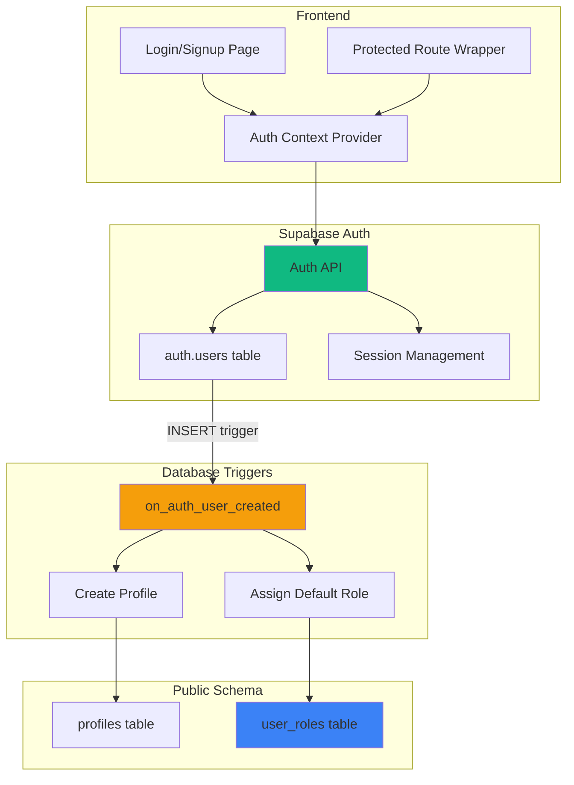

# 11 - Authentication Setup (Supabase Auth)

## ⚠️ IMPORTANT: Using Supabase Auth (NOT Clerk)

**Decision:** This project uses **Supabase Auth** as it's already integrated with Lovable Cloud.

**Why NOT Clerk:**
- ❌ Requires additional API keys and setup
- ❌ Adds external dependency
- ✅ Supabase Auth is pre-configured in Lovable Cloud
- ✅ Seamless integration with RLS policies
- ✅ No additional cost

---

## Authentication Architecture



---

## Database Setup

### 1. Create Enums and Tables

```sql
-- 1. Create role enum
CREATE TYPE app_role AS ENUM ('admin', 'organizer', 'attendee');

-- 2. Create profiles table
CREATE TABLE public.profiles (
  id UUID PRIMARY KEY REFERENCES auth.users(id) ON DELETE CASCADE,
  full_name TEXT,
  email TEXT,
  avatar_url TEXT,
  company_name TEXT,
  phone TEXT,
  created_at TIMESTAMPTZ NOT NULL DEFAULT now(),
  updated_at TIMESTAMPTZ NOT NULL DEFAULT now()
);

ALTER TABLE public.profiles ENABLE ROW LEVEL SECURITY;

-- Public can view profiles (for event organizer info)
CREATE POLICY "Public profiles viewable" ON public.profiles
  FOR SELECT USING (true);

-- Users can update their own profile
CREATE POLICY "Users update own profile" ON public.profiles
  FOR UPDATE USING (auth.uid() = id)
  WITH CHECK (auth.uid() = id);

-- Users can insert their own profile (via trigger, but allow manual)
CREATE POLICY "Users insert own profile" ON public.profiles
  FOR INSERT WITH CHECK (auth.uid() = id);

-- 3. Create user_roles table (CRITICAL for security)
CREATE TABLE public.user_roles (
  id UUID PRIMARY KEY DEFAULT gen_random_uuid(),
  user_id UUID NOT NULL REFERENCES auth.users(id) ON DELETE CASCADE,
  role app_role NOT NULL,
  created_at TIMESTAMPTZ NOT NULL DEFAULT now(),
  UNIQUE(user_id, role)
);

ALTER TABLE public.user_roles ENABLE ROW LEVEL SECURITY;

-- Users can view their own roles
CREATE POLICY "Users view own roles" ON public.user_roles
  FOR SELECT USING (auth.uid() = user_id);

-- Only admins can manage roles
CREATE POLICY "Admins manage all roles" ON public.user_roles
  FOR ALL USING (public.has_role(auth.uid(), 'admin'));
```

### 2. Create SECURITY DEFINER Function

```sql
-- CRITICAL: This function bypasses RLS to check roles
CREATE OR REPLACE FUNCTION public.has_role(_user_id UUID, _role app_role)
RETURNS BOOLEAN
LANGUAGE SQL
STABLE
SECURITY DEFINER
SET search_path = public
AS $$
  SELECT EXISTS (
    SELECT 1
    FROM public.user_roles
    WHERE user_id = _user_id AND role = _role
  )
$$;

-- Grant execute to authenticated users
GRANT EXECUTE ON FUNCTION public.has_role(UUID, app_role) TO authenticated;
```

### 3. Create Auto-Creation Trigger

```sql
-- Function to create profile and assign default role
CREATE OR REPLACE FUNCTION public.handle_new_user()
RETURNS TRIGGER
LANGUAGE plpgsql
SECURITY DEFINER
SET search_path = public
AS $$
BEGIN
  -- Create profile
  INSERT INTO public.profiles (id, full_name, email)
  VALUES (
    NEW.id,
    COALESCE(NEW.raw_user_meta_data->>'full_name', ''),
    NEW.email
  );
  
  -- Assign default 'attendee' role
  INSERT INTO public.user_roles (user_id, role)
  VALUES (NEW.id, 'attendee');
  
  RETURN NEW;
END;
$$;

-- Attach trigger to auth.users
CREATE TRIGGER on_auth_user_created
  AFTER INSERT ON auth.users
  FOR EACH ROW EXECUTE FUNCTION public.handle_new_user();
```

### 4. Create Updated_at Trigger

```sql
CREATE OR REPLACE FUNCTION public.update_updated_at_column()
RETURNS TRIGGER
LANGUAGE plpgsql
SECURITY DEFINER
SET search_path = public
AS $$
BEGIN
  NEW.updated_at = now();
  RETURN NEW;
END;
$$;

CREATE TRIGGER update_profiles_updated_at
  BEFORE UPDATE ON public.profiles
  FOR EACH ROW EXECUTE FUNCTION public.update_updated_at_column();
```

---

## Supabase Auth Configuration

### Enable Auto-Confirm (For Development)

```typescript
// In Lovable UI: Settings -> Auth -> Email Auth
{
  "MAILER_AUTOCONFIRM": true, // ← Enable this for development
  "DISABLE_SIGNUP": false
}
```

**Production:** Disable auto-confirm and use email verification.

---

## Frontend Implementation

### 1. Auth Context Provider

```tsx
// src/components/auth/AuthContext.tsx
import { createContext, useContext, useEffect, useState } from 'react';
import { User, Session } from '@supabase/supabase-js';
import { supabase } from '@/integrations/supabase/client';

interface AuthContextType {
  user: User | null;
  session: Session | null;
  loading: boolean;
  signUp: (email: string, password: string, fullName: string) => Promise<{ error: any }>;
  signIn: (email: string, password: string) => Promise<{ error: any }>;
  signOut: () => Promise<void>;
}

const AuthContext = createContext<AuthContextType | undefined>(undefined);

export function AuthProvider({ children }: { children: React.ReactNode }) {
  const [user, setUser] = useState<User | null>(null);
  const [session, setSession] = useState<Session | null>(null);
  const [loading, setLoading] = useState(true);

  useEffect(() => {
    // Check active session
    supabase.auth.getSession().then(({ data: { session } }) => {
      setSession(session);
      setUser(session?.user ?? null);
      setLoading(false);
    });

    // Listen for auth changes
    const {
      data: { subscription },
    } = supabase.auth.onAuthStateChange((_event, session) => {
      setSession(session);
      setUser(session?.user ?? null);
      setLoading(false);
    });

    return () => subscription.unsubscribe();
  }, []);

  const signUp = async (email: string, password: string, fullName: string) => {
    const { error } = await supabase.auth.signUp({
      email,
      password,
      options: {
        emailRedirectTo: `${window.location.origin}/`,
        data: {
          full_name: fullName, // Passed to trigger
        },
      },
    });
    return { error };
  };

  const signIn = async (email: string, password: string) => {
    const { error } = await supabase.auth.signInWithPassword({
      email,
      password,
    });
    return { error };
  };

  const signOut = async () => {
    await supabase.auth.signOut();
  };

  return (
    <AuthContext.Provider value={{ user, session, loading, signUp, signIn, signOut }}>
      {children}
    </AuthContext.Provider>
  );
}

export const useAuth = () => {
  const context = useContext(AuthContext);
  if (context === undefined) {
    throw new Error('useAuth must be used within AuthProvider');
  }
  return context;
};
```

### 2. Protected Route Component

```tsx
// src/components/auth/ProtectedRoute.tsx
import { Navigate } from 'react-router-dom';
import { useAuth } from './AuthContext';

interface ProtectedRouteProps {
  children: React.ReactNode;
}

export function ProtectedRoute({ children }: ProtectedRouteProps) {
  const { user, loading } = useAuth();

  if (loading) {
    return (
      <div className="flex items-center justify-center min-h-screen">
        <div className="animate-spin rounded-full h-12 w-12 border-b-2 border-primary"></div>
      </div>
    );
  }

  if (!user) {
    return <Navigate to="/auth/login" replace />;
  }

  return <>{children}</>;
}
```

### 3. Login Page

```tsx
// src/pages/auth/Login.tsx
import { useState } from 'react';
import { Link, useNavigate } from 'react-router-dom';
import { useAuth } from '@/components/auth/AuthContext';
import { Button } from '@/components/ui/button';
import { Input } from '@/components/ui/input';
import { Label } from '@/components/ui/label';
import { useToast } from '@/hooks/use-toast';

export default function Login() {
  const [email, setEmail] = useState('');
  const [password, setPassword] = useState('');
  const [loading, setLoading] = useState(false);
  const { signIn } = useAuth();
  const { toast } = useToast();
  const navigate = useNavigate();

  const handleSubmit = async (e: React.FormEvent) => {
    e.preventDefault();
    setLoading(true);

    const { error } = await signIn(email, password);

    if (error) {
      toast({
        title: 'Login failed',
        description: error.message,
        variant: 'destructive',
      });
    } else {
      toast({
        title: 'Welcome back!',
        description: 'You have successfully logged in.',
      });
      navigate('/dashboard');
    }

    setLoading(false);
  };

  return (
    <div className="min-h-screen flex items-center justify-center bg-gradient-to-br from-primary/10 to-background">
      <div className="w-full max-w-md p-8 bg-card rounded-lg shadow-lg">
        <h1 className="text-2xl font-bold text-center mb-6">Sign In</h1>
        
        <form onSubmit={handleSubmit} className="space-y-4">
          <div className="space-y-2">
            <Label htmlFor="email">Email</Label>
            <Input
              id="email"
              type="email"
              value={email}
              onChange={(e) => setEmail(e.target.value)}
              placeholder="you@company.com"
              required
            />
          </div>

          <div className="space-y-2">
            <Label htmlFor="password">Password</Label>
            <Input
              id="password"
              type="password"
              value={password}
              onChange={(e) => setPassword(e.target.value)}
              placeholder="••••••••"
              required
            />
          </div>

          <Button type="submit" className="w-full" disabled={loading}>
            {loading ? 'Signing in...' : 'Sign In'}
          </Button>
        </form>

        <p className="text-center mt-4 text-sm text-muted-foreground">
          Don't have an account?{' '}
          <Link to="/auth/signup" className="text-primary hover:underline">
            Sign up
          </Link>
        </p>
      </div>
    </div>
  );
}
```

### 4. Signup Page

```tsx
// src/pages/auth/Signup.tsx
import { useState } from 'react';
import { Link, useNavigate } from 'react-router-dom';
import { useAuth } from '@/components/auth/AuthContext';
import { Button } from '@/components/ui/button';
import { Input } from '@/components/ui/input';
import { Label } from '@/components/ui/label';
import { useToast } from '@/hooks/use-toast';

export default function Signup() {
  const [fullName, setFullName] = useState('');
  const [email, setEmail] = useState('');
  const [password, setPassword] = useState('');
  const [loading, setLoading] = useState(false);
  const { signUp } = useAuth();
  const { toast } = useToast();
  const navigate = useNavigate();

  const handleSubmit = async (e: React.FormEvent) => {
    e.preventDefault();
    setLoading(true);

    const { error } = await signUp(email, password, fullName);

    if (error) {
      toast({
        title: 'Signup failed',
        description: error.message,
        variant: 'destructive',
      });
    } else {
      toast({
        title: 'Account created!',
        description: 'Welcome to the platform.',
      });
      navigate('/dashboard');
    }

    setLoading(false);
  };

  return (
    <div className="min-h-screen flex items-center justify-center bg-gradient-to-br from-primary/10 to-background">
      <div className="w-full max-w-md p-8 bg-card rounded-lg shadow-lg">
        <h1 className="text-2xl font-bold text-center mb-6">Create Account</h1>
        
        <form onSubmit={handleSubmit} className="space-y-4">
          <div className="space-y-2">
            <Label htmlFor="fullName">Full Name</Label>
            <Input
              id="fullName"
              type="text"
              value={fullName}
              onChange={(e) => setFullName(e.target.value)}
              placeholder="John Doe"
              required
            />
          </div>

          <div className="space-y-2">
            <Label htmlFor="email">Email</Label>
            <Input
              id="email"
              type="email"
              value={email}
              onChange={(e) => setEmail(e.target.value)}
              placeholder="you@company.com"
              required
            />
          </div>

          <div className="space-y-2">
            <Label htmlFor="password">Password</Label>
            <Input
              id="password"
              type="password"
              value={password}
              onChange={(e) => setPassword(e.target.value)}
              placeholder="••••••••"
              required
              minLength={6}
            />
          </div>

          <Button type="submit" className="w-full" disabled={loading}>
            {loading ? 'Creating account...' : 'Sign Up'}
          </Button>
        </form>

        <p className="text-center mt-4 text-sm text-muted-foreground">
          Already have an account?{' '}
          <Link to="/auth/login" className="text-primary hover:underline">
            Sign in
          </Link>
        </p>
      </div>
    </div>
  );
}
```

---

## Social Login (Optional - LinkedIn OAuth)

### Setup LinkedIn OAuth

1. **Create LinkedIn App:**
   - Go to [LinkedIn Developers](https://www.linkedin.com/developers/)
   - Create new app
   - Add redirect URI: `https://jnmfterqvevgusfckxbt.supabase.co/auth/v1/callback`

2. **Configure in Supabase:**
   ```typescript
   // Lovable UI: Settings -> Auth -> External OAuth Providers
   {
     "EXTERNAL_LINKEDIN_ENABLED": true,
     "EXTERNAL_LINKEDIN_CLIENT_ID": "your_client_id",
     "EXTERNAL_LINKEDIN_SECRET": "your_secret"
   }
   ```

3. **Add LinkedIn Button:**
   ```tsx
   const handleLinkedInLogin = async () => {
     const { error } = await supabase.auth.signInWithOAuth({
       provider: 'linkedin_oidc',
       options: {
         redirectTo: `${window.location.origin}/dashboard`,
       },
     });
     if (error) console.error(error);
   };

   <Button variant="outline" onClick={handleLinkedInLogin}>
     <LinkedInIcon className="mr-2 h-4 w-4" />
     Continue with LinkedIn
   </Button>
   ```

---

## Security Checklist

### ✅ Implemented
- [x] Separate `user_roles` table
- [x] `SECURITY DEFINER` function for role checks
- [x] RLS policies on `profiles` and `user_roles`
- [x] Auto-creation trigger for profiles + roles
- [x] Email/password validation
- [x] Session persistence via `onAuthStateChange`

### ⚠️ Production Requirements
- [ ] Disable auto-confirm email
- [ ] Set up SMTP for email verification
- [ ] Add password reset flow
- [ ] Implement rate limiting on auth endpoints
- [ ] Add CAPTCHA for signup (optional)
- [ ] Set up MFA (multi-factor authentication)

---

## Testing Auth Flow

### Manual Test Steps

1. **Sign Up:**
   - Go to `/auth/signup`
   - Fill form → Submit
   - Check: Profile created in `profiles` table
   - Check: Role assigned in `user_roles` table
   - Check: Redirected to `/dashboard`

2. **Sign In:**
   - Go to `/auth/login`
   - Enter credentials → Submit
   - Check: Session persists after page refresh

3. **Protected Route:**
   - Log out
   - Try to access `/dashboard`
   - Check: Redirected to `/auth/login`

4. **Profile Update:**
   - Log in
   - Go to `/profile`
   - Update name → Submit
   - Check: `updated_at` timestamp changed

---

## Common Issues & Solutions

### Issue: "User already registered"
**Solution:** Check if email is already in `auth.users`. Use forgot password flow.

### Issue: RLS policy blocks insert
**Solution:** Ensure `auth.uid()` returns valid UUID. Check trigger created profile correctly.

### Issue: Session not persisting
**Solution:** Verify `supabase.auth.onAuthStateChange` is set up in root component.

---

**Next Steps:**
1. Run database migration
2. Configure Supabase Auth (auto-confirm for dev)
3. Implement login/signup pages
4. Test full auth flow
5. Add role-based UI (show/hide features by role)
