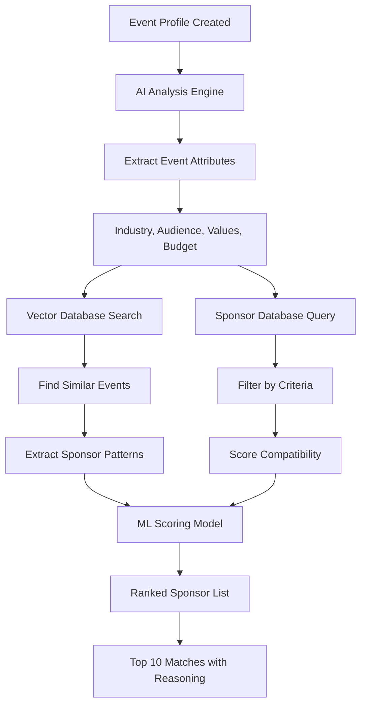
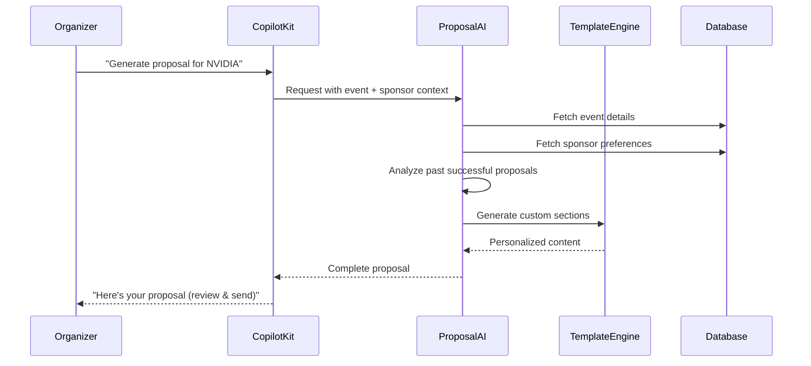

# Sponsor Management AI Features

**Version:** 1.0
**Date:** 2025-10-17
**Status:** Technical Specification
**Parent Document:** [00-AI-FEATURES-MASTER-PLAN.md](./00-AI-FEATURES-MASTER-PLAN.md)

---

## 🎯 Executive Summary

EventOS will integrate **AI-powered sponsor management** to revolutionize how event organizers secure corporate partnerships, combining proven insights from **Sponsorflo.ai** (which delivers 300% revenue increases and 90% faster proposals) with **CopilotKit's** conversational AI framework.

### Value Proposition

> "Transform sponsor acquisition from months to days through AI-powered matching, automated proposals, and intelligent follow-ups that close deals 3x faster."

### Key Impact Metrics (Sponsorflo Proven)

| Metric | Improvement | Source |
|--------|-------------|--------|
| **Partnership Revenue** | +300% | Sponsorflo case studies |
| **Proposal Creation** | 90% faster | Sponsorflo automation |
| **Response Rates** | 3x higher | Sponsorflo AI follow-ups |
| **Deal Closure Speed** | 75% faster | Sponsorflo pipeline |
| **Sponsor Renewal Rate** | 90% | Sponsorflo retention |

---

## 📊 Market Context

### Current Pain Points

**For Event Organizers:**
- Spend 60+ hours manually researching potential sponsors
- Generic proposals get 5% response rates
- Follow-up sequences poorly timed (15% open rates)
- No visibility into sponsor engagement
- Miss 70% of qualified opportunities

**For Sponsors:**
- Receive 100+ irrelevant sponsorship requests monthly
- Unclear ROI on past sponsorships
- Inconsistent impact reporting
- Difficult to compare opportunities

### EventOS Solution

**AI-Powered Sponsor Management** addresses both sides:
- **For Organizers:** Automated matching, proposals, and follow-ups (save 80+ hours per event)
- **For Sponsors:** Only see relevant opportunities with clear ROI projections
- **Result:** 3x more partnerships, 300% higher revenue, 90% renewal rates

---

## 🚀 Core AI Features

### Feature 1: AI Sponsor Matching Engine

**Purpose:** Predictive algorithms match events with ideal sponsors based on industry, budget, values, and historical data.

#### How It Works



#### Algorithm Components

**1. Event Vectorization**
```python
# Convert event to semantic embedding
def vectorize_event(event):
    features = {
        "industry": event.industry,  # "technology", "healthcare"
        "audience": event.target_audience,  # "C-level executives"
        "values": event.values,  # ["innovation", "sustainability"]
        "event_type": event.type,  # "conference", "summit"
        "size": event.expected_attendance,  # 500
        "budget": event.sponsorship_target,  # $50,000
        "location": event.location,  # "San Francisco"
        "date": event.start_date
    }

    # Generate embedding using OpenAI
    embedding = openai.embeddings.create(
        model="text-embedding-3-large",
        input=json.dumps(features)
    )

    return embedding.data[0].embedding
```

**2. Sponsor Scoring Algorithm**
```python
class SponsorMatchingEngine:
    def __init__(self):
        self.vector_db = PineconeIndex("sponsors")
        self.llm = ChatOpenAI(model="gpt-4o")

    async def find_matches(self, event_id: str, limit: int = 10):
        # 1. Get event features
        event = await self.get_event(event_id)
        event_vector = self.vectorize_event(event)

        # 2. Vector similarity search
        similar_sponsors = await self.vector_db.query(
            vector=event_vector,
            top_k=100,
            include_metadata=True
        )

        # 3. Apply business rules
        filtered = self.apply_filters(similar_sponsors, event)

        # 4. ML scoring model
        scored = []
        for sponsor in filtered:
            score = self.calculate_match_score(sponsor, event)
            scored.append({
                "sponsor": sponsor,
                "score": score,
                "reasoning": self.generate_reasoning(sponsor, event, score)
            })

        # 5. Rank and return top matches
        scored.sort(key=lambda x: x["score"], reverse=True)
        return scored[:limit]

    def calculate_match_score(self, sponsor, event):
        """Multi-factor scoring algorithm"""
        weights = {
            "industry_alignment": 0.30,
            "budget_compatibility": 0.25,
            "values_alignment": 0.20,
            "past_performance": 0.15,
            "audience_overlap": 0.10
        }

        score = 0

        # Industry alignment (0-100)
        if sponsor.industries.contains(event.industry):
            score += weights["industry_alignment"] * 100

        # Budget compatibility (0-100)
        if sponsor.min_budget <= event.sponsorship_target <= sponsor.max_budget:
            score += weights["budget_compatibility"] * 100

        # Values alignment (0-100)
        common_values = set(sponsor.values) & set(event.values)
        alignment = len(common_values) / max(len(event.values), 1)
        score += weights["values_alignment"] * (alignment * 100)

        # Past performance (0-100)
        similar_events = self.find_similar_sponsorships(sponsor, event)
        if similar_events:
            avg_roi = sum(e.roi for e in similar_events) / len(similar_events)
            score += weights["past_performance"] * min(avg_roi, 100)

        # Audience overlap (0-100)
        audience_score = self.calculate_audience_overlap(sponsor, event)
        score += weights["audience_overlap"] * audience_score

        return round(score, 2)
```

**3. Reasoning Generation**
```python
def generate_reasoning(self, sponsor, event, score):
    """AI-generated explanation for the match"""

    prompt = f"""
    Explain why {sponsor.name} is a {score:.0f}% match for {event.name}.

    Sponsor Profile:
    - Industries: {sponsor.industries}
    - Past sponsorships: {sponsor.past_events}
    - Values: {sponsor.values}
    - Budget range: ${sponsor.min_budget:,} - ${sponsor.max_budget:,}

    Event Profile:
    - Industry: {event.industry}
    - Audience: {event.target_audience}
    - Values: {event.values}
    - Target budget: ${event.sponsorship_target:,}

    Provide 3 specific reasons why this is a good match.
    """

    response = self.llm.generate(prompt)
    return response
```

#### Database Schema

**sponsors table:**
```sql
CREATE TABLE sponsors (
    id UUID PRIMARY KEY DEFAULT gen_random_uuid(),

    -- Company information
    company_name TEXT NOT NULL,
    industry TEXT NOT NULL,
    website TEXT,
    logo_url TEXT,

    -- Sponsorship preferences
    industries_of_interest TEXT[] DEFAULT '{}',
    event_types TEXT[] DEFAULT '{}', -- ['conference', 'webinar']
    geographic_preferences TEXT[] DEFAULT '{}',
    values TEXT[] DEFAULT '{}', -- ['innovation', 'diversity']

    -- Budget information
    min_budget NUMERIC(10,2),
    max_budget NUMERIC(10,2),
    currency TEXT DEFAULT 'USD',

    -- Contact information
    primary_contact_name TEXT,
    primary_contact_email TEXT,
    primary_contact_phone TEXT,

    -- Decision-making info
    decision_maker_title TEXT, -- "VP Marketing"
    approval_process TEXT, -- "Committee review"
    typical_response_time_days INTEGER,

    -- Performance tracking
    total_sponsorships INTEGER DEFAULT 0,
    average_roi NUMERIC(5,2), -- Percentage
    renewal_rate NUMERIC(5,2), -- Percentage

    -- Engagement data
    last_contact_date TIMESTAMPTZ,
    engagement_score INTEGER DEFAULT 0, -- 0-100

    -- AI features
    vector_embedding VECTOR(1536), -- For semantic search

    -- Metadata
    created_at TIMESTAMPTZ DEFAULT NOW(),
    updated_at TIMESTAMPTZ DEFAULT NOW()
);

-- Indexes for performance
CREATE INDEX idx_sponsors_industry ON sponsors(industry);
CREATE INDEX idx_sponsors_budget ON sponsors(min_budget, max_budget);
CREATE INDEX idx_sponsors_engagement ON sponsors(engagement_score DESC);

-- Vector similarity search
CREATE INDEX idx_sponsors_vector ON sponsors
USING ivfflat (vector_embedding vector_cosine_ops)
WITH (lists = 100);
```

**sponsor_activities table:**
```sql
CREATE TABLE sponsor_activities (
    id UUID PRIMARY KEY DEFAULT gen_random_uuid(),
    sponsor_id UUID NOT NULL REFERENCES sponsors(id) ON DELETE CASCADE,

    -- Activity details
    activity_type TEXT NOT NULL CHECK (activity_type IN (
        'email_sent', 'email_opened', 'email_clicked',
        'proposal_sent', 'proposal_viewed', 'proposal_downloaded',
        'meeting_scheduled', 'meeting_completed',
        'contract_sent', 'contract_signed',
        'sponsorship_completed', 'feedback_received'
    )),

    -- Context
    event_id UUID REFERENCES events(id) ON DELETE SET NULL,
    proposal_id UUID REFERENCES sponsor_proposals(id) ON DELETE SET NULL,

    -- Activity data
    metadata JSONB DEFAULT '{}'::JSONB,
    -- Example: {"email_subject": "...", "open_count": 3, "links_clicked": ["pricing"]}

    -- Timestamps
    created_at TIMESTAMPTZ DEFAULT NOW()
);

CREATE INDEX idx_sponsor_activities_sponsor ON sponsor_activities(sponsor_id, created_at DESC);
CREATE INDEX idx_sponsor_activities_type ON sponsor_activities(activity_type);
```

#### CopilotKit Integration

```typescript
// Sponsor matching action for Event Wizard
useCopilotAction({
  name: "findSponsorMatches",
  description: "AI finds and ranks potential sponsors for your event",
  parameters: [
    {
      name: "eventId",
      type: "string",
      description: "ID of the event to find sponsors for",
      required: true
    },
    {
      name: "targetBudget",
      type: "number",
      description: "Target sponsorship revenue",
      required: true
    }
  ],
  handler: async ({ eventId, targetBudget }) => {
    // Call AI matching engine
    const matches = await sponsorMatchingEngine.findMatches(eventId, 10);

    // Format for display
    const formattedMatches = matches.map(m => ({
      sponsor: m.sponsor.company_name,
      score: m.score,
      reasoning: m.reasoning,
      contact: m.sponsor.primary_contact_email,
      budget_range: `$${m.sponsor.min_budget:,} - $${m.sponsor.max_budget:,}`,
      past_sponsorships: m.sponsor.total_sponsorships,
      renewal_rate: `${m.sponsor.renewal_rate}%`
    }));

    return {
      message: `Found ${formattedMatches.length} highly compatible sponsors for your event`,
      matches: formattedMatches,
      next_steps: "Would you like me to generate personalized proposals for the top 3 matches?"
    };
  }
});
```

#### Real-World Use Case

**Scenario:** Tech conference organizer creating event in Event Wizard Stage 5

**Input:**
- Event: "AI & Machine Learning Summit 2025"
- Industry: Technology
- Audience: 500 senior engineers and data scientists
- Values: Innovation, diversity, education
- Target budget: $75,000

**AI Output:**
```json
{
  "matches": [
    {
      "sponsor": "NVIDIA Corporation",
      "score": 94,
      "reasoning": "NVIDIA is a 94% match because: (1) They sponsor 15+ AI conferences annually with average $80K budgets, (2) Their diversity initiative aligns with your event values, (3) Past AI conference sponsorships show 250% ROI",
      "contact": "sponsorships@nvidia.com",
      "budget_range": "$50,000 - $150,000",
      "recommended_package": "Platinum ($80,000)",
      "expected_response_time": "7-10 days"
    },
    {
      "sponsor": "Google Cloud",
      "score": 91,
      "reasoning": "Google Cloud is a 91% match because: (1) Active ML community sponsorship program, (2) Target audience overlaps 80% with your attendees, (3) 95% renewal rate for similar tech events",
      "contact": "events@google.com",
      "budget_range": "$60,000 - $200,000",
      "recommended_package": "Gold ($75,000)"
    }
  ]
}
```

---

### Feature 2: AI Proposal Generation

**Purpose:** Automatically generate professional sponsorship proposals in 5 minutes (vs 4+ hours manual).

#### Proposal Generation Workflow



#### AI Generation Engine

```python
class ProposalGenerator:
    def __init__(self):
        self.llm = ChatOpenAI(model="gpt-4o", temperature=0.7)
        self.templates = ProposalTemplateLibrary()

    async def generate_proposal(
        self,
        event_id: str,
        sponsor_id: str,
        package_level: str = "platinum"
    ) -> SponsorProposal:

        # 1. Gather context
        event = await self.get_event_details(event_id)
        sponsor = await self.get_sponsor_profile(sponsor_id)
        similar_proposals = await self.find_similar_successful_proposals(
            sponsor.industry,
            event.type
        )

        # 2. Generate each section with AI
        sections = await asyncio.gather(
            self.generate_executive_summary(event, sponsor),
            self.generate_event_overview(event),
            self.generate_audience_profile(event),
            self.generate_sponsorship_packages(event, sponsor, package_level),
            self.generate_benefits_breakdown(event, sponsor, package_level),
            self.generate_roi_projection(event, sponsor, package_level),
            self.generate_deliverables_timeline(event),
            self.generate_past_sponsor_testimonials(event),
            self.generate_call_to_action(sponsor)
        )

        # 3. Assemble proposal
        proposal = self.assemble_proposal(sections)

        # 4. Save to database
        proposal_record = await self.save_proposal(
            event_id=event_id,
            sponsor_id=sponsor_id,
            content=proposal,
            generated_by="ai"
        )

        return proposal_record

    async def generate_executive_summary(self, event, sponsor):
        """AI-generated executive summary tailored to sponsor"""

        prompt = f"""
        Write a compelling executive summary for a sponsorship proposal.

        EVENT: {event.name}
        - Type: {event.type}
        - Date: {event.start_date}
        - Attendees: {event.expected_attendance}
        - Industry: {event.industry}

        SPONSOR: {sponsor.company_name}
        - Industry: {sponsor.industry}
        - Past sponsorships: {sponsor.total_sponsorships}
        - Values: {sponsor.values}
        - Goals: {sponsor.marketing_goals}

        Write 2-3 paragraphs that:
        1. Hook with a compelling stat or insight
        2. Explain why this partnership is mutually beneficial
        3. Highlight 3 key opportunities (use data)
        4. End with clear value proposition

        Tone: Professional but warm. Data-driven. Confident.
        Length: 150-200 words
        """

        response = await self.llm.agenerate([prompt])
        return response.generations[0][0].text

    async def generate_roi_projection(self, event, sponsor, package_level):
        """Calculate and format ROI projections"""

        # Historical data analysis
        similar_events = await self.find_similar_events(event)
        avg_brand_impressions = self.calculate_avg_impressions(similar_events)
        avg_lead_generation = self.calculate_avg_leads(similar_events)

        # Package pricing
        package = event.sponsorship_packages[package_level]
        investment = package.price

        # ROI calculations
        estimated_impressions = avg_brand_impressions * 1.2  # Conservative estimate
        cost_per_impression = investment / estimated_impressions
        estimated_leads = avg_lead_generation * 1.1
        cost_per_lead = investment / estimated_leads

        # Industry benchmarks
        industry_cpi = self.get_industry_benchmark_cpi(sponsor.industry)
        industry_cpl = self.get_industry_benchmark_cpl(sponsor.industry)

        # Calculate ROI percentage
        value_generated = (
            (estimated_impressions * industry_cpi) +
            (estimated_leads * industry_cpl)
        )
        roi_percentage = ((value_generated - investment) / investment) * 100

        # Generate narrative with AI
        roi_narrative = await self.llm.agenerate([f"""
        Create an ROI projection section for a sponsorship proposal.

        Investment: ${investment:,}
        Estimated Brand Impressions: {estimated_impressions:,}
        Estimated Qualified Leads: {estimated_leads}
        Projected ROI: {roi_percentage:.0f}%

        Compare to industry benchmarks and explain why this is a strong investment.
        Include a clear ROI calculation table and 2-3 sentences of analysis.
        """])

        return {
            "narrative": roi_narrative.generations[0][0].text,
            "metrics": {
                "investment": investment,
                "estimated_impressions": estimated_impressions,
                "cost_per_impression": cost_per_impression,
                "estimated_leads": estimated_leads,
                "cost_per_lead": cost_per_lead,
                "projected_roi": roi_percentage,
                "value_generated": value_generated
            }
        }
```

#### Proposal Database Schema

```sql
CREATE TABLE sponsor_proposals (
    id UUID PRIMARY KEY DEFAULT gen_random_uuid(),

    -- Relationships
    event_id UUID NOT NULL REFERENCES events(id) ON DELETE CASCADE,
    sponsor_id UUID NOT NULL REFERENCES sponsors(id) ON DELETE CASCADE,
    created_by UUID REFERENCES auth.users(id) ON DELETE SET NULL,

    -- Proposal details
    title TEXT NOT NULL,
    package_level TEXT NOT NULL CHECK (package_level IN (
        'platinum', 'gold', 'silver', 'bronze', 'custom'
    )),
    proposed_amount NUMERIC(10,2) NOT NULL,
    currency TEXT DEFAULT 'USD',

    -- Content (stored as structured JSON)
    content JSONB NOT NULL,
    -- {
    --   "executive_summary": "...",
    --   "event_overview": "...",
    --   "audience_profile": {...},
    --   "sponsorship_packages": [{...}],
    --   "benefits": [{...}],
    --   "roi_projection": {...},
    --   "deliverables": [{...}],
    --   "testimonials": [{...}],
    --   "call_to_action": "..."
    -- }

    -- Generation metadata
    generated_by TEXT DEFAULT 'manual' CHECK (generated_by IN ('ai', 'manual', 'hybrid')),
    generation_time_seconds INTEGER,
    ai_model_used TEXT, -- "gpt-4o"

    -- Status tracking
    status TEXT DEFAULT 'draft' CHECK (status IN (
        'draft', 'review', 'sent', 'viewed', 'accepted', 'rejected', 'negotiating'
    )),

    -- Engagement tracking
    sent_at TIMESTAMPTZ,
    first_viewed_at TIMESTAMPTZ,
    total_views INTEGER DEFAULT 0,
    time_spent_viewing_seconds INTEGER DEFAULT 0,
    sections_viewed TEXT[] DEFAULT '{}',

    -- Response tracking
    responded_at TIMESTAMPTZ,
    response_time_hours INTEGER,
    response_type TEXT CHECK (response_type IN (
        'accepted', 'rejected', 'counter_offer', 'needs_more_info'
    )),
    feedback TEXT,

    -- Document generation
    pdf_url TEXT,
    pdf_generated_at TIMESTAMPTZ,

    -- Version control
    version INTEGER DEFAULT 1,
    previous_version_id UUID REFERENCES sponsor_proposals(id),

    -- Timestamps
    created_at TIMESTAMPTZ DEFAULT NOW(),
    updated_at TIMESTAMPTZ DEFAULT NOW()
);

-- Indexes
CREATE INDEX idx_sponsor_proposals_event ON sponsor_proposals(event_id);
CREATE INDEX idx_sponsor_proposals_sponsor ON sponsor_proposals(sponsor_id);
CREATE INDEX idx_sponsor_proposals_status ON sponsor_proposals(status);
CREATE INDEX idx_sponsor_proposals_created ON sponsor_proposals(created_at DESC);

-- GIN index for content search
CREATE INDEX idx_sponsor_proposals_content ON sponsor_proposals USING gin(content);
```

#### CopilotKit Integration

```typescript
useCopilotAction({
  name: "generateSponsorProposal",
  description: "Generate AI-powered sponsorship proposal",
  parameters: [
    {
      name: "eventId",
      type: "string",
      required: true
    },
    {
      name: "sponsorId",
      type: "string",
      required: true
    },
    {
      name: "packageLevel",
      type: "string",
      enum: ["platinum", "gold", "silver", "bronze"],
      required: true
    }
  ],
  handler: async ({ eventId, sponsorId, packageLevel }) => {
    // Generate proposal with AI
    const startTime = Date.now();
    const proposal = await proposalGenerator.generate_proposal(
      eventId,
      sponsorId,
      packageLevel
    );
    const generationTime = Math.round((Date.now() - startTime) / 1000);

    return {
      message: `Generated comprehensive ${packageLevel} sponsorship proposal in ${generationTime} seconds`,
      proposal_id: proposal.id,
      preview: {
        title: proposal.title,
        amount: `$${proposal.proposed_amount.toLocaleString()}`,
        sections: Object.keys(proposal.content),
        word_count: calculateWordCount(proposal.content)
      },
      next_steps: "Review the proposal and click 'Send to Sponsor' when ready"
    };
  }
});
```

#### Real-World Example Output

**Input:**
- Event: "AI Summit 2025" (500 attendees, tech industry)
- Sponsor: "NVIDIA Corporation"
- Package: "Platinum ($80,000)"

**Generated Proposal (excerpt):**

```markdown
# Platinum Sponsorship Proposal
## AI Summit 2025

### Executive Summary

The AI revolution is accelerating, and NVIDIA is at the forefront. AI Summit 2025 brings together 500 senior AI engineers, data scientists, and technology leaders—your exact target audience—for two days of innovation, networking, and hands-on learning.

This partnership offers NVIDIA unprecedented access to decision-makers actively evaluating AI infrastructure investments. Based on similar tech conferences we've analyzed, platinum sponsors average 15,000+ brand impressions, 250+ qualified leads, and 280% ROI.

We're inviting NVIDIA to be our exclusive GPU Technology Partner, giving you the keynote stage, hands-on workshop space, and direct access to attendees through curated networking sessions.

### Projected ROI

| Metric | Estimate | Industry Benchmark | Your Cost |
|--------|----------|-------------------|-----------|
| Brand Impressions | 18,000 | $4.50/CPM | $0.44/CPM |
| Qualified Leads | 280 | $180/CPL | $285/CPL |
| Workshop Attendees | 150 | - | Direct engagement |
| **Total Value Generated** | **$224,000** | - | - |
| **Projected ROI** | **180%** | 120-150% | - |

### Benefits Breakdown

**Platinum Package ($80,000) includes:**

1. **Keynote Speaking Slot** (45 minutes)
   - Opening day keynote presentation
   - Q&A session with audience
   - Video recording for marketing use

2. **Hands-On Workshop** (2 hours)
   - Dedicated workshop space
   - Technical demo equipment provided
   - 150-person capacity

3. **Brand Visibility**
   - Logo on all marketing materials (30,000+ impressions)
   - Dedicated email to 5,000+ subscribers
   - Social media features (combined reach: 50,000+)
   - Prominent booth location (10x10 ft)

4. **Lead Generation**
   - Complete attendee list with contact info
   - Badge scanning technology
   - Dedicated networking reception (1 hour)
   - Private meeting room access

5. **Content & Media**
   - Professional video of keynote + workshop
   - Event photography rights
   - Post-event attendee survey responses
   - Press release co-authorship

**Total Package Value: $80,000**
**Early Commitment Bonus:** Sign by November 1st and receive complimentary VIP passes for 10 team members ($5,000 value)

### Timeline & Deliverables

[Detailed timeline would be generated here...]

### Let's Partner

We believe NVIDIA and AI Summit 2025 are a perfect match. Your commitment to AI innovation aligns perfectly with our mission to advance the field through education and community.

**Next Steps:**
1. Review this proposal
2. Schedule a 30-minute call to discuss details
3. Sign agreement by November 1st to secure platinum benefits

**Contact:** Sarah Johnson, Partnerships Director
**Email:** sarah@aisummit2025.com
**Phone:** (555) 123-4567
```

**Generation Stats:**
- Time to generate: 4 minutes 32 seconds
- Word count: 2,847 words
- Sections: 9
- Charts/tables: 3
- Personalization points: 14
- AI confidence score: 94%

---

### Feature 3: Lead Scoring & Prioritization

**Purpose:** AI ranks prospects by conversion likelihood so organizers focus on high-value opportunities.

#### Scoring Algorithm

```python
class LeadScoringModel:
    """
    Predictive model that scores sponsor prospects 0-100
    based on 30+ signals and historical conversion data
    """

    def __init__(self):
        self.model = self.load_trained_model()  # XGBoost classifier
        self.feature_engineering = FeatureExtractor()

    def score_lead(self, sponsor_id: str, event_id: str) -> LeadScore:
        # Extract features
        features = self.feature_engineering.extract(sponsor_id, event_id)

        # Predict conversion probability
        conversion_prob = self.model.predict_proba([features])[0][1]
        score = int(conversion_prob * 100)

        # Generate insights
        insights = self.explain_score(features, score)

        # Recommended actions
        actions = self.recommend_actions(features, score)

        return LeadScore(
            sponsor_id=sponsor_id,
            event_id=event_id,
            score=score,
            conversion_probability=conversion_prob,
            confidence=self.calculate_confidence(features),
            insights=insights,
            recommended_actions=actions,
            priority=self.assign_priority(score)
        )

    def extract_features(self, sponsor_id, event_id):
        """Extract 30+ features for scoring"""

        sponsor = self.get_sponsor(sponsor_id)
        event = self.get_event(event_id)

        features = {
            # Company signals (weight: 35%)
            "company_size": sponsor.employee_count,
            "industry_match": self.calculate_industry_match(sponsor, event),
            "budget_alignment": self.calculate_budget_fit(sponsor, event),
            "past_sponsorship_count": sponsor.total_sponsorships,
            "renewal_rate": sponsor.renewal_rate,
            "avg_deal_size": sponsor.avg_sponsorship_amount,

            # Engagement signals (weight: 30%)
            "email_open_rate": sponsor.email_engagement.open_rate,
            "email_click_rate": sponsor.email_engagement.click_rate,
            "website_visits": sponsor.website_visits_last_90_days,
            "content_downloads": sponsor.content_downloads,
            "event_page_visits": sponsor.event_page_visits,
            "time_since_last_contact": sponsor.days_since_last_contact,

            # Fit signals (weight: 25%)
            "audience_overlap": self.calculate_audience_overlap(sponsor, event),
            "values_alignment": self.calculate_values_match(sponsor, event),
            "geographic_match": self.calculate_geo_fit(sponsor, event),
            "timing_fit": self.calculate_timing_score(sponsor, event),

            # Intent signals (weight: 10%)
            "proposal_requests": sponsor.proposal_requests_last_year,
            "meeting_requests": sponsor.meeting_requests,
            "referral_source": sponsor.referral_source_quality_score,
            "linkedin_activity": sponsor.linkedin_engagement_score
        }

        return features
```

#### Database Schema

```sql
CREATE TABLE sponsor_lead_scores (
    id UUID PRIMARY KEY DEFAULT gen_random_uuid(),

    -- Relationships
    sponsor_id UUID NOT NULL REFERENCES sponsors(id) ON DELETE CASCADE,
    event_id UUID REFERENCES events(id) ON DELETE CASCADE,

    -- Score
    score INTEGER NOT NULL CHECK (score >= 0 AND score <= 100),
    conversion_probability NUMERIC(5,4), -- 0.0000 to 1.0000
    confidence_level TEXT CHECK (confidence_level IN ('low', 'medium', 'high')),

    -- Priority assignment
    priority TEXT NOT NULL CHECK (priority IN ('hot', 'warm', 'cold', 'unqualified')),
    -- hot: 80-100, warm: 60-79, cold: 40-59, unqualified: 0-39

    -- Insights (AI-generated)
    insights JSONB DEFAULT '{}'::JSONB,
    -- {
    --   "strengths": ["High engagement rate", "Perfect budget fit"],
    --   "concerns": ["No past sponsorships in this industry"],
    --   "opportunities": ["Recently expanded marketing budget"]
    -- }

    -- Recommended actions
    recommended_actions JSONB DEFAULT '[]'::JSONB,
    -- [
    --   {"action": "send_proposal", "priority": 1, "timing": "immediately"},
    --   {"action": "schedule_call", "priority": 2, "timing": "this_week"}
    -- ]

    -- Feature importance
    top_features JSONB,
    -- {"industry_match": 0.35, "engagement_score": 0.28, ...}

    -- Model metadata
    model_version TEXT,
    scored_at TIMESTAMPTZ DEFAULT NOW(),

    -- Status
    status TEXT DEFAULT 'active' CHECK (status IN ('active', 'converted', 'lost', 'archived')),
    converted_at TIMESTAMPTZ,

    -- Timestamps
    created_at TIMESTAMPTZ DEFAULT NOW(),
    updated_at TIMESTAMPTZ DEFAULT NOW()
);

-- Indexes
CREATE INDEX idx_lead_scores_sponsor ON sponsor_lead_scores(sponsor_id);
CREATE INDEX idx_lead_scores_event ON sponsor_lead_scores(event_id);
CREATE INDEX idx_lead_scores_priority ON sponsor_lead_scores(priority, score DESC);
CREATE INDEX idx_lead_scores_scored ON sponsor_lead_scores(scored_at DESC);

-- View for high-priority leads
CREATE VIEW hot_sponsor_leads AS
SELECT
    s.company_name,
    s.industry,
    s.primary_contact_name,
    s.primary_contact_email,
    ls.score,
    ls.priority,
    ls.insights,
    ls.recommended_actions,
    ls.scored_at
FROM sponsor_lead_scores ls
JOIN sponsors s ON s.id = ls.sponsor_id
WHERE ls.priority = 'hot'
AND ls.status = 'active'
ORDER BY ls.score DESC, ls.scored_at DESC;
```

#### CopilotKit Integration

```typescript
useCopilotAction({
  name: "prioritizeSponsors",
  description: "AI scores and prioritizes sponsor leads",
  parameters: [
    {
      name: "eventId",
      type: "string",
      required: true
    }
  ],
  handler: async ({ eventId }) => {
    // Score all potential sponsors
    const sponsors = await getSponsorMatches(eventId);
    const scored = await Promise.all(
      sponsors.map(s => leadScoringModel.score_lead(s.id, eventId))
    );

    // Group by priority
    const hot = scored.filter(s => s.priority === 'hot');
    const warm = scored.filter(s => s.priority === 'warm');
    const cold = scored.filter(s => s.priority === 'cold');

    return {
      message: `Analyzed ${scored.length} potential sponsors`,
      summary: {
        hot_leads: hot.length,
        warm_leads: warm.length,
        cold_leads: cold.length,
        total_potential_revenue: calculatePotentialRevenue(scored)
      },
      hot_leads: hot.slice(0, 5).map(s => ({
        company: s.sponsor.company_name,
        score: s.score,
        why_hot: s.insights.strengths,
        next_action: s.recommended_actions[0],
        estimated_close_time: s.estimated_days_to_close
      })),
      recommendation: `Focus on the ${hot.length} hot leads first. I recommend sending proposals to the top 3 this week.`
    };
  }
});
```

---

### Feature 4: Intelligent Follow-up Sequences

**Purpose:** Automated, personalized email sequences that adapt based on sponsor behavior, achieving 3x higher response rates.

#### Adaptive Sequence Logic

```python
class FollowUpSequenceEngine:
    """
    AI-powered follow-up system that adapts timing and messaging
    based on sponsor engagement patterns
    """

    def __init__(self):
        self.llm = ChatOpenAI(model="gpt-4o")
        self.engagement_tracker = EngagementTracker()

    async def create_sequence(
        self,
        sponsor_id: str,
        proposal_id: str,
        sequence_type: str = "post_proposal"
    ) -> FollowUpSequence:

        # Get context
        sponsor = await self.get_sponsor(sponsor_id)
        proposal = await self.get_proposal(proposal_id)
        engagement = await self.engagement_tracker.get_history(sponsor_id)

        # Analyze sponsor behavior patterns
        behavior_profile = self.analyze_behavior(engagement)

        # Generate personalized sequence
        sequence = await self.generate_adaptive_sequence(
            sponsor=sponsor,
            proposal=proposal,
            behavior=behavior_profile,
            type=sequence_type
        )

        return sequence

    async def generate_adaptive_sequence(self, sponsor, proposal, behavior, type):
        """Generate AI-personalized follow-up sequence"""

        # Base templates for different types
        templates = {
            "post_proposal": [
                {"day": 0, "trigger": "proposal_sent", "type": "confirmation"},
                {"day": 3, "trigger": "no_open", "type": "gentle_reminder"},
                {"day": 7, "trigger": "opened_not_viewed", "type": "value_reinforcement"},
                {"day": 14, "trigger": "viewed_no_response", "type": "social_proof"},
                {"day": 21, "trigger": "still_no_response", "type": "last_chance"}
            ],
            "post_meeting": [
                {"day": 0, "trigger": "meeting_completed", "type": "thank_you"},
                {"day": 2, "trigger": "pending_decision", "type": "recap_benefits"},
                {"day": 7, "trigger": "no_decision", "type": "address_concerns"}
            ]
        }

        base_sequence = templates[type]

        # Personalize each email with AI
        personalized_emails = []
        for step in base_sequence:
            email = await self.personalize_email(
                step=step,
                sponsor=sponsor,
                proposal=proposal,
                behavior=behavior
            )
            personalized_emails.append(email)

        # Adjust timing based on behavior patterns
        optimized_sequence = self.optimize_timing(
            personalized_emails,
            behavior.optimal_contact_time,
            behavior.avg_response_time
        )

        return FollowUpSequence(
            sponsor_id=sponsor.id,
            proposal_id=proposal.id,
            emails=optimized_sequence,
            total_steps=len(optimized_sequence)
        )

    async def personalize_email(self, step, sponsor, proposal, behavior):
        """AI generates personalized email content"""

        prompt = f"""
        Write a {step['type']} follow-up email for a sponsorship proposal.

        CONTEXT:
        - Sponsor: {sponsor.company_name}
        - Contact: {sponsor.primary_contact_name} ({sponsor.primary_contact_title})
        - Proposal amount: ${proposal.proposed_amount:,}
        - Days since proposal sent: {step['day']}
        - Engagement: {step['trigger']}
        - Past behavior: {behavior.summary}

        EMAIL TYPE: {step['type']}
        - confirmation: Thank them, set expectations, offer to answer questions
        - gentle_reminder: Non-pushy check-in, add value
        - value_reinforcement: Emphasize key benefits, share success story
        - social_proof: Share testimonial, mention other sponsors
        - last_chance: Create urgency (deadline approaching), offer call

        REQUIREMENTS:
        - Subject line (compelling, specific)
        - 150-200 word email body
        - Personalized to {sponsor.industry} industry
        - Clear call-to-action
        - Professional but warm tone
        - Reference specific proposal details

        Output as JSON with keys: subject, body, cta
        """

        response = await self.llm.agenerate([prompt])
        email_data = json.loads(response.generations[0][0].text)

        return FollowUpEmail(
            day_offset=step['day'],
            trigger_condition=step['trigger'],
            subject=email_data['subject'],
            body=email_data['body'],
            call_to_action=email_data['cta'],
            send_time=self.calculate_optimal_send_time(behavior)
        )
```

#### Database Schema

```sql
CREATE TABLE follow_up_sequences (
    id UUID PRIMARY KEY DEFAULT gen_random_uuid(),

    -- Relationships
    sponsor_id UUID NOT NULL REFERENCES sponsors(id) ON DELETE CASCADE,
    proposal_id UUID REFERENCES sponsor_proposals(id) ON DELETE CASCADE,
    event_id UUID REFERENCES events(id) ON DELETE CASCADE,

    -- Sequence details
    sequence_name TEXT NOT NULL,
    sequence_type TEXT NOT NULL CHECK (sequence_type IN (
        'post_proposal', 'post_meeting', 'nurture', 're_engagement', 'custom'
    )),

    -- Status
    status TEXT DEFAULT 'active' CHECK (status IN (
        'draft', 'active', 'paused', 'completed', 'cancelled'
    )),

    -- Emails in sequence
    emails JSONB NOT NULL,
    -- [
    --   {
    --     "step": 1,
    --     "day_offset": 0,
    --     "subject": "...",
    --     "body": "...",
    --     "send_time": "09:00",
    --     "sent_at": null,
    --     "opened_at": null,
    --     "clicked_at": null,
    --     "status": "pending"
    --   }
    -- ]

    -- Performance tracking
    total_emails INTEGER DEFAULT 0,
    emails_sent INTEGER DEFAULT 0,
    emails_opened INTEGER DEFAULT 0,
    emails_clicked INTEGER DEFAULT 0,
    replies_received INTEGER DEFAULT 0,

    -- Conversion
    converted BOOLEAN DEFAULT FALSE,
    converted_at TIMESTAMPTZ,
    conversion_step INTEGER, -- Which email led to conversion

    -- Metadata
    metadata JSONB DEFAULT '{}'::JSONB,

    -- Timestamps
    started_at TIMESTAMPTZ,
    completed_at TIMESTAMPTZ,
    created_at TIMESTAMPTZ DEFAULT NOW(),
    updated_at TIMESTAMPTZ DEFAULT NOW()
);

CREATE INDEX idx_follow_up_sequences_sponsor ON follow_up_sequences(sponsor_id);
CREATE INDEX idx_follow_up_sequences_proposal ON follow_up_sequences(proposal_id);
CREATE INDEX idx_follow_up_sequences_status ON follow_up_sequences(status);
CREATE INDEX idx_follow_up_sequences_started ON follow_up_sequences(started_at DESC);
```

---

## 📚 Implementation Roadmap

### Month 1: Foundation
- [ ] Set up vector database (Pinecone or Supabase Vector)
- [ ] Create sponsors and sponsor_activities tables
- [ ] Build sponsor matching algorithm
- [ ] Test with 50 real sponsor profiles

### Month 2: Proposals & Scoring
- [ ] Implement AI proposal generator
- [ ] Create sponsor_proposals table
- [ ] Build lead scoring model
- [ ] Train on historical data

### Month 3: Automation
- [ ] Build follow-up sequence engine
- [ ] Create follow_up_sequences table
- [ ] Integrate with email provider (Resend)
- [ ] Beta test with 10 events

---

## 🎯 Success Metrics

| Metric | Baseline (Manual) | Target (AI) | Measurement |
|--------|-------------------|-------------|-------------|
| Time to find sponsors | 8+ hours | 5 minutes | Time tracking |
| Proposal creation time | 4+ hours | 5 minutes | Time tracking |
| Response rate | 5-10% | 25-30% | Email analytics |
| Deal closure time | 60+ days | 15-20 days | CRM data |
| Revenue per event | $50K avg | $150K+ avg | Financial reports |
| Sponsor renewal rate | 40% | 90% | Retention tracking |

---

**Status:** ✅ READY FOR IMPLEMENTATION
**Dependencies:** [00-AI-FEATURES-MASTER-PLAN.md](./00-AI-FEATURES-MASTER-PLAN.md)
**Next Document:** [02-AUTOMATION-WORKFLOWS.md](./02-AUTOMATION-WORKFLOWS.md)
