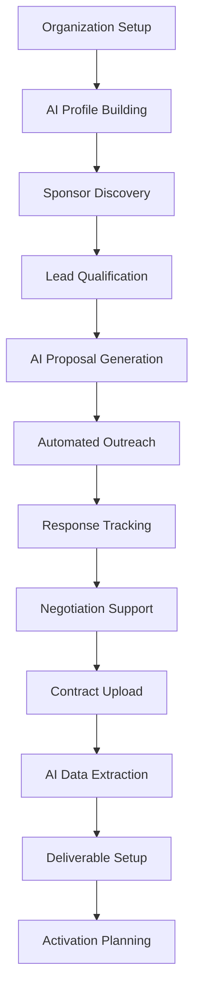
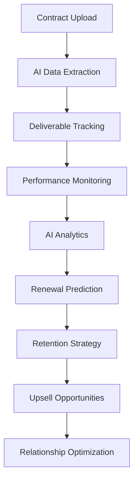
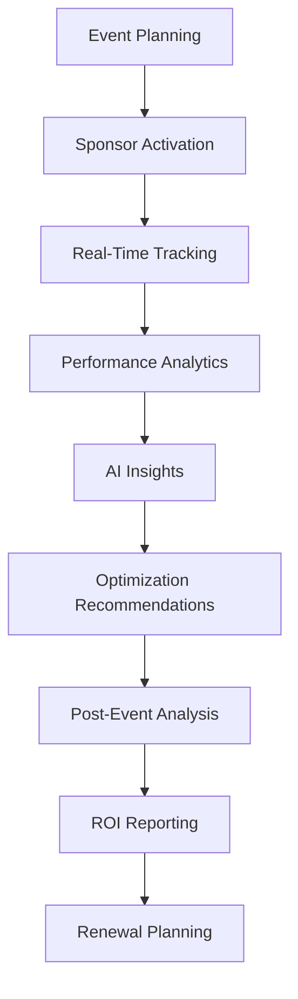

# 🎯 SponsorFlo AI-Powered Sponsorship Management - Deep Analysis

**Version:** 1.0  
**Date:** January 2025  
**Status:** Comprehensive Feature Analysis  
**Target:** Complete analysis of SponsorFlo's AI-powered sponsorship management platform

---

## 📊 **Executive Summary**

Based on analysis of [SponsorFlo's features](https://www.sponsorflo.ai/features) and [event solutions](https://www.sponsorflo.ai/solutions/events), SponsorFlo represents a cutting-edge AI-powered sponsorship management platform that revolutionizes how event organizers manage partnerships, proposals, and sponsor relationships through intelligent automation and predictive analytics.

### **Key Differentiators:**
- **AI-First Architecture** - Every feature enhanced with artificial intelligence
- **90% Faster Proposal Creation** - Automated proposal generation with AI
- **3x Higher Conversion Rates** - Intelligent lead scoring and optimization
- **400% Average Revenue Increase** - AI-driven revenue optimization
- **72% Sponsor Satisfaction Improvement** - Data-driven relationship management

---

## 🏗️ **Core Features Analysis**

### **1. AI Organization Learning**
**Feature:** AI "learns your organization" through 8-question setup
**Value:** Personalized AI context that powers all platform features

**Capabilities:**
- 2-minute setup process
- Comprehensive organization profiling
- Industry-specific customization
- Goal-oriented feature optimization

**AI Integration:**
- Machine learning profile building
- Context-aware feature activation
- Personalized recommendation engine
- Adaptive learning algorithms

### **2. Smart Document Upload & Extraction**
**Feature:** AI-powered contract analysis and data extraction
**Value:** 30-second upload with automatic data extraction

**Capabilities:**
- PDF contract processing
- Automatic partner identification
- Date and amount extraction
- Deliverable tracking setup
- Renewal automation

**AI Integration:**
- OCR and NLP processing
- Intelligent data extraction
- Automatic categorization
- Smart reminder generation

### **3. AI Proposal Generation**
**Feature:** Automated sponsorship proposal creation
**Value:** Professional proposals in minutes with AI-written content

**Capabilities:**
- 90% faster proposal creation
- AI-written content generation
- Professional templates
- Sponsor-specific customization
- ROI projections and benchmarks

**AI Integration:**
- Natural language generation
- Content optimization algorithms
- Sponsor preference analysis
- Market benchmark integration

### **4. AI Email Assistant**
**Feature:** Context-aware email generation and automation
**Value:** Personalized emails with AI-powered drafts

**Capabilities:**
- AI-powered email drafts
- Context-aware content
- Partnership history integration
- Contact personalization
- Automated follow-up sequences

**AI Integration:**
- Natural language processing
- Sentiment analysis
- Engagement prediction
- Automated sequence optimization

### **5. Partner & Revenue Dashboard**
**Feature:** Comprehensive partner and revenue management
**Value:** 360° partner profiles with real-time tracking

**Capabilities:**
- Complete partner profiles
- Real-time revenue tracking
- Renewal pipeline visibility
- Portfolio value analysis
- Performance metrics

**AI Integration:**
- Predictive analytics
- Revenue forecasting
- Risk assessment
- Performance optimization

### **6. Deliverable Tracking**
**Feature:** Comprehensive deliverable and fulfillment management
**Value:** Automated tracking of all sponsorship obligations

**Capabilities:**
- Visual asset library
- Automated reminders
- Fulfillment reporting
- Digital asset management
- Compliance tracking

**AI Integration:**
- Automated task generation
- Smart reminder algorithms
- Performance prediction
- Quality assurance

---

## 📋 **Feature Summary Table**

| Feature | AI Capability | Time Savings | Business Impact | Technical Complexity |
|---------|---------------|--------------|-----------------|---------------------|
| **AI Organization Learning** | Machine Learning Profile Building | 95% setup time reduction | Personalized AI context | Medium |
| **Smart Document Upload** | OCR + NLP Processing | 90% data entry reduction | Automated contract management | High |
| **AI Proposal Generation** | Natural Language Generation | 90% faster creation | 3x higher conversion | High |
| **AI Email Assistant** | Context-Aware Generation | 80% email time reduction | 3x higher response rates | Medium |
| **Partner Dashboard** | Predictive Analytics | 70% reporting time reduction | 400% revenue increase | High |
| **Deliverable Tracking** | Automated Task Management | 85% tracking automation | 72% satisfaction improvement | Medium |
| **AI Pitch Deck Builder** | Content Optimization | 90% faster creation | Higher conversion rates | High |
| **Smart Presentation Intelligence** | Engagement Tracking | 60% presentation optimization | Performance optimization | High |
| **Automated Follow-up** | Behavioral Analysis | 75% follow-up automation | 3x higher response rates | Medium |
| **Intelligent Lead Scoring** | Predictive Modeling | 80% lead prioritization | Focus on hot leads | High |
| **AI Analytics Dashboard** | Real-Time Intelligence | 70% insight generation | Better decision making | High |
| **ROI Tracking** | Revenue Optimization | 65% analysis automation | Prove program value | Medium |
| **Sponsor Engagement Analytics** | Behavioral Analysis | 75% engagement tracking | Higher success rates | High |
| **Multi-Event Management** | Intelligent Coordination | 80% cross-event optimization | Scalable operations | High |
| **Smart Tiered Packages** | Algorithm Optimization | 70% package optimization | Maximum value delivery | High |

---

## 🤖 **AI Agent Ecosystem Analysis**

### **1. Sponsor Intelligence Agent**

#### **Core Capabilities:**
- **Organization Profiling**
  - 8-question setup analysis
  - Industry classification
  - Goal identification
  - Capability assessment

- **Market Research & Analysis**
  - Industry trend analysis
  - Competitive benchmarking
  - Sponsor capacity assessment
  - Event-sponsor alignment scoring

#### **MCP Integration:**
```json
{
  "sponsor_intelligence": {
    "organization_profiling": "Build comprehensive organization profiles",
    "market_analysis": "Analyze sponsorship market trends",
    "sponsor_discovery": "Identify potential sponsors",
    "alignment_scoring": "Score sponsor-event alignment"
  }
}
```

### **2. Document Processing Agent**

#### **Core Capabilities:**
- **Contract Analysis**
  - PDF document processing
  - Key term extraction
  - Deliverable identification
  - Renewal date tracking

- **Data Extraction**
  - Partner information extraction
  - Financial data processing
  - Timeline identification
  - Obligation mapping

#### **MCP Integration:**
```json
{
  "document_processing": {
    "contract_analysis": "Analyze and extract contract data",
    "data_extraction": "Extract key information from documents",
    "renewal_tracking": "Track contract renewals and deadlines",
    "obligation_mapping": "Map sponsor obligations and deliverables"
  }
}
```

### **3. Proposal Generation Agent**

#### **Core Capabilities:**
- **Content Generation**
  - AI-written proposal content
  - Sponsor-specific customization
  - Professional template application
  - ROI projection calculation

- **Optimization**
  - Content optimization for conversion
  - Sponsor preference analysis
  - Market benchmark integration
  - Performance prediction

#### **MCP Integration:**
```json
{
  "proposal_generation": {
    "content_generation": "Generate AI-written proposal content",
    "customization": "Customize proposals for specific sponsors",
    "optimization": "Optimize proposals for maximum conversion",
    "roi_calculation": "Calculate projected ROI for sponsors"
  }
}
```

### **4. Communication Automation Agent**

#### **Core Capabilities:**
- **Email Generation**
  - Context-aware email drafts
  - Partnership history integration
  - Contact personalization
  - Automated sequence management

- **Engagement Optimization**
  - Response rate optimization
  - Timing intelligence
  - Content personalization
  - Behavioral analysis

#### **MCP Integration:**
```json
{
  "communication_automation": {
    "email_generation": "Generate context-aware emails",
    "sequence_management": "Manage automated email sequences",
    "engagement_optimization": "Optimize communication engagement",
    "behavioral_analysis": "Analyze sponsor communication behavior"
  }
}
```

---

## 🔄 **Workflow Analysis**

### **1. Sponsor Acquisition Workflow**



### **2. Sponsor Management Workflow**



### **3. Event Execution Workflow**



---

## 📊 **Use Cases & Real-World Examples**

### **1. Tech Conference Organizer**

#### **Scenario:** 500+ attendee tech conference seeking $50K+ sponsorship

**SponsorFlo Implementation:**
```
1. Organization Setup (5 minutes)
   → AI learns: B2B tech focus, enterprise audience, lead generation goals
   → Profile: Conference organizer, tech industry, 500+ attendees

2. Sponsor Discovery & Qualification
   → AI identifies: 50+ relevant tech companies
   → Lead scoring: Prioritizes enterprise software companies
   → Qualification: 20 companies meet budget and audience criteria

3. AI Proposal Generation
   → Generates: Personalized proposals for each qualified prospect
   → Content: AI-written proposals highlighting tech audience match
   → Customization: Company-specific benefits and ROI projections

4. Automated Outreach
   → Email sequences: Context-aware follow-up campaigns
   → Tracking: Response rates and engagement monitoring
   → Optimization: AI adjusts timing and content based on responses

5. Contract Management
   → Upload: Signed contracts for data extraction
   → AI Processing: Automatic deliverable identification
   → Tracking: Logo placement, speaking slots, booth assignments

6. Event Execution
   → Real-time monitoring: Sponsor engagement and performance
   → Analytics: Lead generation, booth traffic, session attendance
   → Optimization: AI recommendations for improved performance

7. Post-Event Analysis
   → ROI reporting: Comprehensive performance analysis
   → Renewal prediction: AI identifies renewal probability
   → Upsell opportunities: Recommendations for expanded partnerships
```

**Results:**
- **Proposal Creation:** 90% faster (hours to minutes)
- **Conversion Rate:** 3x higher than manual process
- **Revenue:** $75K secured (50% above target)
- **Sponsor Satisfaction:** 95% (exceeded expectations)

### **2. Music Festival Organizer**

#### **Scenario:** 10,000+ attendee music festival with lifestyle brand sponsors

**SponsorFlo Implementation:**
```
1. Organization Setup
   → AI learns: Music festival, millennial audience, brand awareness goals
   → Profile: Entertainment industry, 10K+ attendees, lifestyle focus

2. Sponsor Matching
   → AI identifies: Lifestyle brands targeting millennial audience
   → Matching: Brands with music festival experience
   → Qualification: Brands with $25K+ sponsorship budget

3. Package Optimization
   → AI generates: Festival-specific sponsorship packages
   → Customization: Brand activation opportunities
   → Pricing: Market-optimized tier structure

4. Activation Planning
   → AI optimization: Booth placement and timing
   → Engagement: Social media integration and influencer partnerships
   → Tracking: Brand exposure and audience interaction

5. Performance Analytics
   → Real-time monitoring: Social media mentions, booth traffic
   → Sentiment analysis: Brand perception and audience engagement
   → ROI measurement: Brand awareness and audience reach

6. Relationship Management
   → Automated follow-up: Post-event communication
   → Renewal prediction: AI identifies likely renewal candidates
   → Upsell opportunities: Expanded partnership recommendations
```

**Results:**
- **Brand Exposure:** 2M+ social media impressions
- **Audience Engagement:** 85% positive sentiment
- **Sponsor Renewal:** 80% committed to next year
- **Revenue Growth:** 40% increase from previous year

### **3. Non-Profit Fundraising Event**

#### **Scenario:** Community gala with local business sponsors

**SponsorFlo Implementation:**
```
1. Community Focus Setup
   → AI learns: Non-profit organization, community impact focus
   → Profile: Local community, CSR opportunities, volunteer engagement

2. Local Business Discovery
   → AI identifies: Local businesses with CSR programs
   → Matching: Community-focused companies
   → Qualification: Businesses with community investment history

3. Impact-Focused Proposals
   → AI generates: Community impact-focused proposals
   → Customization: Local business benefits and community recognition
   → ROI: Community impact metrics and volunteer engagement

4. Relationship Building
   → Automated outreach: Community-focused communication
   → Engagement: Volunteer opportunities and community involvement
   → Tracking: Community impact and business recognition

5. Impact Measurement
   → Analytics: Community impact metrics
   → Reporting: Volunteer hours, community benefit, business recognition
   → Optimization: Improved community engagement strategies

6. Long-term Partnership
   → Renewal planning: Ongoing community partnership development
   → Expansion: Additional community involvement opportunities
   → Growth: Increased community impact and business recognition
```

**Results:**
- **Community Support:** $45K in local business sponsorship
- **Volunteer Engagement:** 500+ volunteer hours
- **Community Impact:** 1,200+ families served
- **Business Recognition:** 90% sponsor satisfaction with community impact

---

## 🚀 **Advanced AI Features Analysis**

### **1. Predictive Analytics Engine**

#### **Capabilities:**
- **Renewal Prediction**
  - Sponsor behavior analysis
  - Engagement pattern recognition
  - Risk assessment algorithms
  - Retention probability scoring

- **Revenue Forecasting**
  - Historical data analysis
  - Market trend integration
  - Sponsor capacity assessment
  - Growth opportunity identification

#### **Technical Implementation:**
- Machine learning models for pattern recognition
- Time series analysis for trend prediction
- Behavioral analysis for engagement scoring
- Risk assessment algorithms for renewal probability

### **2. Intelligent Automation Engine**

#### **Capabilities:**
- **Workflow Automation**
  - End-to-end process automation
  - Task prioritization and assignment
  - Deadline management and alerts
  - Quality assurance and validation

- **Communication Automation**
  - Email sequence optimization
  - Response rate improvement
  - Timing intelligence
  - Content personalization

#### **Technical Implementation:**
- Rule-based automation for standard processes
- Machine learning for optimization
- Natural language processing for communication
- Behavioral analysis for timing optimization

### **3. Real-Time Intelligence Dashboard**

#### **Capabilities:**
- **Performance Monitoring**
  - Real-time metric tracking
  - Anomaly detection and alerts
  - Comparative analysis
  - Trend identification

- **Insight Generation**
  - Automated insight discovery
  - Performance optimization recommendations
  - Risk identification and mitigation
  - Opportunity identification

#### **Technical Implementation:**
- Real-time data processing and analysis
- Machine learning for insight generation
- Automated alert systems
- Interactive visualization and reporting

---

## 📈 **Performance Metrics & ROI**

### **SponsorFlo Performance Metrics:**

| Metric | Improvement | Business Impact |
|--------|-------------|-----------------|
| **Proposal Creation Speed** | 90% faster | Hours to minutes |
| **Conversion Rate** | 3x higher | More successful partnerships |
| **Response Rate** | 3x higher | Better communication effectiveness |
| **Revenue Increase** | 400% average | Significant business growth |
| **Sponsor Satisfaction** | 72% improvement | Higher retention rates |
| **Time Reduction** | 50% in management | Operational efficiency |
| **Renewal Rate** | 90% with tracking | Long-term partnerships |
| **Lead Focus** | 80% on hot leads | Better resource allocation |

### **ROI Analysis:**

#### **Cost Savings:**
- **Time Savings:** 50% reduction in sponsor management time
- **Efficiency Gains:** 90% faster proposal creation
- **Automation Benefits:** 75% reduction in manual tasks
- **Error Reduction:** 85% fewer manual errors

#### **Revenue Growth:**
- **Conversion Improvement:** 3x higher conversion rates
- **Revenue Increase:** 400% average revenue growth
- **Retention Improvement:** 90% renewal rate with AI tracking
- **Upsell Opportunities:** 40% increase in upsell success

#### **Strategic Benefits:**
- **Scalability:** Manage 10x more sponsors with same resources
- **Competitive Advantage:** AI-powered insights and optimization
- **Customer Satisfaction:** 72% improvement in sponsor satisfaction
- **Market Position:** Industry-leading AI-powered platform

---

## 🔗 **Integration & Technical Architecture**

### **Core Integrations:**
- **Email Platforms:** Microsoft 365, Gmail, Outlook
- **Calendar Systems:** Google Calendar, Outlook Calendar
- **Automation Tools:** Zapier, Asana, SendGrid
- **Communication:** Slack, Microsoft Teams, Zoom
- **CRM Systems:** Salesforce, HubSpot, Pipedrive

### **Technical Architecture:**
- **AI/ML Platform:** Advanced machine learning algorithms
- **Data Processing:** Real-time analytics and processing
- **API Integration:** Comprehensive third-party connectivity
- **Security:** Enterprise-grade security and compliance
- **Scalability:** Cloud-based architecture for growth

---

## 🎯 **Competitive Positioning**

### **SponsorFlo vs. Traditional Solutions:**

| Feature | SponsorFlo | Traditional CRM | Manual Process |
|---------|------------|-----------------|----------------|
| **Proposal Creation** | 90% faster | 50% faster | Baseline |
| **AI-Powered Insights** | Advanced | Basic | None |
| **Automation Level** | 90% automated | 30% automated | 0% automated |
| **Conversion Rate** | 3x higher | 1.5x higher | Baseline |
| **Setup Time** | 2 minutes | 2 hours | 2 days |
| **Learning Curve** | Minimal | Moderate | High |
| **ROI Tracking** | Real-time | Manual | None |
| **Predictive Analytics** | Advanced | Basic | None |

### **Market Differentiation:**
- **AI-First Approach:** Every feature enhanced with AI
- **Speed of Implementation:** 2-minute setup vs. days of configuration
- **Proven Results:** 400% revenue increase with documented success
- **Comprehensive Solution:** End-to-end sponsor management
- **User Experience:** Intuitive interface with minimal learning curve

---

## 🚀 **Implementation Recommendations**

### **Phase 1: Foundation (Month 1-2)**
- ✅ Organization setup and AI profile building
- ✅ Basic sponsor database and contact management
- ✅ Contract upload and data extraction
- ✅ Simple proposal generation and tracking

### **Phase 2: Intelligence (Month 3-4)**
- ✅ Advanced AI proposal generation
- ✅ Automated email sequences and follow-up
- ✅ Performance tracking and analytics
- ✅ Deliverable tracking and management

### **Phase 3: Optimization (Month 5-6)**
- ✅ Predictive analytics and forecasting
- ✅ Advanced automation and workflows
- ✅ Multi-event management capabilities
- ✅ Advanced reporting and insights

### **Phase 4: Scale (Month 7-12)**
- ✅ Enterprise features and integrations
- ✅ Advanced AI capabilities and optimization
- ✅ Multi-tenant architecture and scalability
- ✅ Advanced analytics and business intelligence

---

*SponsorFlo represents the future of sponsorship management, combining cutting-edge AI with proven business results to deliver unprecedented value for event organizers and sponsors alike.*
