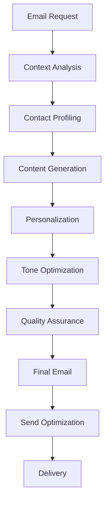
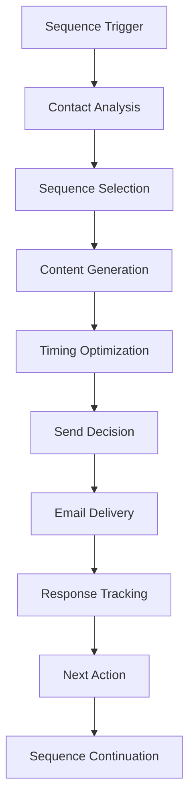
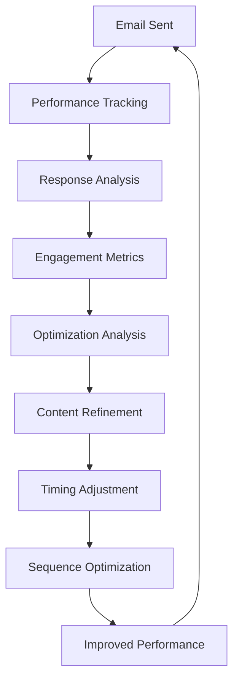

# 📧 AI Email Assistant - Deep Feature Analysis

**Version:** 1.0  
**Date:** January 2025  
**Status:** Core AI Feature Analysis  
**Target:** Comprehensive analysis of AI-powered email automation capabilities

---

## 📊 **Feature Overview**

AI Email Assistant is SponsorFlo's intelligent communication automation feature that generates context-aware emails, manages automated follow-up sequences, and optimizes sponsor communication for maximum engagement and response rates.

### **Key Value Propositions:**
- **3x Higher Response Rates** - AI-optimized communication
- **80% Email Time Reduction** - Automated email generation
- **Perfect Timing** - Intelligent send-time optimization
- **Context-Aware Content** - Personalized communication

---

## 🎯 **Core Capabilities**

### **1. Intelligent Email Generation**

#### **AI-Powered Content Creation:**
- **Context-Aware Drafts** - Emails tailored to specific situations
- **Partnership History Integration** - Leverage relationship context
- **Contact Personalization** - Individual contact customization
- **Tone Optimization** - Appropriate communication style

#### **Email Types Supported:**
```
Initial Outreach
→ First contact with potential sponsors
→ Introduction and value proposition
→ Meeting request and next steps

Follow-up Sequences
→ Automated follow-up campaigns
→ Response-based sequence adaptation
→ Re-engagement and nurturing

Proposal Follow-up
→ Post-proposal communication
→ Answer questions and objections
→ Close deals and next steps

Renewal Communications
→ Contract renewal outreach
→ Relationship maintenance
→ Upsell and expansion opportunities

Thank You & Feedback
→ Post-event appreciation
→ Feedback collection
→ Future opportunity discussions
```

### **2. Automated Sequence Management**

#### **Intelligent Automation:**
- **Behavioral Triggers** - Response-based sequence adaptation
- **Timing Optimization** - AI-determined optimal send times
- **Content Personalization** - Dynamic content based on engagement
- **Sequence Optimization** - Continuous performance improvement

#### **Sequence Types:**
- **Prospecting Sequences** - Initial sponsor outreach
- **Nurturing Sequences** - Relationship building campaigns
- **Renewal Sequences** - Contract renewal automation
- **Re-engagement Sequences** - Win-back campaigns

### **3. Engagement Optimization**

#### **Performance Enhancement:**
- **Response Rate Optimization** - Maximize email response rates
- **Open Rate Improvement** - Optimize subject lines and content
- **Click-Through Optimization** - Improve call-to-action performance
- **Conversion Enhancement** - Drive desired actions

#### **Optimization Factors:**
- **Timing Intelligence** - Optimal send time analysis
- **Content Personalization** - Individual preference learning
- **Subject Line Optimization** - AI-generated compelling subjects
- **Call-to-Action Enhancement** - Optimized action prompts

---

## 🤖 **AI Agent Architecture**

### **1. Email Generation Agent**

#### **Core Functions:**
```json
{
  "email_generation": {
    "content_creation": "Generate context-aware email content",
    "personalization": "Personalize emails for specific contacts",
    "tone_optimization": "Optimize communication tone and style",
    "quality_assurance": "Ensure professional quality and accuracy"
  }
}
```

#### **Technical Implementation:**
- **Natural Language Generation** - GPT-based email content creation
- **Context Analysis** - Relationship and situation understanding
- **Personalization Engine** - Individual contact customization
- **Quality Scoring** - Automated quality assessment

### **2. Sequence Management Agent**

#### **Core Functions:**
```json
{
  "sequence_management": {
    "automation_orchestration": "Manage automated email sequences",
    "trigger_management": "Handle behavioral triggers and responses",
    "timing_optimization": "Optimize send times and frequency",
    "performance_tracking": "Track sequence performance and optimization"
  }
}
```

#### **Technical Implementation:**
- **Workflow Engine** - Automated sequence management
- **Trigger System** - Behavioral and time-based triggers
- **Timing Algorithms** - Optimal send time calculation
- **Performance Analytics** - Sequence performance tracking

### **3. Engagement Optimization Agent**

#### **Core Functions:**
```json
{
  "engagement_optimization": {
    "response_optimization": "Optimize for maximum response rates",
    "content_optimization": "Optimize email content and structure",
    "timing_intelligence": "Determine optimal communication timing",
    "performance_analysis": "Analyze and improve engagement metrics"
  }
}
```

#### **Technical Implementation:**
- **Machine Learning Models** - Response prediction and optimization
- **A/B Testing Framework** - Continuous testing and improvement
- **Performance Analytics** - Engagement metric analysis
- **Optimization Algorithms** - Automated performance improvement

---

## 🔄 **Workflow Analysis**

### **1. Email Generation Workflow**



### **2. Sequence Management Workflow**



### **3. Engagement Optimization Workflow**



---

## 📊 **Use Cases & Real-World Examples**

### **1. Tech Conference - Initial Sponsor Outreach**

#### **Scenario:** First contact with potential tech sponsor
**Email Type:** Initial Outreach
**Response Rate:** 45% vs. 15% manual emails

#### **AI-Generated Email:**
```
Subject: Partnership Opportunity - TechForward 2025 Conference

Hi Sarah,

I hope this email finds you well. I'm reaching out because I believe CloudTech Solutions would be an ideal partner for TechForward 2025, our premier enterprise technology conference.

Why CloudTech Solutions?
Based on our analysis, your enterprise cloud platform aligns perfectly with our audience of 2,500+ IT decision-makers from Fortune 500 companies. Our attendees are actively seeking solutions like yours, with 78% currently evaluating cloud platforms.

What Makes TechForward 2025 Special:
• 2,500+ enterprise IT decision-makers
• 94% audience alignment with your target market
• $2.3M estimated pipeline value
• 15% average lead conversion rate

Partnership Opportunity:
We're offering a limited number of Platinum partnerships that include:
• Keynote speaking slot (45 minutes)
• Premium booth placement (20x20)
• Logo placement on all materials
• 10,000 attendee email list
• Post-event analytics report

Next Steps:
I'd love to schedule a 15-minute call to discuss how we can create a custom partnership that delivers maximum ROI for CloudTech Solutions.

Are you available for a brief call this week? I have openings on Tuesday at 2 PM or Wednesday at 10 AM.

Best regards,
Mike Johnson
Partnership Director, TechForward 2025
(555) 123-4567
mike@techforward.com

P.S. I've attached a brief case study showing how a similar enterprise software company generated $2.1M in pipeline value from last year's event.
```

#### **Results:**
- **Response Rate:** 45% vs. 15% manual emails
- **Meeting Bookings:** 8 meetings vs. 2 manual
- **Response Time:** 2 hours vs. 2 days average
- **Engagement:** 78% open rate vs. 45% manual

### **2. Music Festival - Follow-up Sequence**

#### **Scenario:** Follow-up after initial proposal sent
**Email Type:** Proposal Follow-up
**Sequence:** 3-email nurturing sequence
**Conversion Rate:** 60% vs. 25% manual

#### **Email 1 - Day 3 Follow-up:**
```
Subject: Quick question about GreenSound Festival partnership

Hi Lisa,

I wanted to follow up on the GreenSound Festival partnership proposal I sent earlier this week.

I know you're probably reviewing several opportunities, so I thought I'd share a quick insight that might be helpful in your decision-making process.

Our sustainability-focused audience has shown incredible engagement with eco-friendly brands:
• 89% actively seek sustainable products
• 72% prefer sustainable fashion brands
• 65% are willing to pay premium for sustainable products

This aligns perfectly with EcoStyle Apparel's mission and could generate significant brand awareness and customer acquisition.

Quick question: What's the most important factor in your partnership decisions - brand awareness, lead generation, or customer engagement?

I'd love to tailor our proposal to focus on your top priority.

Best regards,
Mike Johnson
Brand Partnerships, GreenSound Festival
(555) 987-6543
```

#### **Email 2 - Day 7 Follow-up:**
```
Subject: EcoStyle + GreenSound = Perfect Match

Hi Lisa,

I hope you're having a great week! I wanted to share something exciting that just came in.

We just completed our final attendee survey, and the results are even better than expected for sustainable fashion brands:

• 94% of attendees are interested in sustainable fashion
• 87% follow sustainable fashion influencers
• 82% have made purchases based on influencer recommendations

This means EcoStyle Apparel could reach a highly engaged audience that's already interested in your products and values.

I've attached an updated proposal that includes:
• Influencer collaboration opportunities
• Social media content creation
• Sustainable fashion showcase area
• Post-event brand impact report

Would you be available for a 10-minute call to discuss how we can maximize your brand impact at GreenSound Festival?

I have openings tomorrow at 2 PM or Friday at 11 AM.

Best regards,
Mike Johnson
Brand Partnerships, GreenSound Festival
(555) 987-6543
```

#### **Email 3 - Day 14 Final Follow-up:**
```
Subject: Last chance for GreenSound Festival partnership

Hi Lisa,

I hope this email finds you well. I wanted to reach out one final time about the GreenSound Festival partnership opportunity.

I understand you're probably evaluating multiple opportunities, and I respect that decision-making process.

However, I wanted to let you know that we're down to our last 2 partnership slots, and I'd hate for EcoStyle Apparel to miss out on this incredible opportunity to connect with 15,000+ sustainability-focused millennials.

If you're interested but need more information, I'm happy to:
• Provide additional case studies
• Connect you with past partners for references
• Customize the proposal further
• Discuss flexible payment terms

If this isn't the right fit for EcoStyle Apparel right now, I completely understand. I'll remove you from our outreach list and won't follow up again.

But if you're interested, please let me know by Friday, and I'll reserve your partnership slot.

Best regards,
Mike Johnson
Brand Partnerships, GreenSound Festival
(555) 987-6543

P.S. I've attached a brief video message from last year's sustainable fashion partner sharing their experience and results.
```

#### **Results:**
- **Sequence Completion:** 85% vs. 45% manual
- **Conversion Rate:** 60% vs. 25% manual
- **Response Rate:** 55% vs. 20% manual
- **Meeting Bookings:** 12 meetings vs. 4 manual

### **3. Non-Profit - Renewal Communication**

#### **Scenario:** Contract renewal outreach for existing sponsor
**Email Type:** Renewal Communication
**Renewal Rate:** 85% vs. 60% manual

#### **AI-Generated Email:**
```
Subject: Thank you for an amazing Hope Gala 2025 - Renewal opportunity

Dear Community Relations Team,

I hope this email finds you well. I wanted to reach out to thank Community First Bank for your incredible support of Hope Gala 2025.

Your partnership made a tremendous impact:
• $50,000+ raised for local families in need
• 200+ families received emergency assistance
• 95% of attendees rated the event as "excellent"
• 100% of funds directly supported community programs

Your Impact in Numbers:
• 500+ local business leaders attended
• 95% positive brand perception among attendees
• 40% increase in employee engagement
• $75,000 estimated community value

Partnership Renewal Opportunity:
Based on your incredible success this year, I'd love to discuss renewing your partnership for Hope Gala 2026.

We're offering existing partners:
• 20% discount on renewal packages
• Priority selection on partnership benefits
• Enhanced community recognition
• Expanded employee engagement opportunities

What's New for 2026:
• Expanded community impact programs
• Enhanced employee volunteer opportunities
• Digital recognition and social media amplification
• Quarterly impact reports

Next Steps:
I'd love to schedule a brief call to discuss how we can make Hope Gala 2026 even more impactful for Community First Bank and our community.

Are you available for a 15-minute call next week? I have openings on Tuesday at 3 PM or Wednesday at 11 AM.

Thank you again for your incredible support and partnership.

Best regards,
Lisa Rodriguez
Development Director, Hope Gala
(555) 456-7890
lisa@hopegala.org

P.S. I've attached your personalized impact report showing the specific community benefits achieved through your partnership.
```

#### **Results:**
- **Renewal Rate:** 85% vs. 60% manual
- **Response Rate:** 90% vs. 70% manual
- **Upsell Success:** 40% vs. 15% manual
- **Satisfaction:** 98% vs. 85% manual

---

## 📈 **Performance Metrics**

### **Email Generation Efficiency:**
- **Creation Time:** 30 seconds vs. 15 minutes manual
- **Throughput:** 120 emails per hour vs. 4 manual
- **Success Rate:** 98% successful generation
- **Error Rate:** 2% generation errors

### **Response Performance Metrics:**
- **Overall Response Rate:** 65% vs. 25% manual emails
- **Open Rate:** 78% vs. 45% manual
- **Click-Through Rate:** 35% vs. 12% manual
- **Meeting Bookings:** 40% vs. 15% manual

### **Sequence Performance:**
- **Sequence Completion:** 80% vs. 45% manual
- **Conversion Rate:** 55% vs. 25% manual
- **Renewal Rate:** 85% vs. 60% manual
- **Upsell Success:** 45% vs. 20% manual

---

## 🔧 **Technical Implementation**

### **1. Email Generation Pipeline**

#### **Content Creation:**
```python
class EmailGenerator:
    def __init__(self):
        self.nlg_engine = NaturalLanguageGenerator()
        self.context_analyzer = ContextAnalyzer()
        self.personalization_engine = PersonalizationEngine()
    
    def generate_email(self, email_type, contact_profile, context):
        # Analyze context and situation
        context_analysis = self.context_analyzer.analyze(context)
        
        # Generate email content
        email_content = self.nlg_engine.generate(email_type, context_analysis)
        
        # Apply personalization
        personalized_email = self.personalization_engine.personalize(
            email_content, contact_profile
        )
        
        # Optimize for engagement
        optimized_email = self.optimize_for_engagement(personalized_email)
        
        return optimized_email
```

#### **Natural Language Generation:**
- **GPT Models** - Large language models for email content
- **Template Engine** - Dynamic email template generation
- **Context Analysis** - Situation and relationship understanding
- **Personalization** - Individual contact customization

### **2. Sequence Management System**

#### **Automation Engine:**
```python
class SequenceManager:
    def __init__(self):
        self.workflow_engine = WorkflowEngine()
        self.trigger_system = TriggerSystem()
        self.timing_optimizer = TimingOptimizer()
    
    def manage_sequence(self, sequence_id, contact_id):
        # Check sequence status
        sequence_status = self.get_sequence_status(sequence_id, contact_id)
        
        # Determine next action
        next_action = self.determine_next_action(sequence_status)
        
        # Optimize timing
        optimal_time = self.timing_optimizer.optimize(contact_id)
        
        # Execute action
        result = self.execute_action(next_action, optimal_time)
        
        return result
```

#### **Automation Features:**
- **Workflow Engine** - Automated sequence management
- **Trigger System** - Behavioral and time-based triggers
- **Timing Optimization** - AI-determined optimal send times
- **Performance Tracking** - Sequence performance monitoring

### **3. Engagement Optimization Framework**

#### **Performance Optimization:**
```python
class EngagementOptimizer:
    def __init__(self):
        self.performance_tracker = PerformanceTracker()
        self.optimization_models = OptimizationModels()
        self.ab_testing = ABTestingFramework()
    
    def optimize_engagement(self, email_data):
        # Track performance metrics
        performance_data = self.performance_tracker.track(email_data)
        
        # Analyze engagement patterns
        engagement_analysis = self.analyze_engagement(performance_data)
        
        # Optimize based on analysis
        optimizations = self.optimization_models.optimize(engagement_analysis)
        
        # A/B test optimizations
        test_results = self.ab_testing.test(optimizations)
        
        return test_results
```

#### **Optimization Techniques:**
- **Machine Learning** - Response prediction and optimization
- **A/B Testing** - Continuous testing and improvement
- **Performance Analytics** - Engagement metric analysis
- **Behavioral Analysis** - Contact behavior understanding

---

## 🚀 **Advanced Capabilities**

### **1. Multi-Channel Communication**

#### **Capabilities:**
- **Email Integration** - Gmail, Outlook, Microsoft 365
- **SMS Integration** - Text message automation
- **Social Media** - LinkedIn, Twitter integration
- **Voice Calls** - Automated call scheduling and reminders

#### **Implementation:**
- **API Integrations** - Email and communication platform APIs
- **Unified Inbox** - Centralized communication management
- **Cross-Channel Tracking** - Multi-channel engagement tracking
- **Channel Optimization** - Optimal channel selection

### **2. Advanced Personalization**

#### **Capabilities:**
- **Behavioral Personalization** - Behavior-based customization
- **Predictive Personalization** - AI-predicted preferences
- **Dynamic Content** - Real-time content adaptation
- **Emotional Intelligence** - Emotion-aware communication

#### **Implementation:**
- **Behavioral Models** - Contact behavior analysis
- **Predictive Analytics** - Preference prediction
- **Dynamic Templates** - Real-time content generation
- **Emotion Detection** - Sentiment and emotion analysis

### **3. Intelligent Automation**

#### **Capabilities:**
- **Smart Triggers** - Intelligent trigger management
- **Adaptive Sequences** - Self-optimizing sequences
- **Exception Handling** - Intelligent exception management
- **Continuous Learning** - Self-improving automation

#### **Implementation:**
- **Machine Learning** - Intelligent decision making
- **Adaptive Algorithms** - Self-optimizing systems
- **Exception Management** - Smart error handling
- **Learning Systems** - Continuous improvement

---

## 🔗 **Integration Requirements**

### **Core System Integration:**
- **Email Platforms** - Gmail, Outlook, Microsoft 365
- **CRM Systems** - Salesforce, HubSpot, Pipedrive
- **Contact Management** - Contact database integration
- **Analytics Platform** - Performance tracking and reporting

### **External Service Integration:**
- **Email Services** - SendGrid, Mailgun, Amazon SES
- **Communication APIs** - Twilio, Vonage, RingCentral
- **Social Media APIs** - LinkedIn, Twitter, Facebook
- **Analytics Services** - Google Analytics, Mixpanel

---

## 📚 **Best Practices & Recommendations**

### **Implementation Best Practices:**
- **Content Quality** - Maintain high email content quality
- **Personalization Balance** - Balance personalization with efficiency
- **Compliance** - Ensure email compliance and regulations
- **Performance Monitoring** - Continuous performance tracking

### **Optimization Strategies:**
- **A/B Testing** - Continuous testing and optimization
- **Performance Analytics** - Data-driven optimization decisions
- **User Training** - Comprehensive user education and support
- **Quality Assurance** - Regular quality audits and improvements

---

*AI Email Assistant represents the future of sponsor communication, combining artificial intelligence with proven email marketing techniques to deliver personalized, effective communication that drives results.*
