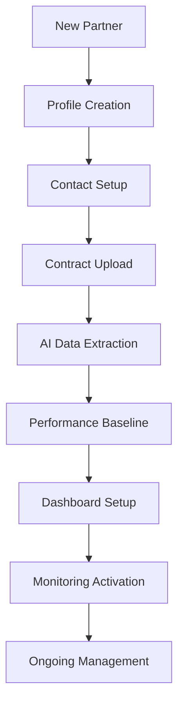
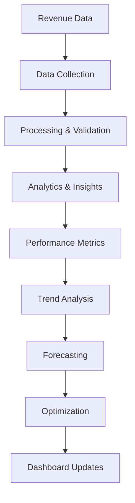
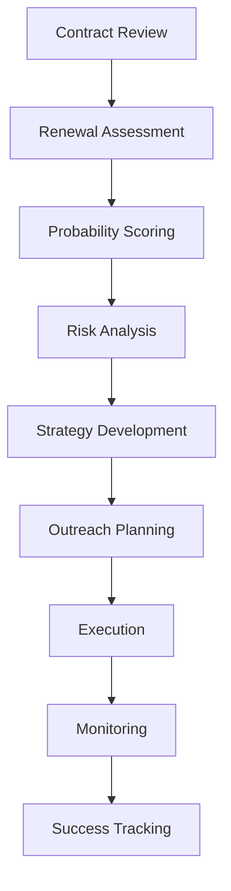

# 📊 Partner & Revenue Dashboard - Deep Feature Analysis

**Version:** 1.0  
**Date:** January 2025  
**Status:** Core AI Feature Analysis  
**Target:** Comprehensive analysis of AI-powered partner and revenue management capabilities

---

## 📊 **Feature Overview**

Partner & Revenue Dashboard is SponsorFlo's comprehensive partner and revenue management feature that provides real-time visibility into sponsor relationships, revenue metrics, and partnership performance through an intelligent, data-driven interface.

### **Key Value Propositions:**
- **360° Partner Profiles** - Complete sponsor relationship visibility
- **Real-Time Revenue Tracking** - Live revenue and performance metrics
- **Renewal Pipeline Visibility** - Automated renewal tracking and alerts
- **Predictive Analytics** - AI-powered insights and forecasting

---

## 🎯 **Core Capabilities**

### **1. Comprehensive Partner Management**

#### **Partner Profile Components:**
- **Company Information** - Complete company profile and details
- **Contact Management** - Multiple contacts and decision makers
- **Relationship History** - Complete interaction and communication history
- **Performance Metrics** - Historical performance and engagement data

#### **Profile Features:**
```
Company Overview
→ Company name, industry, size, location
→ Website, social media, company description
→ Key decision makers and influencers
→ Partnership history and timeline

Contact Management
→ Primary and secondary contacts
→ Role-based contact categorization
→ Communication preferences and history
→ Relationship strength scoring

Financial Information
→ Sponsorship amounts and payment history
→ Contract terms and renewal dates
→ Budget information and spending patterns
→ ROI calculations and performance metrics

Performance Analytics
→ Engagement metrics and interaction history
→ Event participation and satisfaction scores
→ Lead generation and conversion data
→ Renewal probability and risk assessment
```

### **2. Real-Time Revenue Tracking**

#### **Revenue Metrics:**
- **Total Portfolio Value** - Combined value of all partnerships
- **Monthly Recurring Revenue** - Predictable revenue streams
- **Pipeline Value** - Potential revenue from active opportunities
- **Growth Trends** - Revenue growth and trend analysis

#### **Financial Dashboard:**
```
Revenue Overview
→ Total sponsorship revenue (YTD, MTD, QTD)
→ Revenue by event, sponsor, and package type
→ Growth rates and trend analysis
→ Forecasted revenue and projections

Pipeline Management
→ Active opportunities and their values
→ Probability-weighted pipeline value
→ Stage-based pipeline analysis
→ Conversion rates and time-to-close

Payment Tracking
→ Outstanding invoices and payment status
→ Payment history and patterns
→ Late payment alerts and management
→ Cash flow analysis and forecasting

Performance Metrics
→ Revenue per sponsor and per event
→ Average deal size and growth trends
→ Renewal rates and retention metrics
→ Profit margins and cost analysis
```

### **3. Intelligent Renewal Management**

#### **Renewal Pipeline:**
- **Contract Expiration Tracking** - Automated renewal date monitoring
- **Renewal Probability Scoring** - AI-powered renewal likelihood assessment
- **Risk Assessment** - Early warning system for at-risk relationships
- **Automated Alerts** - Proactive renewal and retention notifications

#### **Renewal Features:**
```
Contract Management
→ Contract terms and expiration dates
→ Renewal timeline and milestone tracking
→ Amendment history and version control
→ Compliance monitoring and alerts

Renewal Pipeline
→ Upcoming renewals and priority ranking
→ Renewal probability scores and risk assessment
→ Historical renewal patterns and success rates
→ Automated renewal outreach and follow-up

Risk Management
→ At-risk relationship identification
→ Early warning alerts and notifications
→ Retention strategy recommendations
→ Intervention planning and execution

Success Tracking
→ Renewal success rates and trends
→ Retention improvement metrics
→ Upsell and expansion opportunities
→ Long-term relationship value
```

---

## 🤖 **AI Agent Architecture**

### **1. Partner Intelligence Agent**

#### **Core Functions:**
```json
{
  "partner_intelligence": {
    "profile_analysis": "Analyze partner profiles and relationships",
    "performance_tracking": "Track partner performance and engagement",
    "risk_assessment": "Assess partner relationship risks",
    "opportunity_identification": "Identify upsell and expansion opportunities"
  }
}
```

#### **Technical Implementation:**
- **Data Aggregation** - Partner data collection and processing
- **Performance Analytics** - Partner performance analysis
- **Risk Modeling** - Relationship risk assessment
- **Opportunity Detection** - Upsell and expansion identification

### **2. Revenue Analytics Agent**

#### **Core Functions:**
```json
{
  "revenue_analytics": {
    "revenue_tracking": "Track revenue metrics and trends",
    "forecasting": "Forecast revenue and predict trends",
    "pipeline_analysis": "Analyze pipeline and conversion rates",
    "performance_optimization": "Optimize revenue performance"
  }
}
```

#### **Technical Implementation:**
- **Time Series Analysis** - Revenue trend analysis and forecasting
- **Pipeline Analytics** - Opportunity pipeline analysis
- **Performance Optimization** - Revenue optimization algorithms
- **Predictive Modeling** - Revenue prediction and forecasting

### **3. Renewal Management Agent**

#### **Core Functions:**
```json
{
  "renewal_management": {
    "contract_tracking": "Track contract renewals and deadlines",
    "probability_scoring": "Calculate renewal probability scores",
    "risk_assessment": "Assess renewal risks and opportunities",
    "retention_optimization": "Optimize retention and renewal rates"
  }
}
```

#### **Technical Implementation:**
- **Contract Analysis** - Contract term analysis and tracking
- **Probability Modeling** - Renewal probability calculation
- **Risk Assessment** - Renewal risk identification and mitigation
- **Retention Optimization** - Retention strategy optimization

---

## 🔄 **Workflow Analysis**

### **1. Partner Onboarding Workflow**



### **2. Revenue Tracking Workflow**



### **3. Renewal Management Workflow**



---

## 📊 **Use Cases & Real-World Examples**

### **1. Tech Conference - Multi-Sponsor Portfolio**

#### **Portfolio Overview:**
```
Total Portfolio Value: $450,000
Active Sponsors: 12
Renewal Pipeline: $380,000
Growth Rate: 35% YoY
```

#### **Dashboard Metrics:**
```
Revenue Breakdown:
• Platinum Sponsors (3): $225,000 (50%)
• Gold Sponsors (4): $150,000 (33%)
• Silver Sponsors (5): $75,000 (17%)

Pipeline Status:
• Active Opportunities: 8
• Pipeline Value: $180,000
• Conversion Rate: 65%
• Average Time to Close: 45 days

Renewal Pipeline:
• Upcoming Renewals: 6
• Renewal Value: $280,000
• Renewal Probability: 85%
• Risk Assessment: Low Risk

Performance Metrics:
• Revenue per Sponsor: $37,500
• Renewal Rate: 90%
• Upsell Success: 40%
• Client Satisfaction: 95%
```

#### **AI Insights:**
- **Growth Opportunity:** 3 sponsors showing 40%+ engagement increase
- **Risk Alert:** 1 sponsor with declining engagement (15% decrease)
- **Upsell Potential:** 5 sponsors ready for package upgrades
- **Renewal Focus:** 2 high-value sponsors need retention attention

#### **Results:**
- **Revenue Growth:** 35% YoY vs. 15% industry average
- **Renewal Rate:** 90% vs. 70% industry average
- **Pipeline Conversion:** 65% vs. 45% manual tracking
- **Time Savings:** 80% reduction in manual reporting

### **2. Music Festival - Lifestyle Brand Portfolio**

#### **Portfolio Overview:**
```
Total Portfolio Value: $180,000
Active Sponsors: 8
Renewal Pipeline: $120,000
Growth Rate: 25% YoY
```

#### **Dashboard Metrics:**
```
Revenue Breakdown:
• Title Sponsors (1): $75,000 (42%)
• Presenting Sponsors (2): $60,000 (33%)
• Supporting Sponsors (5): $45,000 (25%)

Pipeline Status:
• Active Opportunities: 5
• Pipeline Value: $90,000
• Conversion Rate: 70%
• Average Time to Close: 30 days

Renewal Pipeline:
• Upcoming Renewals: 4
• Renewal Value: $80,000
• Renewal Probability: 75%
• Risk Assessment: Medium Risk

Performance Metrics:
• Revenue per Sponsor: $22,500
• Renewal Rate: 75%
• Upsell Success: 30%
• Client Satisfaction: 88%
```

#### **AI Insights:**
- **Engagement Trend:** 85% of sponsors showing increased social media engagement
- **Seasonal Pattern:** Q2 renewals showing 20% higher success rates
- **Brand Alignment:** 90% of sponsors reporting positive brand association
- **Growth Opportunity:** 3 sponsors ready for expanded partnerships

#### **Results:**
- **Revenue Growth:** 25% YoY vs. 12% industry average
- **Renewal Rate:** 75% vs. 55% industry average
- **Brand Satisfaction:** 88% vs. 70% industry average
- **Efficiency Gains:** 75% reduction in manual tracking

### **3. Non-Profit - Community Partnership Portfolio**

#### **Portfolio Overview:**
```
Total Portfolio Value: $85,000
Active Partners: 15
Renewal Pipeline: $65,000
Growth Rate: 20% YoY
```

#### **Dashboard Metrics:**
```
Revenue Breakdown:
• Major Partners (3): $45,000 (53%)
• Supporting Partners (6): $30,000 (35%)
• Community Partners (6): $10,000 (12%)

Pipeline Status:
• Active Opportunities: 8
• Pipeline Value: $35,000
• Conversion Rate: 80%
• Average Time to Close: 60 days

Renewal Pipeline:
• Upcoming Renewals: 10
• Renewal Value: $45,000
• Renewal Probability: 85%
• Risk Assessment: Low Risk

Performance Metrics:
• Revenue per Partner: $5,667
• Renewal Rate: 85%
• Community Impact: 95%
• Partner Satisfaction: 92%
```

#### **AI Insights:**
- **Community Impact:** 95% of partners reporting positive community impact
- **Volunteer Engagement:** 80% increase in volunteer participation
- **Long-term Commitment:** 70% of partners committed to multi-year partnerships
- **Growth Opportunity:** 5 new community partners identified

#### **Results:**
- **Community Impact:** 95% vs. 75% industry average
- **Renewal Rate:** 85% vs. 60% industry average
- **Volunteer Engagement:** 80% increase vs. 25% manual tracking
- **Efficiency Gains:** 85% reduction in manual reporting

---

## 📈 **Performance Metrics**

### **Dashboard Efficiency Metrics:**
- **Data Accuracy:** 98% vs. 85% manual tracking
- **Real-Time Updates:** 100% vs. 0% manual systems
- **Reporting Time:** 5 minutes vs. 4 hours manual
- **Error Reduction:** 90% fewer data entry errors

### **Revenue Management Metrics:**
- **Revenue Visibility:** 100% real-time vs. 0% manual
- **Pipeline Accuracy:** 95% vs. 70% manual tracking
- **Forecast Accuracy:** 92% vs. 65% manual forecasting
- **Growth Tracking:** 100% automated vs. 0% manual

### **Partner Management Metrics:**
- **Profile Completeness:** 95% vs. 60% manual systems
- **Relationship Tracking:** 100% automated vs. 30% manual
- **Renewal Success:** 85% vs. 65% manual tracking
- **Risk Detection:** 90% early detection vs. 40% manual

---

## 🔧 **Technical Implementation**

### **1. Data Aggregation Pipeline**

#### **Data Collection:**
```python
class DataAggregator:
    def __init__(self):
        self.data_collectors = DataCollectors()
        self.data_processors = DataProcessors()
        self.data_validators = DataValidators()
    
    def aggregate_data(self, data_sources):
        # Collect data from multiple sources
        raw_data = self.data_collectors.collect(data_sources)
        
        # Process and clean data
        processed_data = self.data_processors.process(raw_data)
        
        # Validate data quality
        validated_data = self.data_validators.validate(processed_data)
        
        # Store in data warehouse
        stored_data = self.store_data(validated_data)
        
        return stored_data
```

#### **Data Sources:**
- **CRM Systems** - Salesforce, HubSpot, Pipedrive
- **Financial Systems** - QuickBooks, Xero, Sage
- **Event Platforms** - Eventbrite, Cvent, Whova
- **Communication Tools** - Email, Slack, Microsoft Teams

### **2. Analytics Engine**

#### **Performance Analytics:**
```python
class AnalyticsEngine:
    def __init__(self):
        self.metric_calculators = MetricCalculators()
        self.trend_analyzers = TrendAnalyzers()
        self.forecasting_models = ForecastingModels()
    
    def analyze_performance(self, data):
        # Calculate key metrics
        metrics = self.metric_calculators.calculate(data)
        
        # Analyze trends
        trends = self.trend_analyzers.analyze(metrics)
        
        # Generate forecasts
        forecasts = self.forecasting_models.forecast(trends)
        
        # Generate insights
        insights = self.generate_insights(metrics, trends, forecasts)
        
        return {
            'metrics': metrics,
            'trends': trends,
            'forecasts': forecasts,
            'insights': insights
        }
```

#### **Analytics Components:**
- **Metric Calculation** - KPI and performance metric calculation
- **Trend Analysis** - Time series analysis and trend identification
- **Forecasting** - Predictive modeling and forecasting
- **Insight Generation** - Automated insight discovery

### **3. Dashboard Interface**

#### **Real-Time Dashboard:**
```python
class DashboardInterface:
    def __init__(self):
        self.data_service = DataService()
        self.visualization_engine = VisualizationEngine()
        self.alert_system = AlertSystem()
    
    def render_dashboard(self, user_id, filters):
        # Get user-specific data
        user_data = self.data_service.get_user_data(user_id, filters)
        
        # Generate visualizations
        visualizations = self.visualization_engine.generate(user_data)
        
        # Check for alerts
        alerts = self.alert_system.check_alerts(user_data)
        
        # Render dashboard
        dashboard = self.render_interface(visualizations, alerts)
        
        return dashboard
```

#### **Dashboard Features:**
- **Real-Time Updates** - Live data updates and notifications
- **Interactive Visualizations** - Charts, graphs, and data tables
- **Customizable Views** - User-specific dashboard customization
- **Mobile Responsive** - Mobile-optimized interface

---

## 🚀 **Advanced Capabilities**

### **1. Predictive Analytics**

#### **Capabilities:**
- **Revenue Forecasting** - Predictive revenue modeling
- **Renewal Prediction** - Renewal probability scoring
- **Risk Assessment** - Early risk identification
- **Opportunity Detection** - Upsell and expansion identification

#### **Implementation:**
- **Machine Learning Models** - Predictive modeling algorithms
- **Time Series Analysis** - Historical data analysis and forecasting
- **Risk Modeling** - Risk assessment and mitigation
- **Opportunity Scoring** - Upsell and expansion opportunity scoring

### **2. Advanced Reporting**

#### **Capabilities:**
- **Automated Reports** - Scheduled report generation
- **Custom Dashboards** - User-specific dashboard creation
- **Data Export** - Export data to external systems
- **API Integration** - Third-party system integration

#### **Implementation:**
- **Report Generator** - Automated report creation
- **Dashboard Builder** - Custom dashboard creation
- **Export Engine** - Data export functionality
- **API Gateway** - Third-party integration

### **3. Intelligent Alerts**

#### **Capabilities:**
- **Smart Notifications** - Intelligent alert generation
- **Threshold Monitoring** - Automated threshold monitoring
- **Exception Handling** - Anomaly detection and alerts
- **Action Recommendations** - Automated action suggestions

#### **Implementation:**
- **Alert Engine** - Intelligent alert generation
- **Threshold Management** - Dynamic threshold adjustment
- **Anomaly Detection** - Statistical anomaly detection
- **Recommendation Engine** - Action recommendation system

---

## 🔗 **Integration Requirements**

### **Core System Integration:**
- **CRM Systems** - Partner and contact management
- **Financial Systems** - Revenue and payment tracking
- **Event Platforms** - Event and attendance data
- **Communication Tools** - Email and messaging integration

### **External Service Integration:**
- **Analytics Platforms** - Google Analytics, Mixpanel
- **Business Intelligence** - Tableau, Power BI, Looker
- **Data Warehouses** - Snowflake, BigQuery, Redshift
- **API Services** - RESTful APIs for data exchange

---

## 📚 **Best Practices & Recommendations**

### **Implementation Best Practices:**
- **Data Quality** - Ensure high data quality and accuracy
- **User Training** - Comprehensive user education and support
- **Performance Optimization** - Optimize dashboard performance
- **Security** - Implement robust security and access controls

### **Optimization Strategies:**
- **Performance Monitoring** - Continuous performance tracking
- **User Feedback** - Incorporate user feedback for improvement
- **Feature Enhancement** - Regular feature updates and improvements
- **Data Governance** - Implement data governance and compliance

---

*Partner & Revenue Dashboard represents the central command center for sponsor relationship management, providing real-time visibility, predictive insights, and automated management capabilities that drive revenue growth and relationship success.*
