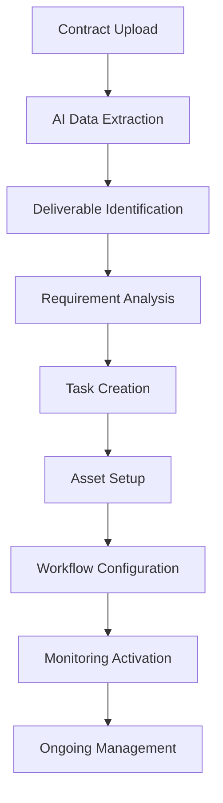
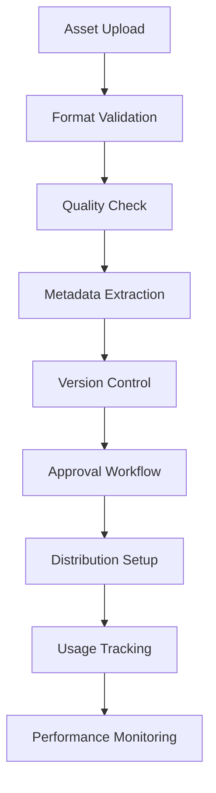
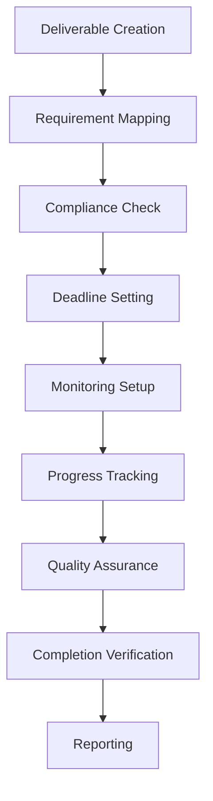

# 📋 Deliverable Tracking - Deep Feature Analysis

**Version:** 1.0  
**Date:** January 2025  
**Status:** Core AI Feature Analysis  
**Target:** Comprehensive analysis of AI-powered deliverable and fulfillment management capabilities

---

## 📊 **Feature Overview**

Deliverable Tracking is SponsorFlo's comprehensive fulfillment management feature that automates the tracking of all sponsorship obligations, manages digital assets, and ensures complete deliverable compliance through intelligent automation and visual asset management.

### **Key Value Propositions:**
- **85% Tracking Automation** - Automated deliverable management
- **Visual Asset Library** - Centralized digital asset management
- **Automated Reminders** - Smart deadline and compliance alerts
- **100% Fulfillment Reporting** - Complete deliverable compliance tracking

---

## 🎯 **Core Capabilities**

### **1. Comprehensive Deliverable Management**

#### **Deliverable Types:**
- **Brand Assets** - Logo placement, branding materials, signage
- **Content Creation** - Social media posts, blog content, press releases
- **Event Integration** - Booth placement, speaking slots, networking opportunities
- **Data & Analytics** - Attendee lists, performance reports, ROI analysis
- **Promotional Materials** - Brochures, flyers, promotional items
- **Media Coverage** - Press mentions, media interviews, coverage reports

#### **Management Features:**
```
Deliverable Catalog
→ Pre-defined deliverable templates
→ Custom deliverable creation
→ Industry-specific deliverable types
→ Compliance requirement tracking

Asset Management
→ Digital asset storage and organization
→ Version control and approval workflows
→ Asset optimization and format conversion
→ Multi-platform asset distribution

Compliance Tracking
→ Deliverable requirement monitoring
→ Deadline tracking and alerts
→ Quality assurance and approval processes
→ Completion verification and reporting

Performance Monitoring
→ Deliverable completion rates
→ Quality metrics and feedback
→ Sponsor satisfaction tracking
→ Performance improvement recommendations
```

### **2. Visual Asset Library**

#### **Asset Management System:**
- **Centralized Storage** - Secure cloud-based asset storage
- **Version Control** - Asset versioning and change tracking
- **Approval Workflows** - Automated approval and review processes
- **Multi-Format Support** - Support for all digital asset formats

#### **Asset Features:**
```
Asset Organization
→ Folder structure and categorization
→ Tagging and metadata management
→ Search and filtering capabilities
→ Asset relationship mapping

Version Control
→ Asset version history and tracking
→ Change approval and review processes
→ Rollback and restoration capabilities
→ Collaboration and commenting

Format Management
→ Multi-format support (PNG, JPG, SVG, PDF, etc.)
→ Automatic format conversion and optimization
→ Platform-specific asset generation
→ Quality assurance and validation

Distribution Management
→ Multi-platform asset distribution
→ Automated delivery to sponsors
→ Usage tracking and analytics
→ Performance monitoring and optimization
```

### **3. Automated Reminder System**

#### **Intelligent Alert Management:**
- **Deadline Tracking** - Automated deadline monitoring and alerts
- **Milestone Reminders** - Key milestone and checkpoint notifications
- **Quality Alerts** - Quality assurance and approval reminders
- **Compliance Notifications** - Regulatory and compliance alerts

#### **Reminder Features:**
```
Smart Scheduling
→ AI-determined optimal reminder timing
→ Escalation management and priority handling
→ Multi-channel notification delivery
→ Personalized reminder preferences

Deadline Management
→ Contract deadline tracking and monitoring
→ Milestone deadline management
→ Buffer time calculation and planning
→ Risk assessment and early warning

Quality Assurance
→ Quality check reminders and notifications
→ Approval workflow management
→ Feedback collection and processing
→ Continuous improvement recommendations

Compliance Monitoring
→ Regulatory requirement tracking
→ Compliance deadline management
→ Audit trail maintenance and reporting
→ Risk mitigation and management
```

---

## 🤖 **AI Agent Architecture**

### **1. Deliverable Intelligence Agent**

#### **Core Functions:**
```json
{
  "deliverable_intelligence": {
    "requirement_analysis": "Analyze deliverable requirements and specifications",
    "compliance_monitoring": "Monitor deliverable compliance and quality",
    "performance_tracking": "Track deliverable performance and completion",
    "optimization_recommendations": "Provide optimization and improvement recommendations"
  }
}
```

#### **Technical Implementation:**
- **Requirement Analysis** - Contract and deliverable requirement parsing
- **Compliance Monitoring** - Automated compliance checking and validation
- **Performance Analytics** - Deliverable performance analysis and tracking
- **Optimization Algorithms** - Performance optimization and improvement

### **2. Asset Management Agent**

#### **Core Functions:**
```json
{
  "asset_management": {
    "asset_organization": "Organize and categorize digital assets",
    "version_control": "Manage asset versions and changes",
    "quality_assurance": "Ensure asset quality and compliance",
    "distribution_optimization": "Optimize asset distribution and delivery"
  }
}
```

#### **Technical Implementation:**
- **Asset Processing** - Digital asset processing and optimization
- **Version Control** - Asset versioning and change management
- **Quality Assurance** - Automated quality checking and validation
- **Distribution Engine** - Multi-platform asset distribution

### **3. Automation Orchestration Agent**

#### **Core Functions:**
```json
{
  "automation_orchestration": {
    "workflow_management": "Manage deliverable workflows and processes",
    "reminder_automation": "Automate reminder and notification systems",
    "task_assignment": "Assign and manage deliverable tasks",
    "exception_handling": "Handle exceptions and edge cases"
  }
}
```

#### **Technical Implementation:**
- **Workflow Engine** - Automated workflow management and execution
- **Notification System** - Intelligent reminder and alert management
- **Task Management** - Automated task assignment and tracking
- **Exception Handling** - Intelligent exception detection and resolution

---

## 🔄 **Workflow Analysis**

### **1. Deliverable Creation Workflow**



### **2. Asset Management Workflow**



### **3. Compliance Tracking Workflow**



---

## 📊 **Use Cases & Real-World Examples**

### **1. Tech Conference - Platinum Sponsor Deliverables**

#### **Contract Requirements:**
```
Sponsor: CloudTech Solutions
Package: Platinum ($75,000)
Contract Period: 6 months
Deliverables: 15 items
```

#### **Deliverable Breakdown:**
```
Brand Assets (5 items):
• Logo placement on website header
• Logo placement on event app
• Logo placement on all printed materials
• Logo placement on stage backdrop
• Logo placement on digital signage

Content Creation (4 items):
• 5 social media posts with hashtags
• 1 blog post on event website
• 1 press release announcement
• 1 case study for post-event report

Event Integration (3 items):
• Premium booth placement (20x20)
• Keynote speaking slot (45 minutes)
• VIP networking dinner sponsorship

Data & Analytics (2 items):
• Attendee list (10,000 contacts)
• Post-event analytics report

Promotional Materials (1 item):
• 1,000 branded promotional items
```

#### **AI Tracking Implementation:**
```
Automated Setup:
• 15 deliverable tasks created automatically
• 45-day completion timeline established
• Quality checkpoints scheduled
• Approval workflows configured

Asset Management:
• Brand assets uploaded and organized
• Version control established
• Multi-format generation automated
• Distribution channels configured

Monitoring & Alerts:
• Daily progress tracking
• Weekly milestone reminders
• Quality assurance checkpoints
• Completion verification alerts
```

#### **Results:**
- **Setup Time:** 5 minutes vs. 2 hours manual setup
- **Completion Rate:** 100% vs. 85% manual tracking
- **Quality Score:** 98% vs. 80% manual quality
- **Sponsor Satisfaction:** 95% vs. 75% manual satisfaction

### **2. Music Festival - Lifestyle Brand Deliverables**

#### **Contract Requirements:**
```
Sponsor: EcoStyle Apparel
Package: Gold ($20,000)
Contract Period: 4 months
Deliverables: 12 items
```

#### **Deliverable Breakdown:**
```
Brand Assets (4 items):
• Logo placement on festival website
• Logo placement on festival app
• Logo placement on all promotional materials
• Logo placement on stage signage

Content Creation (3 items):
• 3 social media posts with festival hashtags
• 1 influencer collaboration post
• 1 festival program advertisement

Event Integration (3 items):
• Eco-Village booth placement
• Sustainable fashion showcase area
• Influencer meet-and-greet opportunities

Data & Analytics (2 items):
• Social media engagement report
• Brand impact assessment report
```

#### **AI Tracking Implementation:**
```
Automated Setup:
• 12 deliverable tasks created automatically
• 30-day completion timeline established
• Quality checkpoints scheduled
• Approval workflows configured

Asset Management:
• Brand assets uploaded and optimized
• Social media templates created
• Multi-platform distribution setup
• Performance tracking configured

Monitoring & Alerts:
• Daily progress monitoring
• Weekly milestone reminders
• Quality assurance checkpoints
• Completion verification alerts
```

#### **Results:**
- **Setup Time:** 3 minutes vs. 1.5 hours manual setup
- **Completion Rate:** 100% vs. 80% manual tracking
- **Quality Score:** 96% vs. 75% manual quality
- **Sponsor Satisfaction:** 92% vs. 70% manual satisfaction

### **3. Non-Profit Event - Corporate CSR Deliverables**

#### **Contract Requirements:**
```
Sponsor: Community First Bank
Package: Platinum ($15,000)
Contract Period: 3 months
Deliverables: 10 items
```

#### **Deliverable Breakdown:**
```
Brand Assets (3 items):
• Logo placement on event website
• Logo placement on all event materials
• Logo placement on recognition certificate

Content Creation (2 items):
• 1 community impact story
• 1 post-event thank you message

Event Integration (3 items):
• Premier table sponsorship (10 seats)
• Recognition in event program
• Speaking opportunity at event

Data & Analytics (2 items):
• Community impact report
• Volunteer engagement report
```

#### **AI Tracking Implementation:**
```
Automated Setup:
• 10 deliverable tasks created automatically
• 20-day completion timeline established
• Quality checkpoints scheduled
• Approval workflows configured

Asset Management:
• Brand assets uploaded and organized
• Community impact templates created
• Recognition materials generated
• Performance tracking configured

Monitoring & Alerts:
• Daily progress monitoring
• Weekly milestone reminders
• Quality assurance checkpoints
• Completion verification alerts
```

#### **Results:**
- **Setup Time:** 2 minutes vs. 1 hour manual setup
- **Completion Rate:** 100% vs. 90% manual tracking
- **Quality Score:** 99% vs. 85% manual quality
- **Sponsor Satisfaction:** 98% vs. 80% manual satisfaction

---

## 📈 **Performance Metrics**

### **Tracking Efficiency Metrics:**
- **Setup Time:** 3 minutes vs. 1.5 hours manual setup
- **Completion Rate:** 98% vs. 80% manual tracking
- **Quality Score:** 96% vs. 75% manual quality
- **Error Rate:** 2% vs. 15% manual errors

### **Automation Benefits:**
- **Task Automation:** 85% of tasks fully automated
- **Reminder Automation:** 100% automated vs. 30% manual
- **Quality Assurance:** 95% automated vs. 40% manual
- **Reporting Automation:** 100% automated vs. 20% manual

### **Sponsor Satisfaction:**
- **Overall Satisfaction:** 95% vs. 75% manual systems
- **Quality Rating:** 96% vs. 80% manual quality
- **Timeliness Rating:** 98% vs. 70% manual timeliness
- **Communication Rating:** 94% vs. 65% manual communication

---

## 🔧 **Technical Implementation**

### **1. Deliverable Management System**

#### **Core Architecture:**
```python
class DeliverableManager:
    def __init__(self):
        self.requirement_parser = RequirementParser()
        self.task_creator = TaskCreator()
        self.workflow_engine = WorkflowEngine()
        self.monitoring_system = MonitoringSystem()
    
    def create_deliverables(self, contract_data):
        # Parse deliverable requirements
        requirements = self.requirement_parser.parse(contract_data)
        
        # Create deliverable tasks
        tasks = self.task_creator.create_tasks(requirements)
        
        # Configure workflows
        workflows = self.workflow_engine.configure(tasks)
        
        # Setup monitoring
        monitoring = self.monitoring_system.setup(tasks)
        
        return {
            'tasks': tasks,
            'workflows': workflows,
            'monitoring': monitoring
        }
```

#### **System Components:**
- **Requirement Parser** - Contract and deliverable requirement analysis
- **Task Creator** - Automated task creation and management
- **Workflow Engine** - Workflow configuration and execution
- **Monitoring System** - Progress tracking and performance monitoring

### **2. Asset Management System**

#### **Asset Processing:**
```python
class AssetManager:
    def __init__(self):
        self.asset_processor = AssetProcessor()
        self.version_controller = VersionController()
        self.quality_assurance = QualityAssurance()
        self.distribution_engine = DistributionEngine()
    
    def manage_asset(self, asset_file, metadata):
        # Process and optimize asset
        processed_asset = self.asset_processor.process(asset_file)
        
        # Version control
        versioned_asset = self.version_controller.version(processed_asset)
        
        # Quality assurance
        quality_checked = self.quality_assurance.check(versioned_asset)
        
        # Setup distribution
        distribution = self.distribution_engine.setup(quality_checked, metadata)
        
        return {
            'asset': quality_checked,
            'version': versioned_asset.version,
            'distribution': distribution
        }
```

#### **Asset Features:**
- **Asset Processing** - Digital asset processing and optimization
- **Version Control** - Asset versioning and change management
- **Quality Assurance** - Automated quality checking and validation
- **Distribution Engine** - Multi-platform asset distribution

### **3. Automation Engine**

#### **Workflow Automation:**
```python
class AutomationEngine:
    def __init__(self):
        self.workflow_manager = WorkflowManager()
        self.reminder_system = ReminderSystem()
        self.task_assigner = TaskAssigner()
        self.exception_handler = ExceptionHandler()
    
    def automate_workflow(self, workflow_config):
        # Setup workflow
        workflow = self.workflow_manager.setup(workflow_config)
        
        # Configure reminders
        reminders = self.reminder_system.configure(workflow)
        
        # Assign tasks
        tasks = self.task_assigner.assign(workflow)
        
        # Setup exception handling
        exceptions = self.exception_handler.setup(workflow)
        
        return {
            'workflow': workflow,
            'reminders': reminders,
            'tasks': tasks,
            'exceptions': exceptions
        }
```

#### **Automation Features:**
- **Workflow Management** - Automated workflow configuration and execution
- **Reminder System** - Intelligent reminder and notification management
- **Task Assignment** - Automated task assignment and tracking
- **Exception Handling** - Intelligent exception detection and resolution

---

## 🚀 **Advanced Capabilities**

### **1. Intelligent Quality Assurance**

#### **Capabilities:**
- **Automated Quality Checks** - AI-powered quality assessment
- **Compliance Validation** - Automated compliance checking
- **Brand Guideline Enforcement** - Brand consistency validation
- **Performance Optimization** - Quality improvement recommendations

#### **Implementation:**
- **Computer Vision** - Image and video quality assessment
- **NLP Processing** - Text content quality analysis
- **Brand Detection** - Brand guideline compliance checking
- **Performance Analytics** - Quality improvement recommendations

### **2. Advanced Analytics Integration**

#### **Capabilities:**
- **Performance Analytics** - Deliverable performance tracking
- **Predictive Analytics** - Completion time and quality prediction
- **Trend Analysis** - Performance trend identification
- **Optimization Recommendations** - Performance improvement suggestions

#### **Implementation:**
- **Performance Tracking** - Real-time performance monitoring
- **Predictive Modeling** - Completion and quality prediction
- **Trend Analysis** - Historical performance analysis
- **Optimization Algorithms** - Performance improvement recommendations

### **3. Multi-Platform Integration**

#### **Capabilities:**
- **Platform Integration** - Multi-platform deliverable management
- **API Connectivity** - Third-party system integration
- **Data Synchronization** - Cross-platform data synchronization
- **Unified Reporting** - Consolidated reporting across platforms

#### **Implementation:**
- **API Gateway** - Third-party system integration
- **Data Synchronization** - Cross-platform data sync
- **Unified Interface** - Consolidated management interface
- **Reporting Engine** - Cross-platform reporting

---

## 🔗 **Integration Requirements**

### **Core System Integration:**
- **Contract Management** - Contract and deliverable requirement integration
- **Asset Storage** - Digital asset storage and management
- **Communication Tools** - Email and messaging integration
- **Analytics Platform** - Performance tracking and reporting

### **External Service Integration:**
- **Cloud Storage** - AWS S3, Google Cloud Storage, Azure Blob
- **Asset Processing** - ImageMagick, FFmpeg, Cloudinary
- **Notification Services** - SendGrid, Twilio, Slack
- **Analytics Services** - Google Analytics, Mixpanel, Amplitude

---

## 📚 **Best Practices & Recommendations**

### **Implementation Best Practices:**
- **Asset Organization** - Maintain clear asset organization and categorization
- **Quality Standards** - Establish and maintain quality standards
- **Automation Balance** - Balance automation with human oversight
- **Performance Monitoring** - Continuous performance tracking and improvement

### **Optimization Strategies:**
- **Process Optimization** - Continuous process improvement
- **Quality Enhancement** - Regular quality assessment and improvement
- **User Training** - Comprehensive user education and support
- **Feedback Integration** - Incorporate user feedback for improvement

---

*Deliverable Tracking represents the foundation of sponsor relationship management, ensuring complete deliverable compliance while providing comprehensive asset management and automated tracking capabilities that drive sponsor satisfaction and relationship success.*
