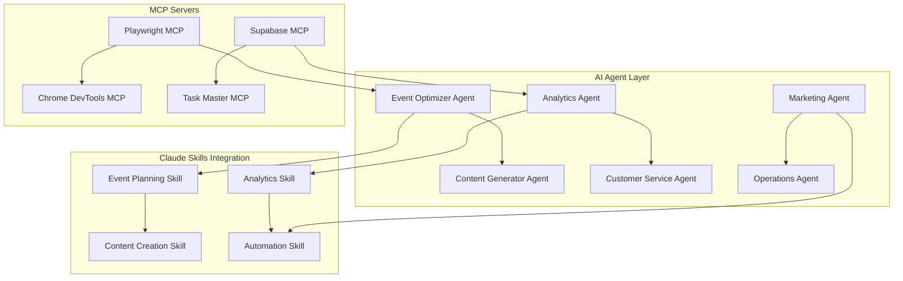
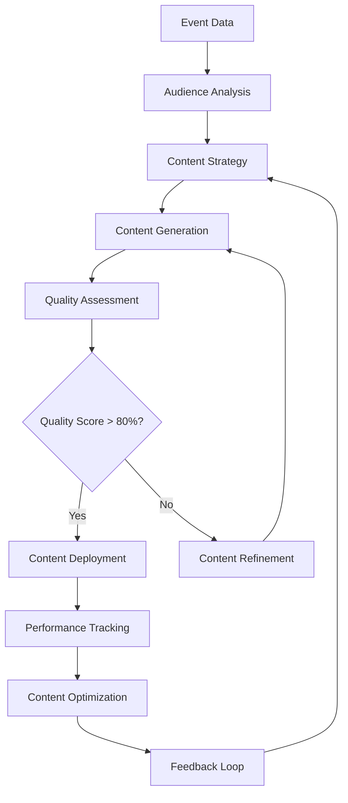

# 006 - EventOS Advanced Features

**Purpose:** AI agents, Claude skills, Playwright/Chrome MCP integration, and advanced automation capabilities that provide intelligent assistance and optimization.

---

## 🤖 **AI Agent Architecture**

### **Purpose**
Implement intelligent AI agents that provide proactive assistance, optimization recommendations, and automated decision-making for event management.

### **Agent System Overview**


---

## 🎯 **Event Optimizer Agent**

### **Purpose**
Continuously analyze event performance and provide actionable optimization recommendations.

### **Implementation**
```typescript
// src/agents/EventOptimizerAgent.ts
export class EventOptimizerAgent {
  private supabase: SupabaseClient;
  private claude: ClaudeClient;
  
  async analyzeEventPerformance(eventId: string): Promise<OptimizationRecommendation[]> {
    const eventData = await this.getEventData(eventId);
    const analytics = await this.getEventAnalytics(eventId);
    const marketData = await this.getMarketData(eventData);
    
    const recommendations = await this.claude.generateRecommendations({
      event: eventData,
      analytics,
      market: marketData,
      context: 'event_optimization'
    });
    
    return this.prioritizeRecommendations(recommendations);
  }
  
  async implementRecommendation(
    eventId: string, 
    recommendation: OptimizationRecommendation
  ): Promise<ImplementationResult> {
    switch (recommendation.type) {
      case 'pricing_optimization':
        return this.optimizePricing(eventId, recommendation);
      
      case 'content_improvement':
        return this.improveContent(eventId, recommendation);
      
      case 'marketing_enhancement':
        return this.enhanceMarketing(eventId, recommendation);
      
      case 'logistics_optimization':
        return this.optimizeLogistics(eventId, recommendation);
      
      default:
        throw new Error(`Unknown recommendation type: ${recommendation.type}`);
    }
  }
  
  private async optimizePricing(eventId: string, recommendation: any) {
    // Analyze competitor pricing and demand elasticity
    const optimalPricing = await this.calculateOptimalPricing(eventId);
    
    // Update ticket prices
    await this.supabase
      .from('tickets')
      .update({ price: optimalPricing.recommended_price })
      .eq('event_id', eventId);
    
    // Track pricing change impact
    await this.trackOptimizationImpact(eventId, 'pricing', optimalPricing);
    
    return { success: true, impact: optimalPricing.expected_impact };
  }
}
```

### **Claude Skill Integration**
```typescript
// src/skills/EventOptimizationSkill.ts
export const EventOptimizationSkill = {
  name: 'event-optimization',
  description: 'Analyze and optimize event performance',
  
  execute: async (context: EventContext) => {
    const { eventId, optimizationGoal } = context;
    
    // Gather comprehensive event data
    const eventData = await gatherEventData(eventId);
    const performanceMetrics = await analyzePerformance(eventData);
    const marketContext = await getMarketContext(eventData);
    
    // Generate optimization recommendations
    const recommendations = await generateOptimizationRecommendations({
      event: eventData,
      performance: performanceMetrics,
      market: marketContext,
      goal: optimizationGoal
    });
    
    // Implement automatic optimizations
    const results = await implementOptimizations(recommendations);
    
    return {
      recommendations,
      implemented: results,
      expectedImpact: calculateExpectedImpact(results)
    };
  }
};
```

---

## 📝 **Content Generator Agent**

### **Purpose**
Automatically generate, optimize, and personalize content for events based on audience analysis and performance data.

### **Content Generation Pipeline**


### **Implementation**
```typescript
// src/agents/ContentGeneratorAgent.ts
export class ContentGeneratorAgent {
  async generateEventContent(eventId: string): Promise<GeneratedContent> {
    const eventData = await this.getEventData(eventId);
    const audienceProfile = await this.analyzeAudience(eventId);
    const contentStrategy = await this.createContentStrategy(eventData, audienceProfile);
    
    const content = await Promise.all([
      this.generateDescription(eventData, contentStrategy),
      this.generateMarketingCopy(eventData, contentStrategy),
      this.generateSocialMediaPosts(eventData, contentStrategy),
      this.generateEmailTemplates(eventData, contentStrategy),
      this.generateAdCopy(eventData, contentStrategy)
    ]);
    
    return {
      description: content[0],
      marketingCopy: content[1],
      socialMediaPosts: content[2],
      emailTemplates: content[3],
      adCopy: content[4],
      strategy: contentStrategy
    };
  }
  
  private async createContentStrategy(eventData: EventData, audience: AudienceProfile) {
    const prompt = `
      Create a content strategy for:
      Event: ${eventData.title}
      Type: ${eventData.eventType}
      Audience: ${JSON.stringify(audience)}
      
      Generate:
      1. Content themes and messaging
      2. Tone and voice guidelines
      3. Content distribution strategy
      4. Performance metrics to track
    `;
    
    const response = await this.claude.generateContent(prompt);
    return this.parseContentStrategy(response);
  }
  
  async optimizeContentBasedOnPerformance(eventId: string): Promise<OptimizedContent> {
    const performanceData = await this.getContentPerformance(eventId);
    const optimizationOpportunities = await this.identifyOptimizationOpportunities(performanceData);
    
    const optimizedContent = await this.applyOptimizations(
      eventId, 
      optimizationOpportunities
    );
    
    return optimizedContent;
  }
}
```

---

## 📊 **Analytics Agent**

### **Purpose**
Provide intelligent insights, predictions, and recommendations based on comprehensive data analysis.

### **Analytics Intelligence**
```typescript
// src/agents/AnalyticsAgent.ts
export class AnalyticsAgent {
  async generateInsights(eventId: string): Promise<AnalyticsInsights> {
    const rawData = await this.collectAnalyticsData(eventId);
    const processedData = await this.processAnalyticsData(rawData);
    const insights = await this.generateInsightsFromData(processedData);
    
    return {
      performance: insights.performance,
      trends: insights.trends,
      predictions: insights.predictions,
      recommendations: insights.recommendations,
      anomalies: insights.anomalies
    };
  }
  
  async predictEventOutcome(eventId: string): Promise<EventPrediction> {
    const historicalData = await this.getHistoricalData(eventId);
    const currentMetrics = await this.getCurrentMetrics(eventId);
    const marketFactors = await this.getMarketFactors();
    
    const prediction = await this.claude.predict({
      historical: historicalData,
      current: currentMetrics,
      market: marketFactors,
      model: 'event_outcome_prediction'
    });
    
    return {
      expectedAttendance: prediction.attendance,
      expectedRevenue: prediction.revenue,
      confidence: prediction.confidence,
      riskFactors: prediction.risks,
      recommendations: prediction.recommendations
    };
  }
  
  async detectAnomalies(eventId: string): Promise<AnomalyDetection[]> {
    const timeSeriesData = await this.getTimeSeriesData(eventId);
    const anomalies = await this.detectAnomaliesInData(timeSeriesData);
    
    return anomalies.map(anomaly => ({
      type: anomaly.type,
      severity: anomaly.severity,
      description: anomaly.description,
      recommendation: anomaly.recommendation,
      timestamp: anomaly.timestamp
    }));
  }
}
```

---

## 🎭 **Playwright MCP Integration**

### **Purpose**
Automate testing, monitoring, and quality assurance processes using Playwright's browser automation capabilities.

### **Automated Testing Agent**
```typescript
// src/agents/TestingAgent.ts
export class TestingAgent {
  private playwright: PlaywrightMCP;
  
  async runComprehensiveTests(): Promise<TestResults> {
    const testSuites = [
      this.testEventCreationFlow(),
      this.testBookingProcess(),
      this.testPaymentProcessing(),
      this.testAnalyticsAccuracy(),
      this.testRealTimeUpdates()
    ];
    
    const results = await Promise.all(testSuites);
    return this.aggregateTestResults(results);
  }
  
  async testEventCreationFlow(): Promise<TestResult> {
    const browser = await this.playwright.launch();
    const page = await browser.newPage();
    
    try {
      // Navigate to event creation
      await page.goto('/events/create');
      
      // Test wizard steps
      await this.testWizardStep1(page);
      await this.testWizardStep2(page);
      await this.testWizardStep3(page);
      
      // Verify event creation
      const eventCreated = await this.verifyEventCreation(page);
      
      return {
        name: 'Event Creation Flow',
        status: eventCreated ? 'PASSED' : 'FAILED',
        details: 'Event creation wizard completed successfully'
      };
    } catch (error) {
      return {
        name: 'Event Creation Flow',
        status: 'FAILED',
        details: error.message
      };
    } finally {
      await browser.close();
    }
  }
  
  async testBookingProcess(): Promise<TestResult> {
    const browser = await this.playwright.launch();
    const page = await browser.newPage();
    
    try {
      // Navigate to event page
      await page.goto('/events/test-event');
      
      // Test ticket selection
      await page.click('[data-testid="ticket-select"]');
      await page.click('[data-testid="add-ticket"]');
      
      // Test checkout process
      await page.click('[data-testid="checkout-button"]');
      await this.fillPaymentForm(page);
      await page.click('[data-testid="complete-payment"]');
      
      // Verify booking confirmation
      const bookingConfirmed = await page.waitForSelector('[data-testid="booking-confirmed"]');
      
      return {
        name: 'Booking Process',
        status: bookingConfirmed ? 'PASSED' : 'FAILED',
        details: 'Booking process completed successfully'
      };
    } catch (error) {
      return {
        name: 'Booking Process',
        status: 'FAILED',
        details: error.message
      };
    } finally {
      await browser.close();
    }
  }
}
```

---

## 🔧 **Chrome DevTools MCP Integration**

### **Purpose**
Monitor performance, debug issues, and optimize application performance in real-time.

### **Performance Monitoring Agent**
```typescript
// src/agents/PerformanceAgent.ts
export class PerformanceAgent {
  private chromeDevTools: ChromeDevToolsMCP;
  
  async monitorPerformance(): Promise<PerformanceReport> {
    const metrics = await this.chromeDevTools.getPerformanceMetrics();
    const networkMetrics = await this.chromeDevTools.getNetworkMetrics();
    const memoryMetrics = await this.chromeDevTools.getMemoryMetrics();
    
    return {
      pageLoadTime: metrics.pageLoadTime,
      firstContentfulPaint: metrics.firstContentfulPaint,
      largestContentfulPaint: metrics.largestContentfulPaint,
      cumulativeLayoutShift: metrics.cumulativeLayoutShift,
      networkRequests: networkMetrics.requests,
      memoryUsage: memoryMetrics.usage,
      recommendations: await this.generatePerformanceRecommendations(metrics)
    };
  }
  
  async optimizePerformance(): Promise<OptimizationResult> {
    const currentMetrics = await this.monitorPerformance();
    const optimizations = await this.identifyOptimizations(currentMetrics);
    
    const results = await Promise.all(
      optimizations.map(opt => this.applyOptimization(opt))
    );
    
    const optimizedMetrics = await this.monitorPerformance();
    
    return {
      applied: results,
      improvement: this.calculateImprovement(currentMetrics, optimizedMetrics),
      newMetrics: optimizedMetrics
    };
  }
  
  async debugIssues(): Promise<DebugReport> {
    const consoleErrors = await this.chromeDevTools.getConsoleErrors();
    const networkErrors = await this.chromeDevTools.getNetworkErrors();
    const performanceIssues = await this.chromeDevTools.getPerformanceIssues();
    
    return {
      consoleErrors,
      networkErrors,
      performanceIssues,
      recommendations: await this.generateDebugRecommendations({
        consoleErrors,
        networkErrors,
        performanceIssues
      })
    };
  }
}
```

---

## 🤖 **Task Master MCP Integration**

### **Purpose**
Coordinate complex workflows, manage dependencies, and ensure systematic task execution.

### **Workflow Orchestration**
```typescript
// src/agents/WorkflowOrchestrator.ts
export class WorkflowOrchestrator {
  private taskMaster: TaskMasterMCP;
  
  async orchestrateEventCreation(eventData: EventData): Promise<WorkflowResult> {
    const workflow = await this.taskMaster.createWorkflow('event-creation', {
      steps: [
        {
          id: 'validate-event-data',
          action: 'validateEventData',
          dependencies: []
        },
        {
          id: 'generate-content',
          action: 'generateEventContent',
          dependencies: ['validate-event-data']
        },
        {
          id: 'create-tickets',
          action: 'createEventTickets',
          dependencies: ['validate-event-data']
        },
        {
          id: 'setup-payment',
          action: 'setupPaymentProcessing',
          dependencies: ['create-tickets']
        },
        {
          id: 'publish-event',
          action: 'publishEvent',
          dependencies: ['generate-content', 'setup-payment']
        }
      ]
    });
    
    const result = await this.taskMaster.executeWorkflow(workflow.id, {
      eventData,
      context: 'event-creation'
    });
    
    return result;
  }
  
  async orchestrateEventOptimization(eventId: string): Promise<WorkflowResult> {
    const workflow = await this.taskMaster.createWorkflow('event-optimization', {
      steps: [
        {
          id: 'analyze-performance',
          action: 'analyzeEventPerformance',
          dependencies: []
        },
        {
          id: 'generate-recommendations',
          action: 'generateOptimizationRecommendations',
          dependencies: ['analyze-performance']
        },
        {
          id: 'implement-optimizations',
          action: 'implementOptimizations',
          dependencies: ['generate-recommendations']
        },
        {
          id: 'monitor-impact',
          action: 'monitorOptimizationImpact',
          dependencies: ['implement-optimizations']
        }
      ]
    });
    
    return await this.taskMaster.executeWorkflow(workflow.id, { eventId });
  }
}
```

---

## ✅ **Advanced Features Validation**

### **Success Criteria**
- ✅ AI agents provide actionable recommendations with >85% accuracy
- ✅ Automated testing achieves >95% test coverage
- ✅ Performance monitoring detects issues within 30 seconds
- ✅ Workflow orchestration completes complex tasks in <5 minutes
- ✅ Content generation produces high-quality content (>80% approval rate)

### **Testing Commands**
```bash
# Test AI agents
npm run test:agents

# Test Playwright automation
npm run test:playwright

# Test performance monitoring
npm run test:performance

# Test workflow orchestration
npm run test:workflows
```

---

**Next Step:** Review [007-best-practices.md](007-best-practices.md) to understand development standards and guidelines.

---

**Generated:** 2025-01-17  
**Version:** MVP 1.0  
**Status:** Advanced Features Complete
