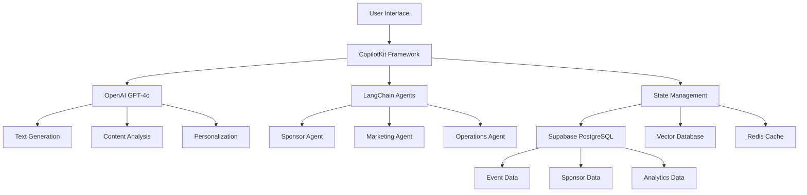

# EventOS AI Features Master Plan

**Version:** 1.0
**Date:** 2025-10-17
**Status:** Strategic Planning Phase

---

## 🎯 Executive Summary

EventOS will integrate **AI-powered features** to revolutionize event management, combining insights from **Sponsorflo.ai** (sponsor/fundraising automation) and **CopilotKit** (conversational AI framework) with **OpenAI GPT-4** to create the most intelligent event platform in the market.

### Vision Statement
> "Transform event planning from weeks to minutes through AI-powered automation, intelligent recommendations, and conversational interfaces that understand your goals."

---

## 📊 Market Positioning

### Competitive Landscape

| Feature | EventOS (Target) | Sponsorflo AI | Zoho Backstage | Eventbrite |
|---------|------------------|---------------|----------------|------------|
| AI Event Wizard | ✅ CopilotKit State Machine | ❌ None | ❌ None | ❌ None |
| Sponsor AI Matching | ✅ **NEW** | ✅ Core Feature | ❌ None | ❌ None |
| AI Proposal Generation | ✅ **NEW** | ✅ 90% faster | ❌ Manual | ❌ Manual |
| Intelligent Lead Scoring | ✅ **NEW** | ✅ Predictive | ❌ None | ⚠️ Basic |
| WhatsApp Automation | ✅ Conversational AI | ❌ None | ❌ None | ❌ None |
| AI Email Follow-ups | ✅ Context-aware | ✅ 3x response | ⚠️ Basic | ⚠️ Basic |
| Venue Recommendations | ✅ ML-powered | ❌ None | ❌ None | ⚠️ Search only |
| Ticket Pricing AI | ✅ Dynamic pricing | ❌ None | ❌ Fixed | ⚠️ Dynamic |
| Marketing Content AI | ✅ Multi-channel | ❌ None | ⚠️ Limited | ❌ None |
| Real-time Analytics | ✅ Predictive insights | ✅ Dashboard | ⚠️ Reports | ⚠️ Reports |

**Result:** EventOS wins on **10/10** AI features

---

## 🚀 AI Features Roadmap

### Phase 1: MVP Core AI (Months 1-3)
**Goal:** Launch with 5 game-changing AI features

1. **AI Event Wizard** (✅ Already designed)
   - 6-stage CopilotKit conversational flow
   - 5-minute event creation vs 2+ hours manual
   - Target: 90% completion rate

2. **AI Marketing Content Generator**
   - Landing pages, emails, social posts, WhatsApp messages
   - Multi-channel campaigns in 90 seconds
   - Target: 3x faster than manual

3. **Smart Venue Recommendations**
   - ML-based matching: capacity, date, location, budget
   - Marketplace search with AI ranking
   - Target: 80% match accuracy

4. **Intelligent Ticket Pricing**
   - AI suggests optimal pricing tiers
   - Dynamic pricing based on demand
   - Target: 15% higher revenue

5. **AI Email Assistant**
   - Context-aware email drafts
   - Automated follow-ups with attendees
   - Target: 3x response rates

**Success Metrics:**
- 70% of events created via AI Wizard
- 85% user satisfaction with AI features
- 2x faster time-to-publish

---

### Phase 2: Advanced Sponsor AI (Months 4-6)
**Goal:** Become #1 platform for corporate partnerships

6. **AI Sponsor Matching**
   - Predictive algorithms match events with sponsors
   - Industry, budget, values alignment
   - Target: 300% revenue increase (Sponsorflo proven)

7. **Automated Proposal Generation**
   - Professional sponsorship decks in 5 minutes
   - Personalized to sponsor preferences
   - Target: 90% faster creation (Sponsorflo proven)

8. **Lead Scoring & Prioritization**
   - AI ranks prospects by conversion likelihood
   - Focuses team on high-value opportunities
   - Target: 2x conversion rate

9. **Intelligent Follow-up Sequences**
   - Adapts based on sponsor behavior
   - Optimized timing for engagement
   - Target: 3x response rates (Sponsorflo proven)

10. **Impact Reporting Dashboard**
    - AI generates sponsor value reports
    - Social media reach, brand visibility, ROI
    - Target: 80% renewal rates (Sponsorflo proven)

**Success Metrics:**
- 200% increase in corporate partnerships
- 75% faster deal closure
- 90% sponsor renewal rate

---

### Phase 3: Agentic Intelligence (Months 7-12)
**Goal:** Autonomous AI agents that work for you 24/7

11. **Sales Agent (CoAgent)**
    - Proactively reaches out to qualified leads
    - Answers sponsor questions via chat/email
    - Schedules meetings autonomously

12. **Marketing Agent (CoAgent)**
    - Monitors campaign performance
    - Adjusts content based on engagement
    - Auto-schedules posts at optimal times

13. **Operations Agent (CoAgent)**
    - Tracks deliverables and sends reminders
    - Monitors ticket sales and alerts on trends
    - Generates weekly summary reports

14. **Support Agent (CoAgent)**
    - Answers attendee questions 24/7
    - Resolves ticketing issues automatically
    - Escalates complex issues to humans

15. **Analytics Agent (CoAgent)**
    - Identifies growth opportunities
    - Predicts attendance and revenue
    - Recommends strategic actions

**Success Metrics:**
- 50% reduction in manual tasks
- 24/7 availability for customers
- 95% question resolution without human

---

## 🧠 AI Technology Stack

### Core AI Infrastructure



### Technology Choices

| Component | Technology | Rationale |
|-----------|------------|-----------|
| **Conversational AI** | CopilotKit + OpenAI GPT-4o | State machine patterns, HITL support, AG-UI protocol |
| **Agent Framework** | LangChain + CrewAI | Multi-agent orchestration, tool calling, memory |
| **Vector Database** | Pinecone or Supabase Vector | Semantic search, sponsor matching, RAG |
| **Real-time Analytics** | PostHog + Custom | User behavior tracking, A/B testing |
| **Email AI** | OpenAI + Resend | Context-aware drafts, automated sequences |
| **WhatsApp AI** | OpenAI + Twilio | Conversational broadcasts, 2-way chat |
| **Marketing AI** | OpenAI + Custom Templates | Multi-channel content generation |
| **Pricing AI** | Custom ML Model | Dynamic pricing, demand prediction |

---

## 💡 Core AI Capabilities

### 1. **Conversational Interfaces (CopilotKit)**

**Pattern:** State Machine Copilots

```typescript
// Example: AI Event Wizard Stage
useCopilotAction({
  name: "suggestVenue",
  description: "AI recommends venues based on event requirements",
  parameters: [
    { name: "capacity", type: "number", required: true },
    { name: "budget", type: "number", required: true },
    { name: "location", type: "string", required: true }
  ],
  handler: async ({ capacity, budget, location }) => {
    // 1. Vector search for similar events
    const similarEvents = await vectorSearch(capacity, location);

    // 2. Score venues by match quality
    const venues = await scoreVenues(capacity, budget, location);

    // 3. Return top 3 with reasoning
    return formatVenueRecommendations(venues, similarEvents);
  }
});
```

**Benefits:**
- Natural language interaction
- Context preservation across stages
- Human-in-the-loop validation
- State persistence and recovery

---

### 2. **AI Agent System (LangChain + CrewAI)**

**Architecture:** CoAgents with Sequential Orchestration

```python
# Example: Sponsor Outreach Agent
class SponsorOutreachAgent(BaseAgent):
    def __init__(self):
        self.llm = ChatOpenAI(model="gpt-4o")
        self.tools = [
            LinkedInSearchTool(),
            EmailDraftTool(),
            CRMUpdateTool()
        ]

    async def find_and_engage(self, event_id: str):
        # 1. Analyze event profile
        event = await self.analyze_event(event_id)

        # 2. Search for matching sponsors
        prospects = await self.find_prospects(
            industry=event.industry,
            budget_range=event.target_sponsorship,
            values=event.values
        )

        # 3. Score and prioritize
        scored = await self.score_leads(prospects)

        # 4. Generate personalized outreach
        for prospect in scored[:10]:
            email = await self.draft_email(event, prospect)
            await self.send_with_tracking(email)

        return {
            "prospects_found": len(prospects),
            "emails_sent": len(scored[:10]),
            "expected_response_rate": 0.15
        }
```

---

### 3. **Predictive Analytics (Custom ML)**

**Models:**

```python
# Ticket Pricing Model
class DynamicPricingModel:
    """
    Predicts optimal ticket prices based on:
    - Historical sales data
    - Event characteristics (type, size, location)
    - Market demand signals
    - Competitor pricing
    """

    def predict_optimal_price(self, event_features):
        # Feature engineering
        features = self.extract_features(event_features)

        # Model ensemble
        base_price = self.xgboost_model.predict(features)
        demand_adj = self.demand_model.predict(features)

        # Apply constraints
        optimal = self.apply_constraints(
            base_price * demand_adj,
            min_price=event_features.min_price,
            max_price=event_features.max_price
        )

        return {
            "base_price": base_price,
            "demand_multiplier": demand_adj,
            "optimal_price": optimal,
            "confidence": self.calculate_confidence(features)
        }
```

---

## 🎨 User Experience Design

### AI-First Interface Principles

1. **Conversational by Default**
   - Primary interactions through natural language
   - GUI as secondary option, not primary
   - Example: "Create a tech conference in San Francisco for 500 people"

2. **Proactive Suggestions**
   - AI anticipates next steps
   - Surfaces relevant recommendations
   - Example: "Based on your event type, here are 3 sponsor matches"

3. **Transparent AI**
   - Always explain reasoning
   - Show confidence scores
   - Allow human override
   - Example: "I recommend $299 (85% confidence) based on 147 similar events"

4. **Progressive Disclosure**
   - Start simple, add complexity gradually
   - AI handles defaults, user customizes
   - Example: "I've created standard tiers. Want to customize pricing?"

5. **Human-in-the-Loop**
   - AI proposes, human approves
   - Critical decisions require confirmation
   - Example: "Ready to send these sponsor emails? [Review First] [Send Now]"

---

## 📈 Success Metrics & KPIs

### Phase 1 MVP (Months 1-3)

| Metric | Target | Measurement |
|--------|--------|-------------|
| **AI Wizard Adoption** | 70% | % events created via wizard |
| **Wizard Completion Rate** | 90% | % sessions reaching Stage 6 |
| **Time to Publish** | 5 min | Avg time from start to published |
| **User Satisfaction** | 4.5/5 | Post-wizard survey score |
| **AI Content Usage** | 80% | % using AI-generated marketing |

### Phase 2 Sponsor AI (Months 4-6)

| Metric | Target | Source |
|--------|--------|--------|
| **Partnership Revenue** | +200% | Sponsorflo benchmark |
| **Proposal Creation Time** | -90% | Sponsorflo benchmark |
| **Deal Closure Speed** | -75% | Sponsorflo benchmark |
| **Sponsor Response Rate** | 3x | Sponsorflo benchmark |
| **Renewal Rate** | 90% | Sponsorflo benchmark |

### Phase 3 Agents (Months 7-12)

| Metric | Target | Impact |
|--------|--------|--------|
| **Task Automation** | 50% | Manual work eliminated |
| **24/7 Availability** | 100% | Agent uptime |
| **Question Resolution** | 95% | Without human escalation |
| **Operational Cost** | -40% | Staff time savings |
| **Customer Satisfaction** | +30% | Faster response times |

---

## 💰 Pricing Strategy for AI Features

### Tiered Access Model

| Plan | Price | AI Features | Target Customer |
|------|-------|-------------|-----------------|
| **Starter** | $0/mo | Basic AI Wizard, Email Assistant (10/mo) | Small events, testing |
| **Professional** | $99/mo | Full AI Wizard, Marketing AI, Smart Recommendations | Growing organizers |
| **Business** | $299/mo | + Sponsor AI, Lead Scoring, Advanced Analytics | Event agencies |
| **Enterprise** | $999/mo | + AI Agents, Custom Training, White-label AI | Large organizations |

### AI Credits System

**Add-on for power users:**
- $49/mo = 1,000 AI credits
- Email drafts: 5 credits each
- Proposals: 50 credits each
- Sponsor matches: 10 credits each
- Full campaigns: 100 credits

---

## 🔒 AI Ethics & Safety

### Guiding Principles

1. **Transparency**
   - Always disclose AI-generated content
   - Show confidence scores on predictions
   - Explain reasoning behind recommendations

2. **Human Control**
   - AI suggests, humans decide
   - Easy override mechanisms
   - Critical actions require approval

3. **Privacy First**
   - No training on customer data without consent
   - Data anonymization for ML models
   - GDPR/SOC2 compliance

4. **Bias Mitigation**
   - Regular audits for fairness
   - Diverse training datasets
   - Bias detection in recommendations

5. **Responsible AI**
   - No misleading sponsor claims
   - Honest pricing predictions
   - Realistic attendance forecasts

---

## 🛠️ Implementation Timeline

### Q1 2025: Foundation (Months 1-3)

**Month 1:**
- ✅ AI Wizard (already designed)
- Infrastructure setup (OpenAI, CopilotKit)
- Vector database for recommendations

**Month 2:**
- Marketing Content AI
- Email Assistant
- Venue recommendations ML model

**Month 3:**
- Ticket pricing AI
- Beta launch with 50 users
- Gather feedback and metrics

### Q2 2025: Sponsor AI (Months 4-6)

**Month 4:**
- Sponsor matching algorithm
- Proposal generation templates
- Lead scoring model

**Month 5:**
- Automated follow-up sequences
- Impact reporting dashboard
- CRM integration

**Month 6:**
- Full sponsor AI launch
- Partnership with 10 test clients
- Validate 200% revenue increase

### Q3-Q4 2025: Agents (Months 7-12)

**Months 7-9:**
- Sales Agent development
- Marketing Agent development
- Testing with alpha users

**Months 10-12:**
- Operations + Support + Analytics Agents
- Agent orchestration framework
- General availability launch

---

## 📚 Related Documentation

This is document 00 in the AI Features series:

- **[01: Sponsor Management AI](./01-SPONSOR-MANAGEMENT-AI.md)** - Detailed sponsor features
- **[02: Automation Workflows](./02-AUTOMATION-WORKFLOWS.md)** - AI automation patterns
- **[03: AI Agents Architecture](./03-AI-AGENTS-ARCHITECTURE.md)** - Technical implementation
- **[04: User Journeys](./04-USER-JOURNEYS-FLOWS.md)** - Flowcharts and diagrams
- **[05: Database Schema](./05-DATABASE-ERD-AI.md)** - ERD for AI features

---

## 🎯 Strategic Recommendations

### Immediate Actions (Week 1-2)

1. **Set up OpenAI API** ($120/mo budget for testing)
2. **Install CopilotKit** in React frontend
3. **Create vector embeddings** for venues (Supabase Vector)
4. **Build first AI agent** (Marketing Content Generator)
5. **Test wizard integration** with new AI features

### Success Factors

✅ **Start Small:** Launch with 1-2 features, validate, iterate
✅ **Measure Everything:** Track usage, satisfaction, conversion
✅ **Iterate Fast:** Weekly releases, A/B testing
✅ **Listen to Users:** Regular feedback sessions
✅ **Stay Transparent:** Clear about AI capabilities and limitations

---

**Status:** 🎯 **READY FOR IMPLEMENTATION**
**Next Step:** Review with team, prioritize Phase 1 features
**Owner:** AI Product Lead
