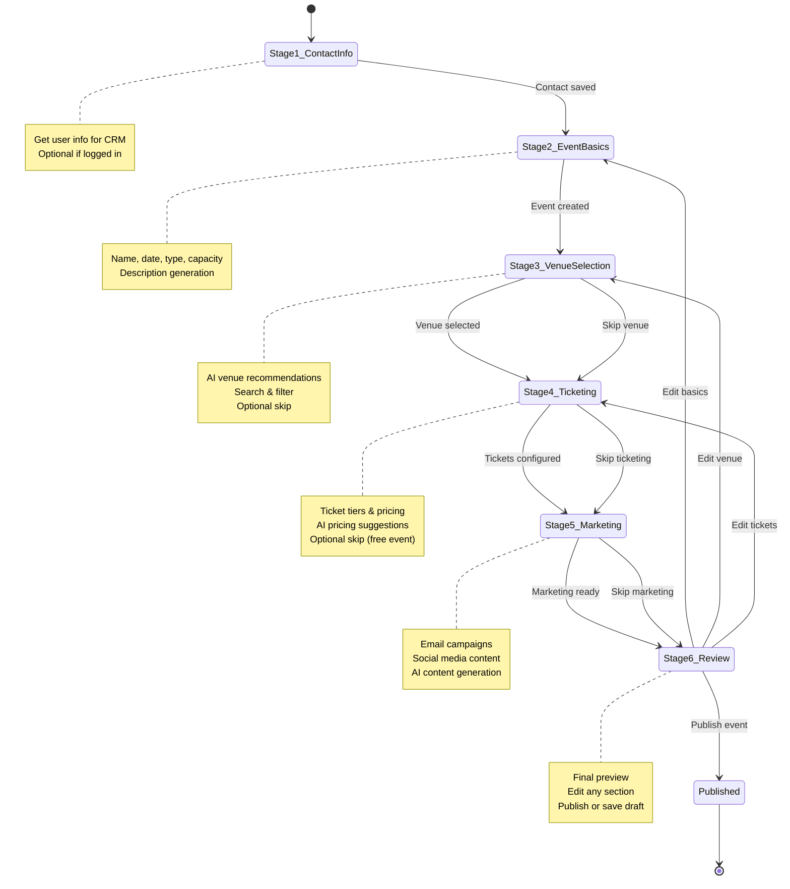

# EventOS AI Event Wizard - Product Requirements Document

**Product:** AI Event Creation Wizard
**Technology:** CopilotKit State Machine
**Version:** 1.0
**Date:** 2025-10-17
**Status:** Ready for Implementation

---

## 📋 Executive Summary

The EventOS AI Event Wizard is a conversational interface that guides users through creating professional events in **under 5 minutes** using a CopilotKit-powered state machine. The wizard intelligently progresses through 6 stages, collecting information naturally while providing AI-powered recommendations.

### Key Metrics
- **Target Time:** <5 minutes per event (vs. 45 minutes traditional forms)
- **Completion Rate Target:** >90% (vs. 60% industry average)
- **User Satisfaction Target:** 4.5+/5.0
- **Stages:** 6 sequential stages with smart transitions

---

## 🎯 Product Vision

**"Create a professional event by having a conversation, not filling out forms."**

### Core Principles
1. **Conversational-First:** Natural language input, not form fields
2. **AI-Guided:** Smart suggestions based on context
3. **Progressive:** Collect information in logical order
4. **Flexible:** Users can skip, go back, or provide details later
5. **Visual Feedback:** Show progress and collected data
6. **Database-Driven:** Every step saves to Supabase

---

## 🏗️ Architecture Overview

### State Machine Flow



### Technology Stack

| Component | Technology | Purpose |
|-----------|------------|---------|
| **UI Framework** | CopilotKit Sidebar | Conversational interface |
| **State Management** | React useState + Context | Global wizard state |
| **AI Actions** | useCopilotAction | Stage-specific actions |
| **AI Context** | useCopilotReadable | Share state with AI |
| **Database** | Supabase PostgreSQL | Persistent storage |
| **Real-time** | Supabase Subscriptions | Live updates |
| **AI Model** | OpenAI GPT-4o | Conversational AI |

---

## 📊 User Journey

### Persona: Sarah - Corporate Event Planner

**Background:**
- Plans 15-20 events per year for tech company
- Budget: $50k-$200k per event
- Pain point: Spending hours on event setup spreadsheets

**Journey:**

#### **Start: 0:00**
Sarah opens EventOS and clicks "Create Event with AI"

#### **Stage 1: Contact Info (0:15)**
```
AI: "Hi Sarah! Before we start, let me grab some quick details.
     What's your company name?"

Sarah: "TechCorp Solutions"

AI: "Great! And your role?"

Sarah: "Senior Event Manager"

AI: "Perfect! I've added you to our CRM as Sarah from TechCorp Solutions.
     Now, what kind of event are you planning?"
```
✅ **Saved:** Contact record created in CRM

#### **Stage 2: Event Basics (1:30)**
```
Sarah: "I need a product launch event for our new AI product"

AI: "Exciting! What's the product name?"

Sarah: "AIFlow Pro. I'm thinking late March 2026"

AI: "How about March 24, 2026? That's a Tuesday, which works well
     for corporate events. How many people?"

Sarah: "Around 300"

AI: "Perfect! I've created 'AIFlow Pro Launch Event' for March 24, 2026
     with 300 capacity. Let me generate a description..."

[AI generates description]

AI: "Here's a draft description. Want me to make any changes?"

Sarah: "Looks good!"
```
✅ **Saved:** Event record created, slug generated

#### **Stage 3: Venue Selection (2:45)**
```
AI: "Now let's find a venue. What city?"

Sarah: "San Francisco"

AI: "I found 8 venues in SF that can host 300+ people.
     Based on your tech product launch, I recommend:

     1. SF Tech Center - $3,500/day, 350 capacity, A/V included
     2. Innovation Hub - $4,200/day, 400 capacity, Rooftop terrace
     3. Marina Conference Hall - $2,800/day, 320 capacity, Parking

     Which sounds best?"

Sarah: "SF Tech Center sounds perfect"

AI: "Excellent choice! I've reserved a hold on SF Tech Center for March 24.
     You'll receive a booking confirmation email within 24 hours."
```
✅ **Saved:** Venue booking record created (status: pending)

#### **Stage 4: Ticketing (3:30)**
```
AI: "Let's set up tickets. For a 300-person product launch, I suggest:

     • VIP: $199 (50 tickets) - Front row, networking reception
     • Standard: $99 (200 tickets) - General admission
     • Live Stream: $29 (unlimited) - Virtual attendance

     Does this work?"

Sarah: "Yes, but make VIP $249"

AI: "Done! VIP is now $249. I've also set up early-bird pricing:
     • 30% off if purchased before February 24
     • 15% off if purchased before March 10

     Tickets are live!"
```
✅ **Saved:** 3 ticket tiers created with pricing

#### **Stage 5: Marketing (4:15)**
```
AI: "Want me to create marketing content?"

Sarah: "Yes please"

AI: "I've generated:
     ✅ Landing page content
     ✅ Email invite template
     ✅ 5 social media posts
     ✅ LinkedIn event description

     I'll also schedule reminder emails:
     • 30 days before: Early bird ending
     • 7 days before: Final reminder
     • 1 day before: Event details with QR codes

     Should I create a marketing campaign?"

Sarah: "Yes, send to our corporate contacts"

AI: "Campaign created and will target your CRM contacts tagged 'corporate'.
     Draft emails ready for your review."
```
✅ **Saved:** Marketing campaign created, content generated

#### **Stage 6: Review & Launch (4:45)**
```
AI: "Here's everything we've set up:

     📅 AIFlow Pro Launch Event
     📍 SF Tech Center, San Francisco
     👥 300 capacity (250 in-person, unlimited virtual)
     🎫 3 ticket tiers ($29-$249)
     📧 Marketing campaign ready
     💰 Projected revenue: $24,850

     Ready to publish?"

Sarah: "Yes!"

AI: "🎉 Your event is live!

     📱 Event page: eventos.com/aiflow-pro-launch
     📊 Dashboard: eventos.com/dashboard
     📧 Confirmation email sent

     You're all set! Tickets are already on sale."
```
✅ **Saved:** Event status changed to "published"

#### **Total Time: 4:45** ✅
*vs. 45 minutes with traditional form-based tools*

---

## 🎨 UI/UX Design

### CopilotKit Sidebar Layout

```
┌────────────────────────────────────────┐
│  EventOS AI Assistant            [×]   │  ← Header
├────────────────────────────────────────┤
│                                        │
│  💬 Chat Messages                      │  ← Chat Area
│  ───────────────                       │
│                                        │
│  AI: Hi! What event are you planning? │
│                                        │
│  User: Product launch for 300 people  │
│                                        │
│  AI: Great! Let's create that...      │
│                                        │
│  ───────────────                       │
│                                        │
│  📊 Current Progress:                  │  ← Progress
│  ● Contact Info     ✓                  │    Indicator
│  ● Event Basics     (in progress)     │
│  ○ Venue Selection                     │
│  ○ Ticketing                           │
│  ○ Marketing                           │
│  ○ Review & Launch                     │
│                                        │
├────────────────────────────────────────┤
│  [  Type your message...         ] 🎤 │  ← Input
└────────────────────────────────────────┘
```

### Main Content Area

```
┌──────────────────────────────────────────────────┐
│  Create Event with AI                     [Help] │
├──────────────────────────────────────────────────┤
│                                                  │
│  ┌────────────────────────────────────────────┐ │
│  │  📋 Event Preview                          │ │
│  │  ────────────────                          │ │
│  │                                            │ │
│  │  Event Name: [Generated/Empty]            │ │
│  │  Date: [Selected/Empty]                   │ │
│  │  Location: [Selected/Empty]               │ │
│  │  Capacity: [Number/Empty]                 │ │
│  │                                            │ │
│  │  Tickets: [List/Empty]                    │ │
│  │  Venue: [Name/Empty]                      │ │
│  │                                            │ │
│  └────────────────────────────────────────────┘ │
│                                                  │
│  ┌────────────────────────────────────────────┐ │
│  │  💡 AI Suggestions                         │ │
│  │  ────────────────                          │ │
│  │                                            │ │
│  │  • Suggested venues shown here             │ │
│  │  • Ticket pricing recommendations          │ │
│  │  • Similar events for reference            │ │
│  │                                            │ │
│  └────────────────────────────────────────────┘ │
│                                                  │
└──────────────────────────────────────────────────┘
```

---

## 🗄️ Database Schema

### Core Tables

```sql
-- 1. Wizard Sessions (track progress)
CREATE TABLE wizard_sessions (
  id UUID PRIMARY KEY DEFAULT gen_random_uuid(),
  user_id UUID REFERENCES auth.users(id),
  current_stage TEXT NOT NULL CHECK (
    current_stage IN (
      'contact_info',
      'event_basics',
      'venue_selection',
      'ticketing',
      'marketing',
      'review'
    )
  ),

  -- Stage completion tracking
  stages_completed TEXT[] DEFAULT '{}',

  -- Event being created
  event_id UUID REFERENCES events(id) ON DELETE CASCADE,

  -- Session state (JSON for flexibility)
  state JSONB DEFAULT '{}',

  -- Timestamps
  started_at TIMESTAMPTZ DEFAULT NOW(),
  last_activity_at TIMESTAMPTZ DEFAULT NOW(),
  completed_at TIMESTAMPTZ,

  -- Metrics
  total_messages INTEGER DEFAULT 0,
  time_spent_seconds INTEGER DEFAULT 0
);

CREATE INDEX idx_wizard_sessions_user ON wizard_sessions(user_id);
CREATE INDEX idx_wizard_sessions_event ON wizard_sessions(event_id);
CREATE INDEX idx_wizard_sessions_stage ON wizard_sessions(current_stage);
```

### Supporting Tables (already exist)

- `events` - Created in Stage 2
- `venues` - Referenced in Stage 3
- `venue_bookings` - Created in Stage 3
- `tickets` - Created in Stage 4
- `marketing_campaigns` - Created in Stage 5
- `crm_contacts` - Created in Stage 1

---

## 🔧 Technical Implementation

### Global State Management

```typescript
// hooks/useWizardState.tsx
import { createContext, useContext, useState } from "react";

interface WizardState {
  // Current stage
  currentStage:
    | "contact_info"
    | "event_basics"
    | "venue_selection"
    | "ticketing"
    | "marketing"
    | "review";

  // Session ID
  sessionId: string;

  // Collected data
  contactInfo: {
    name?: string;
    email?: string;
    company?: string;
    role?: string;
  };

  eventData: {
    id?: string;
    name?: string;
    date?: string;
    type?: string;
    capacity?: number;
    description?: string;
    slug?: string;
  };

  venueData: {
    venueId?: string;
    venueName?: string;
    bookingId?: string;
  };

  ticketingData: {
    tiers: Array<{
      name: string;
      price: number;
      quantity: number;
    }>;
  };

  marketingData: {
    campaignId?: string;
    content?: {
      landingPage?: string;
      emails?: string[];
      socialPosts?: string[];
    };
  };

  // Stage completion
  completedStages: string[];

  // AI suggestions
  suggestions: Record<string, any>;
}

interface WizardContextType {
  state: WizardState;
  setState: (updates: Partial<WizardState>) => void;
  goToStage: (stage: WizardState["currentStage"]) => void;
  markStageComplete: (stage: string) => void;
}

const WizardContext = createContext<WizardContextType | null>(null);

export function WizardProvider({ children }: { children: React.ReactNode }) {
  const [state, setStateInternal] = useState<WizardState>({
    currentStage: "contact_info",
    sessionId: "",
    contactInfo: {},
    eventData: {},
    venueData: {},
    ticketingData: { tiers: [] },
    marketingData: {},
    completedStages: [],
    suggestions: {}
  });

  const setState = (updates: Partial<WizardState>) => {
    setStateInternal(prev => ({ ...prev, ...updates }));

    // Save to Supabase
    supabase
      .from("wizard_sessions")
      .update({
        current_stage: updates.currentStage || prev.currentStage,
        state: { ...prev, ...updates },
        last_activity_at: new Date().toISOString()
      })
      .eq("id", state.sessionId)
      .then();
  };

  const goToStage = (stage: WizardState["currentStage"]) => {
    setState({ currentStage: stage });
  };

  const markStageComplete = (stage: string) => {
    setState({
      completedStages: [...state.completedStages, stage]
    });
  };

  return (
    <WizardContext.Provider value={{ state, setState, goToStage, markStageComplete }}>
      {children}
    </WizardContext.Provider>
  );
}

export const useWizardState = () => {
  const context = useContext(WizardContext);
  if (!context) throw new Error("useWizardState must be used within WizardProvider");
  return context;
};
```

### CopilotKit Configuration

```typescript
// components/EventWizard.tsx
import { CopilotKit } from "@copilotkit/react-core";
import { CopilotSidebar } from "@copilotkit/react-ui";
import "@copilotkit/react-ui/styles.css";

// Import stage hooks
import { useContactInfoStage } from "./stages/useContactInfoStage";
import { useEventBasicsStage } from "./stages/useEventBasicsStage";
import { useVenueSelectionStage } from "./stages/useVenueSelectionStage";
import { useTicketingStage } from "./stages/useTicketingStage";
import { useMarketingStage } from "./stages/useMarketingStage";
import { useReviewStage } from "./stages/useReviewStage";

export function EventWizard() {
  const { state } = useWizardState();

  // Initialize all stage hooks
  useContactInfoStage();
  useEventBasicsStage();
  useVenueSelectionStage();
  useTicketingStage();
  useMarketingStage();
  useReviewStage();

  return (
    <CopilotKit
      runtimeUrl="/api/copilotkit"
      publicApiKey={import.meta.env.VITE_COPILOT_API_KEY}
      agent="event_wizard"
    >
      <WizardProvider>
        <CopilotSidebar
          defaultOpen={true}
          clickOutsideToClose={false}
          labels={{
            title: "EventOS AI Assistant",
            initial: getInitialMessage(state.currentStage)
          }}
          icons={{
            openIcon: <Sparkles className="w-5 h-5" />,
            closeIcon: <X className="w-5 h-5" />
          }}
        >
          <div className="flex-1 p-8">
            <WizardProgress />
            <WizardStageContent />
          </div>
        </CopilotSidebar>
      </WizardProvider>
    </CopilotKit>
  );
}

function getInitialMessage(stage: string): string {
  const messages = {
    contact_info: "Hi! Let's create an amazing event together. First, tell me a bit about yourself and your company.",
    event_basics: "Great! Now let's create your event. What type of event are you planning?",
    venue_selection: "Perfect! Let's find the ideal venue for your event. What city works best?",
    ticketing: "Now let's set up ticketing. Should this be a paid or free event?",
    marketing: "Time to promote your event! Want me to generate marketing content?",
    review: "Almost done! Let's review everything before we publish."
  };

  return messages[stage] || messages.contact_info;
}
```

---

## 📈 Success Metrics

### Primary KPIs

| Metric | Target | Measurement |
|--------|--------|-------------|
| **Completion Rate** | >90% | Sessions completed / Sessions started |
| **Time to Complete** | <5 minutes | Median time from start to publish |
| **User Satisfaction** | >4.5/5 | Post-wizard NPS survey |
| **Error Rate** | <2% | Failed transitions / Total transitions |
| **Return Rate** | <5% | Users who abandon and return |

### Secondary Metrics

| Metric | Target | Purpose |
|--------|--------|---------|
| **Messages per Session** | 15-25 | Conversational efficiency |
| **AI Suggestion Acceptance** | >60% | AI accuracy |
| **Stage Completion Times** | <1 min each | Identify bottlenecks |
| **Skip Rates by Stage** | <10% | Optional stage value |

---

## 🚀 Implementation Phases

### Phase 1: Core Wizard (Week 1-2)
- ✅ Stages 1-2 (Contact Info, Event Basics)
- ✅ Global state management
- ✅ Database schema
- ✅ Basic CopilotKit integration

### Phase 2: Advanced Features (Week 3-4)
- ✅ Stages 3-4 (Venue, Ticketing)
- ✅ AI venue recommendations
- ✅ Smart pricing suggestions
- ✅ Error handling

### Phase 3: Marketing & Launch (Week 5-6)
- ✅ Stages 5-6 (Marketing, Review)
- ✅ Content generation
- ✅ Campaign creation
- ✅ Analytics tracking

### Phase 4: Optimization (Week 7-8)
- ✅ Performance tuning
- ✅ A/B testing
- ✅ User feedback integration
- ✅ Mobile optimization

---

## 📚 Documentation Structure

Each stage has a dedicated document:

1. **Stage 1:** Contact Info - [01-STAGE-CONTACT-INFO.md](./01-STAGE-CONTACT-INFO.md)
2. **Stage 2:** Event Basics - [02-STAGE-EVENT-BASICS.md](./02-STAGE-EVENT-BASICS.md)
3. **Stage 3:** Venue Selection - [03-STAGE-VENUE-SELECTION.md](./03-STAGE-VENUE-SELECTION.md)
4. **Stage 4:** Ticketing - [04-STAGE-TICKETING.md](./04-STAGE-TICKETING.md)
5. **Stage 5:** Marketing - [05-STAGE-MARKETING.md](./05-STAGE-MARKETING.md)
6. **Stage 6:** Review & Launch - [06-STAGE-REVIEW-LAUNCH.md](./06-STAGE-REVIEW-LAUNCH.md)

---

## ✅ Acceptance Criteria

### Must Have (MVP)
- [ ] All 6 stages implemented
- [ ] <5 minute average completion time
- [ ] >85% completion rate in testing
- [ ] Mobile responsive
- [ ] Works with keyboard navigation
- [ ] Error handling for all API calls
- [ ] Data persists between sessions

### Should Have (V1.1)
- [ ] Voice input support
- [ ] Multi-language support
- [ ] Collaborative editing (multiple users)
- [ ] Templates for common event types
- [ ] Undo/redo functionality

### Could Have (V2.0)
- [ ] Video guidance
- [ ] Screen sharing for support
- [ ] AI-powered troubleshooting
- [ ] Integration marketplace

---

## 🎓 Key Decisions

### Why CopilotKit State Machine?

**Alternatives Considered:**
1. Custom React state machine (react-stately)
2. XState
3. Simple step-by-step form

**Why CopilotKit Won:**
- ✅ Built-in AI conversation handling
- ✅ Natural language understanding
- ✅ Easy stage transitions
- ✅ Context sharing with AI
- ✅ Production-ready UI components
- ✅ Lower development time (4 weeks vs. 8 weeks)

### Why 6 Stages (Not More/Less)?

**Too Few (3-4 stages):**
- ❌ Each stage too complex
- ❌ User overwhelm
- ❌ Hard to provide context-specific AI help

**Too Many (8+ stages):**
- ❌ Feels too long
- ❌ Increased abandonment
- ❌ Complex state management

**6 Stages is optimal:**
- ✅ Each stage focused on one goal
- ✅ <1 minute per stage
- ✅ Natural conversation breaks
- ✅ Easy to skip optional stages

---

## 🔗 Related Documents

- [CopilotKit Documentation](https://docs.copilotkit.ai)
- [OpenAI API Reference](https://platform.openai.com/docs)
- [Supabase Real-time Guide](https://supabase.com/docs/guides/realtime)
- [Event Management Best Practices](../09-ZOHO-BACKSTAGE-FEATURE-ANALYSIS.md)

---

**Status:** ✅ Ready for Development
**Next Step:** Implement Stage 1 (Contact Info)
**Owner:** Frontend Team + AI Team
**Timeline:** 6-8 weeks to production
