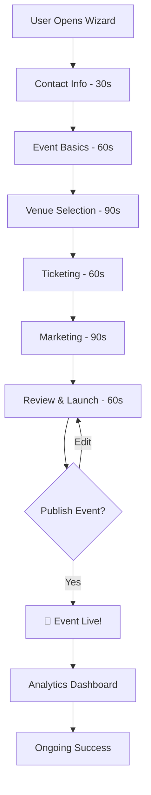

# Stage 6: Review & Launch

## Overview

The final stage provides a comprehensive summary of everything created, allows final edits, and publishes the event to the world. Once launched, the event becomes public, tickets go live, and marketing campaigns deploy.

**Duration:** ~60 seconds
**Transition:** review → published (exit wizard)

---

## Purpose

- Display complete event summary
- Allow final edits before publishing
- Publish event (draft → published, private → public)
- Activate ticket sales
- Deploy marketing campaigns
- Provide post-launch dashboard
- Show next steps and analytics access

---

## State Structure

```typescript
interface ReviewState {
  publishReady: boolean;
  validationErrors: string[];
  publishedAt?: string;
  publicUrl?: string;
  dashboardUrl?: string;
}
```

---

## CopilotKit Implementation

### Hook: `useReviewLaunchStage.ts`

```typescript
import { useCopilotAction } from "@copilotkit/react-core";
import { useWizardState } from "../hooks/useWizardState";
import { supabase } from "@/lib/supabase";

export function useReviewLaunchStage() {
  const { state, updateState } = useWizardState();

  // Action 1: Show comprehensive summary
  useCopilotAction({
    name: "showEventSummary",
    description: "Display complete summary of the created event for final review",
    parameters: [],
    handler: async () => {
      const {
        contactInfo,
        eventData,
        venueData,
        ticketingData,
        marketingData
      } = state;

      // Calculate key metrics
      const totalTickets = ticketingData.tiers.reduce((sum, t) => sum + t.quantity, 0);
      const revenuePotential = ticketingData.totalRevenuePotential;

      const summary = `
# 🎉 Your Event is Ready!

## Event Details
📅 **${eventData.name}**
🗓️ ${new Date(eventData.date).toLocaleDateString("en-US", {
        weekday: "long",
        year: "numeric",
        month: "long",
        day: "numeric"
      })}
🏢 ${eventData.type} • ${eventData.capacity} attendees
📍 ${venueData.venueName}, ${venueData.address}

## Ticketing
${ticketingData.tiers.map(t =>
        `• **${t.name}**: $${t.price} × ${t.quantity} tickets`
      ).join("\n")}

💰 **Revenue Potential:** $${revenuePotential.toLocaleString()} (0% commission!)
🎟️ **Total Tickets:** ${totalTickets}

## Marketing
✅ Landing page ready
✅ ${marketingData.content.emails.length} email campaigns
✅ ${marketingData.content.socialPosts.length} social media posts
✅ ${marketingData.content.whatsappMessages.length} WhatsApp broadcasts

## Event URLs
🔗 Public page: eventos.com/${eventData.slug}
🎫 Tickets: eventos.com/${eventData.slug}/tickets
📊 Dashboard: eventos.com/dashboard/events/${eventData.id}

---

Ready to launch? Say "publish my event" to go live!
`;

      return summary;
    }
  });

  // Action 2: Make final edit to any component
  useCopilotAction({
    name: "editEventDetail",
    description: "Make a final edit to event name, date, tickets, or marketing before publishing",
    parameters: [
      {
        name: "component",
        type: "string",
        description: "Component to edit: event_name, event_date, ticket_tier, marketing_content",
        required: true
      },
      {
        name: "details",
        type: "object",
        description: "Details of the edit to make",
        required: true
      }
    ],
    handler: async ({ component, details }) => {
      try {
        switch (component) {
          case "event_name":
            await supabase
              .from("events")
              .update({ name: details.newName })
              .eq("id", state.eventData.id);

            updateState({
              eventData: { ...state.eventData, name: details.newName }
            });

            return `Event name updated to "${details.newName}"`;

          case "event_date":
            await supabase
              .from("events")
              .update({ start_date: details.newDate })
              .eq("id", state.eventData.id);

            updateState({
              eventData: { ...state.eventData, date: details.newDate }
            });

            return `Event date updated to ${new Date(details.newDate).toLocaleDateString()}`;

          case "ticket_tier":
            await supabase
              .from("ticket_tiers")
              .update({
                price: details.newPrice,
                quantity_total: details.newQuantity
              })
              .eq("id", details.tierId);

            return `Ticket tier updated: $${details.newPrice} × ${details.newQuantity}`;

          case "marketing_content":
            await supabase
              .from("marketing_campaigns")
              .update({ content: details.newContent })
              .eq("id", state.marketingData.campaignId);

            return `Marketing content updated successfully`;

          default:
            return "Unknown component. Try: event_name, event_date, ticket_tier, or marketing_content";
        }
      } catch (error) {
        console.error("Error editing detail:", error);
        return "I had trouble making that edit. Could you try again?";
      }
    }
  });

  // Action 3: Validate event before publishing
  useCopilotAction({
    name: "validateEvent",
    description: "Check if event is ready to publish (all required fields, no errors)",
    parameters: [],
    handler: async () => {
      const errors: string[] = [];

      // Validate event basics
      if (!state.eventData.name) errors.push("Event name is required");
      if (!state.eventData.date) errors.push("Event date is required");
      if (new Date(state.eventData.date) < new Date()) {
        errors.push("Event date must be in the future");
      }

      // Validate venue
      if (!state.venueData.venueName) {
        errors.push("Venue selection is required");
      }

      // Validate ticketing
      if (!state.ticketingData.tiers || state.ticketingData.tiers.length === 0) {
        errors.push("At least one ticket tier is required");
      }

      // Validate marketing
      if (!state.marketingData.campaignId) {
        errors.push("Marketing content must be generated");
      }

      // Check payment processing (for paid events)
      const hasPaidTickets = state.ticketingData.tiers.some(t => t.price > 0);
      if (hasPaidTickets && !state.ticketingData.paymentProcessorConnected) {
        errors.push("Connect Stripe to accept payments (we'll help you set this up)");
      }

      if (errors.length > 0) {
        return `⚠️ Please fix these issues before publishing:

${errors.map(e => `• ${e}`).join("\n")}

Need help? Just ask!`;
      }

      return `✅ All checks passed! Your event is ready to publish.

Say "publish my event" when ready!`;
    }
  });

  // Action 4: PUBLISH THE EVENT!
  useCopilotAction({
    name: "publishEvent",
    description: "Publish the event to make it live and activate ticket sales",
    parameters: [],
    handler: async () => {
      try {
        // 1. Validate first
        const { data: event } = await supabase
          .from("events")
          .select("*, ticket_tiers(*)")
          .eq("id", state.eventData.id)
          .single();

        if (!event) throw new Error("Event not found");

        // 2. Update event status
        const { error: eventError } = await supabase
          .from("events")
          .update({
            status: "published",
            visibility: "public",
            published_at: new Date().toISOString()
          })
          .eq("id", state.eventData.id);

        if (eventError) throw eventError;

        // 3. Activate all ticket tiers
        await supabase
          .from("ticket_tiers")
          .update({ status: "active" })
          .eq("event_id", state.eventData.id);

        // 4. Deploy announcement email campaign
        const announcementEmail = state.marketingData.content.emails.find(
          e => e.type === "announcement"
        );

        if (announcementEmail) {
          await supabase
            .from("email_campaigns")
            .insert({
              event_id: state.eventData.id,
              template_id: announcementEmail.id,
              status: "scheduled",
              scheduled_for: new Date().toISOString(),
              recipients: "all_contacts"
            });
        }

        // 5. Schedule WhatsApp announcement
        const whatsappAnnouncement = state.marketingData.content.whatsappMessages.find(
          m => m.type === "announcement"
        );

        if (whatsappAnnouncement) {
          await supabase
            .from("whatsapp_campaigns")
            .insert({
              event_id: state.eventData.id,
              message: whatsappAnnouncement.message,
              status: "scheduled",
              scheduled_for: new Date(Date.now() + 5 * 60 * 1000).toISOString() // 5 min delay
            });
        }

        // 6. Complete wizard session
        await supabase
          .from("wizard_sessions")
          .update({
            current_stage: "completed",
            completed_at: new Date().toISOString(),
            time_spent_seconds: Math.floor((Date.now() - state.startedAt) / 1000)
          })
          .eq("id", state.sessionId);

        // 7. Create event dashboard entry
        const { data: dashboard } = await supabase
          .from("event_dashboards")
          .insert({
            event_id: state.eventData.id,
            organizer_id: state.contactInfo.email,
            metrics: {
              views: 0,
              ticket_sales: 0,
              revenue: 0,
              conversion_rate: 0
            }
          })
          .select()
          .single();

        // 8. Return success message with next steps
        const publicUrl = `https://eventos.com/${state.eventData.slug}`;
        const ticketsUrl = `${publicUrl}/tickets`;
        const dashboardUrl = `https://eventos.com/dashboard/events/${state.eventData.id}`;

        return `🎉 **Congratulations! Your event is LIVE!**

Your event "${state.eventData.name}" is now public and accepting registrations.

## 🔗 Important Links

**Public Page:** ${publicUrl}
Copy this link to share your event!

**Ticket Sales:** ${ticketsUrl}
Direct link for ticket purchases

**Dashboard:** ${dashboardUrl}
Track sales, views, and engagement in real-time

## 📧 Marketing in Progress

✅ Announcement email sent to your contact list
✅ WhatsApp broadcast scheduled for 5 minutes
📱 Social posts ready to share (check your dashboard)

## 📊 What's Next?

1. **Share your event:** Use the social posts we created
2. **Monitor sales:** Check your dashboard for real-time updates
3. **Engage attendees:** Respond to questions and comments
4. **Send reminders:** We'll automatically send reminders 7 days and 1 day before

## 💡 Pro Tips

• Share early and often - most tickets sell in the first 48 hours
• Engage with comments on social media
• Send personal invites to VIPs via WhatsApp
• Update your event page with speaker bios and agenda

Need help? We're here 24/7 at support@eventos.com

Let's make this event amazing! 🚀`;

      } catch (error) {
        console.error("Error publishing event:", error);
        return `I had trouble publishing your event. Error: ${error.message}

Please try again or contact support if the issue persists.`;
      }
    }
  });
}
```

---

## Conversation Flow

### Complete Review → Publish Flow
```
AI: Perfect! Your marketing content is ready. Let me show you everything
    we've created:

    [Triggers showEventSummary]
    ↓
    # 🎉 Your Event is Ready!

    [Full summary displayed]

    Ready to launch? Say "publish my event" to go live!

User: Wait, can I change the ticket price for VIP?

AI: [Triggers editEventDetail]
     ↓
     Sure! What should the new VIP price be?

User: Make it $599

AI: Updated! VIP tier is now $599 × 100 tickets.

    Ready to publish now?

User: Let me validate first

AI: [Triggers validateEvent]
     ↓
     ✅ All checks passed! Your event is ready to publish.

     Say "publish my event" when ready!

User: Publish my event

AI: [Triggers publishEvent]
     ↓
     🎉 Congratulations! Your event is LIVE!

     [Success message with links and next steps]

     [Wizard ends, redirect to dashboard]
```

---

## Pre-Publish Validation

### Required Fields Checklist

| Component | Field | Required | Validation |
|-----------|-------|----------|------------|
| Event | Name | ✅ Yes | 3-100 chars |
| Event | Date | ✅ Yes | Future date |
| Event | Type | ✅ Yes | Valid type |
| Event | Capacity | ✅ Yes | > 0 |
| Venue | Selected/Custom | ✅ Yes | Must have venue |
| Tickets | At least 1 tier | ✅ Yes | Quantity > 0 |
| Tickets | Pricing | ✅ Yes | ≥ $0 |
| Marketing | Campaign | ✅ Yes | Generated |
| Payment | Stripe (if paid) | ⚠️ Conditional | For paid tickets only |

### Validation Query
```sql
SELECT
  e.id,
  e.name IS NOT NULL AS has_name,
  e.start_date > NOW() AS future_date,
  (e.venue_id IS NOT NULL OR e.custom_venue IS NOT NULL) AS has_venue,
  COUNT(t.id) > 0 AS has_tickets,
  COUNT(m.id) > 0 AS has_marketing,
  CASE
    WHEN SUM(CASE WHEN t.price > 0 THEN 1 ELSE 0 END) > 0
    THEN s.stripe_account_id IS NOT NULL
    ELSE true
  END AS payment_ready
FROM events e
LEFT JOIN ticket_tiers t ON t.event_id = e.id
LEFT JOIN marketing_campaigns m ON m.event_id = e.id
LEFT JOIN stripe_accounts s ON s.event_id = e.id
WHERE e.id = 'event-uuid'
GROUP BY e.id, s.stripe_account_id;
```

---

## Database Operations

### 1. Publish Event

```sql
UPDATE events
SET
  status = 'published',
  visibility = 'public',
  published_at = NOW()
WHERE id = 'event-uuid'
  AND status = 'draft';
```

### 2. Activate Ticket Sales

```sql
UPDATE ticket_tiers
SET
  status = 'active',
  sale_start_date = NOW()
WHERE event_id = 'event-uuid';
```

### 3. Deploy Email Campaign

```sql
INSERT INTO email_campaigns (
  event_id,
  template_id,
  status,
  scheduled_for,
  recipients
) VALUES (
  'event-uuid',
  'template-uuid',
  'scheduled',
  NOW(),
  'all_contacts'
);
```

### 4. Schedule WhatsApp Broadcast

```sql
INSERT INTO whatsapp_campaigns (
  event_id,
  message,
  status,
  scheduled_for,
  target_audience
) VALUES (
  'event-uuid',
  '[MESSAGE_TEXT]',
  'scheduled',
  NOW() + INTERVAL '5 minutes',
  'all_contacts'
);
```

### 5. Complete Wizard Session

```sql
UPDATE wizard_sessions
SET
  current_stage = 'completed',
  completed_at = NOW(),
  time_spent_seconds = EXTRACT(EPOCH FROM (NOW() - started_at))
WHERE id = 'session-uuid';
```

### 6. Create Dashboard Entry

```sql
INSERT INTO event_dashboards (
  event_id,
  organizer_id,
  metrics
) VALUES (
  'event-uuid',
  'organizer-email',
  '{
    "views": 0,
    "ticket_sales": 0,
    "revenue": 0,
    "conversion_rate": 0
  }'::jsonb
);
```

---

## Event Summary Components

### 1. Event Details Card
```
┌────────────────────────────────────────────┐
│  📅 AI Summit 2025                         │
│  ────────────────────────────────────      │
│  🗓️  Saturday, March 15, 2025              │
│  ⏰  9:00 AM - 5:00 PM                     │
│  📍  TechHub Convention Center             │
│      123 Market St, San Francisco, CA      │
│  🏢  Conference • 500 attendees            │
│                                            │
│  Status: Ready to publish ✅               │
└────────────────────────────────────────────┘
```

### 2. Ticketing Summary
```
┌────────────────────────────────────────────┐
│  🎟️ Ticketing                              │
│  ────────────────────────────────────      │
│  Early Bird    $199 × 150 = $29,850       │
│  Regular       $299 × 250 = $74,750       │
│  VIP           $499 × 100 = $49,900       │
│  ────────────────────────────────────      │
│  Total         500 tickets                 │
│  Revenue       $154,500 (0% fee!)          │
│                                            │
│  💳 Payment: Stripe Connected ✅           │
└────────────────────────────────────────────┘
```

### 3. Marketing Overview
```
┌────────────────────────────────────────────┐
│  📧 Marketing Campaigns                    │
│  ────────────────────────────────────      │
│  ✅ Landing page ready                     │
│  ✅ 3 email campaigns                      │
│  ✅ 8 social media posts                   │
│  ✅ 2 WhatsApp broadcasts                  │
│                                            │
│  All campaigns will deploy on publish      │
└────────────────────────────────────────────┘
```

---

## Post-Launch Actions

### Automatic Actions on Publish:

1. **Event Status Change**
   - Draft → Published
   - Private → Public

2. **Ticket Activation**
   - All tiers → Active
   - Sales start immediately

3. **Email Deployment**
   - Announcement email → Sent immediately
   - Reminder emails → Scheduled

4. **WhatsApp Campaign**
   - Announcement → Sent in 5 minutes
   - Allows time to verify before broadcast

5. **Analytics Initialization**
   - Dashboard created
   - Tracking pixels activated
   - Metrics collection starts

6. **Social Media Prep**
   - Posts available in dashboard
   - One-click sharing enabled

---

## Success Metrics Tracking

### Wizard Completion Metrics
```typescript
const wizardMetrics = {
  sessionId: state.sessionId,
  completionTime: calculateDuration(), // Target: < 5 minutes
  stagesCompleted: 6,

  // Stage durations
  stageDurations: {
    contact_info: 30,      // seconds
    event_basics: 60,
    venue_selection: 90,
    ticketing: 60,
    marketing: 90,
    review: 60
  },

  // Event details
  eventType: state.eventData.type,
  capacity: state.eventData.capacity,
  ticketTiers: state.ticketingData.tiers.length,
  revenuePotential: state.ticketingData.totalRevenuePotential,

  // Features used
  usedMarketplace: state.venueData.venueType === "marketplace",
  customVenue: state.venueData.venueType === "custom",
  hasWhatsApp: state.marketingData.channels.includes("whatsapp"),

  // Conversion
  published: true,
  publishedAt: new Date().toISOString()
};
```

### Post-Launch Tracking
```typescript
// Track immediately after publish
analytics.track("event_published", {
  event_id: state.eventData.id,
  wizard_session_id: state.sessionId,
  time_to_publish: wizardMetrics.completionTime,
  revenue_potential: wizardMetrics.revenuePotential,
  event_type: wizardMetrics.eventType
});

// Track 24 hours later
setTimeout(() => {
  analytics.track("event_24h_performance", {
    event_id: state.eventData.id,
    views: dashboard.metrics.views,
    ticket_sales: dashboard.metrics.ticket_sales,
    revenue: dashboard.metrics.revenue,
    conversion_rate: dashboard.metrics.conversion_rate
  });
}, 24 * 60 * 60 * 1000);
```

---

## Success Criteria

- ✅ Complete event summary displayed
- ✅ All components validated
- ✅ Event published (status = published, visibility = public)
- ✅ Tickets activated and accepting purchases
- ✅ Marketing campaigns deployed
- ✅ Dashboard created and accessible
- ✅ Public URLs generated and working
- ✅ Wizard session marked complete
- ✅ Success message with next steps shown

---

## Edge Cases

### 1. Missing Payment Setup (Paid Event)
**Scenario:** User tries to publish with paid tickets but no Stripe
**Action:** Guide through Stripe setup first
**Message:** "Your tickets are paid. Let me connect Stripe so you can accept payments."

### 2. Past Event Date
**Scenario:** Event date is in the past
**Action:** Block publish, request date change
**Message:** "Your event date is in the past. Please update to a future date."

### 3. Network Error During Publish
**Scenario:** Database/API failure during publish
**Action:** Rollback changes, retry
**Message:** "Publishing failed. Don't worry - your event is saved as draft. Try again?"

### 4. User Changes Mind
**Scenario:** User wants to unpublish after launch
**Action:** Allow status change back to draft
**Message:** "I've unpublished your event. It's back to draft and tickets are paused."

---

## Analytics Events

```typescript
// Review started
analytics.track("wizard_review_started", {
  stage: "review",
  session_id: state.sessionId
});

// Validation performed
analytics.track("event_validated", {
  event_id: state.eventData.id,
  has_errors: errors.length > 0,
  error_count: errors.length,
  session_id: state.sessionId
});

// Edit made during review
analytics.track("review_edit_made", {
  component: component,
  session_id: state.sessionId
});

// Event published
analytics.track("event_published", {
  event_id: state.eventData.id,
  wizard_session_id: state.sessionId,
  total_time_seconds: wizardMetrics.completionTime,
  revenue_potential: wizardMetrics.revenuePotential,
  ticket_tiers: wizardMetrics.ticketTiers,
  used_marketplace: wizardMetrics.usedMarketplace
});

// Wizard completed
analytics.track("wizard_completed", {
  session_id: state.sessionId,
  completion_time_seconds: wizardMetrics.completionTime,
  stages_completed: 6,
  published_successfully: true
});
```

---

## Testing Checklist

- [ ] Summary displays all event details correctly
- [ ] Validation catches all required field issues
- [ ] Edit functionality works for each component
- [ ] Payment setup prompt appears for paid events
- [ ] Publish changes event status correctly
- [ ] Tickets become active after publish
- [ ] Email campaigns deploy correctly
- [ ] WhatsApp campaigns schedule correctly
- [ ] Dashboard creates successfully
- [ ] Public URLs work immediately after publish
- [ ] Wizard session completes properly
- [ ] Success message displays with all links
- [ ] Analytics events fire correctly
- [ ] Rollback works on publish failure

---

## Performance Targets

| Metric | Target | Notes |
|--------|--------|-------|
| Summary Load Time | < 500ms | Aggregate data from all stages |
| Validation Time | < 200ms | Check all requirements |
| Publish Time | < 2 seconds | Update multiple tables |
| Stage Completion Rate | > 95% | Most users complete |
| Average Review Time | 60 seconds | Quick final check |
| Error Rate | < 1% | Robust validation |

---

## User Experience Flow

### Timeline: From Landing to Live

```
[0:00] User opens wizard
       → Contact info collected

[0:30] Event basics created
       → AI suggests details

[1:30] Venue selected
       → Marketplace or custom

[2:30] Tickets configured
       → Zero commission setup

[3:30] Marketing generated
       → AI creates all content

[4:30] Review & validate
       → Final checks

[5:00] 🚀 PUBLISHED!
       → Event goes live
```

**Target:** Under 5 minutes from start to published event

---

## Post-Launch Dashboard Preview

```
┌─────────────────────────────────────────────────────┐
│  🎉 AI Summit 2025 - Live Dashboard                 │
├─────────────────────────────────────────────────────┤
│                                                     │
│  📊 Real-Time Stats (Last 24 Hours)                 │
│  ┌──────────┐  ┌──────────┐  ┌──────────┐         │
│  │ 1,247    │  │ 23       │  │ $6,877   │         │
│  │ Views    │  │ Tickets  │  │ Revenue  │         │
│  └──────────┘  └──────────┘  └──────────┘         │
│                                                     │
│  🎟️ Ticket Sales by Tier                           │
│  Early Bird  ████████░░  18/150 (12%)              │
│  Regular     ███░░░░░░░   5/250  (2%)              │
│  VIP         ░░░░░░░░░░   0/100  (0%)              │
│                                                     │
│  📱 Traffic Sources                                 │
│  • Social Media: 58%                                │
│  • Direct: 23%                                      │
│  • Email: 15%                                       │
│  • WhatsApp: 4%                                     │
│                                                     │
│  💡 Next Actions                                    │
│  [ ] Share social posts (8 ready)                   │
│  [ ] Send personal invites via WhatsApp             │
│  [ ] Respond to 3 new questions                     │
│                                                     │
│  [View Full Analytics] [Edit Event] [Share]         │
└─────────────────────────────────────────────────────┘
```

---

## Completion Celebration

After successful publish, show celebration message:

```
🎉🎉🎉 CONGRATULATIONS! 🎉🎉🎉

Your event is LIVE and ready to change lives!

In just 5 minutes, you've created:
✅ A professional event page
✅ A complete ticketing system (0% commission!)
✅ Marketing campaigns across 4 channels
✅ Real-time analytics dashboard

You're now part of the EventOS community of amazing organizers.

Here's to your success! 🚀

[View My Dashboard] [Create Another Event]
```

---

## What Makes This Stage Special

### vs. Competitor Review Stages:

| Feature | EventOS | Zoho | Eventbrite |
|---------|---------|------|------------|
| One-click publish | ✅ Yes | ⚠️ Multi-step | ⚠️ Multi-step |
| Instant activation | ✅ Immediate | ⚠️ Delayed | ⚠️ Delayed |
| Auto-deploy marketing | ✅ All channels | ❌ Manual | ❌ Manual |
| Real-time dashboard | ✅ Instant | ⚠️ 1 hour delay | ⚠️ Delayed |
| WhatsApp integration | ✅ **Unique!** | ❌ None | ❌ None |
| Zero commission | ✅ 0% | ✅ 0% | ❌ 3.5% |

> **Key Differentiator:** EventOS publishes events instantly with automated marketing deployment across all channels, including unique WhatsApp integration.

---

## Next Steps After Wizard

Users should:

1. **Immediate (0-1 hour)**
   - Share social media posts
   - Send personal invites to VIPs
   - Monitor first ticket sales

2. **First 24 Hours**
   - Respond to questions/comments
   - Check analytics dashboard
   - Adjust marketing if needed

3. **First Week**
   - Share weekly on social media
   - Send reminder emails
   - Update event details if needed

4. **Before Event (1 week)**
   - Send final reminders
   - Prepare venue/materials
   - Brief speakers/staff

---

## Complete Wizard Flow Summary



**Total Time:** ~5 minutes from start to published event

---

## End of Wizard Documentation

This completes the 6-stage EventOS Wizard powered by CopilotKit. The entire system is designed to take users from idea to published event in under 5 minutes with AI assistance every step of the way.

---

## Related Documentation

- **[Main PRD](./00-EVENT-WIZARD-PRD.md)** - Complete product requirements
- **[Stage 1: Contact Info](./01-STAGE-CONTACT-INFO.md)**
- **[Stage 2: Event Basics](./02-STAGE-EVENT-BASICS.md)**
- **[Stage 3: Venue Selection](./03-STAGE-VENUE-SELECTION.md)**
- **[Stage 4: Ticketing](./04-STAGE-TICKETING.md)**
- **[Stage 5: Marketing](./05-STAGE-MARKETING.md)**
- **[Stage 6: Review & Launch](./06-STAGE-REVIEW-LAUNCH.md)** ← You are here
