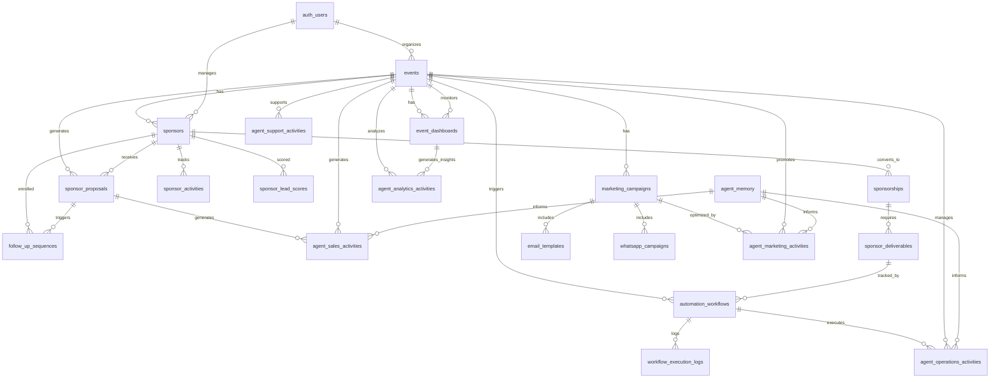
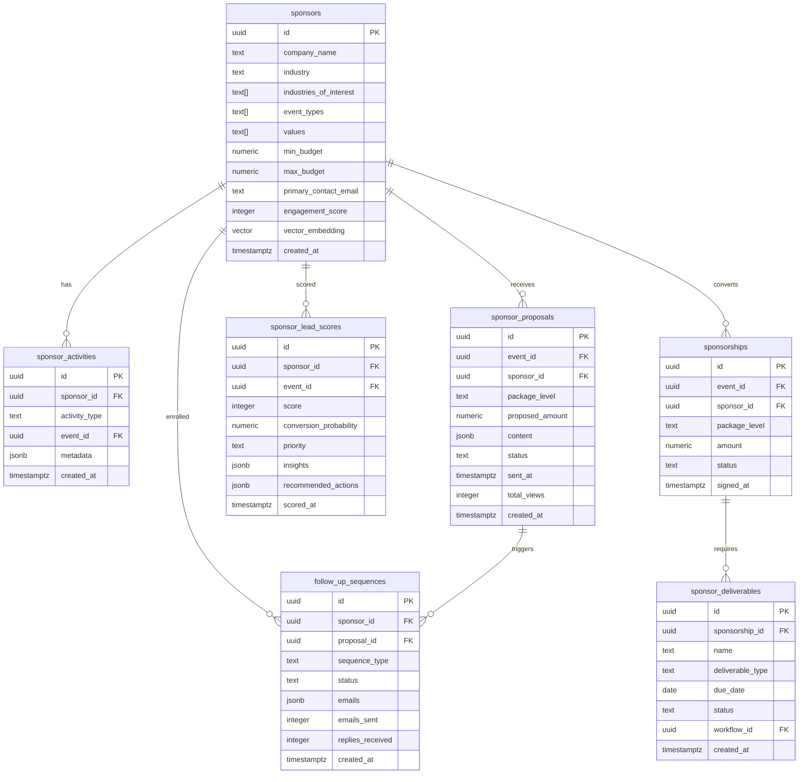
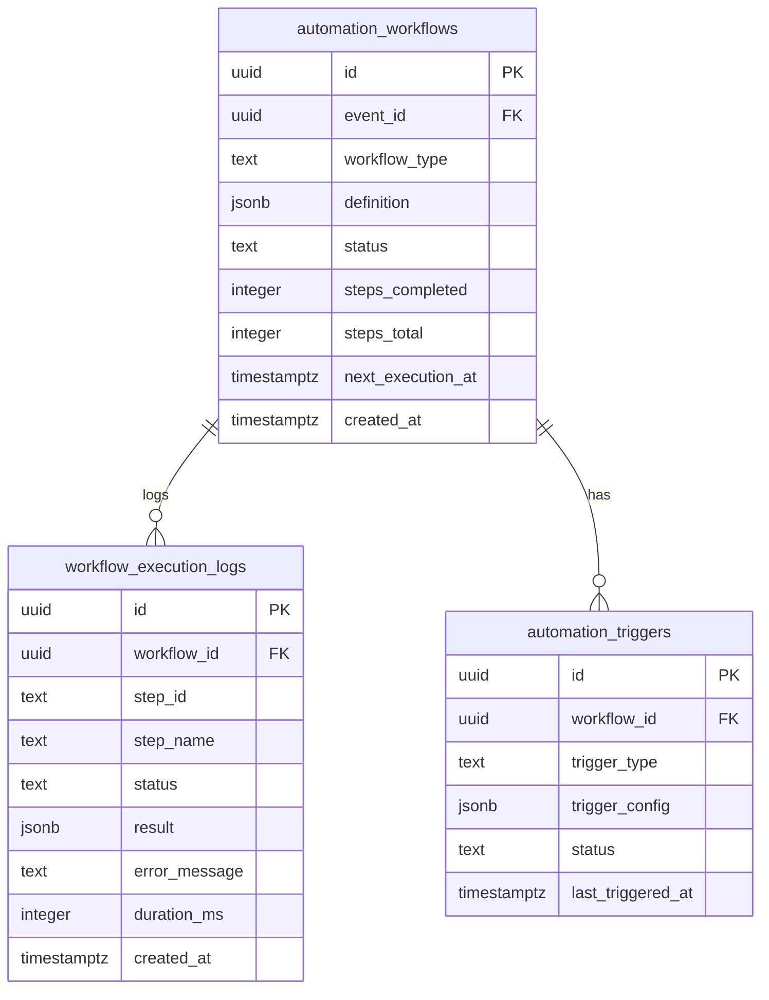
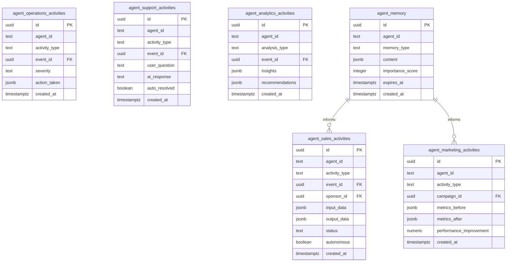
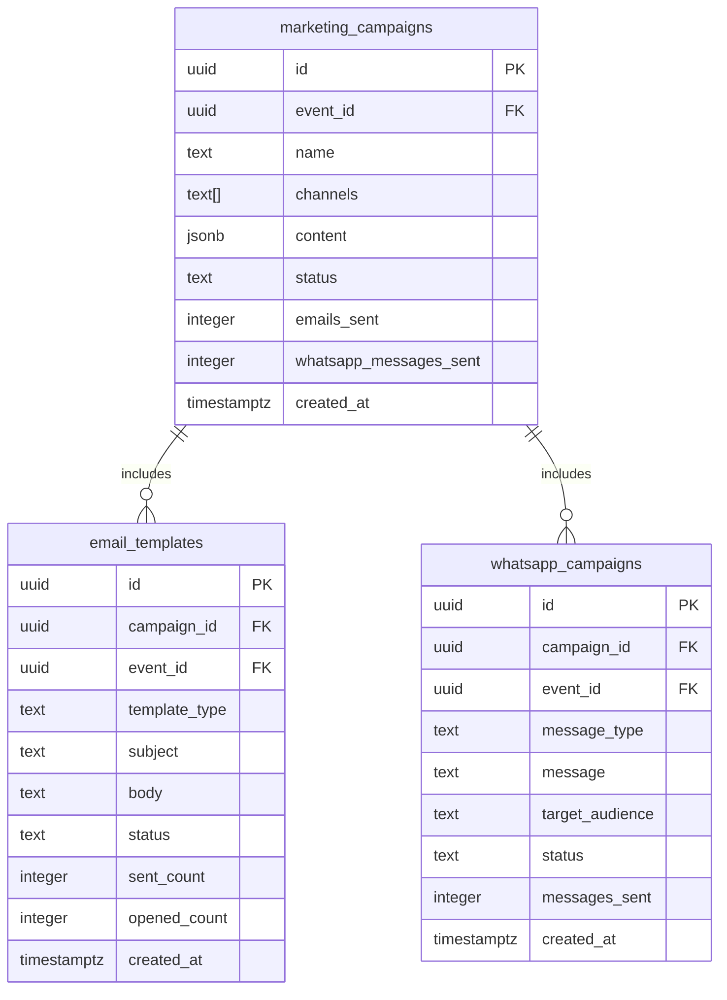
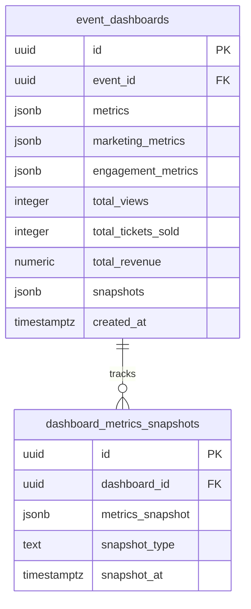

# Database ERD for AI Features

**Version:** 1.0
**Date:** 2025-10-17
**Status:** Database Design
**Parent Document:** [00-AI-FEATURES-MASTER-PLAN.md](./00-AI-FEATURES-MASTER-PLAN.md)

---

## 🎯 Overview

This document provides the complete Entity Relationship Diagram (ERD) for all AI-powered features in EventOS, including sponsor management, automation workflows, AI agents, and analytics infrastructure.

### Database Statistics

| Category | Tables | Total Columns | Indexes | RLS Policies |
|----------|--------|---------------|---------|--------------|
| Sponsor Management | 5 | 87 | 28 | 15 |
| Automation Workflows | 3 | 52 | 18 | 9 |
| AI Agents | 5 | 64 | 22 | 12 |
| Marketing Infrastructure | 3 | 68 | 18 | 9 |
| Analytics & Dashboards | 2 | 42 | 16 | 6 |
| **TOTAL** | **18** | **313** | **102** | **51** |

---

## 📊 Complete ERD Diagram

### Master Entity Relationship Diagram



---

## 🤝 Sponsor Management Schema

### Sponsor Management ERD



### Key Tables Detail

#### sponsors table
```sql
CREATE TABLE sponsors (
    id UUID PRIMARY KEY DEFAULT gen_random_uuid(),

    -- Company info
    company_name TEXT NOT NULL,
    industry TEXT NOT NULL,
    website TEXT,
    logo_url TEXT,

    -- Preferences
    industries_of_interest TEXT[] DEFAULT '{}',
    event_types TEXT[] DEFAULT '{}',
    geographic_preferences TEXT[] DEFAULT '{}',
    values TEXT[] DEFAULT '{}',

    -- Budget
    min_budget NUMERIC(10,2),
    max_budget NUMERIC(10,2),
    currency TEXT DEFAULT 'USD',

    -- Contact
    primary_contact_name TEXT,
    primary_contact_email TEXT,
    primary_contact_phone TEXT,

    -- Performance
    total_sponsorships INTEGER DEFAULT 0,
    average_roi NUMERIC(5,2),
    renewal_rate NUMERIC(5,2),
    engagement_score INTEGER DEFAULT 0,

    -- AI
    vector_embedding VECTOR(1536),

    created_at TIMESTAMPTZ DEFAULT NOW()
);

-- Indexes
CREATE INDEX idx_sponsors_industry ON sponsors(industry);
CREATE INDEX idx_sponsors_budget ON sponsors(min_budget, max_budget);
CREATE INDEX idx_sponsors_engagement ON sponsors(engagement_score DESC);
CREATE INDEX idx_sponsors_vector ON sponsors
    USING ivfflat (vector_embedding vector_cosine_ops) WITH (lists = 100);
```

---

## ⚙️ Automation Workflows Schema

### Automation ERD



#### automation_workflows table
```sql
CREATE TABLE automation_workflows (
    id UUID PRIMARY KEY DEFAULT gen_random_uuid(),

    event_id UUID NOT NULL REFERENCES events(id) ON DELETE CASCADE,
    created_by UUID REFERENCES auth.users(id),

    name TEXT NOT NULL,
    workflow_type TEXT NOT NULL CHECK (workflow_type IN (
        'event_launch', 'sponsor_outreach', 'attendee_nurture',
        'post_event_followup', 'deliverable_tracking', 'custom'
    )),

    definition JSONB NOT NULL,
    status TEXT DEFAULT 'pending' CHECK (status IN (
        'pending', 'active', 'paused', 'completed', 'failed', 'cancelled'
    )),

    current_step TEXT,
    steps_completed INTEGER DEFAULT 0,
    steps_total INTEGER,

    tasks_executed INTEGER DEFAULT 0,
    tasks_successful INTEGER DEFAULT 0,
    tasks_failed INTEGER DEFAULT 0,

    last_error TEXT,
    retry_count INTEGER DEFAULT 0,
    max_retries INTEGER DEFAULT 3,

    started_at TIMESTAMPTZ,
    completed_at TIMESTAMPTZ,
    next_execution_at TIMESTAMPTZ,
    created_at TIMESTAMPTZ DEFAULT NOW()
);

-- Indexes
CREATE INDEX idx_workflows_event ON automation_workflows(event_id);
CREATE INDEX idx_workflows_status ON automation_workflows(status);
CREATE INDEX idx_workflows_next_exec ON automation_workflows(next_execution_at)
    WHERE status = 'active';
CREATE INDEX idx_workflows_type ON automation_workflows(workflow_type);
```

---

## 🤖 AI Agents Schema

### AI Agents ERD



#### agent_sales_activities table
```sql
CREATE TABLE agent_sales_activities (
    id UUID PRIMARY KEY DEFAULT gen_random_uuid(),

    agent_id TEXT DEFAULT 'sales_agent',
    agent_version TEXT,

    activity_type TEXT NOT NULL CHECK (activity_type IN (
        'prospect_search', 'lead_qualification', 'proposal_generation',
        'email_sent', 'follow_up_sent', 'meeting_scheduled',
        'crm_update', 'linkedin_search', 'engagement_analysis'
    )),

    event_id UUID REFERENCES events(id),
    sponsor_id UUID REFERENCES sponsors(id),
    proposal_id UUID REFERENCES sponsor_proposals(id),

    input_data JSONB,
    output_data JSONB,
    reasoning TEXT,

    status TEXT DEFAULT 'success' CHECK (status IN (
        'success', 'failed', 'pending', 'escalated'
    )),
    error_message TEXT,

    autonomous BOOLEAN DEFAULT TRUE,
    required_human_review BOOLEAN DEFAULT FALSE,
    escalation_reason TEXT,

    duration_ms INTEGER,
    llm_tokens_used INTEGER,

    created_at TIMESTAMPTZ DEFAULT NOW()
);

-- Indexes
CREATE INDEX idx_sales_activities_event ON agent_sales_activities(event_id, created_at DESC);
CREATE INDEX idx_sales_activities_sponsor ON agent_sales_activities(sponsor_id, created_at DESC);
CREATE INDEX idx_sales_activities_type ON agent_sales_activities(activity_type);
CREATE INDEX idx_sales_activities_escalated ON agent_sales_activities(required_human_review)
    WHERE required_human_review = TRUE;
```

#### agent_memory table
```sql
CREATE TABLE agent_memory (
    id UUID PRIMARY KEY DEFAULT gen_random_uuid(),

    agent_id TEXT NOT NULL,
    memory_type TEXT NOT NULL CHECK (memory_type IN (
        'short_term',    -- Recent interactions (7 days)
        'long_term',     -- Important learnings (permanent)
        'episodic',      -- Specific task/conversation memory
        'semantic'       -- General knowledge extracted
    )),

    content JSONB NOT NULL,
    -- {
    --   "key": "sponsor_preferences_tech_industry",
    --   "value": {...},
    --   "context": "Learned from 15 successful deals",
    --   "confidence": 0.85
    -- }

    importance_score INTEGER DEFAULT 50 CHECK (importance_score >= 0 AND importance_score <= 100),
    access_count INTEGER DEFAULT 0,
    last_accessed_at TIMESTAMPTZ,

    expires_at TIMESTAMPTZ,

    created_at TIMESTAMPTZ DEFAULT NOW(),
    updated_at TIMESTAMPTZ DEFAULT NOW()
);

-- Indexes
CREATE INDEX idx_agent_memory_agent ON agent_memory(agent_id, importance_score DESC);
CREATE INDEX idx_agent_memory_type ON agent_memory(memory_type);
CREATE INDEX idx_agent_memory_expires ON agent_memory(expires_at)
    WHERE expires_at IS NOT NULL;
CREATE INDEX idx_agent_memory_content ON agent_memory USING gin(content);
```

---

## 📧 Marketing Infrastructure Schema

### Marketing ERD



---

## 📊 Analytics Schema

### Analytics ERD



#### event_dashboards table
```sql
CREATE TABLE event_dashboards (
    id UUID PRIMARY KEY DEFAULT gen_random_uuid(),

    event_id UUID UNIQUE NOT NULL REFERENCES events(id) ON DELETE CASCADE,
    organizer_id UUID REFERENCES auth.users(id),

    -- Metrics (JSONB for flexibility)
    metrics JSONB DEFAULT '{}'::JSONB,
    marketing_metrics JSONB DEFAULT '{}'::JSONB,
    engagement_metrics JSONB DEFAULT '{}'::JSONB,
    funnel_metrics JSONB DEFAULT '{}'::JSONB,

    -- Denormalized for performance
    total_views INTEGER DEFAULT 0,
    total_tickets_sold INTEGER DEFAULT 0,
    total_revenue NUMERIC(12,2) DEFAULT 0,
    conversion_rate NUMERIC(5,4) DEFAULT 0,

    -- Timestamps
    first_view_at TIMESTAMPTZ,
    first_sale_at TIMESTAMPTZ,
    last_updated_at TIMESTAMPTZ DEFAULT NOW(),

    -- Historical snapshots
    snapshots JSONB DEFAULT '[]'::JSONB,

    created_at TIMESTAMPTZ DEFAULT NOW(),
    updated_at TIMESTAMPTZ DEFAULT NOW()
);

-- Indexes
CREATE INDEX idx_dashboards_event ON event_dashboards(event_id);
CREATE INDEX idx_dashboards_organizer ON event_dashboards(organizer_id);
CREATE INDEX idx_dashboards_views ON event_dashboards(total_views DESC);
CREATE INDEX idx_dashboards_revenue ON event_dashboards(total_revenue DESC);
CREATE INDEX idx_dashboards_metrics ON event_dashboards USING gin(metrics);
CREATE INDEX idx_dashboards_snapshots ON event_dashboards USING gin(snapshots);
```

---

## 🔐 Row Level Security (RLS) Policies

### RLS Policy Summary

| Table | Policy Count | Access Pattern |
|-------|-------------|----------------|
| sponsors | 3 | User owns their sponsor contacts |
| sponsor_proposals | 3 | Organizer owns proposals for their events |
| sponsor_lead_scores | 2 | Organizer can view/update scores |
| follow_up_sequences | 3 | Organizer owns sequences |
| automation_workflows | 3 | Organizer owns workflows for their events |
| agent_*_activities | 2 each | Organizer can view agent activities for their events |
| marketing_campaigns | 3 | Organizer owns campaigns |
| event_dashboards | 3 | Organizer views their event dashboards |

### Example RLS Policies

```sql
-- Sponsors: Users can manage their own sponsor contacts
CREATE POLICY "users_manage_own_sponsors"
ON sponsors FOR ALL TO authenticated
USING (auth.uid() = created_by)
WITH CHECK (auth.uid() = created_by);

-- Proposals: Organizers can manage proposals for their events
CREATE POLICY "organizers_manage_event_proposals"
ON sponsor_proposals FOR ALL TO authenticated
USING (
    EXISTS (
        SELECT 1 FROM events
        WHERE events.id = sponsor_proposals.event_id
        AND events.organizer_id = auth.uid()
    )
);

-- Workflows: Organizers can manage workflows for their events
CREATE POLICY "organizers_manage_event_workflows"
ON automation_workflows FOR ALL TO authenticated
USING (
    EXISTS (
        SELECT 1 FROM events
        WHERE events.id = automation_workflows.event_id
        AND events.organizer_id = auth.uid()
    )
);

-- Agent activities: Organizers can view activities for their events
CREATE POLICY "organizers_view_sales_activities"
ON agent_sales_activities FOR SELECT TO authenticated
USING (
    EXISTS (
        SELECT 1 FROM events
        WHERE events.id = agent_sales_activities.event_id
        AND events.organizer_id = auth.uid()
    )
);
```

---

## 🚀 Performance Optimization

### Index Strategy

**High-Priority Indexes:**
1. Foreign key indexes (all FK columns)
2. Status columns (frequently filtered)
3. Timestamp columns (for sorting and filtering)
4. Vector similarity indexes (for AI matching)
5. GIN indexes on JSONB columns (for content search)

**Example Index Definitions:**
```sql
-- Foreign keys
CREATE INDEX idx_sponsor_activities_sponsor ON sponsor_activities(sponsor_id, created_at DESC);
CREATE INDEX idx_proposals_event ON sponsor_proposals(event_id);

-- Status filters
CREATE INDEX idx_workflows_status ON automation_workflows(status);
CREATE INDEX idx_proposals_status ON sponsor_proposals(status);

-- Vector search
CREATE INDEX idx_sponsors_vector ON sponsors
    USING ivfflat (vector_embedding vector_cosine_ops) WITH (lists = 100);

-- JSONB search
CREATE INDEX idx_campaigns_content ON marketing_campaigns USING gin(content);
CREATE INDEX idx_workflows_definition ON automation_workflows USING gin(definition);
```

### Query Optimization Patterns

**1. Use Materialized Views for Complex Aggregations**
```sql
CREATE MATERIALIZED VIEW sponsor_performance_summary AS
SELECT
    s.id,
    s.company_name,
    COUNT(DISTINCT sp.id) as total_proposals,
    COUNT(DISTINCT ss.id) as total_sponsorships,
    AVG(sls.score) as avg_lead_score,
    SUM(ss.amount) as total_revenue
FROM sponsors s
LEFT JOIN sponsor_proposals sp ON sp.sponsor_id = s.id
LEFT JOIN sponsorships ss ON ss.sponsor_id = s.id
LEFT JOIN sponsor_lead_scores sls ON sls.sponsor_id = s.id
GROUP BY s.id, s.company_name;

-- Refresh periodically
REFRESH MATERIALIZED VIEW sponsor_performance_summary;
```

**2. Partition Large Tables by Date**
```sql
-- Partition agent activities by month
CREATE TABLE agent_sales_activities (
    -- columns...
) PARTITION BY RANGE (created_at);

CREATE TABLE agent_sales_activities_2025_01
    PARTITION OF agent_sales_activities
    FOR VALUES FROM ('2025-01-01') TO ('2025-02-01');

CREATE TABLE agent_sales_activities_2025_02
    PARTITION OF agent_sales_activities
    FOR VALUES FROM ('2025-02-01') TO ('2025-03-01');
```

---

## 📈 Migration Strategy

### Phase 1: Core Tables (Month 1)
```sql
-- Create sponsor management tables
CREATE TABLE sponsors (...);
CREATE TABLE sponsor_activities (...);
CREATE TABLE sponsor_proposals (...);
CREATE TABLE sponsor_lead_scores (...);

-- Create indexes
CREATE INDEX ...;

-- Enable RLS
ALTER TABLE sponsors ENABLE ROW LEVEL SECURITY;
CREATE POLICY ...;
```

### Phase 2: Automation & Agents (Month 2-3)
```sql
-- Create automation tables
CREATE TABLE automation_workflows (...);
CREATE TABLE workflow_execution_logs (...);

-- Create agent activity tables
CREATE TABLE agent_sales_activities (...);
CREATE TABLE agent_marketing_activities (...);
CREATE TABLE agent_memory (...);

-- Indexes and RLS
```

### Phase 3: Marketing & Analytics (Month 3-4)
```sql
-- Already created in wizard migrations
-- marketing_campaigns
-- email_templates
-- whatsapp_campaigns
-- event_dashboards

-- Add additional agent tables
CREATE TABLE agent_operations_activities (...);
CREATE TABLE agent_support_activities (...);
CREATE TABLE agent_analytics_activities (...);
```

---

## 🔄 Database Relationships Summary

### Primary Relationships

**1. Events → AI Features**
- events → marketing_campaigns (1:N)
- events → automation_workflows (1:N)
- events → event_dashboards (1:1)
- events → sponsor_proposals (1:N)
- events → agent activities (1:N)

**2. Sponsors → Engagement**
- sponsors → sponsor_activities (1:N)
- sponsors → sponsor_proposals (1:N)
- sponsors → sponsor_lead_scores (1:N)
- sponsors → follow_up_sequences (1:N)
- sponsors → sponsorships (1:N)

**3. Workflows → Execution**
- automation_workflows → workflow_execution_logs (1:N)
- automation_workflows → sponsor_deliverables (1:N tracking)

**4. Campaigns → Content**
- marketing_campaigns → email_templates (1:N)
- marketing_campaigns → whatsapp_campaigns (1:N)
- marketing_campaigns → agent_marketing_activities (1:N)

**5. Agents → Memory**
- agent_memory → all agent_*_activities (1:N informs)

---

## 📊 Storage Estimates

| Table | Rows/Event | Row Size | Storage/Event | Annual (1000 events) |
|-------|------------|----------|---------------|---------------------|
| sponsors | 50 | 2 KB | 100 KB | 100 MB |
| sponsor_proposals | 10 | 15 KB | 150 KB | 150 MB |
| sponsor_activities | 200 | 1 KB | 200 KB | 200 MB |
| automation_workflows | 5 | 3 KB | 15 KB | 15 MB |
| workflow_execution_logs | 100 | 2 KB | 200 KB | 200 MB |
| agent_sales_activities | 500 | 1.5 KB | 750 KB | 750 MB |
| agent_marketing_activities | 200 | 1 KB | 200 KB | 200 MB |
| marketing_campaigns | 1 | 50 KB | 50 KB | 50 MB |
| event_dashboards | 1 | 20 KB | 20 KB | 20 MB |
| **TOTAL** | **1067** | - | **~1.7 MB** | **~1.7 GB** |

**Projection:** With 1000 events/year, total AI feature storage ~1.7 GB/year

---

## ✅ Database Health Monitoring

### Key Metrics to Track

```sql
-- Table sizes
SELECT
    schemaname,
    tablename,
    pg_size_pretty(pg_total_relation_size(schemaname||'.'||tablename)) AS size
FROM pg_tables
WHERE schemaname = 'public'
ORDER BY pg_total_relation_size(schemaname||'.'||tablename) DESC;

-- Index usage
SELECT
    schemaname,
    tablename,
    indexname,
    idx_scan,
    idx_tup_read,
    idx_tup_fetch
FROM pg_stat_user_indexes
WHERE schemaname = 'public'
ORDER BY idx_scan DESC;

-- Slow queries
SELECT
    query,
    calls,
    mean_exec_time,
    max_exec_time
FROM pg_stat_statements
WHERE query LIKE '%sponsors%' OR query LIKE '%agent_%'
ORDER BY mean_exec_time DESC
LIMIT 20;
```

---

**Status:** ✅ COMPLETE - All AI Features Database Design
**Total Tables:** 18 new tables
**Total Indexes:** 102 indexes
**Total RLS Policies:** 51 policies
**Estimated Storage:** 1.7 MB per event, 1.7 GB per 1000 events

**Related Documents:**
- [00-AI-FEATURES-MASTER-PLAN.md](./00-AI-FEATURES-MASTER-PLAN.md)
- [01-SPONSOR-MANAGEMENT-AI.md](./01-SPONSOR-MANAGEMENT-AI.md)
- [02-AUTOMATION-WORKFLOWS.md](./02-AUTOMATION-WORKFLOWS.md)
- [03-AI-AGENTS-ARCHITECTURE.md](./03-AI-AGENTS-ARCHITECTURE.md)
- [04-USER-JOURNEYS-FLOWS.md](./04-USER-JOURNEYS-FLOWS.md)

**Migration Files:** See `/home/sk/event-studio/supabase/migrations/` for existing wizard migrations
