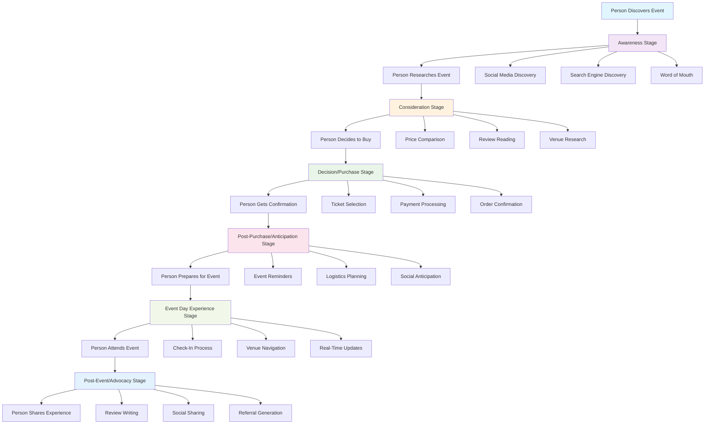

# Event Journey System - Simple Overview

## What This System Does

The Event Journey System is a complete customer experience platform that guides people through every step of attending an event - from first hearing about it to becoming a loyal advocate who brings in new customers.

## The Six Stages of the Customer Journey

### 1. **Awareness** - "I heard about this event"
- **What happens**: People discover events through social media, search engines, friends, or direct visits
- **Key activities**: Event browsing, social sharing, search optimization
- **Goal**: Get people interested in the event

### 2. **Consideration** - "Should I go to this event?"
- **What happens**: People research the event details, compare prices, read reviews, and check venue information
- **Key activities**: Price comparison, review reading, venue research, decision support
- **Goal**: Help people make an informed decision

### 3. **Decision/Purchase** - "I'm buying tickets"
- **What happens**: People select tickets, choose seats, provide payment information, and complete their purchase
- **Key activities**: Ticket selection, seat selection, payment processing, order confirmation
- **Goal**: Convert interest into actual ticket sales

### 4. **Post-Purchase/Anticipation** - "I'm excited for the event"
- **What happens**: People receive confirmation, plan their logistics, get reminders, and share their excitement
- **Key activities**: Order confirmation, reminder setup, logistics planning, social anticipation
- **Goal**: Keep people engaged and reduce no-shows

### 5. **Event Day Experience** - "I'm at the event"
- **What happens**: People check in, navigate the venue, participate in real-time activities, and provide feedback
- **Key activities**: Check-in process, venue navigation, real-time updates, event interaction
- **Goal**: Provide a smooth, enjoyable experience

### 6. **Post-Event/Advocacy** - "That was amazing!"
- **What happens**: People share their experience, write reviews, refer friends, and show interest in future events
- **Key activities**: Social sharing, review writing, referral programs, future engagement
- **Goal**: Turn satisfied customers into brand advocates

## How It All Works Together

## Key Benefits

### For Customers
- **Seamless Experience**: Everything works together smoothly
- **Personalized Content**: Recommendations based on preferences
- **Easy Planning**: Help with transportation, accommodation, and logistics
- **Social Features**: Share excitement and connect with others
- **Rewards**: Earn benefits for referrals and loyalty

### For Event Organizers
- **Higher Attendance**: Better experience means fewer no-shows
- **More Revenue**: Increased conversion rates and repeat customers
- **Word-of-Mouth Marketing**: Satisfied customers bring in new ones
- **Data Insights**: Understand what customers want and need
- **Automated Processes**: Less manual work, more focus on events

## Revenue Impact

### Direct Revenue
- **Ticket Sales**: Primary revenue from successful purchases
- **Commissions**: Fees from ticket sales
- **Premium Features**: Additional services and upgrades

### Indirect Revenue
- **Referrals**: New customers from existing ones
- **Repeat Attendance**: Loyal customers who come back
- **Data Value**: Insights for better targeting and pricing
- **Brand Building**: Strong reputation attracts more customers

## Success Metrics

### Customer Satisfaction
- **Event Rating**: Average satisfaction score (target: 4.5+ stars)
- **Completion Rate**: Percentage who complete the full journey (target: 70%)
- **Repeat Attendance**: Percentage who attend future events (target: 40%)

### Business Performance
- **Conversion Rate**: Percentage who buy tickets (target: 15%)
- **Revenue per Customer**: Average spending per person (target: $25)
- **Referral Rate**: Percentage who refer others (target: 25%)

## Implementation Approach

### Phase 1: Foundation (Weeks 1-2)
- Set up basic journey tracking
- Create core stage components
- Implement analytics collection

### Phase 2: Core Journey (Weeks 3-4)
- Build awareness and consideration features
- Implement purchase flow
- Add post-purchase experience

### Phase 3: Advanced Features (Weeks 5-6)
- Add event day experience features
- Implement advocacy and social sharing
- Optimize based on data

## Technology Stack

### Frontend
- **React**: Modern, responsive user interface
- **TypeScript**: Reliable, maintainable code
- **Tailwind CSS**: Beautiful, consistent design
- **Mobile-First**: Optimized for phones and tablets

### Backend
- **Supabase**: Database and authentication
- **Real-time Updates**: Live event information
- **API Integration**: Payment processing, messaging, social media

### AI & Personalization
- **Smart Recommendations**: AI-powered event suggestions
- **Personalized Content**: Customized experience for each user
- **Automated Messaging**: Intelligent reminders and updates

## Why This System Works

### For Customers
- **One-Stop Solution**: Everything needed in one place
- **Personalized Experience**: Content tailored to preferences
- **Social Integration**: Share and connect with others
- **Rewards Program**: Earn benefits for loyalty and referrals

### For Business
- **Complete Customer Journey**: From discovery to advocacy
- **Data-Driven Insights**: Understand customer behavior
- **Automated Processes**: Reduce manual work
- **Revenue Optimization**: Maximize conversion and retention

---

*This system transforms the traditional event experience into a comprehensive journey that maximizes both customer satisfaction and business revenue.*
