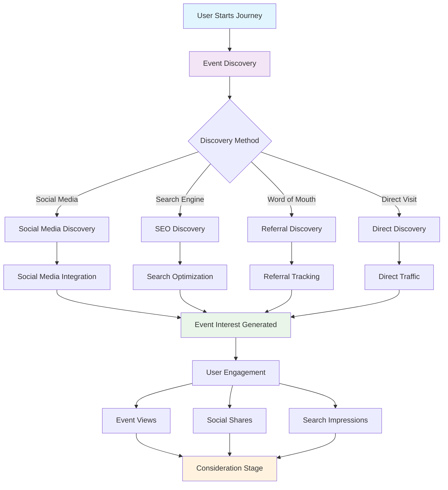

# Awareness Stage Implementation

## 📊 **Awareness Stage Flow Diagram**



## 🎯 **Stage Overview**
The awareness stage is where potential attendees first discover events. This is the foundation of the entire journey and critical for driving initial interest and engagement.

## 📊 **Key Metrics & Goals**
- **Primary Goal**: Generate initial interest and event discovery
- **Success Metrics**: Event views, social shares, search impressions, discovery rate
- **Revenue Impact**: Higher awareness = more potential ticket sales

## 🏗️ **Technical Implementation**

### Frontend Components
```typescript
// Awareness Stage Components
interface AwarenessStageProps {
  eventId: string;
  userId?: string;
  onStageComplete: (stage: string) => void;
}

const AwarenessStage: React.FC<AwarenessStageProps> = ({ eventId, userId, onStageComplete }) => {
  return (
    <div className="awareness-stage">
      <EventDiscovery />
      <SocialSharing />
      <SearchOptimization />
      <InterestCapture />
    </div>
  );
};
```

### Event Discovery Features
```typescript
// Event Discovery Component
const EventDiscovery: React.FC = () => {
  const [events, setEvents] = useState<Event[]>([]);
  const [filters, setFilters] = useState<EventFilters>({});
  
  return (
    <div className="event-discovery">
      <SearchBar onSearch={handleSearch} />
      <FilterPanel filters={filters} onChange={setFilters} />
      <EventGrid events={events} />
      <InfiniteScroll onLoadMore={loadMoreEvents} />
    </div>
  );
};
```

### Social Media Integration
```typescript
// Social Sharing Component
const SocialSharing: React.FC<{ event: Event }> = ({ event }) => {
  const shareToSocial = async (platform: string) => {
    // Track social sharing
    await trackJourneyStage('awareness', 'social_share', { platform });
    
    // Share to platform
    switch (platform) {
      case 'facebook':
        return shareToFacebook(event);
      case 'twitter':
        return shareToTwitter(event);
      case 'whatsapp':
        return shareToWhatsApp(event);
    }
  };
  
  return (
    <div className="social-sharing">
      <button onClick={() => shareToSocial('facebook')}>Share on Facebook</button>
      <button onClick={() => shareToSocial('twitter')}>Share on Twitter</button>
      <button onClick={() => shareToSocial('whatsapp')}>Share on WhatsApp</button>
    </div>
  );
};
```

## 🔍 **Discovery Mechanisms**

### 1. Search Engine Optimization
```typescript
// SEO Optimization
const SEOOptimization: React.FC<{ event: Event }> = ({ event }) => {
  const seoData = {
    title: `${event.title} - ${event.venue} | EventOS`,
    description: event.description.substring(0, 160),
    keywords: [event.category, event.venue, event.city, 'events', 'tickets'],
    openGraph: {
      title: event.title,
      description: event.description,
      image: event.image_url,
      type: 'event'
    }
  };
  
  return (
    <Helmet>
      <title>{seoData.title}</title>
      <meta name="description" content={seoData.description} />
      <meta name="keywords" content={seoData.keywords.join(', ')} />
      <meta property="og:title" content={seoData.openGraph.title} />
      <meta property="og:description" content={seoData.openGraph.description} />
      <meta property="og:image" content={seoData.openGraph.image} />
    </Helmet>
  );
};
```

### 2. Social Media Discovery
```typescript
// Social Media Integration
const SocialDiscovery: React.FC = () => {
  const [socialEvents, setSocialEvents] = useState<Event[]>([]);
  
  useEffect(() => {
    // Fetch events from social media APIs
    const fetchSocialEvents = async () => {
      const facebookEvents = await fetchFacebookEvents();
      const instagramEvents = await fetchInstagramEvents();
      setSocialEvents([...facebookEvents, ...instagramEvents]);
    };
    
    fetchSocialEvents();
  }, []);
  
  return (
    <div className="social-discovery">
      <h3>Events from Your Social Network</h3>
      <EventList events={socialEvents} />
    </div>
  );
};
```

### 3. Recommendation Engine
```typescript
// AI-Powered Recommendations
const RecommendationEngine: React.FC<{ userId?: string }> = ({ userId }) => {
  const [recommendations, setRecommendations] = useState<Event[]>([]);
  
  useEffect(() => {
    const fetchRecommendations = async () => {
      if (userId) {
        // Personalized recommendations
        const personalized = await getPersonalizedRecommendations(userId);
        setRecommendations(personalized);
      } else {
        // General recommendations
        const general = await getGeneralRecommendations();
        setRecommendations(general);
      }
    };
    
    fetchRecommendations();
  }, [userId]);
  
  return (
    <div className="recommendations">
      <h3>Recommended for You</h3>
      <EventCarousel events={recommendations} />
    </div>
  );
};
```

## 📱 **Mobile-First Design**

### Responsive Event Cards
```typescript
// Mobile-Optimized Event Card
const EventCard: React.FC<{ event: Event }> = ({ event }) => {
  return (
    <div className="event-card mobile-optimized">
      <div className="event-image">
        
        <div className="event-badge">{event.category}</div>
      </div>
      
      <div className="event-content">
        <h3 className="event-title">{event.title}</h3>
        <p className="event-date">{formatDate(event.start_date)}</p>
        <p className="event-venue">{event.venue}</p>
        <p className="event-price">From ${event.min_price}</p>
      </div>
      
      <div className="event-actions">
        <button className="btn-primary">View Details</button>
        <button className="btn-secondary">Share</button>
      </div>
    </div>
  );
};
```

## 🔧 **Backend Implementation**

### Journey Tracking Service
```typescript
// Journey Tracking Service
export class JourneyTrackingService {
  async trackAwarenessStage(userId: string, eventId: string, action: string, metadata?: any) {
    const journeyEntry = {
      user_id: userId,
      event_id: eventId,
      stage: 'awareness',
      action: action,
      metadata: metadata,
      timestamp: new Date()
    };
    
    await supabase
      .from('event_journey_stages')
      .insert(journeyEntry);
  }
  
  async getAwarenessMetrics(eventId: string) {
    const { data } = await supabase
      .from('event_journey_stages')
      .select('*')
      .eq('event_id', eventId)
      .eq('stage', 'awareness');
    
    return this.calculateAwarenessMetrics(data);
  }
}
```

### Analytics Collection
```typescript
// Analytics Service
export class AwarenessAnalytics {
  async trackEventView(eventId: string, userId?: string) {
    await this.trackJourneyStage('awareness', 'event_view', { eventId, userId });
    
    // Update event view count
    await supabase
      .from('events')
      .update({ view_count: supabase.raw('view_count + 1') })
      .eq('id', eventId);
  }
  
  async trackSocialShare(eventId: string, platform: string, userId?: string) {
    await this.trackJourneyStage('awareness', 'social_share', { 
      eventId, 
      platform, 
      userId 
    });
  }
}
```

## 🎯 **Optimization Strategies**

### 1. A/B Testing
```typescript
// A/B Testing for Awareness Stage
const AwarenessABTest: React.FC = () => {
  const [variant, setVariant] = useState<'control' | 'variant_a' | 'variant_b'>('control');
  
  useEffect(() => {
    // Determine A/B test variant
    const testVariant = getABTestVariant('awareness_stage');
    setVariant(testVariant);
  }, []);
  
  return (
    <div className={`awareness-stage ${variant}`}>
      {variant === 'control' && <ControlLayout />}
      {variant === 'variant_a' && <VariantALayout />}
      {variant === 'variant_b' && <VariantBLayout />}
    </div>
  );
};
```

### 2. Personalization
```typescript
// Personalization Engine
export class AwarenessPersonalization {
  async getPersonalizedContent(userId: string, eventId: string) {
    const userProfile = await this.getUserProfile(userId);
    const eventData = await this.getEventData(eventId);
    
    // AI-powered content personalization
    const personalizedContent = await this.generatePersonalizedContent(
      userProfile, 
      eventData
    );
    
    return personalizedContent;
  }
}
```

## 📊 **Success Metrics**

### Key Performance Indicators
- **Event Discovery Rate**: % of users who discover events
- **Social Share Rate**: % of users who share events
- **Search Conversion**: % of searches that lead to event views
- **Recommendation Click-Through**: % of recommendations clicked

### Revenue Metrics
- **Cost per Acquisition**: Cost to acquire new users
- **Lifetime Value**: Revenue from users acquired through awareness
- **Conversion Rate**: % of awareness stage users who purchase

## 🚀 **Implementation Checklist**

- [ ] **Event Discovery Interface**: Search, filters, recommendations
- [ ] **Social Media Integration**: Facebook, Twitter, WhatsApp sharing
- [ ] **SEO Optimization**: Meta tags, structured data, sitemaps
- [ ] **Mobile Optimization**: Responsive design, touch-friendly interface
- [ ] **Analytics Tracking**: User behavior, conversion metrics
- [ ] **A/B Testing**: Test different awareness strategies
- [ ] **Personalization**: AI-powered content recommendations
- [ ] **Performance Optimization**: Fast loading, smooth interactions

---

*The awareness stage is the foundation of the entire event journey. Success here directly impacts all subsequent stages and overall revenue generation.*
