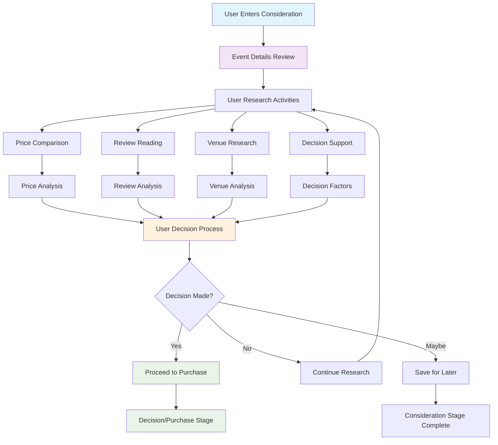

# Consideration Stage Implementation

## 📊 **Consideration Stage Flow Diagram**



## 🎯 **Stage Overview**
The consideration stage is where potential attendees evaluate events and decide if they're the right fit. This is where detailed research, comparison, and decision-making happens.

## 📊 **Key Metrics & Goals**
- **Primary Goal**: Help users make informed decisions about event attendance
- **Success Metrics**: Time on event page, comparison actions, bounce rate, consideration completion
- **Revenue Impact**: Higher consideration quality = higher conversion rates

## 🏗️ **Technical Implementation**

### Frontend Components
```typescript
// Consideration Stage Components
interface ConsiderationStageProps {
  eventId: string;
  userId?: string;
  onStageComplete: (stage: string) => void;
}

const ConsiderationStage: React.FC<ConsiderationStageProps> = ({ eventId, userId, onStageComplete }) => {
  return (
    <div className="consideration-stage">
      <EventDetails />
      <PriceComparison />
      <ReviewsSection />
      <VenueInformation />
      <DecisionSupport />
    </div>
  );
};
```

### Event Details Component
```typescript
// Comprehensive Event Details
const EventDetails: React.FC<{ event: Event }> = ({ event }) => {
  return (
    <div className="event-details">
      <div className="event-header">
        <h1>{event.title}</h1>
        <div className="event-meta">
          <span className="date">{formatDate(event.start_date)}</span>
          <span className="venue">{event.venue}</span>
          <span className="location">{event.city}, {event.state}</span>
        </div>
      </div>
      
      <div className="event-content">
        <div className="event-description">
          <h3>About This Event</h3>
          <p>{event.description}</p>
        </div>
        
        <div className="event-highlights">
          <h3>Event Highlights</h3>
          <ul>
            {event.highlights.map(highlight => (
              <li key={highlight.id}>{highlight.text}</li>
            ))}
          </ul>
        </div>
        
        <div className="event-schedule">
          <h3>Schedule</h3>
          <Timeline events={event.schedule} />
        </div>
      </div>
    </div>
  );
};
```

## 💰 **Price Comparison Features**

### Price Comparison Component
```typescript
// Price Comparison Tool
const PriceComparison: React.FC<{ event: Event }> = ({ event }) => {
  const [ticketOptions, setTicketOptions] = useState<TicketOption[]>([]);
  const [comparisonData, setComparisonData] = useState<ComparisonData | null>(null);
  
  useEffect(() => {
    const fetchTicketOptions = async () => {
      const options = await getTicketOptions(event.id);
      setTicketOptions(options);
      
      // Get comparison data from other platforms
      const comparison = await getPriceComparison(event.id);
      setComparisonData(comparison);
    };
    
    fetchTicketOptions();
  }, [event.id]);
  
  return (
    <div className="price-comparison">
      <h3>Ticket Options & Pricing</h3>
      
      <div className="ticket-tiers">
        {ticketOptions.map(tier => (
          <TicketTierCard key={tier.id} tier={tier} />
        ))}
      </div>
      
      {comparisonData && (
        <div className="price-comparison-table">
          <h4>Compare Prices Across Platforms</h4>
          <ComparisonTable data={comparisonData} />
        </div>
      )}
    </div>
  );
};
```

### Ticket Tier Card
```typescript
// Individual Ticket Tier
const TicketTierCard: React.FC<{ tier: TicketTier }> = ({ tier }) => {
  const [isSelected, setIsSelected] = useState(false);
  
  return (
    <div className={`ticket-tier-card ${isSelected ? 'selected' : ''}`}>
      <div className="tier-header">
        <h4>{tier.name}</h4>
        <span className="price">${tier.price}</span>
      </div>
      
      <div className="tier-features">
        <ul>
          {tier.features.map(feature => (
            <li key={feature.id}>
              <CheckIcon />
              {feature.description}
            </li>
          ))}
        </ul>
      </div>
      
      <div className="tier-availability">
        <span className="available">
          {tier.quantity_available} tickets left
        </span>
      </div>
      
      <button 
        className="select-tier-btn"
        onClick={() => setIsSelected(!isSelected)}
      >
        {isSelected ? 'Selected' : 'Select Tier'}
      </button>
    </div>
  );
};
```

## ⭐ **Reviews & Social Proof**

### Reviews Section
```typescript
// Reviews and Ratings
const ReviewsSection: React.FC<{ event: Event }> = ({ event }) => {
  const [reviews, setReviews] = useState<Review[]>([]);
  const [averageRating, setAverageRating] = useState<number>(0);
  
  useEffect(() => {
    const fetchReviews = async () => {
      const reviewData = await getEventReviews(event.id);
      setReviews(reviewData.reviews);
      setAverageRating(reviewData.averageRating);
    };
    
    fetchReviews();
  }, [event.id]);
  
  return (
    <div className="reviews-section">
      <div className="reviews-header">
        <h3>Reviews & Ratings</h3>
        <div className="rating-summary">
          <StarRating rating={averageRating} />
          <span className="rating-text">
            {averageRating.toFixed(1)} out of 5 ({reviews.length} reviews)
          </span>
        </div>
      </div>
      
      <div className="reviews-grid">
        {reviews.slice(0, 6).map(review => (
          <ReviewCard key={review.id} review={review} />
        ))}
      </div>
      
      {reviews.length > 6 && (
        <button className="view-all-reviews-btn">
          View All {reviews.length} Reviews
        </button>
      )}
    </div>
  );
};
```

### Review Card Component
```typescript
// Individual Review Card
const ReviewCard: React.FC<{ review: Review }> = ({ review }) => {
  return (
    <div className="review-card">
      <div className="review-header">
        <div className="reviewer-info">
          
          <div className="reviewer-details">
            <h4>{review.user.name}</h4>
            <span className="review-date">{formatDate(review.created_at)}</span>
          </div>
        </div>
        <StarRating rating={review.rating} />
      </div>
      
      <div className="review-content">
        <p>{review.comment}</p>
      </div>
      
      <div className="review-actions">
        <button className="helpful-btn">
          <ThumbsUpIcon />
          Helpful ({review.helpful_count})
        </button>
        <button className="share-review-btn">
          <ShareIcon />
          Share
        </button>
      </div>
    </div>
  );
};
```

## 🏢 **Venue Information**

### Venue Details Component
```typescript
// Venue Information
const VenueInformation: React.FC<{ venue: Venue }> = ({ venue }) => {
  return (
    <div className="venue-information">
      <h3>Venue Information</h3>
      
      <div className="venue-details">
        <div className="venue-basic-info">
          <h4>{venue.name}</h4>
          <p className="venue-address">
            {venue.address}, {venue.city}, {venue.state} {venue.postal_code}
          </p>
          <p className="venue-phone">{venue.phone}</p>
        </div>
        
        <div className="venue-amenities">
          <h4>Amenities</h4>
          <div className="amenities-grid">
            {venue.amenities.map(amenity => (
              <div key={amenity.id} className="amenity-item">
                <AmenityIcon type={amenity.type} />
                <span>{amenity.name}</span>
              </div>
            ))}
          </div>
        </div>
        
        <div className="venue-map">
          <h4>Location</h4>
          <MapComponent 
            latitude={venue.latitude}
            longitude={venue.longitude}
            zoom={15}
          />
        </div>
      </div>
    </div>
  );
};
```

## 🤔 **Decision Support Tools**

### Decision Support Component
```typescript
// Decision Support Tools
const DecisionSupport: React.FC<{ event: Event, userId?: string }> = ({ event, userId }) => {
  const [decisionFactors, setDecisionFactors] = useState<DecisionFactor[]>([]);
  const [recommendation, setRecommendation] = useState<string>('');
  
  useEffect(() => {
    const analyzeDecisionFactors = async () => {
      const factors = await getDecisionFactors(event.id, userId);
      setDecisionFactors(factors);
      
      const rec = await getPersonalizedRecommendation(event.id, userId);
      setRecommendation(rec);
    };
    
    analyzeDecisionFactors();
  }, [event.id, userId]);
  
  return (
    <div className="decision-support">
      <h3>Decision Support</h3>
      
      <div className="decision-factors">
        <h4>Key Factors to Consider</h4>
        <ul>
          {decisionFactors.map(factor => (
            <li key={factor.id} className={`factor ${factor.impact}`}>
              <FactorIcon type={factor.type} />
              <span>{factor.description}</span>
              <span className="factor-impact">{factor.impact}</span>
            </li>
          ))}
        </ul>
      </div>
      
      {recommendation && (
        <div className="personalized-recommendation">
          <h4>Our Recommendation</h4>
          <p>{recommendation}</p>
        </div>
      )}
      
      <div className="decision-actions">
        <button className="btn-primary">Proceed to Purchase</button>
        <button className="btn-secondary">Save for Later</button>
        <button className="btn-outline">Share with Friends</button>
      </div>
    </div>
  );
};
```

## 🔧 **Backend Implementation**

### Consideration Analytics
```typescript
// Consideration Stage Analytics
export class ConsiderationAnalytics {
  async trackEventView(eventId: string, userId: string, duration: number) {
    await this.trackJourneyStage('consideration', 'event_view', {
      eventId,
      userId,
      duration,
      timestamp: new Date()
    });
  }
  
  async trackPriceComparison(eventId: string, userId: string, comparisonData: any) {
    await this.trackJourneyStage('consideration', 'price_comparison', {
      eventId,
      userId,
      comparisonData,
      timestamp: new Date()
    });
  }
  
  async trackReviewView(eventId: string, userId: string, reviewId: string) {
    await this.trackJourneyStage('consideration', 'review_view', {
      eventId,
      userId,
      reviewId,
      timestamp: new Date()
    });
  }
}
```

### Price Comparison Service
```typescript
// Price Comparison Service
export class PriceComparisonService {
  async getPriceComparison(eventId: string) {
    const event = await this.getEvent(eventId);
    const competitors = await this.getCompetitorPrices(event);
    
    return {
      eventId,
      ourPrice: event.min_price,
      competitors: competitors,
      savings: this.calculateSavings(event.min_price, competitors),
      recommendation: this.generateRecommendation(event, competitors)
    };
  }
  
  private calculateSavings(ourPrice: number, competitors: CompetitorPrice[]) {
    const lowestCompetitor = Math.min(...competitors.map(c => c.price));
    return lowestCompetitor - ourPrice;
  }
}
```

## 📊 **Success Metrics**

### Key Performance Indicators
- **Time on Page**: Average time spent on event details
- **Price Comparison Rate**: % of users who compare prices
- **Review Engagement**: % of users who read reviews
- **Decision Completion**: % of users who complete consideration

### Revenue Metrics
- **Consideration to Purchase Rate**: % of users who proceed to purchase
- **Average Order Value**: Revenue per completed consideration
- **Abandonment Rate**: % of users who abandon during consideration

## 🚀 **Implementation Checklist**

- [ ] **Event Details Page**: Comprehensive event information
- [ ] **Price Comparison Tool**: Compare prices across platforms
- [ ] **Reviews System**: User reviews and ratings
- [ ] **Venue Information**: Detailed venue details and amenities
- [ ] **Decision Support**: AI-powered recommendations
- [ ] **Analytics Tracking**: User behavior and engagement metrics
- [ ] **Mobile Optimization**: Touch-friendly interface
- [ ] **Performance Optimization**: Fast loading and smooth interactions

---

*The consideration stage is where users make critical decisions. Providing comprehensive information and decision support tools directly impacts conversion rates and revenue.*
