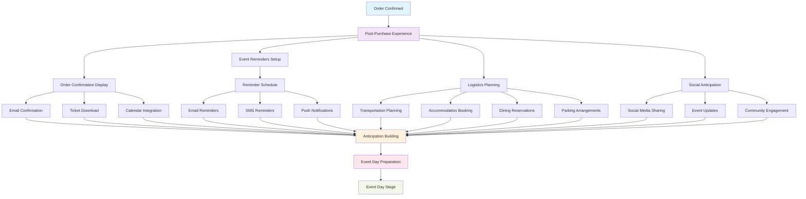

# Post-Purchase/Anticipation Stage Implementation

## 📊 **Post-Purchase/Anticipation Stage Flow Diagram**



## 🎯 **Stage Overview**
The post-purchase/anticipation stage is where customers prepare for their event and build excitement. This stage is crucial for reducing no-shows, increasing satisfaction, and building long-term customer relationships.

## 📊 **Key Metrics & Goals**
- **Primary Goal**: Keep customers engaged and excited about their upcoming event
- **Success Metrics**: Email open rates, reminder engagement, logistics completion, anticipation sentiment
- **Revenue Impact**: Higher engagement = lower no-show rates = higher customer satisfaction = repeat purchases

## 🏗️ **Technical Implementation**

### Frontend Components
```typescript
// Post-Purchase/Anticipation Stage Components
interface AnticipationStageProps {
  orderId: string;
  userId: string;
  onStageComplete: (stage: string) => void;
}

const AnticipationStage: React.FC<AnticipationStageProps> = ({ orderId, userId, onStageComplete }) => {
  return (
    <div className="anticipation-stage">
      <OrderConfirmation />
      <EventReminders />
      <LogisticsPlanning />
      <SocialAnticipation />
      <PreEventUpdates />
    </div>
  );
};
```

### Order Confirmation Component
```typescript
// Order Confirmation Display
const OrderConfirmation: React.FC<{ order: Order }> = ({ order }) => {
  return (
    <div className="order-confirmation">
      <div className="confirmation-header">
        <CheckCircleIcon className="success-icon" />
        <h2>Order Confirmed!</h2>
        <p>Your tickets have been successfully purchased</p>
      </div>
      
      <div className="order-details">
        <div className="order-info">
          <h3>Order Details</h3>
          <div className="info-row">
            <span>Order Number:</span>
            <span>{order.id}</span>
          </div>
          <div className="info-row">
            <span>Event:</span>
            <span>{order.event_title}</span>
          </div>
          <div className="info-row">
            <span>Date:</span>
            <span>{formatDate(order.event_date)}</span>
          </div>
          <div className="info-row">
            <span>Venue:</span>
            <span>{order.venue_name}</span>
          </div>
          <div className="info-row">
            <span>Total:</span>
            <span>${order.total_amount}</span>
          </div>
        </div>
        
        <div className="ticket-details">
          <h3>Your Tickets</h3>
          {order.tickets.map(ticket => (
            <div key={ticket.id} className="ticket-item">
              <div className="ticket-info">
                <span className="ticket-type">{ticket.tier_name}</span>
                <span className="ticket-seat">Seat {ticket.seat_number}</span>
              </div>
              <div className="ticket-actions">
                <button className="btn-outline">Download PDF</button>
                <button className="btn-outline">Add to Calendar</button>
              </div>
            </div>
          ))}
        </div>
      </div>
      
      <div className="next-steps">
        <h3>What's Next?</h3>
        <ul>
          <li>Check your email for confirmation details</li>
          <li>Add the event to your calendar</li>
          <li>Plan your logistics (transportation, accommodation)</li>
          <li>Share your excitement on social media</li>
        </ul>
      </div>
    </div>
  );
};
```

### Event Reminders Component
```typescript
// Event Reminders System
const EventReminders: React.FC<{ event: Event, order: Order }> = ({ event, order }) => {
  const [reminders, setReminders] = useState<Reminder[]>([]);
  const [reminderSettings, setReminderSettings] = useState<ReminderSettings>({
    email: true,
    sms: false,
    push: true,
    frequency: 'standard'
  });
  
  useEffect(() => {
    const loadReminders = async () => {
      const eventReminders = await getEventReminders(event.id);
      setReminders(eventReminders);
    };
    
    loadReminders();
  }, [event.id]);
  
  const handleReminderToggle = async (reminderId: string, enabled: boolean) => {
    await updateReminderSettings(reminderId, { enabled });
    
    setReminders(prev => prev.map(reminder => 
      reminder.id === reminderId 
        ? { ...reminder, enabled }
        : reminder
    ));
  };
  
  return (
    <div className="event-reminders">
      <h3>Event Reminders</h3>
      
      <div className="reminder-settings">
        <h4>Notification Preferences</h4>
        <div className="preference-options">
          <label className="preference-option">
            <input
              type="checkbox"
              checked={reminderSettings.email}
              onChange={(e) => setReminderSettings({
                ...reminderSettings,
                email: e.target.checked
              })}
            />
            <span>Email Reminders</span>
          </label>
          
          <label className="preference-option">
            <input
              type="checkbox"
              checked={reminderSettings.sms}
              onChange={(e) => setReminderSettings({
                ...reminderSettings,
                sms: e.target.checked
              })}
            />
            <span>SMS Reminders</span>
          </label>
          
          <label className="preference-option">
            <input
              type="checkbox"
              checked={reminderSettings.push}
              onChange={(e) => setReminderSettings({
                ...reminderSettings,
                push: e.target.checked
              })}
            />
            <span>Push Notifications</span>
          </label>
        </div>
      </div>
      
      <div className="reminder-schedule">
        <h4>Upcoming Reminders</h4>
        {reminders.map(reminder => (
          <div key={reminder.id} className="reminder-item">
            <div className="reminder-info">
              <span className="reminder-time">{formatReminderTime(reminder.scheduled_at)}</span>
              <span className="reminder-message">{reminder.message}</span>
            </div>
            <div className="reminder-actions">
              <button
                className={`toggle-btn ${reminder.enabled ? 'enabled' : 'disabled'}`}
                onClick={() => handleReminderToggle(reminder.id, !reminder.enabled)}
              >
                {reminder.enabled ? 'Enabled' : 'Disabled'}
              </button>
            </div>
          </div>
        ))}
      </div>
    </div>
  );
};
```

### Logistics Planning Component
```typescript
// Logistics Planning Assistant
const LogisticsPlanning: React.FC<{ event: Event, venue: Venue }> = ({ event, venue }) => {
  const [logistics, setLogistics] = useState<LogisticsPlan>({
    transportation: null,
    accommodation: null,
    dining: null,
    parking: null
  });
  
  const [recommendations, setRecommendations] = useState<LogisticsRecommendations | null>(null);
  
  useEffect(() => {
    const loadRecommendations = async () => {
      const recs = await getLogisticsRecommendations(venue.id, event.date);
      setRecommendations(recs);
    };
    
    loadRecommendations();
  }, [venue.id, event.date]);
  
  return (
    <div className="logistics-planning">
      <h3>Plan Your Visit</h3>
      
      <div className="logistics-sections">
        <div className="logistics-section">
          <h4>Transportation</h4>
          <div className="transportation-options">
            {recommendations?.transportation.map(option => (
              <div key={option.id} className="transportation-option">
                <div className="option-info">
                  <span className="option-name">{option.name}</span>
                  <span className="option-details">{option.details}</span>
                  <span className="option-price">{option.price}</span>
                </div>
                <button className="btn-outline">Select</button>
              </div>
            ))}
          </div>
        </div>
        
        <div className="logistics-section">
          <h4>Accommodation</h4>
          <div className="accommodation-options">
            {recommendations?.accommodation.map(hotel => (
              <div key={hotel.id} className="accommodation-option">
                <div className="hotel-info">
                  <span className="hotel-name">{hotel.name}</span>
                  <span className="hotel-distance">{hotel.distance} from venue</span>
                  <span className="hotel-price">${hotel.price}/night</span>
                </div>
                <button className="btn-outline">Book</button>
              </div>
            ))}
          </div>
        </div>
        
        <div className="logistics-section">
          <h4>Dining</h4>
          <div className="dining-options">
            {recommendations?.dining.map(restaurant => (
              <div key={restaurant.id} className="dining-option">
                <div className="restaurant-info">
                  <span className="restaurant-name">{restaurant.name}</span>
                  <span className="restaurant-cuisine">{restaurant.cuisine}</span>
                  <span className="restaurant-distance">{restaurant.distance} from venue</span>
                </div>
                <button className="btn-outline">Reserve</button>
              </div>
            ))}
          </div>
        </div>
        
        <div className="logistics-section">
          <h4>Parking</h4>
          <div className="parking-options">
            {recommendations?.parking.map(lot => (
              <div key={lot.id} className="parking-option">
                <div className="lot-info">
                  <span className="lot-name">{lot.name}</span>
                  <span className="lot-capacity">{lot.capacity} spaces</span>
                  <span className="lot-price">${lot.price}</span>
                </div>
                <button className="btn-outline">Reserve</button>
              </div>
            ))}
          </div>
        </div>
      </div>
    </div>
  );
};
```

### Social Anticipation Component
```typescript
// Social Anticipation Features
const SocialAnticipation: React.FC<{ event: Event }> = ({ event }) => {
  const [socialContent, setSocialContent] = useState<SocialContent[]>([]);
  const [userPosts, setUserPosts] = useState<SocialPost[]>([]);
  
  useEffect(() => {
    const loadSocialContent = async () => {
      const content = await getEventSocialContent(event.id);
      setSocialContent(content);
      
      const posts = await getUserSocialPosts(event.id);
      setUserPosts(posts);
    };
    
    loadSocialContent();
  }, [event.id]);
  
  const shareExcitement = async (platform: string) => {
    const shareData = {
      event: event,
      message: `I'm excited to attend ${event.title} on ${formatDate(event.start_date)}!`,
      platform: platform
    };
    
    await shareToSocialMedia(shareData);
  };
  
  return (
    <div className="social-anticipation">
      <h3>Share Your Excitement</h3>
      
      <div className="social-sharing">
        <h4>Share on Social Media</h4>
        <div className="sharing-buttons">
          <button 
            className="share-btn facebook"
            onClick={() => shareExcitement('facebook')}
          >
            <FacebookIcon />
            Share on Facebook
          </button>
          
          <button 
            className="share-btn twitter"
            onClick={() => shareExcitement('twitter')}
          >
            <TwitterIcon />
            Share on Twitter
          </button>
          
          <button 
            className="share-btn instagram"
            onClick={() => shareExcitement('instagram')}
          >
            <InstagramIcon />
            Share on Instagram
          </button>
        </div>
      </div>
      
      <div className="social-content">
        <h4>Event Updates & Content</h4>
        <div className="content-feed">
          {socialContent.map(content => (
            <div key={content.id} className="content-item">
              <div className="content-header">
                
                <div className="author-info">
                  <span className="author-name">{content.author.name}</span>
                  <span className="content-time">{formatTime(content.created_at)}</span>
                </div>
              </div>
              <div className="content-body">
                <p>{content.text}</p>
                {content.image && }
              </div>
              <div className="content-actions">
                <button className="action-btn">
                  <LikeIcon />
                  {content.likes}
                </button>
                <button className="action-btn">
                  <CommentIcon />
                  {content.comments}
                </button>
                <button className="action-btn">
                  <ShareIcon />
                  Share
                </button>
              </div>
            </div>
          ))}
        </div>
      </div>
    </div>
  );
};
```

## 🔧 **Backend Implementation**

### Reminder System Service
```typescript
// Automated Reminder System
export class ReminderSystemService {
  async scheduleEventReminders(orderId: string, eventDate: Date): Promise<void> {
    const reminders = [
      {
        orderId,
        type: 'purchase_confirmation',
        scheduledAt: new Date(), // Immediate
        message: 'Thank you for your purchase! Your tickets are confirmed.',
        channel: 'email'
      },
      {
        orderId,
        type: 'week_before',
        scheduledAt: new Date(eventDate.getTime() - 7 * 24 * 60 * 60 * 1000),
        message: 'Your event is in one week! Start planning your visit.',
        channel: 'email'
      },
      {
        orderId,
        type: 'day_before',
        scheduledAt: new Date(eventDate.getTime() - 24 * 60 * 60 * 1000),
        message: 'Your event is tomorrow! Don\'t forget to bring your tickets.',
        channel: 'email'
      },
      {
        orderId,
        type: 'day_of',
        scheduledAt: new Date(eventDate.getTime() - 2 * 60 * 60 * 1000), // 2 hours before
        message: 'Your event is today! See you there!',
        channel: 'sms'
      }
    ];
    
    for (const reminder of reminders) {
      await this.scheduleReminder(reminder);
    }
  }
  
  async sendReminder(reminderId: string): Promise<void> {
    const reminder = await this.getReminder(reminderId);
    if (!reminder) return;
    
    switch (reminder.channel) {
      case 'email':
        await this.sendEmailReminder(reminder);
        break;
      case 'sms':
        await this.sendSMSReminder(reminder);
        break;
      case 'push':
        await this.sendPushReminder(reminder);
        break;
    }
    
    await this.markReminderSent(reminderId);
  }
}
```

### Logistics Recommendation Service
```typescript
// Logistics Recommendation Engine
export class LogisticsRecommendationService {
  async getLogisticsRecommendations(venueId: string, eventDate: Date): Promise<LogisticsRecommendations> {
    const venue = await this.getVenue(venueId);
    const eventTime = eventDate.getHours();
    
    // Get recommendations based on venue location and event time
    const recommendations = {
      transportation: await this.getTransportationRecommendations(venue),
      accommodation: await this.getAccommodationRecommendations(venue),
      dining: await this.getDiningRecommendations(venue, eventTime),
      parking: await this.getParkingRecommendations(venue)
    };
    
    return recommendations;
  }
  
  private async getTransportationRecommendations(venue: Venue): Promise<TransportationOption[]> {
    // Get public transportation options
    const publicTransport = await this.getPublicTransportOptions(venue);
    
    // Get ride-sharing options
    const rideSharing = await this.getRideSharingOptions(venue);
    
    // Get parking options for those driving
    const parking = await this.getParkingOptions(venue);
    
    return [...publicTransport, ...rideSharing, ...parking];
  }
  
  private async getAccommodationRecommendations(venue: Venue): Promise<AccommodationOption[]> {
    // Get hotels within 5 miles of venue
    const hotels = await this.getNearbyHotels(venue, 5);
    
    // Filter by availability and price range
    const availableHotels = await this.filterAvailableHotels(hotels);
    
    return availableHotels;
  }
}
```

## 📊 **Success Metrics**

### Key Performance Indicators
- **Email Open Rate**: % of reminder emails opened
- **Reminder Engagement**: % of users who interact with reminders
- **Logistics Completion**: % of users who complete logistics planning
- **Social Sharing Rate**: % of users who share on social media

### Revenue Metrics
- **No-Show Rate**: % of ticket holders who don't attend
- **Customer Satisfaction**: Post-event satisfaction scores
- **Repeat Purchase Rate**: % of customers who purchase again
- **Referral Rate**: % of customers who refer others

## 🚀 **Implementation Checklist**

- [ ] **Order Confirmation**: Success page and email confirmation
- [ ] **Reminder System**: Automated email and SMS reminders
- [ ] **Logistics Planning**: Transportation, accommodation, dining recommendations
- [ ] **Social Features**: Social sharing and anticipation content
- [ ] **Calendar Integration**: Add to calendar functionality
- [ ] **Mobile Optimization**: Mobile-friendly anticipation experience
- [ ] **Analytics Tracking**: User engagement and behavior metrics
- [ ] **Personalization**: AI-powered recommendations and content

---

*The post-purchase/anticipation stage is crucial for customer satisfaction and retention. Keeping customers engaged and excited leads to higher attendance rates and repeat purchases.*
