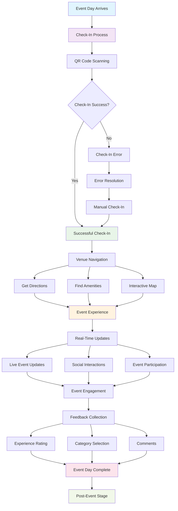

# Event Day Experience Stage Implementation

## 📊 **Event Day Experience Stage Flow Diagram**



## 🎯 **Stage Overview**
The event day experience stage is where customers attend the event and have their actual experience. This stage is critical for ensuring a smooth, enjoyable experience that leads to positive reviews and repeat attendance.

## 📊 **Key Metrics & Goals**
- **Primary Goal**: Provide seamless event day experience and maximize satisfaction
- **Success Metrics**: Check-in success rate, venue navigation success, real-time engagement, satisfaction scores
- **Revenue Impact**: Positive experience = higher satisfaction = better reviews = more future sales

## 🏗️ **Technical Implementation**

### Frontend Components
```typescript
// Event Day Experience Components
interface ExperienceStageProps {
  eventId: string;
  userId: string;
  onStageComplete: (stage: string) => void;
}

const ExperienceStage: React.FC<ExperienceStageProps> = ({ eventId, userId, onStageComplete }) => {
  return (
    <div className="experience-stage">
      <CheckInInterface />
      <VenueNavigation />
      <RealTimeUpdates />
      <EventInteraction />
      <FeedbackCollection />
    </div>
  );
};
```

### Check-In Interface Component
```typescript
// Digital Check-In System
const CheckInInterface: React.FC<{ order: Order }> = ({ order }) => {
  const [checkInStatus, setCheckInStatus] = useState<'pending' | 'success' | 'error'>('pending');
  const [qrCode, setQRCode] = useState<string>('');
  
  useEffect(() => {
    const generateQRCode = async () => {
      const qr = await generateTicketQRCode(order.id);
      setQRCode(qr);
    };
    
    generateQRCode();
  }, [order.id]);
  
  const handleCheckIn = async () => {
    try {
      setCheckInStatus('pending');
      
      const result = await processCheckIn({
        orderId: order.id,
        userId: order.customer_id,
        timestamp: new Date()
      });
      
      if (result.success) {
        setCheckInStatus('success');
        await trackJourneyStage('experience', 'check_in_success', {
          orderId: order.id,
          userId: order.customer_id
        });
      } else {
        setCheckInStatus('error');
      }
    } catch (error) {
      setCheckInStatus('error');
    }
  };
  
  return (
    <div className="check-in-interface">
      <div className="check-in-header">
        <h3>Event Check-In</h3>
        <p>Show your QR code at the venue entrance</p>
      </div>
      
      <div className="qr-code-section">
        <div className="qr-code-container">
          <QRCode value={qrCode} size={200} />
        </div>
        <p className="qr-instructions">
          Present this QR code to venue staff for check-in
        </p>
      </div>
      
      <div className="check-in-status">
        {checkInStatus === 'pending' && (
          <div className="status-pending">
            <Spinner />
            <span>Waiting for check-in...</span>
          </div>
        )}
        
        {checkInStatus === 'success' && (
          <div className="status-success">
            <CheckCircleIcon />
            <span>Successfully checked in!</span>
          </div>
        )}
        
        {checkInStatus === 'error' && (
          <div className="status-error">
            <AlertCircleIcon />
            <span>Check-in failed. Please contact venue staff.</span>
          </div>
        )}
      </div>
      
      <div className="ticket-details">
        <h4>Your Tickets</h4>
        {order.tickets.map(ticket => (
          <div key={ticket.id} className="ticket-item">
            <span className="ticket-type">{ticket.tier_name}</span>
            <span className="ticket-seat">Seat {ticket.seat_number}</span>
          </div>
        ))}
      </div>
    </div>
  );
};
```

### Venue Navigation Component
```typescript
// Interactive Venue Navigation
const VenueNavigation: React.FC<{ venue: Venue }> = ({ venue }) => {
  const [userLocation, setUserLocation] = useState<Location | null>(null);
  const [navigationRoute, setNavigationRoute] = useState<NavigationRoute | null>(null);
  const [venueMap, setVenueMap] = useState<VenueMap | null>(null);
  
  useEffect(() => {
    const loadVenueMap = async () => {
      const map = await getVenueMap(venue.id);
      setVenueMap(map);
    };
    
    loadVenueMap();
  }, [venue.id]);
  
  const handleGetDirections = async () => {
    if (!userLocation) {
      const location = await getUserLocation();
      setUserLocation(location);
    }
    
    const route = await getNavigationRoute(userLocation!, venue.coordinates);
    setNavigationRoute(route);
  };
  
  return (
    <div className="venue-navigation">
      <h3>Venue Navigation</h3>
      
      <div className="navigation-options">
        <button 
          className="nav-btn"
          onClick={handleGetDirections}
        >
          <NavigationIcon />
          Get Directions
        </button>
        
        <button className="nav-btn">
          <ParkingIcon />
          Find Parking
        </button>
        
        <button className="nav-btn">
          <RestroomIcon />
          Find Restrooms
        </button>
        
        <button className="nav-btn">
          <FoodIcon />
          Find Food & Drinks
        </button>
      </div>
      
      {navigationRoute && (
        <div className="navigation-route">
          <h4>Directions to Venue</h4>
          <div className="route-info">
            <span className="route-distance">{navigationRoute.distance}</span>
            <span className="route-duration">{navigationRoute.duration}</span>
          </div>
          <div className="route-steps">
            {navigationRoute.steps.map((step, index) => (
              <div key={index} className="route-step">
                <span className="step-number">{index + 1}</span>
                <span className="step-instruction">{step.instruction}</span>
              </div>
            ))}
          </div>
        </div>
      )}
      
      {venueMap && (
        <div className="venue-map">
          <h4>Venue Map</h4>
          <div className="map-container">
            <VenueMapComponent 
              map={venueMap}
              userLocation={userLocation}
              onLocationSelect={(location) => setSelectedLocation(location)}
            />
          </div>
        </div>
      )}
    </div>
  );
};
```

### Real-Time Updates Component
```typescript
// Real-Time Event Updates
const RealTimeUpdates: React.FC<{ event: Event }> = ({ event }) => {
  const [updates, setUpdates] = useState<EventUpdate[]>([]);
  const [isConnected, setIsConnected] = useState<boolean>(false);
  
  useEffect(() => {
    const connectToUpdates = async () => {
      const socket = new WebSocket(`wss://api.eventos.com/events/${event.id}/updates`);
      
      socket.onopen = () => {
        setIsConnected(true);
      };
      
      socket.onmessage = (event) => {
        const update = JSON.parse(event.data);
        setUpdates(prev => [update, ...prev]);
      };
      
      socket.onclose = () => {
        setIsConnected(false);
      };
      
      return () => socket.close();
    };
    
    connectToUpdates();
  }, [event.id]);
  
  return (
    <div className="real-time-updates">
      <div className="updates-header">
        <h3>Live Event Updates</h3>
        <div className={`connection-status ${isConnected ? 'connected' : 'disconnected'}`}>
          <div className="status-indicator"></div>
          <span>{isConnected ? 'Connected' : 'Disconnected'}</span>
        </div>
      </div>
      
      <div className="updates-feed">
        {updates.map(update => (
          <div key={update.id} className="update-item">
            <div className="update-header">
              <span className="update-time">{formatTime(update.timestamp)}</span>
              <span className="update-type">{update.type}</span>
            </div>
            <div className="update-content">
              <p>{update.message}</p>
              {update.image && }
            </div>
          </div>
        ))}
      </div>
    </div>
  );
};
```

### Event Interaction Component
```typescript
// Event Interaction Features
const EventInteraction: React.FC<{ event: Event }> = ({ event }) => {
  const [interactions, setInteractions] = useState<EventInteraction[]>([]);
  const [userInteractions, setUserInteractions] = useState<UserInteraction[]>([]);
  
  useEffect(() => {
    const loadInteractions = async () => {
      const eventInteractions = await getEventInteractions(event.id);
      setInteractions(eventInteractions);
      
      const userInteractions = await getUserInteractions(event.id);
      setUserInteractions(userInteractions);
    };
    
    loadInteractions();
  }, [event.id]);
  
  const handleInteraction = async (interactionType: string, data: any) => {
    const interaction = {
      eventId: event.id,
      type: interactionType,
      data: data,
      timestamp: new Date()
    };
    
    await createUserInteraction(interaction);
    setUserInteractions(prev => [interaction, ...prev]);
  };
  
  return (
    <div className="event-interaction">
      <h3>Event Interaction</h3>
      
      <div className="interaction-options">
        <button 
          className="interaction-btn"
          onClick={() => handleInteraction('photo_share', { type: 'event_photo' })}
        >
          <CameraIcon />
          Share Photo
        </button>
        
        <button 
          className="interaction-btn"
          onClick={() => handleInteraction('live_reaction', { type: 'applause' })}
        >
          <ClapIcon />
          Live Reaction
        </button>
        
        <button 
          className="interaction-btn"
          onClick={() => handleInteraction('poll_vote', { pollId: 'current_poll' })}
        >
          <PollIcon />
          Vote in Poll
        </button>
        
        <button 
          className="interaction-btn"
          onClick={() => handleInteraction('social_share', { platform: 'twitter' })}
        >
          <ShareIcon />
          Share Experience
        </button>
      </div>
      
      <div className="interaction-feed">
        <h4>Live Interactions</h4>
        {interactions.map(interaction => (
          <div key={interaction.id} className="interaction-item">
            <div className="interaction-header">
              
              <span className="user-name">{interaction.user.name}</span>
              <span className="interaction-time">{formatTime(interaction.timestamp)}</span>
            </div>
            <div className="interaction-content">
              <p>{interaction.message}</p>
              {interaction.image && }
            </div>
            <div className="interaction-actions">
              <button className="action-btn">
                <LikeIcon />
                {interaction.likes}
              </button>
              <button className="action-btn">
                <CommentIcon />
                {interaction.comments}
              </button>
            </div>
          </div>
        ))}
      </div>
    </div>
  );
};
```

### Feedback Collection Component
```typescript
// Real-Time Feedback Collection
const FeedbackCollection: React.FC<{ event: Event }> = ({ event }) => {
  const [feedback, setFeedback] = useState<FeedbackData>({
    rating: 0,
    comments: '',
    categories: []
  });
  
  const [isSubmitting, setIsSubmitting] = useState<boolean>(false);
  
  const handleRatingChange = (rating: number) => {
    setFeedback(prev => ({ ...prev, rating }));
  };
  
  const handleCategoryToggle = (category: string) => {
    setFeedback(prev => ({
      ...prev,
      categories: prev.categories.includes(category)
        ? prev.categories.filter(c => c !== category)
        : [...prev.categories, category]
    }));
  };
  
  const handleSubmitFeedback = async () => {
    setIsSubmitting(true);
    
    try {
      await submitEventFeedback({
        eventId: event.id,
        feedback: feedback,
        timestamp: new Date()
      });
      
      await trackJourneyStage('experience', 'feedback_submitted', {
        eventId: event.id,
        rating: feedback.rating
      });
      
      // Show success message
      alert('Thank you for your feedback!');
    } catch (error) {
      alert('Failed to submit feedback. Please try again.');
    } finally {
      setIsSubmitting(false);
    }
  };
  
  return (
    <div className="feedback-collection">
      <h3>Share Your Experience</h3>
      
      <div className="rating-section">
        <h4>Rate Your Experience</h4>
        <div className="rating-stars">
          {[1, 2, 3, 4, 5].map(star => (
            <button
              key={star}
              className={`star-btn ${star <= feedback.rating ? 'active' : ''}`}
              onClick={() => handleRatingChange(star)}
            >
              <StarIcon />
            </button>
          ))}
        </div>
      </div>
      
      <div className="categories-section">
        <h4>What did you enjoy most?</h4>
        <div className="category-options">
          {['Music', 'Venue', 'Staff', 'Food', 'Atmosphere', 'Value'].map(category => (
            <label key={category} className="category-option">
              <input
                type="checkbox"
                checked={feedback.categories.includes(category)}
                onChange={() => handleCategoryToggle(category)}
              />
              <span>{category}</span>
            </label>
          ))}
        </div>
      </div>
      
      <div className="comments-section">
        <h4>Additional Comments</h4>
        <textarea
          value={feedback.comments}
          onChange={(e) => setFeedback(prev => ({ ...prev, comments: e.target.value }))}
          placeholder="Tell us about your experience..."
          rows={4}
        />
      </div>
      
      <button 
        className="submit-feedback-btn"
        onClick={handleSubmitFeedback}
        disabled={isSubmitting}
      >
        {isSubmitting ? 'Submitting...' : 'Submit Feedback'}
      </button>
    </div>
  );
};
```

## 🔧 **Backend Implementation**

### Check-In Processing Service
```typescript
// Check-In Processing Service
export class CheckInProcessingService {
  async processCheckIn(checkInData: CheckInRequest): Promise<CheckInResult> {
    try {
      // Validate ticket
      const ticket = await this.validateTicket(checkInData.orderId);
      if (!ticket) {
        throw new Error('Invalid ticket');
      }
      
      // Check if already checked in
      const existingCheckIn = await this.getExistingCheckIn(checkInData.orderId);
      if (existingCheckIn) {
        throw new Error('Already checked in');
      }
      
      // Process check-in
      const checkIn = await this.createCheckIn({
        orderId: checkInData.orderId,
        userId: checkInData.userId,
        timestamp: checkInData.timestamp,
        status: 'completed'
      });
      
      // Update attendance count
      await this.updateAttendanceCount(checkInData.eventId);
      
      // Send confirmation
      await this.sendCheckInConfirmation(checkIn);
      
      return {
        success: true,
        checkInId: checkIn.id,
        timestamp: checkIn.timestamp
      };
    } catch (error) {
      return {
        success: false,
        error: error.message
      };
    }
  }
  
  private async validateTicket(orderId: string): Promise<boolean> {
    const order = await this.getOrder(orderId);
    return order && order.status === 'confirmed';
  }
}
```

### Real-Time Updates Service
```typescript
// Real-Time Updates Service
export class RealTimeUpdatesService {
  private connections: Map<string, WebSocket> = new Map();
  
  async broadcastUpdate(eventId: string, update: EventUpdate): Promise<void> {
    const connections = this.getEventConnections(eventId);
    
    for (const connection of connections) {
      try {
        connection.send(JSON.stringify(update));
      } catch (error) {
        // Remove failed connection
        this.removeConnection(connection);
      }
    }
  }
  
  async createEventUpdate(eventId: string, updateData: CreateUpdateRequest): Promise<EventUpdate> {
    const update = {
      id: generateId(),
      eventId,
      type: updateData.type,
      message: updateData.message,
      image: updateData.image,
      timestamp: new Date(),
      author: updateData.author
    };
    
    // Save to database
    await supabase
      .from('event_updates')
      .insert(update);
    
    // Broadcast to connected clients
    await this.broadcastUpdate(eventId, update);
    
    return update;
  }
}
```

## 📊 **Success Metrics**

### Key Performance Indicators
- **Check-In Success Rate**: % of successful check-ins
- **Navigation Usage**: % of users who use venue navigation
- **Real-Time Engagement**: % of users who interact with live updates
- **Feedback Submission Rate**: % of users who submit feedback

### Revenue Metrics
- **Event Satisfaction Score**: Average satisfaction rating
- **Repeat Attendance Rate**: % of satisfied customers who attend again
- **Referral Rate**: % of satisfied customers who refer others
- **Social Sharing Rate**: % of users who share their experience

## 🚀 **Implementation Checklist**

- [ ] **Check-In System**: QR code scanning and validation
- [ ] **Venue Navigation**: Interactive maps and directions
- [ ] **Real-Time Updates**: Live event updates and notifications
- [ ] **Event Interaction**: Photo sharing, reactions, polls
- [ ] **Feedback Collection**: Real-time feedback and ratings
- [ ] **Mobile Optimization**: Touch-friendly experience
- [ ] **Offline Support**: Basic functionality without internet
- [ ] **Analytics Tracking**: User behavior and engagement metrics

---

*The event day experience stage is where the magic happens. A smooth, enjoyable experience leads to positive reviews, repeat attendance, and increased revenue.*
