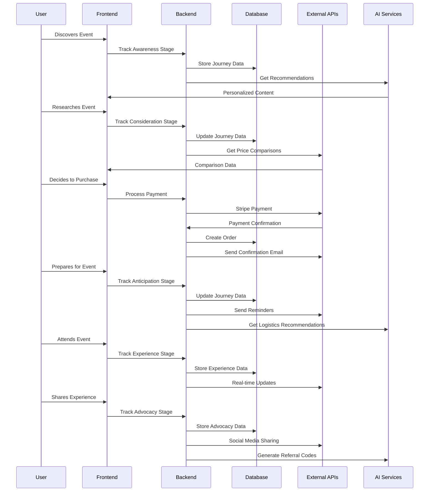
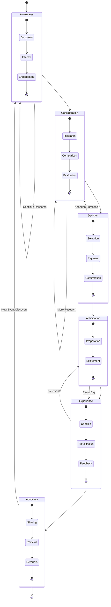
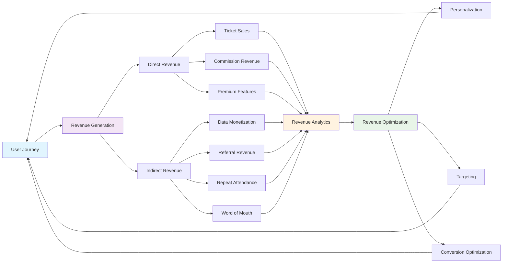
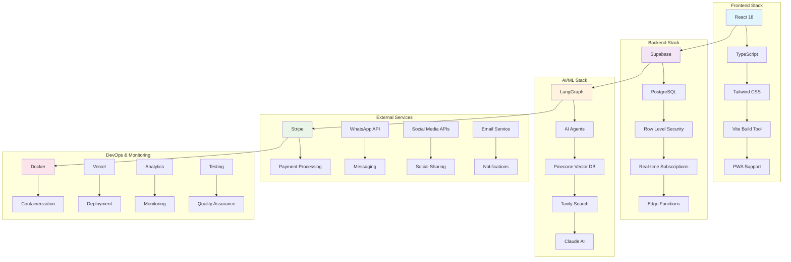
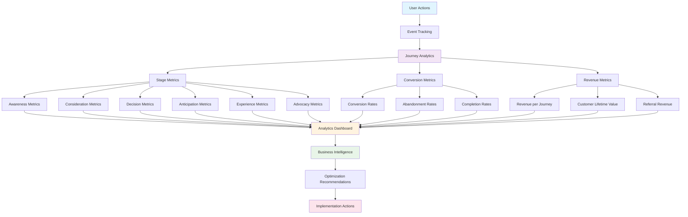
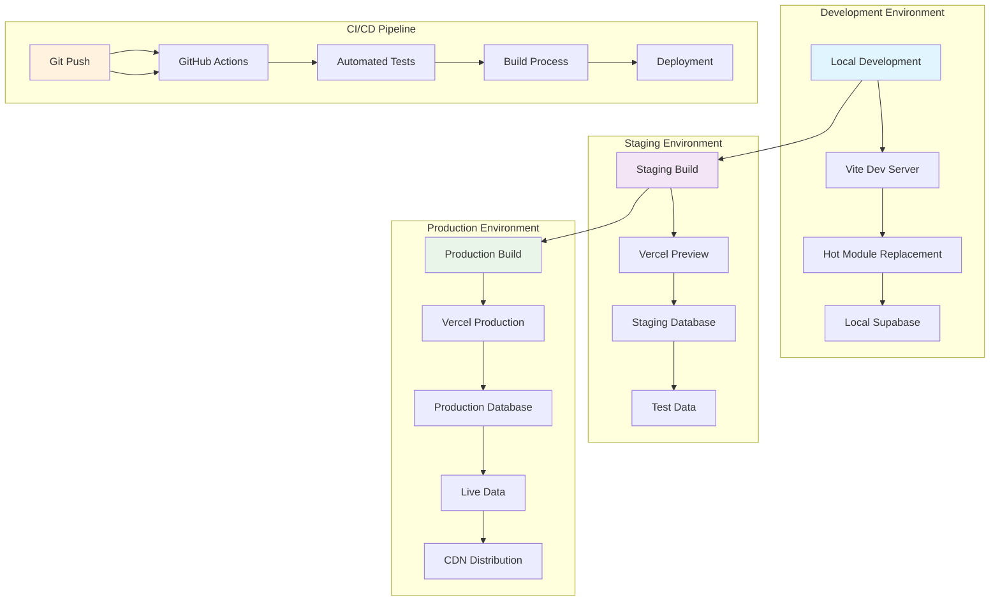

# Complete Event Journey Architecture Diagram

## 🏗️ **System Architecture Overview**

```mermaid
graph TB
    subgraph "Frontend Layer"
        A[React App] --> B[Event Journey Components]
        B --> C[Awareness Stage]
        B --> D[Consideration Stage]
        B --> E[Decision Stage]
        B --> F[Anticipation Stage]
        B --> G[Experience Stage]
        B --> H[Advocacy Stage]
    end
    
    subgraph "Backend Services"
        I[Journey Tracking Service] --> J[Analytics Service]
        K[Personalization Engine] --> L[Recommendation Service]
        M[Communication Service] --> N[Notification Service]
        O[Payment Service] --> P[Order Management]
    end
    
    subgraph "Database Layer"
        Q[Supabase PostgreSQL] --> R[Journey Data]
        Q --> S[Event Data]
        Q --> T[User Data]
        Q --> U[Analytics Data]
    end
    
    subgraph "External Integrations"
        V[Stripe Payment] --> W[Payment Processing]
        X[WhatsApp API] --> Y[Messaging]
        Z[Social Media APIs] --> AA[Social Sharing]
        BB[Email Service] --> CC[Email Notifications]
    end
    
    subgraph "AI/ML Services"
        DD[LangGraph Agents] --> EE[AI Recommendations]
        FF[Pinecone Vector DB] --> GG[Semantic Search]
        HH[Tavily Search] --> II[Real-time Research]
    end
    
    A --> I
    A --> K
    A --> M
    A --> O
    
    I --> Q
    K --> Q
    M --> Q
    O --> Q
    
    O --> V
    M --> X
    A --> Z
    M --> BB
    
    K --> DD
    K --> FF
    K --> HH
    
    style A fill:#e1f5fe
    style I fill:#f3e5f5
    style Q fill:#fff3e0
    style V fill:#e8f5e8
    style DD fill:#fce4ec
```

## 📊 **Data Flow Architecture**

## 🔄 **Journey State Management**

## 🎯 **Revenue Flow Architecture**

## 🔧 **Technical Implementation Stack**

## 📊 **Analytics & Metrics Architecture**

## 🚀 **Deployment Architecture**

---

*This comprehensive architecture diagram shows the complete technical implementation of the event journey system, from frontend components to backend services, AI integration, and deployment strategies.*
