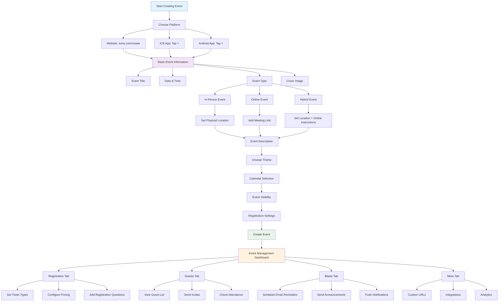

# Event Creation Process - Simple Overview

## How Event Creation Works

Based on the [Luma platform](https://help.luma.com/p/creating-an-event), creating an event is designed to be quick and simple, but powerful enough to handle complex needs.

## Event Creation Flow

## Key Features from Luma Platform

### **Simple Event Creation**
- **Quick Setup**: Fill in basic information and create instantly
- **Multiple Platforms**: Website, iOS app, Android app
- **Auto Calendar**: Events automatically added to your calendar

### **Event Types Supported**
- **In-Person**: Physical gatherings at specific locations
- **Online**: Virtual events via Zoom, Google Meet, etc.
- **Hybrid**: Both physical and online attendance options

### **Registration & Ticketing**
- **Multiple Ticket Types**: Different prices and descriptions
- **Flexible Pricing**: Suggested price + minimum, donation-based
- **Transparent Pricing**: No surprise fees at checkout
- **Require Approval**: Review registrations before charging

### **Communication Features**
- **Event Blasts**: Send updates via email, SMS, and push notifications
- **Guest Management**: View guest list, send invites, check attendance
- **Calendar Integration**: Sync with Google, Apple, Outlook calendars

## Integration with Event Journey System

### **Awareness Stage**
- **Event Discovery**: Public events appear on calendars and search engines
- **Social Sharing**: Easy sharing of event links
- **SEO Optimization**: Events can be indexed by search engines

### **Consideration Stage**
- **Event Details**: Comprehensive event information and descriptions
- **Pricing Transparency**: Clear pricing with no hidden fees
- **Registration Questions**: Gather guest information during signup

### **Decision/Purchase Stage**
- **Ticket Selection**: Multiple ticket types with different prices
- **Payment Processing**: Integrated with Stripe for secure payments
- **Order Confirmation**: Automatic confirmation and calendar invites

### **Post-Purchase/Anticipation Stage**
- **Event Blasts**: Automated reminders and updates
- **Calendar Integration**: Events automatically added to guest calendars
- **Guest Management**: Track attendance and send updates

### **Event Day Experience Stage**
- **Check-in Process**: Track attendance for in-person events
- **Online Events**: Unique join links for virtual attendance
- **Hybrid Support**: Both physical and online attendance options

### **Post-Event/Advocacy Stage**
- **Guest Feedback**: Collect feedback through registration questions
- **Social Sharing**: Easy sharing of event experiences
- **Repeat Attendance**: Build relationships for future events

## Best Practices from Luma

### **Event Setup**
- **High-Quality Images**: Use compelling cover images
- **Clear Titles**: Descriptive titles that tell guests what to expect
- **Early Setup**: Create events early to give guests time to plan
- **Regular Updates**: Keep event information current

### **Guest Experience**
- **Transparent Pricing**: Show full price upfront, no surprise fees
- **Multiple Communication**: Email, SMS, and push notifications
- **Easy Registration**: Simple signup process
- **Calendar Integration**: Automatic calendar invites

### **Event Management**
- **Team Collaboration**: Add co-hosts and managers
- **Capacity Management**: Set limits and waitlists
- **Communication Tools**: Schedule blasts and announcements
- **Analytics**: Track attendance and engagement

## Revenue Optimization

### **Pricing Strategy**
- **Transparent Fees**: Build platform fees into ticket prices
- **Multiple Ticket Types**: Offer different price points
- **Donation Options**: Flexible pricing for community events
- **Approval Process**: Control access for exclusive events

### **Guest Engagement**
- **Registration Questions**: Gather valuable guest information
- **Communication Tools**: Keep guests engaged with updates
- **Social Features**: Easy sharing and promotion
- **Repeat Attendance**: Build relationships for future events

## Implementation in Our System

### **Phase 1: Basic Event Creation**
- Implement core event creation features
- Add support for in-person, online, and hybrid events
- Integrate with calendar systems
- Set up basic registration and ticketing

### **Phase 2: Advanced Features**
- Add event blasts and communication tools
- Implement guest management and check-in
- Add analytics and reporting
- Integrate with social media platforms

### **Phase 3: Optimization**
- Add AI-powered recommendations
- Implement advanced pricing strategies
- Add referral and loyalty programs
- Optimize based on user behavior data

---

*This event creation process, inspired by [Luma's platform](https://help.luma.com/p/creating-an-event), provides a solid foundation for our comprehensive event journey system while keeping the creation process simple and user-friendly.*
