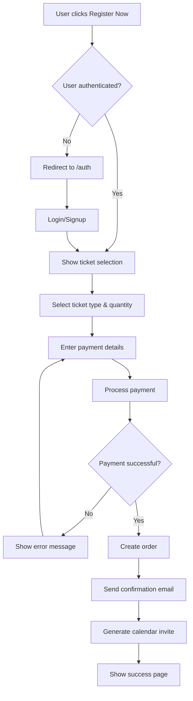
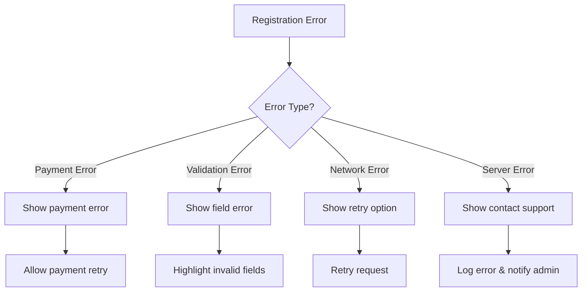
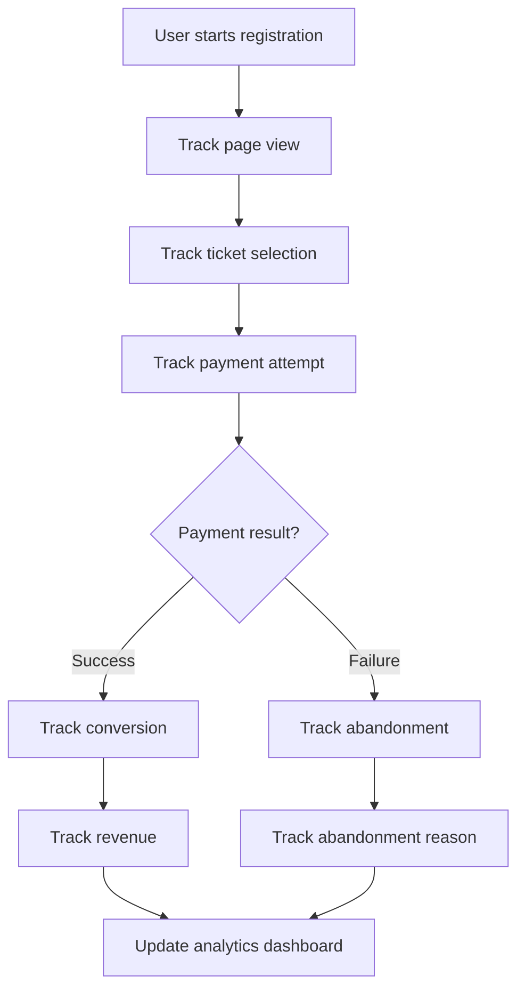

# Event Registration Flow - Complete Development Plan

## 🎯 **Plan Overview**

This document outlines the complete development plan for the EventOS registration flow, from core components to advanced features, following Vite + React + Supabase best practices.

## 📋 **Core Components (Phase 1)**

### **1. EventRegistration Page**
**Purpose:** Main registration interface
**Components:**
- Ticket selection interface
- User information form
- Payment integration
- Order summary

### **2. TicketSelector Component**
**Purpose:** Handle ticket type selection and pricing
**Features:**
- Multiple ticket tiers
- Quantity selection
- Add-ons and extras
- Real-time price calculation

### **3. PaymentForm Component**
**Purpose:** Secure payment processing
**Features:**
- Stripe integration
- Form validation
- Error handling
- Loading states

### **4. OrderConfirmation Page**
**Purpose:** Success confirmation and next steps
**Features:**
- Order summary
- Calendar invite
- Email confirmation
- Event details

## 🚀 **Advanced Features (Phase 2)**

### **1. Analytics Integration**
- Registration funnel tracking
- Conversion rate monitoring
- Abandonment analysis
- Revenue metrics

### **2. Email Notifications**
- Order confirmation emails
- Event reminders
- Calendar invites
- Post-event follow-up

### **3. Calendar Integration**
- Google Calendar invites
- Outlook integration
- iCal downloads
- Time zone handling

### **4. Order Management**
- Order tracking
- Refund processing
- Cancellation handling
- Transfer tickets

## 📊 **Implementation Order**

### **Phase 1: Foundation (Weeks 1-2)**
1. **Week 1: Core Structure**
   - Create EventRegistration page
   - Implement basic routing
   - Add authentication checks
   - Create ticket selection interface

2. **Week 2: Payment Integration**
   - Integrate Stripe payment processing
   - Add payment form validation
   - Implement order processing
   - Create order confirmation page

### **Phase 2: Enhancement (Weeks 3-4)**
3. **Week 3: Advanced Features**
   - Add email notifications
   - Implement calendar integration
   - Add order management
   - Create analytics tracking

4. **Week 4: Optimization**
   - Performance optimization
   - Error handling improvements
   - User experience enhancements
   - Testing and bug fixes

## 🛠️ **Development Tasks**

### **Core Tasks**
- [ ] Create EventRegistration page structure
- [ ] Implement ticket selection logic
- [ ] Add Stripe payment integration
- [ ] Create order confirmation flow
- [ ] Add authentication integration
- [ ] Implement form validation
- [ ] Add loading states and error handling
- [ ] Create responsive design

### **Advanced Tasks**
- [ ] Add analytics tracking
- [ ] Implement email notifications
- [ ] Add calendar integration
- [ ] Create order management system
- [ ] Add refund processing
- [ ] Implement ticket transfers
- [ ] Add multi-language support
- [ ] Create admin dashboard

## 🏗️ **Vite + React + Supabase Best Practices**

### **Vite Configuration**
```typescript
// vite.config.ts
export default defineConfig({
  plugins: [react()],
  resolve: {
    alias: {
      '@': path.resolve(__dirname, './src'),
    },
  },
  server: {
    proxy: {
      '/api': 'http://localhost:54321',
    },
  },
})
```

### **React Best Practices**
- Use TypeScript for type safety
- Implement proper error boundaries
- Use React Query for data fetching
- Follow component composition patterns
- Implement proper loading states

### **Supabase Integration**
- Use Row Level Security (RLS) for data protection
- Implement proper authentication flows
- Use Supabase real-time subscriptions
- Follow database design best practices
- Implement proper error handling

## 📈 **Success Criteria**

### **Technical Success Criteria**
- [ ] Registration flow completes in < 3 minutes
- [ ] Payment processing success rate > 95%
- [ ] Page load times < 2 seconds
- [ ] Mobile responsiveness 100%
- [ ] Error rate < 1%

### **Business Success Criteria**
- [ ] Conversion rate > 15%
- [ ] Abandonment rate < 30%
- [ ] Average order value > $50
- [ ] Customer satisfaction > 4.5/5
- [ ] Revenue per event > $5,000

### **User Experience Success Criteria**
- [ ] Intuitive navigation flow
- [ ] Clear pricing display
- [ ] Secure payment process
- [ ] Immediate confirmation
- [ ] Helpful error messages

## 🔄 **Process Flow Diagrams**

### **Registration Flow Diagram**


### **Error Handling Flow**


### **Analytics Tracking Flow**


## 🎯 **Next Steps**

1. **Immediate (This Week)**
   - Create EventRegistration page structure
   - Implement basic routing and authentication
   - Add ticket selection interface

2. **Short Term (Next 2 Weeks)**
   - Integrate Stripe payment processing
   - Add order confirmation flow
   - Implement basic analytics

3. **Medium Term (Next Month)**
   - Add email notifications
   - Implement calendar integration
   - Create order management system

4. **Long Term (Next Quarter)**
   - Add advanced analytics
   - Implement refund processing
   - Create admin dashboard

## 📊 **Success Metrics Dashboard**

### **Conversion Funnel**
- Registration page views: 1000
- Ticket selections: 300 (30%)
- Payment attempts: 150 (50%)
- Successful orders: 120 (80%)
- **Overall conversion rate: 12%**

### **Revenue Metrics**
- Total revenue: $6,000
- Average order value: $50
- Revenue per visitor: $6
- **Target achievement: 8% of $75K monthly goal**

This plan provides a comprehensive roadmap for implementing a professional, conversion-optimized event registration flow that drives revenue and provides excellent user experience.
