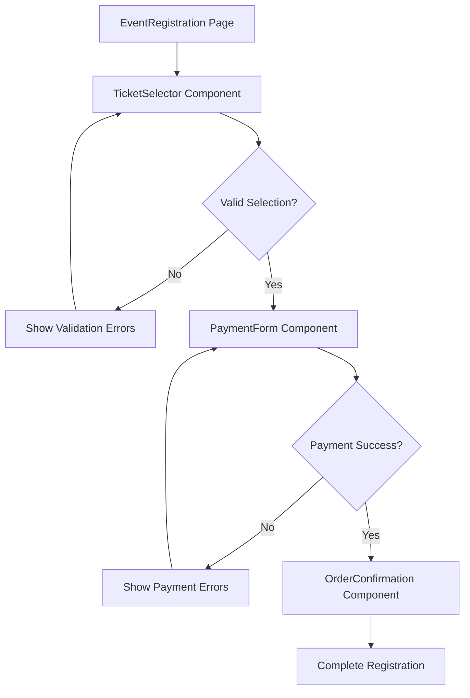

# Core Registration Components Design

## 🎯 **Component Architecture Overview**

This document defines the core components needed for the event registration flow, following React best practices and EventOS design patterns.

## 🏗️ **Component Structure**

### **1. EventRegistration Page**
**Location:** `src/pages/EventRegistration.tsx`
**Purpose:** Main registration interface orchestrating the entire flow

```typescript
interface EventRegistrationProps {
  eventId: string;
  slug: string;
}

interface RegistrationState {
  currentStep: 'tickets' | 'payment' | 'confirmation';
  selectedTickets: TicketSelection[];
  userInfo: UserInfo;
  orderId?: string;
}
```

**Key Features:**
- Multi-step registration wizard
- State management for registration flow
- Authentication integration
- Error handling and validation
- Loading states and progress indicators

### **2. TicketSelector Component**
**Location:** `src/components/registration/TicketSelector.tsx`
**Purpose:** Handle ticket selection, pricing, and quantity

```typescript
interface TicketSelectorProps {
  event: Event;
  onSelectionChange: (tickets: TicketSelection[]) => void;
  selectedTickets: TicketSelection[];
}

interface TicketSelection {
  ticketTierId: string;
  quantity: number;
  pricePerTicket: number;
  totalPrice: number;
}
```

**Key Features:**
- Dynamic ticket tier display
- Quantity selection with validation
- Real-time price calculation
- Add-ons and extras selection
- Inventory checking

### **3. PaymentForm Component**
**Location:** `src/components/registration/PaymentForm.tsx`
**Purpose:** Secure payment processing with Stripe

```typescript
interface PaymentFormProps {
  orderTotal: number;
  onPaymentSuccess: (paymentIntent: PaymentIntent) => void;
  onPaymentError: (error: string) => void;
  isLoading: boolean;
}

interface PaymentData {
  cardNumber: string;
  expiryDate: string;
  cvv: string;
  billingAddress: Address;
}
```

**Key Features:**
- Stripe Elements integration
- Form validation and security
- Billing address collection
- Payment method selection
- Error handling and retry logic

### **4. OrderConfirmation Component**
**Location:** `src/components/registration/OrderConfirmation.tsx`
**Purpose:** Success confirmation and next steps

```typescript
interface OrderConfirmationProps {
  order: Order;
  event: Event;
  onAddToCalendar: () => void;
  onShareEvent: () => void;
}

interface Order {
  id: string;
  eventId: string;
  userId: string;
  tickets: TicketSelection[];
  totalAmount: number;
  status: 'confirmed' | 'pending' | 'failed';
  createdAt: string;
}
```

**Key Features:**
- Order summary display
- Calendar invite generation
- Email confirmation status
- Social sharing options
- Event details and logistics

## 🔄 **Component Flow Diagram**



## 📱 **Responsive Design Strategy**

### **Mobile-First Approach**
- Touch-friendly interface elements
- Optimized form layouts
- Swipe gestures for multi-step flow
- Mobile payment optimization

### **Desktop Enhancements**
- Multi-column layouts
- Keyboard navigation
- Advanced form features
- Enhanced visual feedback

## 🎨 **UI/UX Design Principles**

### **Visual Hierarchy**
- Clear step indicators
- Prominent call-to-action buttons
- Consistent spacing and typography
- Color-coded validation states

### **User Experience**
- Progressive disclosure of information
- Contextual help and tooltips
- Smooth transitions between steps
- Clear error messaging

### **Accessibility**
- ARIA labels and roles
- Keyboard navigation support
- Screen reader compatibility
- High contrast mode support

## 🛠️ **Implementation Details**

### **State Management**
```typescript
// Using React Context for registration state
const RegistrationContext = createContext<RegistrationContextType>();

interface RegistrationContextType {
  state: RegistrationState;
  actions: {
    updateTicketSelection: (tickets: TicketSelection[]) => void;
    updateUserInfo: (info: UserInfo) => void;
    proceedToPayment: () => void;
    completeOrder: (orderId: string) => void;
  };
}
```

### **Form Validation**
```typescript
// Using Zod for schema validation
const ticketSelectionSchema = z.object({
  ticketTierId: z.string().min(1),
  quantity: z.number().min(1).max(10),
});

const paymentSchema = z.object({
  cardNumber: z.string().min(13).max(19),
  expiryDate: z.string().regex(/^\d{2}\/\d{2}$/),
  cvv: z.string().min(3).max(4),
  billingAddress: addressSchema,
});
```

### **Error Handling**
```typescript
interface RegistrationError {
  type: 'validation' | 'payment' | 'network' | 'server';
  message: string;
  field?: string;
  retryable: boolean;
}

const handleRegistrationError = (error: RegistrationError) => {
  switch (error.type) {
    case 'validation':
      return showFieldError(error.field, error.message);
    case 'payment':
      return showPaymentError(error.message);
    case 'network':
      return showRetryOption(error.message);
    case 'server':
      return showContactSupport(error.message);
  }
};
```

## 🔒 **Security Considerations**

### **Payment Security**
- PCI DSS compliance through Stripe
- No sensitive payment data storage
- Secure tokenization
- Fraud detection integration

### **Data Protection**
- Input sanitization
- XSS prevention
- CSRF protection
- Rate limiting

### **Privacy**
- GDPR compliance
- Data minimization
- User consent management
- Secure data transmission

## 📊 **Performance Optimization**

### **Loading States**
- Skeleton screens for content loading
- Progressive image loading
- Lazy loading of non-critical components
- Optimistic UI updates

### **Caching Strategy**
- Event data caching
- Ticket availability caching
- Payment method caching
- Browser storage optimization

### **Bundle Optimization**
- Code splitting by route
- Dynamic imports for heavy components
- Tree shaking for unused code
- Image optimization

## 🧪 **Testing Strategy**

### **Unit Tests**
- Component rendering tests
- State management tests
- Validation logic tests
- Utility function tests

### **Integration Tests**
- Registration flow tests
- Payment integration tests
- API integration tests
- Error handling tests

### **E2E Tests**
- Complete registration flow
- Payment processing
- Error scenarios
- Mobile responsiveness

## 🚀 **Deployment Considerations**

### **Environment Configuration**
- Stripe key management
- API endpoint configuration
- Feature flag management
- Analytics configuration

### **Monitoring**
- Error tracking and logging
- Performance monitoring
- User behavior analytics
- Payment success tracking

This component design provides a solid foundation for implementing a professional, secure, and user-friendly event registration system.
