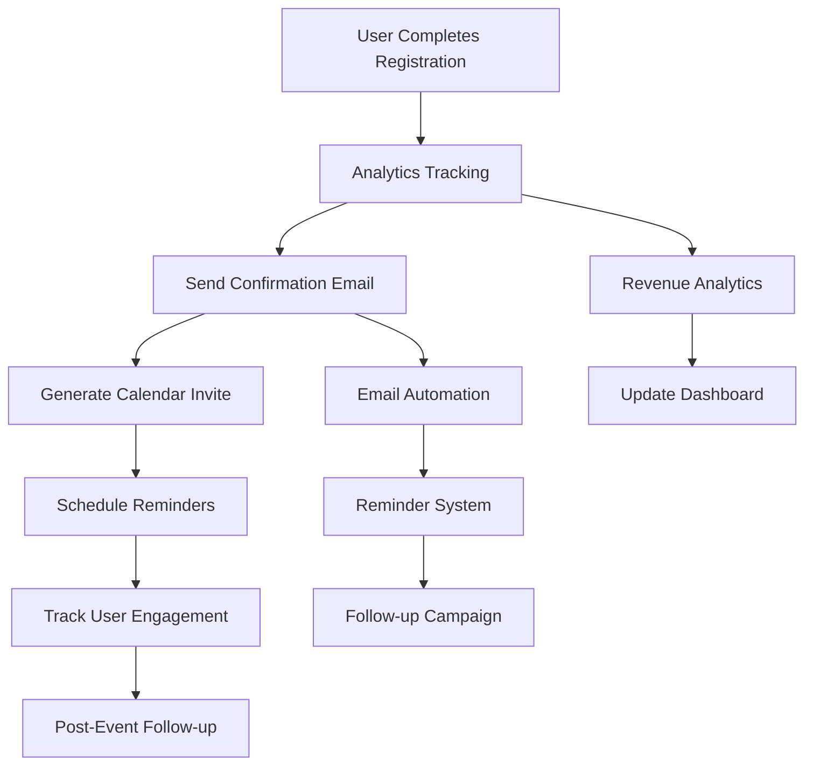

# Advanced Features Design

## 🎯 **Advanced Features Overview**

This document outlines the advanced features that enhance the event registration flow, providing comprehensive analytics, automation, and user experience improvements.

## 📊 **Analytics Integration**

### **1. Registration Funnel Analytics**
**Purpose:** Track user behavior and conversion rates throughout the registration process

```typescript
interface RegistrationAnalytics {
  eventId: string;
  userId?: string;
  sessionId: string;
  step: 'ticket_selection' | 'payment' | 'confirmation';
  timestamp: string;
  metadata: {
    ticketType?: string;
    quantity?: number;
    totalAmount?: number;
    paymentMethod?: string;
    deviceType: 'mobile' | 'tablet' | 'desktop';
    browser: string;
    referrer?: string;
  };
}
```

**Key Metrics:**
- Page view tracking
- Step completion rates
- Time spent on each step
- Abandonment points
- Conversion funnel analysis

### **2. Revenue Analytics**
**Purpose:** Track revenue metrics and optimize pricing strategies

```typescript
interface RevenueAnalytics {
  eventId: string;
  date: string;
  totalRevenue: number;
  ticketSales: {
    tierId: string;
    quantitySold: number;
    revenue: number;
  }[];
  conversionRate: number;
  averageOrderValue: number;
}
```

**Key Metrics:**
- Total revenue per event
- Revenue per visitor
- Average order value
- Ticket tier performance
- Revenue trends over time

### **3. User Behavior Analytics**
**Purpose:** Understand user preferences and optimize user experience

```typescript
interface UserBehaviorAnalytics {
  userId: string;
  eventId: string;
  actions: {
    type: 'click' | 'scroll' | 'hover' | 'form_interaction';
    element: string;
    timestamp: string;
    metadata?: Record<string, any>;
  }[];
  sessionDuration: number;
  deviceInfo: DeviceInfo;
}
```

**Key Metrics:**
- User engagement patterns
- Form interaction analysis
- Device and browser preferences
- Session duration analysis
- User journey mapping

## 📧 **Email Notifications System**

### **1. Order Confirmation Emails**
**Purpose:** Provide immediate confirmation and event details

```typescript
interface ConfirmationEmail {
  to: string;
  template: 'order_confirmation';
  data: {
    orderId: string;
    eventName: string;
    eventDate: string;
    eventLocation: string;
    tickets: TicketSummary[];
    totalAmount: number;
    calendarInvite?: CalendarInvite;
  };
}
```

**Features:**
- Immediate order confirmation
- Event details and logistics
- Calendar invite attachment
- QR code for event access
- Contact information for support

### **2. Event Reminders**
**Purpose:** Keep attendees engaged and reduce no-shows

```typescript
interface ReminderEmail {
  to: string;
  template: 'event_reminder';
  data: {
    eventName: string;
    eventDate: string;
    eventLocation: string;
    reminderType: '24_hours' | '1_week' | '1_day';
    specialInstructions?: string;
    weatherUpdate?: WeatherInfo;
  };
}
```

**Reminder Schedule:**
- 1 week before event
- 1 day before event
- 24 hours before event
- Weather updates for outdoor events
- Last-minute logistics updates

### **3. Post-Event Follow-up**
**Purpose:** Gather feedback and encourage future engagement

```typescript
interface FollowUpEmail {
  to: string;
  template: 'post_event_followup';
  data: {
    eventName: string;
    eventDate: string;
    feedbackLink: string;
    photoGallery?: string[];
    nextEvents?: Event[];
    socialSharing?: SocialShareOptions;
  };
}
```

**Features:**
- Event feedback collection
- Photo gallery sharing
- Next event recommendations
- Social media sharing prompts
- Thank you messages

## 📅 **Calendar Integration**

### **1. Google Calendar Integration**
**Purpose:** Automatically add events to user's calendar

```typescript
interface CalendarIntegration {
  provider: 'google' | 'outlook' | 'apple';
  eventData: {
    title: string;
    description: string;
    startDate: string;
    endDate: string;
    location: string;
    attendees?: string[];
    reminders: Reminder[];
  };
}
```

**Features:**
- One-click calendar addition
- Multiple calendar provider support
- Automatic timezone handling
- Reminder configuration
- Attendee list management

### **2. iCal Download**
**Purpose:** Provide universal calendar file format

```typescript
interface ICalEvent {
  uid: string;
  summary: string;
  description: string;
  dtstart: Date;
  dtend: Date;
  location: string;
  url?: string;
  attachments?: Attachment[];
}
```

**Features:**
- Universal calendar format
- Offline calendar support
- Multiple event support
- Attachment support
- URL integration

## 🔄 **Advanced Features Flow Diagram**



## 🤖 **Automation Features**

### **1. Smart Reminders**
**Purpose:** Intelligent reminder scheduling based on user behavior

```typescript
interface SmartReminder {
  userId: string;
  eventId: string;
  reminderType: 'email' | 'sms' | 'push';
  scheduledTime: string;
  content: {
    subject: string;
    body: string;
    callToAction: string;
  };
  conditions: {
    hasOpenedEmail?: boolean;
    hasClickedLink?: boolean;
    hasAddedToCalendar?: boolean;
  };
}
```

**Features:**
- Behavioral trigger-based reminders
- Multi-channel communication
- Personalized content
- A/B testing for optimization
- Opt-out management

### **2. Dynamic Pricing**
**Purpose:** Optimize ticket pricing based on demand and analytics

```typescript
interface DynamicPricing {
  eventId: string;
  ticketTierId: string;
  basePrice: number;
  currentPrice: number;
  factors: {
    demandLevel: 'low' | 'medium' | 'high';
    timeToEvent: number;
    competitorPricing: number;
    historicalData: number;
  };
  priceHistory: PricePoint[];
}
```

**Features:**
- Demand-based pricing adjustments
- Competitor price monitoring
- Historical data analysis
- A/B testing for price points
- Revenue optimization

## 📱 **Mobile Optimization**

### **1. Progressive Web App (PWA)**
**Purpose:** Provide native app-like experience on mobile devices

```typescript
interface PWAFeatures {
  offlineSupport: boolean;
  pushNotifications: boolean;
  homeScreenInstall: boolean;
  backgroundSync: boolean;
  appShell: boolean;
}
```

**Features:**
- Offline registration support
- Push notification reminders
- Home screen installation
- Background data synchronization
- App-like navigation

### **2. Mobile Payment Optimization**
**Purpose:** Streamline mobile payment experience

```typescript
interface MobilePayment {
  paymentMethods: ('card' | 'apple_pay' | 'google_pay' | 'paypal')[];
  biometricAuth: boolean;
  oneClickPayment: boolean;
  mobileOptimizedUI: boolean;
}
```

**Features:**
- Apple Pay and Google Pay integration
- Biometric authentication
- One-click payment for returning users
- Mobile-optimized payment forms
- Touch-friendly interfaces

## 🔐 **Security Enhancements**

### **1. Fraud Detection**
**Purpose:** Protect against fraudulent registrations and payments

```typescript
interface FraudDetection {
  riskScore: number;
  factors: {
    ipAddress: string;
    deviceFingerprint: string;
    paymentHistory: PaymentHistory[];
    behaviorPattern: BehaviorPattern;
  };
  actions: ('allow' | 'review' | 'block')[];
}
```

**Features:**
- Real-time risk assessment
- Device fingerprinting
- Payment pattern analysis
- Behavioral anomaly detection
- Automated fraud prevention

### **2. Data Encryption**
**Purpose:** Protect sensitive user data

```typescript
interface DataEncryption {
  encryptionLevel: 'field' | 'record' | 'database';
  encryptionMethod: 'AES-256' | 'RSA-2048';
  keyManagement: 'aws-kms' | 'azure-keyvault' | 'self-managed';
  dataClassification: 'public' | 'internal' | 'confidential' | 'restricted';
}
```

**Features:**
- End-to-end encryption
- Secure key management
- Data classification
- Compliance with security standards
- Regular security audits

## 📊 **Performance Monitoring**

### **1. Real-time Monitoring**
**Purpose:** Monitor system performance and user experience

```typescript
interface PerformanceMonitoring {
  metrics: {
    pageLoadTime: number;
    apiResponseTime: number;
    errorRate: number;
    conversionRate: number;
    userSatisfaction: number;
  };
  alerts: {
    threshold: number;
    condition: 'greater_than' | 'less_than' | 'equals';
    action: 'email' | 'sms' | 'slack' | 'webhook';
  }[];
}
```

**Features:**
- Real-time performance tracking
- Automated alerting
- Performance optimization recommendations
- User experience monitoring
- Capacity planning

### **2. A/B Testing Framework**
**Purpose:** Optimize registration flow through experimentation

```typescript
interface ABTest {
  testId: string;
  name: string;
  variants: {
    control: Variant;
    treatment: Variant;
  };
  metrics: string[];
  trafficAllocation: number;
  duration: number;
  status: 'draft' | 'running' | 'completed' | 'paused';
}
```

**Features:**
- Multi-variant testing
- Statistical significance calculation
- Automated test management
- Performance impact analysis
- Results visualization

## 🚀 **Implementation Priority**

### **Phase 1: Core Analytics (Week 1)**
- Basic funnel tracking
- Revenue analytics
- Error monitoring

### **Phase 2: Email Automation (Week 2)**
- Confirmation emails
- Basic reminders
- Email templates

### **Phase 3: Calendar Integration (Week 3)**
- Google Calendar integration
- iCal downloads
- Timezone handling

### **Phase 4: Advanced Features (Week 4)**
- Smart reminders
- Mobile optimization
- Performance monitoring

This advanced features design provides comprehensive functionality to enhance the registration experience and drive business growth.
