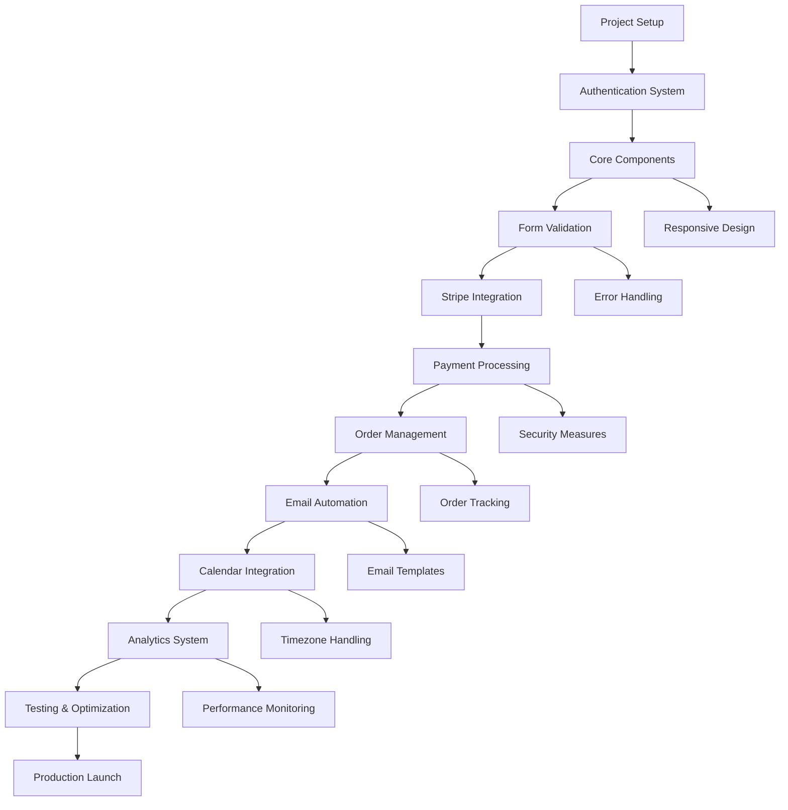

# Implementation Order & Task Dependencies

## 🎯 **Implementation Strategy Overview**

This document defines the implementation order, task dependencies, and development phases for the event registration flow, ensuring efficient development and minimal blockers.

## 📅 **Development Timeline**

### **Total Timeline: 4 Weeks**
- **Week 1:** Core Infrastructure & Basic Flow
- **Week 2:** Payment Integration & Order Processing
- **Week 3:** Advanced Features & Automation
- **Week 4:** Testing, Optimization & Launch

## 🏗️ **Phase 1: Core Infrastructure (Week 1)**

### **Day 1-2: Project Setup & Authentication**
**Priority:** Critical
**Dependencies:** None

#### **Tasks:**
- [ ] Set up Vite + React + TypeScript project structure
- [ ] Configure Supabase connection and authentication
- [ ] Create basic routing structure
- [ ] Implement authentication middleware
- [ ] Set up development environment

#### **Deliverables:**
- Working authentication system
- Basic project structure
- Development environment ready

### **Day 3-4: Core Components Foundation**
**Priority:** Critical
**Dependencies:** Project Setup

#### **Tasks:**
- [ ] Create EventRegistration page structure
- [ ] Implement TicketSelector component
- [ ] Add basic form validation
- [ ] Create responsive layouts
- [ ] Add loading states and error handling

#### **Deliverables:**
- EventRegistration page
- TicketSelector component
- Basic form validation
- Responsive design

### **Day 5: Integration & Testing**
**Priority:** High
**Dependencies:** Core Components

#### **Tasks:**
- [ ] Integrate components with Supabase
- [ ] Add basic analytics tracking
- [ ] Implement error boundaries
- [ ] Write unit tests for components
- [ ] Test authentication flow

#### **Deliverables:**
- Working registration flow (without payment)
- Basic analytics integration
- Unit tests
- Error handling

## 💳 **Phase 2: Payment Integration (Week 2)**

### **Day 6-7: Stripe Integration**
**Priority:** Critical
**Dependencies:** Core Components

#### **Tasks:**
- [ ] Set up Stripe account and API keys
- [ ] Implement PaymentForm component
- [ ] Add Stripe Elements integration
- [ ] Create payment processing logic
- [ ] Add payment validation

#### **Deliverables:**
- PaymentForm component
- Stripe integration
- Payment processing
- Payment validation

### **Day 8-9: Order Processing**
**Priority:** Critical
**Dependencies:** Stripe Integration

#### **Tasks:**
- [ ] Create order management system
- [ ] Implement order confirmation flow
- [ ] Add order tracking
- [ ] Create OrderConfirmation component
- [ ] Add order history

#### **Deliverables:**
- Order processing system
- Order confirmation flow
- Order tracking
- OrderConfirmation component

### **Day 10: Payment Testing & Security**
**Priority:** High
**Dependencies:** Order Processing

#### **Tasks:**
- [ ] Test payment processing with test cards
- [ ] Implement security measures
- [ ] Add fraud detection basics
- [ ] Test error scenarios
- [ ] Add payment analytics

#### **Deliverables:**
- Secure payment processing
- Fraud detection
- Payment analytics
- Error handling

## 🚀 **Phase 3: Advanced Features (Week 3)**

### **Day 11-12: Email Automation**
**Priority:** High
**Dependencies:** Order Processing

#### **Tasks:**
- [ ] Set up email service (SendGrid/AWS SES)
- [ ] Create email templates
- [ ] Implement confirmation emails
- [ ] Add reminder system
- [ ] Create email analytics

#### **Deliverables:**
- Email automation system
- Email templates
- Confirmation emails
- Reminder system

### **Day 13-14: Calendar Integration**
**Priority:** Medium
**Dependencies:** Email Automation

#### **Tasks:**
- [ ] Implement Google Calendar integration
- [ ] Add iCal download functionality
- [ ] Create calendar invite generation
- [ ] Add timezone handling
- [ ] Test calendar integrations

#### **Deliverables:**
- Calendar integration
- iCal downloads
- Calendar invites
- Timezone handling

### **Day 15: Analytics & Monitoring**
**Priority:** Medium
**Dependencies:** Calendar Integration

#### **Tasks:**
- [ ] Implement comprehensive analytics
- [ ] Add performance monitoring
- [ ] Create analytics dashboard
- [ ] Add A/B testing framework
- [ ] Implement error tracking

#### **Deliverables:**
- Analytics system
- Performance monitoring
- Analytics dashboard
- A/B testing framework

## 🧪 **Phase 4: Testing & Launch (Week 4)**

### **Day 16-17: Comprehensive Testing**
**Priority:** Critical
**Dependencies:** All Previous Phases

#### **Tasks:**
- [ ] End-to-end testing
- [ ] Performance testing
- [ ] Security testing
- [ ] Mobile testing
- [ ] User acceptance testing

#### **Deliverables:**
- Comprehensive test coverage
- Performance optimization
- Security validation
- Mobile compatibility

### **Day 18-19: Optimization & Polish**
**Priority:** High
**Dependencies:** Testing

#### **Tasks:**
- [ ] Performance optimization
- [ ] UI/UX improvements
- [ ] Error message refinement
- [ ] Loading state optimization
- [ ] Accessibility improvements

#### **Deliverables:**
- Optimized performance
- Improved UX
- Better error handling
- Accessibility compliance

### **Day 20: Launch Preparation**
**Priority:** Critical
**Dependencies:** Optimization

#### **Tasks:**
- [ ] Production deployment
- [ ] Monitoring setup
- [ ] Documentation completion
- [ ] Team training
- [ ] Launch checklist

#### **Deliverables:**
- Production deployment
- Monitoring system
- Complete documentation
- Team readiness

## 📊 **Task Dependencies Diagram**

## 🎯 **Critical Path Analysis**

### **Critical Path Tasks:**
1. **Project Setup** → **Authentication** → **Core Components** → **Stripe Integration** → **Payment Processing** → **Order Management** → **Testing** → **Launch**

### **Parallel Development Opportunities:**
- **Email Automation** can start after Order Management
- **Calendar Integration** can run parallel with Email Automation
- **Analytics** can be implemented alongside other features
- **Testing** can begin as soon as core features are complete

## 📋 **Resource Allocation**

### **Week 1: Core Infrastructure**
- **Frontend Developer:** 40 hours
- **Backend Developer:** 20 hours
- **DevOps Engineer:** 10 hours
- **Total:** 70 hours

### **Week 2: Payment Integration**
- **Frontend Developer:** 30 hours
- **Backend Developer:** 30 hours
- **DevOps Engineer:** 10 hours
- **Total:** 70 hours

### **Week 3: Advanced Features**
- **Frontend Developer:** 25 hours
- **Backend Developer:** 25 hours
- **DevOps Engineer:** 15 hours
- **QA Engineer:** 15 hours
- **Total:** 80 hours

### **Week 4: Testing & Launch**
- **Frontend Developer:** 20 hours
- **Backend Developer:** 20 hours
- **DevOps Engineer:** 20 hours
- **QA Engineer:** 25 hours
- **Total:** 85 hours

## 🚨 **Risk Mitigation**

### **High-Risk Items:**
1. **Stripe Integration Complexity**
   - **Mitigation:** Start early, use test environment, have backup plan
   - **Contingency:** Implement basic payment first, enhance later

2. **Email Service Setup**
   - **Mitigation:** Use established service (SendGrid), test thoroughly
   - **Contingency:** Start with basic emails, add automation later

3. **Calendar Integration**
   - **Mitigation:** Use standard APIs, implement one provider at a time
   - **Contingency:** Start with iCal downloads, add API integration later

### **Medium-Risk Items:**
1. **Performance Optimization**
   - **Mitigation:** Monitor performance throughout development
   - **Contingency:** Optimize after core functionality is complete

2. **Mobile Compatibility**
   - **Mitigation:** Test on multiple devices throughout development
   - **Contingency:** Focus on core functionality first, optimize mobile later

## 📈 **Success Metrics by Phase**

### **Phase 1 Success Criteria:**
- [ ] Authentication system working
- [ ] Basic registration flow functional
- [ ] Responsive design implemented
- [ ] Error handling in place

### **Phase 2 Success Criteria:**
- [ ] Payment processing working
- [ ] Order confirmation flow complete
- [ ] Security measures implemented
- [ ] Payment analytics tracking

### **Phase 3 Success Criteria:**
- [ ] Email automation functional
- [ ] Calendar integration working
- [ ] Analytics system operational
- [ ] Performance monitoring active

### **Phase 4 Success Criteria:**
- [ ] All tests passing
- [ ] Performance optimized
- [ ] Security validated
- [ ] Production deployment successful

## 🔄 **Iteration Strategy**

### **Daily Standups:**
- Review progress against timeline
- Identify blockers and dependencies
- Adjust priorities if needed
- Share knowledge and updates

### **Weekly Reviews:**
- Assess phase completion
- Review quality metrics
- Plan next week's priorities
- Address any timeline issues

### **Continuous Integration:**
- Automated testing on every commit
- Performance monitoring
- Security scanning
- Code quality checks

This implementation order ensures efficient development with minimal blockers and maximum parallelization opportunities.
