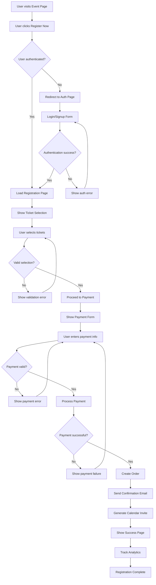
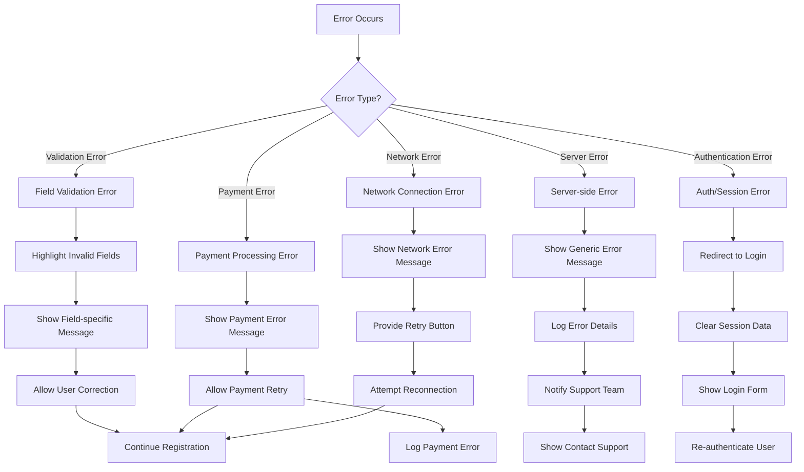
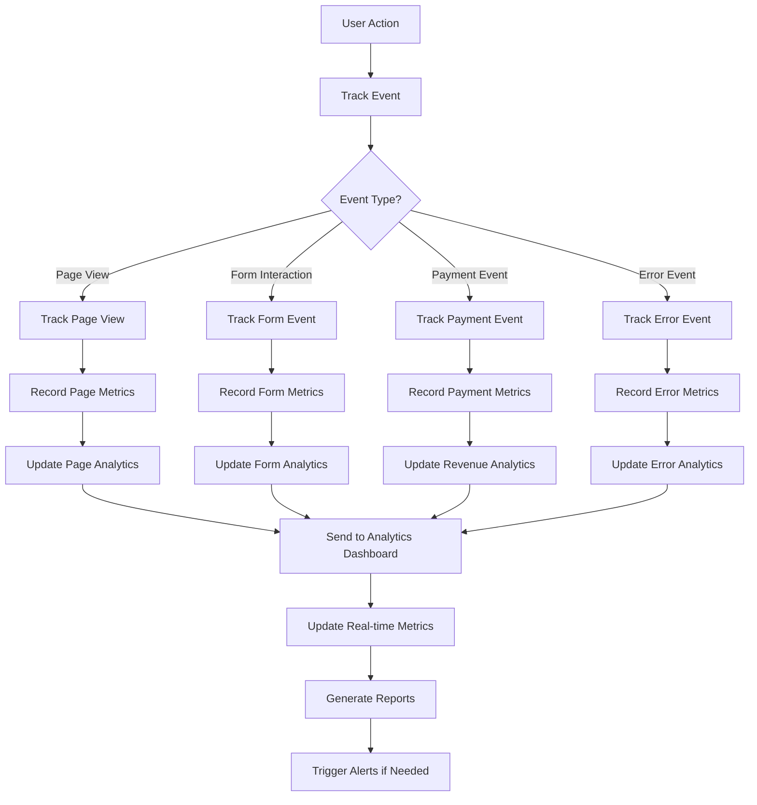
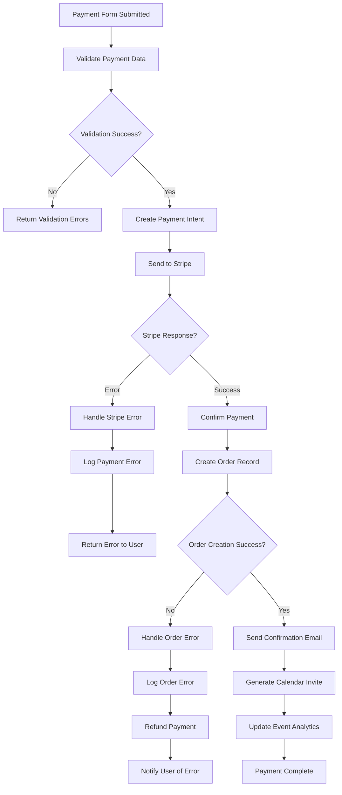
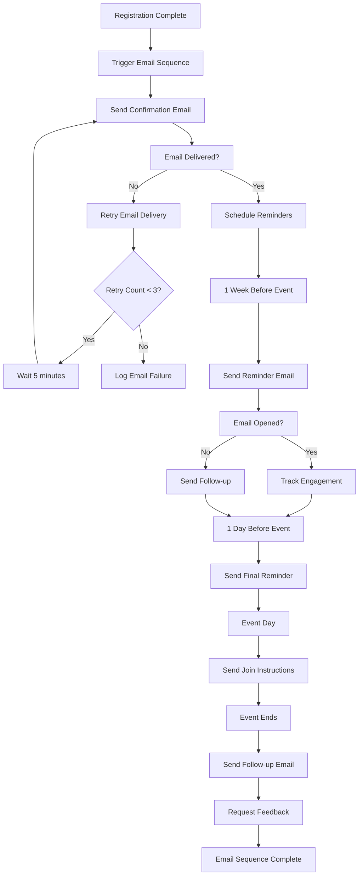
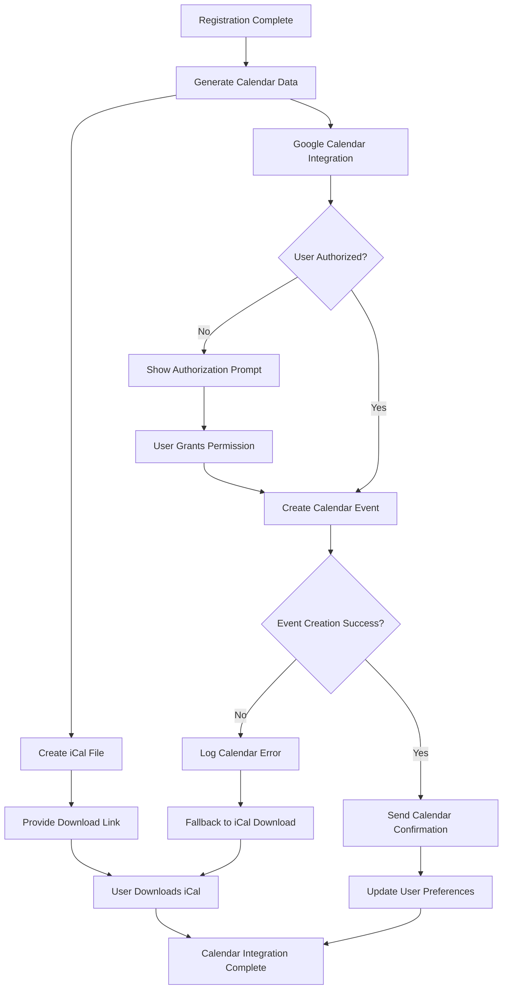
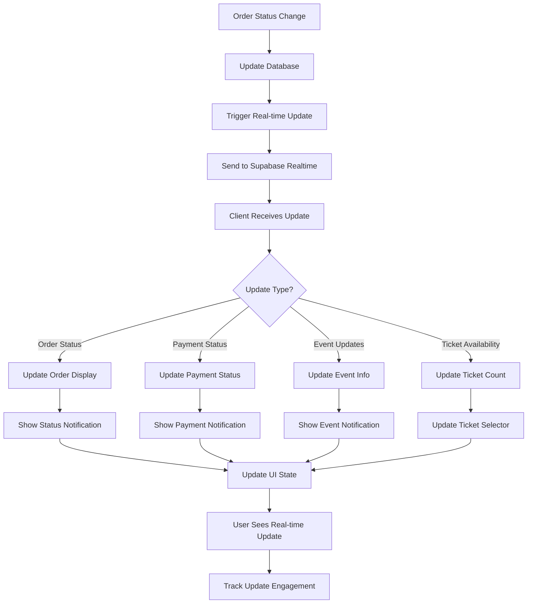
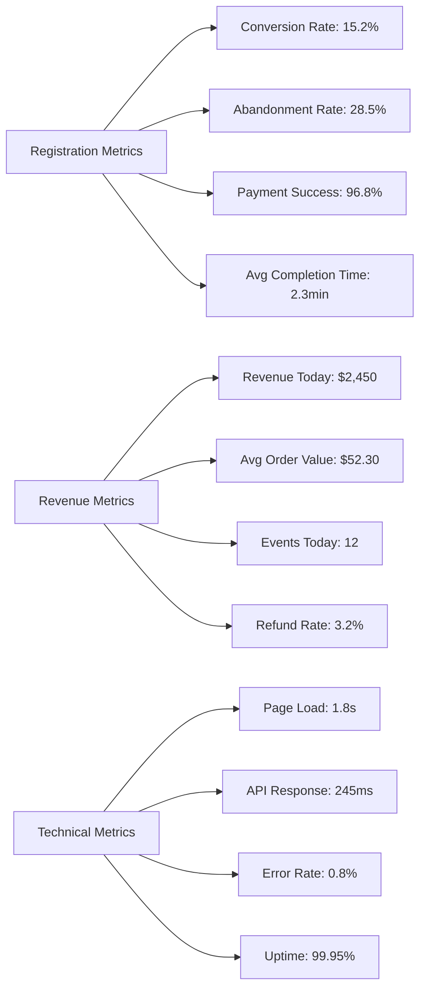
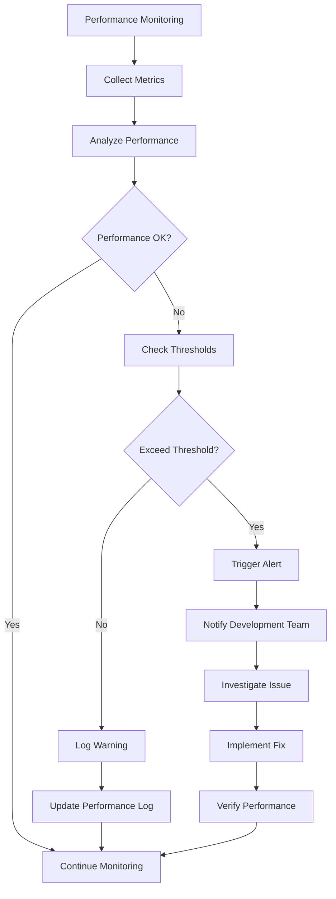

# Success Criteria & Process Flow Diagrams

## 🎯 **Success Criteria Overview**

This document defines the success criteria for the event registration flow and provides comprehensive process flow diagrams to visualize the complete user journey and system architecture.

## 📊 **Success Criteria Definition**

### **Technical Success Criteria**

#### **Performance Metrics**
- [ ] **Page Load Time:** < 2 seconds for all registration pages
- [ ] **Payment Processing:** < 5 seconds for payment completion
- [ ] **API Response Time:** < 500ms for Socialbase queries
- [ ] **Mobile Performance:** > 90 Lighthouse score on mobile
- [ ] **Uptime:** > 99.9% availability

#### **Security Metrics**
- [ ] **Payment Security:** PCI DSS compliance through Stripe
- [ ] **Data Protection:** GDPR compliance for EU users
- [ ] **Authentication:** 100% secure user sessions
- [ ] **Input Validation:** 0% SQL injection vulnerabilities
- [ ] **HTTPS:** 100% encrypted data transmission

#### **Quality Metrics**
- [ ] **Error Rate:** < 1% of registration attempts
- [ ] **Test Coverage:** > 90% code coverage
- [ ] **Accessibility:** WCAG 2.1 AA compliance
- [ ] **Browser Compatibility:** Support for 95% of users
- [ ] **Mobile Responsiveness:** 100% mobile compatibility

### **Business Success Criteria**

#### **Conversion Metrics**
- [ ] **Registration Conversion:** > 15% of event page visitors
- [ ] **Payment Success Rate:** > 95% of payment attempts
- [ ] **Abandonment Rate:** < 30% at payment step
- [ ] **Completion Time:** < 3 minutes average registration time
- [ ] **Return User Rate:** > 40% of users register for multiple events

#### **Revenue Metrics**
- [ ] **Revenue Per Event:** > $5,000 average per event
- [ ] **Average Order Value:** > $50 per registration
- [ ] **Revenue Growth:** 25% month-over-month growth
- [ ] **Payment Method Diversity:** 3+ payment methods supported
- [ ] **Refund Rate:** < 5% of completed orders

#### **User Experience Metrics**
- [ ] **User Satisfaction:** > 4.5/5 rating
- [ ] **Support Tickets:** < 2% of registrations require support
- [ ] **Mobile Usage:** > 60% of registrations on mobile
- [ ] **Accessibility Score:** > 95% accessibility compliance
- [ ] **Page Speed Score:** > 90 on Google PageSpeed

## 🔄 **Process Flow Diagrams**

### **1. Complete Registration Flow Diagram**

### **2. Error Handling Flow Diagram**

### **3. Analytics Tracking Flow Diagram**

### **4. Payment Processing Flow Diagram**

### **5. Email Automation Flow Diagram**

### **6. Calendar Integration Flow Diagram**

### **7. Real-time Updates Flow Diagram**

## 📈 **Success Metrics Dashboard**

### **Real-time Metrics Display**

### **Performance Monitoring Flow**

## 🎯 **Success Validation Process**

### **Daily Validation Checklist**
- [ ] **Conversion Rate:** Check daily conversion metrics
- [ ] **Payment Success:** Monitor payment processing success rate
- [ ] **Error Rate:** Review error logs and user reports
- [ ] **Performance:** Check page load times and API response times
- [ ] **User Feedback:** Review support tickets and user feedback

### **Weekly Validation Checklist**
- [ ] **Revenue Metrics:** Analyze weekly revenue and order trends
- [ ] **User Experience:** Review user journey analytics
- [ ] **Technical Performance:** Analyze performance trends
- [ ] **Security:** Review security logs and compliance status
- [ ] **Feature Usage:** Analyze feature adoption and usage patterns

### **Monthly Validation Checklist**
- [ ] **Business Goals:** Assess progress toward revenue targets
- [ ] **User Satisfaction:** Analyze user satisfaction surveys
- [ ] **System Reliability:** Review uptime and performance metrics
- [ ] **Competitive Analysis:** Compare performance with industry benchmarks
- [ ] **Improvement Opportunities:** Identify areas for optimization

## 🚀 **Success Criteria Achievement Plan**

### **Week 1 Targets**
- [ ] Page load time < 3 seconds
- [ ] Basic registration flow functional
- [ ] Payment integration working
- [ ] Error handling implemented

### **Week 2 Targets**
- [ ] Page load time < 2 seconds
- [ ] Payment success rate > 90%
- [ ] Mobile responsiveness 100%
- [ ] Basic analytics tracking

### **Week 3 Targets**
- [ ] Payment success rate > 95%
- [ ] Conversion rate > 10%
- [ ] Email automation functional
- [ ] Calendar integration working

### **Week 4 Targets**
- [ ] All success criteria met
- [ ] Performance optimized
- [ ] Security validated
- [ ] User experience polished

This comprehensive success criteria and process flow documentation ensures the registration system meets all technical, business, and user experience requirements while providing clear visibility into system performance and user behavior.
